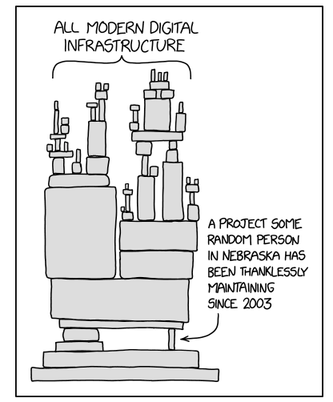

## Why This Course Exists {.center}

> There is a **dearth of technologists in public policy** arenas. Let's change that.

This course sits at the intersection of **technical security/privacy** and the
**legal, regulatory, and policy** systems that govern technology.

::: {.notes}
Open with the framing question: who in the room sees themselves working on policy,
and who sees themselves building systems? The whole point is that you need both. Tell
the BITAG / FTC testimony story briefly to make it concrete.
:::

## Who Am I?

- **Prof. Nick Feamster** — computer networking & security
- Research: applications of **ML** (anomaly detection, classification) and **public
  policy** (broadband deployment, the digital divide)
- Policy engagement: **BITAG**, testimony at the **FTC** and state legislatures,
  comments to the **FCC / USPTO**

::: {.notes}
Keep this short — establish credibility, then move on. The students care more about
what they'll get out of the course than my CV.
:::

## Learning Objectives

By the end of the course you should be able to:

- Explain core **security and privacy** concepts: cryptography; network, endpoint, and
  data security; surveillance and tracking; attacks and defenses
- Place those concepts in the context of **policy and regulation** — consumer privacy,
  censorship, content moderation, data breaches, net neutrality, surveillance, and the
  accountability of automated decision-making
- **Translate** technical ideas into policy arguments and recommendations

## Is This Course for You?

- You're **comfortable programming** (or have a friend in class who is) — this is *not*
  a programming-heavy course, but a couple of labs use Python/JavaScript
- You have an interest in **tech policy**, or in building those skills
- You want practice **communicating technical ideas** — in writing and out loud
  (that's what the debates are for)

## Where This Can Take You

::: {.columns}
::: {.column width="25%"}

:::
::: {.column width="25%"}

:::
::: {.column width="25%"}

:::
::: {.column width="25%"}

:::
:::

People who work at this intersection: an **FCC Commissioner**, an **FTC CTO / U.S.
Deputy CTO**, a **civil-society NGO CEO**, a **city data scientist**.

::: {.notes}
These are real role models who sit where tech meets policy. The point isn't the
specific people — it's that "technologist who understands policy" is a career, not a
hobby. (Image layout here is the template pattern for embedding curated figures.)
:::

## What We Actually Cover {.smaller}

Roughly one theme per week, tracked in [`agenda.md`](../../agenda.md):

::: {.columns}
::: {.column width="50%"}
- Trusting trust; why cryptosystems fail
- Key management & PKI
- Authentication & access control (OAuth)
- Denial of service & botnets
- Routing security (BGP/RPKI)
- Web security; DNS security
:::
::: {.column width="50%"}
- Web & device privacy; tracking
- Privacy law & compliance
- AI and privacy
- Copyright, fair use, and AI
- Content moderation
- Censorship; broadband access
:::
:::

::: {.notes}
This slide is generated from what we *actually* covered last year (agenda.md), not the
aspirational syllabus. If a topic gets cut for time, update agenda.md and this slide.
:::

## Course Components

| Component | Weight |
|---|---|
| Midterm + Final | 40% |
| **Debate** (one per term, ~4 people) | 35% |
| Lab assignments | 20% |
| Participation & quizzes | 5% |

Labs are graded primarily for **thoughtful completion** — each now ships with an
**up-front rubric**. AI tools are allowed *if you understand and can defend the output*.

## A 2026 Vignette: Why This Is Timely {.smaller}

::: {.vignette}
In the last year alone: **20 U.S. states** now have comprehensive privacy laws in
effect (Indiana, Kentucky, and Rhode Island joined on Jan 1, 2026); the **EU AI Act's**
enforcement powers over general-purpose AI providers switch on **August 2, 2026**
(fines up to 3% of global turnover); Anthropic settled a class action on AI training
data for **\$1.5 billion** (Sept 2025) while *NYT v. OpenAI* headed toward trial; and
**Encrypted Client Hello** is now default-on in Chrome, Firefox, and Safari when DoH
is enabled. Almost every headline this term will map onto a lecture.
:::

**Thought question:** pick a tech-policy story from this *week's* news — which lecture
does it belong to?

::: {.notes}
Swap this vignette for the freshest concrete example at the start of the term. The goal
is to show the course is a lens on current events, not a static syllabus. Ask students
to actually name a story; cold-call gently.
:::

## How a Typical Lecture Runs

- **~50 min** core: a vignette tied to the reading → the key idea of the day → a
  thought question + breakout → discussion
- A **debate** occupies part of many meetings (Oxford style; graded on contribution,
  not which side "wins")
- Come having done the reading — there may be short **pop quizzes** for accountability

::: {.notes}
Set expectations about the three-hour block and the break. Students last year flagged
the long single session — be explicit about pacing and the mid-class break.
:::

## Logistics

- **Readings** posted to GitHub the week before; if it isn't posted, you're not
  responsible for it
- **Assignment dates** are published on the schedule on day one and we stick to them
- **Questions:** post in the **public channel** (fastest answer; peers help too); DMs
  have no response-time guarantee
- Syllabus & schedule: the course website

::: {.notes}
These three bullets directly answer last year's feedback (release timing, Slack
responsiveness). Point students at the syllabus section on communication.
:::

# The Security Mindset {.center}

## Meet the Adversary

> "Computer security studies how systems behave **in the presence of an adversary**."

- The adversary — a.k.a. the attacker — is an **intelligence** that actively tries
  to make the system misbehave
- Not random failure, not bad luck: **someone trying, on purpose**
- That's what separates security from reliability engineering

::: {.notes}
Reliability asks "what can go wrong?"; security asks "what can be *made* to go
wrong, by whom, on purpose?" This mindset shift is the single most transferable
skill in the course.
:::

## Threat Modeling: Vocabulary for the Whole Term

- **Assets** — what are we protecting? Data, money, reputation, availability
- **Properties** — what should hold? **Confidentiality, integrity, availability**
  (plus privacy, authenticity)
- **Adversaries** — who attacks us, and what are their **motives**?
- **Capabilities** — what can they actually do? Which attacks are in scope — and
  which do we consciously ignore?

Think like the attacker — and be explicit about the **limits** of your model.

::: {.notes}
This is the shared vocabulary every later lecture leans on: assets, adversaries,
capabilities. Every system we study — PKI, BGP, DNS, moderation pipelines — gets
run through these same four questions. Say that explicitly so students recognize
the pattern when it returns.
:::

## Exercise: Should You Lock Your Door?

Run the model on something you did this morning:

- **Assets?**
- **Adversaries?**
- **Risk assessment?**
- **Countermeasures?**
- **Costs / benefits?**

::: {.notes}
Two-minute pair discussion, then collect answers. The goal is to show threat
modeling is ordinary reasoning made explicit — and that "no lock" can be a
rational answer when the cost of the countermeasure exceeds the risk. Push on
"adversaries": a burglar, a nosy roommate, and a landlord have very different
capabilities and motives.
:::

# Trusting Trust {.center}

## Thompson's Question

In his 1984 Turing Award lecture, Ken Thompson asked: **how much do you have
to trust a claim that a program is free of bugs and backdoors?**

- He showed a compiler can be taught to insert a **backdoor** into a program
- *And* to insert the same backdoor into **future compilers** — then erase the
  evidence from its own source
- You can audit every line of source and still ship the backdoor

**You cannot trust code you did not totally create yourself.**

::: {.notes}
The punchline: the malicious code lives in the binary, not the source. Audit
the source all you want; the compiler reinfects. Trust has to bottom out
somewhere, and that "somewhere" is rarely something you built.
:::

## Why It Still Matters

Almost nothing you run is code you wrote. **All modern digital infrastructure**
rests on dependencies maintained by people you've never met.

::: {.columns}
::: {.column width="55%"}
- Compilers, OS kernels, package managers, CI/CD pipelines
- Open-source libraries pulled in transitively, by the thousands
- The **chain of trust must stop somewhere** — usually at a root you simply
  *assume* is honest
:::
::: {.column width="45%"}

:::
:::

::: {.notes}
The xkcd comic is the whole modern version of Thompson's point. Ask: in your
last project, how many dependencies did you actually read? Tie to the agenda's
recurring "chain of trust must stop somewhere" thread that returns in PKI.
:::

## Trusting Trust, Realized: xz-utils {.smaller}

::: {.vignette}
**March 29, 2024** — developer Andres Freund noticed `sshd` was burning extra
CPU and traced it to a **backdoor hidden in xz-utils** (CVE-2024-3094, CVSS
10.0, the maximum). A contributor using the name "Jia Tan" had spent **over
two years** building trust in the project, then slipped obfuscated malicious
code into the *build scripts* — not the readable source — that injected a
remote-code-execution backdoor into OpenSSH on major Linux distros. It was
caught by luck, days before reaching stable releases.
:::

This is Thompson's attack in the wild: the malice lived in the **build
process**, the social engineering targeted **trust itself**. Attribution to
"Jia Tan" is still unresolved as of mid-2026 — and backdoored versions were
still found in **Debian Docker Hub images in August 2025**, more than a year
after the patch.

::: {.notes}
This is the freshest, most exact realization of "Reflections on Trusting
Trust" ever seen in production. Emphasize: SBOMs and code review would have
walked right past it because the artifact looked fine — the exploit was a
trust problem, not an artifact problem. Connect to agenda question: how does
this extend to AI-generated and AI-assisted code? Freund was a Microsoft
principal engineer benchmarking PostgreSQL who noticed sshd was ~500ms
slower than expected — pure operational luck.
:::

## Supply Chain as a Trust Problem

The attack surface is the **trust we extend to maintainers and registries**,
not just the code.

- **npm "Shai-Hulud" worm** — first outbreak Sept 2025 (500+ packages, credential
  theft); **Shai-Hulud 2.0** (Dec 2025 / Jan 2026) added a destructive failsafe;
  fresh waves in 2026 hit **TanStack, Mistral AI, UiPath** (May 11), the **AntV**
  ecosystem (May 19), and **Red Hat's npm namespace** (~80K downloads/week, June 1);
  the weaponized worm code was released publicly on **May 12, 2026**
- Phishing one maintainer can poison **packages with billions of downloads**
- Defenses (signing, SBOMs, SLSA, npm trusted publishing) help — but a maintainer
  who *earns* trust, then abuses it, defeats them

::: {.notes}
Good debate seed (the agenda lists this paper for debate). Can we ever
"solve" trusting trust, or only manage it? Reproducible builds and diverse
double-compiling raise the bar but don't eliminate the regress. Note the
progression: preinstall execution now bypasses even test-based defenses;
the Red Hat case shows the worm reaching official corporate namespaces.
:::

# Up Next {.center}

**Why Cryptosystems Fail** — when a "secure" system breaks, *where* does it
actually break? (Spoiler: almost never the math.)
