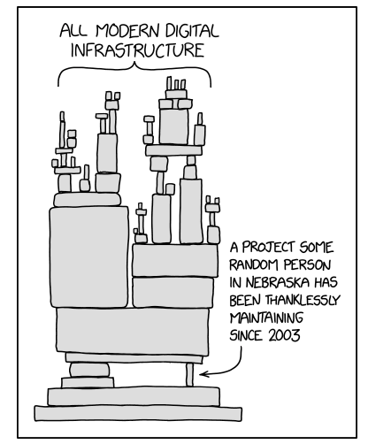
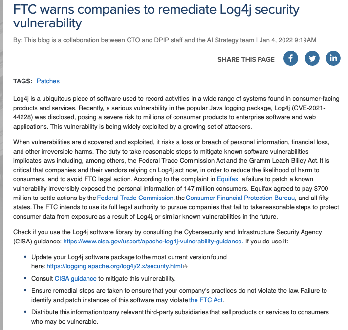

## Two Questions for the Term {.center}

> Can you trust code you didn't write yourself? And when a secure system
> breaks, **where** does it actually break?

Today: **Reflections on Trusting Trust** (Thompson) and **Why Cryptosystems
Fail** (Anderson) — two papers, one lesson.

::: {.notes}
This is Meeting 1's substantive content, after the course overview. Frame the
day as two classic papers that still describe the headlines we'll read all
term. Don't lecture the papers line by line — pull out the durable ideas.
:::

# Part 1: Trusting Trust {.center}

## Thompson's Question

In his 1984 Turing Award lecture, Ken Thompson asked: **how much do you have
to trust a claim that a program is free of bugs and backdoors?**

- He showed a compiler can be taught to insert a **backdoor** into a program
- *And* to insert the same backdoor into **future compilers** — then erase the
  evidence from its own source
- You can audit every line of source and still ship the backdoor

**You cannot trust code you did not totally create yourself.**

::: {.notes}
The punchline: the malicious code lives in the binary, not the source. Audit
the source all you want; the compiler reinfects. Trust has to bottom out
somewhere, and that "somewhere" is rarely something you built.
:::

## Why It Still Matters

Almost nothing you run is code you wrote. **All modern digital infrastructure**
rests on dependencies maintained by people you've never met.

::: {.columns}
::: {.column width="55%"}
- Compilers, OS kernels, package managers, CI/CD pipelines
- Open-source libraries pulled in transitively, by the thousands
- The **chain of trust must stop somewhere** — usually at a root you simply
  *assume* is honest
:::
::: {.column width="45%"}

:::
:::

::: {.notes}
The xkcd comic is the whole modern version of Thompson's point. Ask: in your
last project, how many dependencies did you actually read? Tie to the agenda's
recurring "chain of trust must stop somewhere" thread that returns in PKI.
:::

## Trusting Trust, Realized: xz-utils {.smaller}

::: {.vignette}
**March 29, 2024** — developer Andres Freund noticed `sshd` was burning extra
CPU and traced it to a **backdoor hidden in xz-utils** (CVE-2024-3094, CVSS
10.0, the maximum). A contributor using the name "Jia Tan" had spent **over
two years** building trust in the project, then slipped obfuscated malicious
code into the *build scripts* — not the readable source — that injected a
remote-code-execution backdoor into OpenSSH on major Linux distros. It was
caught by luck, days before reaching stable releases.
:::

This is Thompson's attack in the wild: the malice lived in the **build
process**, the social engineering targeted **trust itself**.

::: {.notes}
This is the freshest, most exact realization of "Reflections on Trusting
Trust" ever seen in production. Emphasize: SBOMs and code review would have
walked right past it because the artifact looked fine — the exploit was a
trust problem, not an artifact problem. Connect to agenda question: how does
this extend to AI-generated and AI-assisted code?
:::

## Supply Chain as a Trust Problem

The attack surface is the **trust we extend to maintainers and registries**,
not just the code.

- **npm "Shai-Hulud" worm** (Sept 2025, with further waves into spring 2026):
  self-replicating malware that compromised maintainer accounts and
  republished popular packages
- Phishing one maintainer can poison **packages with billions of downloads**
- Defenses (signing, SBOMs, SLSA) help — but a maintainer who *earns* trust,
  then abuses it, defeats them

::: {.notes}
Good debate seed (the agenda lists this paper for debate). Can we ever
"solve" trusting trust, or only manage it? Reproducible builds and diverse
double-compiling raise the bar but don't eliminate the regress.
:::

# Part 2: Why Cryptosystems Fail {.center}

## Anderson's Surprise

Ross Anderson studied **real ATM fraud** in the 1990s and found the failures
were almost never the cryptography.

- Banks assumed strong crypto meant a strong system
- In the UK, the **legal burden** fell on customers to prove fraud — so banks
  had little incentive to find their own flaws
- **Cryptology gets little public feedback** about how it fails in the field,
  so the same mistakes repeat

::: {.notes}
The institutional point matters as much as the technical one: who bears the
loss shapes who looks for bugs. Tie to the agenda discussion question about
how GDPR/CCPA-style regimes shift those incentives today.
:::

## How ATM Fraud Actually Happened {.smaller}

::: {.columns}
::: {.column width="55%"}
**Insiders**

- A clerk issuing an extra card; complaints stonewalled

**Outsiders**

- Shoulder-surfing PINs, copying account numbers to blank cards
- **Replaying** the bank's "pay" response — jackpotting
- **False terminals** that harvest card + PIN
:::
::: {.column width="45%"}

:::
:::

::: {.notes}
None of these is a break of DES. They're operations, procedures, and human
factors. The skimmer photo is the physical-world version that still works in
2026 — gas pumps, ATMs, point-of-sale terminals.
:::

## And the Crypto-Adjacent Mistakes

- **Checksums that reduced PIN entropy** — fewer real possibilities than the
  digits suggest
- **Issuing the same PIN** to many customers
- The **PIN-derivation key** had to be secret *and* widely distributed *and*
  available at all times — pick your contradiction
- Sloppy ops: open files, shared keys, customers writing PINs down

::: {.notes}
This is the crux: even where crypto was "used," key management and operating
procedure undid it. Foreshadows the entire Meeting 2 lecture on key management
and PKI — keys that must be both secret and ubiquitous are the hard part.
:::

## The Takeaway

> "The vast majority of security failures occur at the level of
> **implementation detail**."

- **Operating procedures** are often the weakest link
- Suppliers **overestimate** customers' security sophistication
- Security functions at the **application level** get neglected
- Security teams churn — at one point, average tenure of US-agency security
  managers was reported around **seven months**

::: {.notes}
This is the sentence to put on the exam. The lesson is unglamorous: the math
is rarely the problem; the system around the math is. Ask students to predict
which category a given breach falls in before you reveal it.
:::

## A Taxonomy of Failure

When a cryptosystem fails, it's usually one of:

::: {.columns}
::: {.column width="50%"}
- **Faulty implementation** of otherwise-sound crypto
- **Cryptanalysis** — the math actually broke (rare)
:::
::: {.column width="50%"}
- **Poor key management** — generation, storage, distribution
- **Human factors** — misjudging real-world users and operators
:::
:::

**Activity:** for each headline breach you know, which bucket is it?

::: {.notes}
Run this as the in-class activity from the source deck. Most students will put
everything in "cryptanalysis" at first and be surprised how rarely that's the
answer. Seed examples: Heartbleed (implementation), DigiNotar (key/CA trust),
default passwords (human factors).
:::

## Case in Point: Equifax (2017) {.smaller}

Not a crypto break at all — an **unpatched dependency**.

- Equifax ran the open-source **Apache Struts** framework
- A critical patch shipped **March 7, 2017**; attackers were scanning for
  unpatched servers within days
- Equifax didn't patch — breach ran **May–July 2017**, exposing ~**147 million**
  Americans' records
- 2019 **FTC/CFPB/states settlement**: up to **\$700 million**, including a
  \$300M consumer-compensation fund

::: {.notes}
This is Anderson's thesis in one incident: implementation and operating
procedure (patch management) failed, not the cryptography. It also bridges to
the policy half of the course — the FTC's reasonable-security theory under the
FTC Act. Same theory drove the FTC's Log4j warning.
:::

## When Regulators Treat Patching as a Duty {.smaller}

The **FTC warned (Jan 2022)** that failing to remediate **Log4j** (the
ubiquitous logging library, CVE-2021-44228) could violate the **FTC Act** and
**Gramm-Leach-Bliley** — the *duty to take reasonable steps* to fix known
vulnerabilities.

::: {.notes}
Connect the dots: Anderson said implementation and operations are where things
break; regulators have now made *fixing* those failures a legal obligation,
not just good hygiene. This is exactly the agenda question about how regulatory
frameworks shape cryptosystem implementation.
:::

# Designing for Failure {.center}

## What Good Vendors Owe Customers

Anderson's prescription — vendors should pick one and own it:

- Build products that staff with a **realistic level of expertise** can
  integrate, maintain, and manage
- Or **train and certify** the client's personnel, with ongoing support
- Or supply their **own trained, bonded personnel** to run the system

The failure mode is shipping something only an expert could operate safely,
to customers who aren't experts.

::: {.notes}
Modern echo: "secure by default" and "secure by design" (CISA). The burden is
shifting back toward vendors — the opposite of the UK banks' stance Anderson
described.
:::

## Specifications Should Plan for Failure

A real spec should:

- List **all plausible failure modes**
- Make **prevention strategies** explicit
- Explain **how** those strategies are implemented
- **Test** that real people, at the assumed skill level, can actually operate
  it

::: {.notes}
This is threat modeling avant la lettre — enumerate how it breaks before you
ship. Meeting 2 formalizes threat models and adversary capabilities; this is
the intuition.
:::

## Two Paradigms for Safety {.smaller}

Anderson contrasts how other engineering fields handle risk:

::: {.columns}
::: {.column width="50%"}
**Signalling / interlocks**

- Redundant **interlocks**
- **Formal verification**
- The *system* stays in control
:::
::: {.column width="50%"}
**Aviation**

- Constant **feedback**
- **Incremental** improvement
- The *pilot* stays in control
:::
:::

A useful security metaphor must address **organizational** issues, not just
technical ones.

::: {.notes}
The deep point: pure automation ("system in control") can be a blind alley if
it removes human judgment; aviation's feedback-and-learn culture may transfer
better to security. Good debate fodder — which paradigm fits modern security?
:::

## Food for Thought {.smaller}

Anderson's institutional questions are alive in 2026:

- Identity-verification systems pushed into production fast (e.g., public
  benefits and health portals) repeat the **human-factors** failures he
  described
- AI now writes and reviews code — does that **extend or shrink** the trusting-
  trust problem?
- Who bears the loss when these systems fail — and how does that shape who
  hunts for the bugs?

::: {.notes}
Land the plane on the agenda's open questions: trusting trust applied to AI
systems, and mitigation in interconnected systems. These are the breakout /
discussion prompts; keep them open-ended.
:::

# The Through-Line {.center}

> The math is rarely the problem. **Implementation, key management, operations,
> and trust** are — and that's where this whole course lives.
