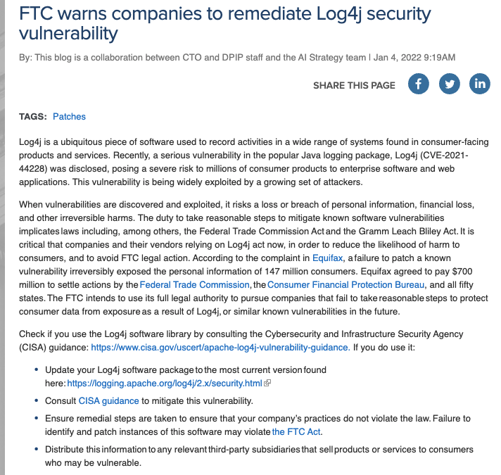

## Where Does It Actually Break? {.center}

> We just saw you can't fully trust code you didn't write. Now the term's
> second question: when a "secure" system fails, **where** does it break?

Today: **Why Cryptosystems Fail** (Anderson, 1993) — the failure is almost
never the math.

::: {.notes}
Follows the Trusting Trust segment that closes the overview deck. Frame
Anderson as the empirical answer to the question Thompson raised in theory:
here is where real deployed systems actually broke. Don't lecture the paper
line by line — pull out the durable ideas.

Live hand-off from the trusting-trust segment: the **ChainDrop** npm worm
(Aug 4, 2026) rebuilt *published tarballs* rather than touching source, so
the git repos looked clean; 444 packages (~2B monthly downloads) were
poisoned in under four hours, and it planted hooks in `.claude/settings.json`
and `.vscode/tasks.json` so merely opening a branch in a coding agent ran the
payload ([Microsoft Security Blog](https://www.microsoft.com/en-us/security/blog/2026/08/04/chaindrop-supply-chain-compromise-anatomy-self-propagating-worm/); [The Register](https://www.theregister.com/security/2026/08/15/chaindrop-worm-crawls-into-npm-supply-chain-evades-standard-defenses/5287958)).
:::

## Anderson's Surprise

Ross Anderson studied **real ATM fraud** in the 1990s and found the failures
were almost never the cryptography.

- Banks assumed strong crypto meant a strong system
- In the UK, the **legal burden** fell on customers to prove fraud — so banks
  had little incentive to find their own flaws
- **Cryptology gets little public feedback** about how it fails in the field,
  so the same mistakes repeat
- 2026 coda: the UK **flipped the burden** — mandatory APP-scam reimbursement
  (Oct 2024) cut Faster Payments fraud losses ~21% (~£73M/yr) in year one
  [PSR independent evaluation, Jul 2026](https://www.regulationtomorrow.com/2026/07/payment-fraud-falls-by-73m-following-psr-reimbursement-scheme/)

::: {.notes}
The institutional point matters as much as the technical one: who bears the
loss shapes who looks for bugs. Tie to the agenda discussion question about
how GDPR/CCPA-style regimes shift those incentives today.
:::

## How ATM Fraud Actually Happened {.smaller}

::: {.columns}
::: {.column width="55%"}
**Insiders**

- A clerk issuing an extra card; complaints stonewalled

**Outsiders**

- Shoulder-surfing PINs, copying account numbers to blank cards
- **Replaying** the bank's "pay" response — jackpotting
- **False terminals** that harvest card + PIN
- 2026: **jackpotting is malware** (Ploutus) commanding the ATM's XFS layer
  directly, bypassing bank authorization — 700+ US incidents, >\$20M in 2025
  [FBI FLASH, Feb 2026](https://www.ic3.gov/CSA/2026/260219.pdf)
:::
::: {.column width="45%"}

:::
:::

::: {.notes}
None of these is a break of DES. They're operations, procedures, and human
factors. The skimmer photo is the physical-world version that still works in
2026 — gas pumps, ATMs, point-of-sale terminals.
:::

## And the Crypto-Adjacent Mistakes

- **Checksums that reduced PIN entropy** — fewer real possibilities than the
  digits suggest
- **Issuing the same PIN** to many customers
- The **PIN-derivation key** had to be secret *and* widely distributed *and*
  available at all times — pick your contradiction
- Sloppy ops: open files, shared keys, customers writing PINs down
- Same contradiction, 2026: **live Stripe secret keys for 659 merchants**
  dumped Aug 18 — leaked from repos, `.env` files, and CI logs, not from
  Stripe [Security Affairs](https://securityaffairs.com/197504/cyber-crime/50000-stripe-secrets-leaked-in-public-code.html)
- 768 long-leaked AWS keys still gave **full account control**; 526 were
  root keys [BleepingComputer, Aug 2026](https://www.bleepingcomputer.com/news/security/hundreds-of-leaked-aws-keys-give-full-control-over-corporate-accounts/)

::: {.notes}
This is the crux: even where crypto was "used," key management and operating
procedure undid it. Foreshadows the entire Meeting 2 lecture on key management
and PKI — keys that must be both secret and ubiquitous are the hard part.
:::

## The Takeaway

> "The vast majority of security failures occur at the level of
> **implementation detail**."

- **Operating procedures** are often the weakest link
- Suppliers **overestimate** customers' security sophistication
- Security functions at the **application level** get neglected
- Security teams churn — at one point, average tenure of US-agency security
  managers was reported around **seven months**
- Sept 2026: the **identity product itself** — Cisco ISE auth bypass
  (CVE-2026-76460, CVSS 10.0): an API endpoint with insufficient
  authentication, exploited in the wild [Help Net Security](https://www.helpnetsecurity.com/2026/09/17/cisco-ise-vulnerability-exploited-cve-2026-76460/)
<!-- TODO: consider adding {.smaller} to this slide if the fifth bullet overflows -->

::: {.notes}
This is the sentence to put on the exam. The lesson is unglamorous: the math
is rarely the problem; the system around the math is. Ask students to predict
which category a given breach falls in before you reveal it.
:::

## A Taxonomy of Failure

When a cryptosystem fails, it's usually one of:

::: {.columns}
::: {.column width="50%"}
- **Faulty implementation** of otherwise-sound crypto
- **Cryptanalysis** — the math actually broke (rare)
:::
::: {.column width="50%"}
- **Poor key management** — generation, storage, distribution
- **Human factors** — misjudging real-world users and operators
:::
:::

**Activity:** for each headline breach you know, which bucket is it?

::: {.notes}
Run this as the in-class activity from the source deck. Most students will put
everything in "cryptanalysis" at first and be surprised how rarely that's the
answer. Seed examples: Heartbleed (implementation), DigiNotar (key/CA trust),
default passwords (human factors).

Fresh seeds (Sept 2026): OpenSSL CVE-2026-84782 (Sept 29, High) — a DTLS
retransmit from a stale buffer offset leaks heap memory in plaintext,
Heartbleed's cousin → *implementation* ([OpenSSL advisories](https://openssl-library.org/news/vulnerabilities/));
wolfSSL 5.9.4 fixed three high-severity certificate-validation bypasses →
*implementation shading into trust* ([SecurityWeek](https://www.securityweek.com/high-severity-vulnerabilities-patched-in-openssl-wolfssl/)); the Aug 2026
Stripe/AWS key dumps → *key management*; IDScan.net's year-long undetected
exfiltration of ~153M licence scans → *human factors / operations*.
:::

## Case in Point: Equifax (2017) {.smaller}

Not a crypto break at all — an **unpatched dependency**.

- Equifax ran the open-source **Apache Struts** framework
- A critical patch shipped **March 7, 2017**; attackers were scanning for
  unpatched servers within days
- Equifax didn't patch — breach ran **May–July 2017**, exposing ~**147 million**
  Americans' records
- 2019 **FTC/CFPB/states settlement**: up to **\$700 million**, including a
  \$300M consumer-compensation fund

::: {.notes}
This is Anderson's thesis in one incident: implementation and operating
procedure (patch management) failed, not the cryptography. It also bridges to
the policy half of the course — the FTC's reasonable-security theory under the
FTC Act. Same theory drove the FTC's Log4j warning.

Anticipate the "but patches break things" objection — the Sept 2026 Windows
Server Remote Desktop regression (two slides on) is the honest counterpoint.
Patch *management* (inventory, staging, testing) is the discipline Equifax
lacked; "patching is risky" is not a defence for a ten-week-old critical.
:::

## When Regulators Treat Patching as a Duty {.smaller}

The **FTC warned (Jan 2022)** that failing to remediate **Log4j** (the
ubiquitous logging library, CVE-2021-44228) could violate the **FTC Act** and
**Gramm-Leach-Bliley** — the *duty to take reasonable steps* to fix known
vulnerabilities.

- The theory keeps expanding — **Dec 2025** FTC order against Illusory
  Systems (Nomad bridge): an inadequately tested June 2022 code change lost
  ~\$186M; alleged failure to use *secure coding practices* and to handle
  vulnerability reports [FTC press release](https://www.ftc.gov/news-events/news/press-releases/2025/12/ftc-will-require-illusory-systems-return-money-stolen-hackers-implement-information-security-program)
<!-- TODO: consider shrinking the FTC screenshot to make room for the new bullet -->

::: {.notes}
Connect the dots: Anderson said implementation and operations are where things
break; regulators have now made *fixing* those failures a legal obligation,
not just good hygiene. This is exactly the agenda question about how regulatory
frameworks shape cryptosystem implementation.

Second 2026 data point: the Jan 2026 10-year order against Illuminate
Education — student data stored in plaintext, vendor security warnings
ignored since 2020, 10M+ records ([Covington Inside Privacy](https://www.insideprivacy.com/united-states/federal-trade-commission/ftc-announces-10-year-information-security-consent-orders-with-illuminate-education-and-illusory-systems/)). Note
the 10-year term versus the FTC's traditional 20 — a policy shift worth a
sentence.
:::

# Designing for Failure {.center}

## What Good Vendors Owe Customers

Anderson's prescription — vendors should pick one and own it:

- Build products that staff with a **realistic level of expertise** can
  integrate, maintain, and manage
- Or **train and certify** the client's personnel, with ongoing support
- Or supply their **own trained, bonded personnel** to run the system

The failure mode is shipping something only an expert could operate safely,
to customers who aren't experts.

- 2026 echo: ChainDrop hunted for npm publish tokens flagged `bypass_2fa` and
  ran from a `preinstall` hook — a convenience escape hatch shipped to
  non-experts became the propagation path
  [Elastic Security Labs, Aug 2026](https://www.elastic.co/security-labs/shai-hulud-chaindrop-npm-supply-chain)

::: {.notes}
Modern echo: "secure by default" and "secure by design" (CISA). The burden is
shifting back toward vendors — the opposite of the UK banks' stance Anderson
described.
:::

## Specifications Should Plan for Failure

A real spec should:

- List **all plausible failure modes**
- Make **prevention strategies** explicit
- Explain **how** those strategies are implemented
- **Test** that real people, at the assumed skill level, can actually operate
  it
- Counter-example, Sept 2026: Windows Server cumulative updates froze Remote
  Desktop hours after boot; the only fix was removing the security patch
  [Cybersecurity News](https://cybersecuritynews.com/remote-desktop-services-failures/)
<!-- TODO: consider swapping in a stronger outlet for the RDS regression if one appears before class -->

::: {.notes}
This is threat modeling avant la lettre — enumerate how it breaks before you
ship. Meeting 2 formalizes threat models and adversary capabilities; this is
the intuition.
:::

## Two Paradigms for Safety {.smaller}

Anderson contrasts how other engineering fields handle risk:

::: {.columns}
::: {.column width="50%"}
**Signalling / interlocks**

- Redundant **interlocks**
- **Formal verification**
- The *system* stays in control
:::
::: {.column width="50%"}
**Aviation**

- Constant **feedback**
- **Incremental** improvement
- The *pilot* stays in control
:::
:::

A useful security metaphor must address **organizational** issues, not just
technical ones.

Regulators now *mandate* interlocks: the FTC's Nomad order requires a "pause"
capability for irreversible transactions
[Covington Inside Privacy, Jan 2026](https://www.insideprivacy.com/united-states/federal-trade-commission/ftc-announces-10-year-information-security-consent-orders-with-illuminate-education-and-illusory-systems/)

::: {.notes}
The deep point: pure automation ("system in control") can be a blind alley if
it removes human judgment; aviation's feedback-and-learn culture may transfer
better to security. Good debate fodder — which paradigm fits modern security?
:::

## Food for Thought {.smaller}

Anderson's institutional questions are alive in 2026:

- Identity-verification systems pushed into production fast (e.g., public
  benefits and health portals) repeat the **human-factors** failures he
  described
  - Sept 2026: **IDScan.net** — ~153M driver's-licence scans; attackers had a
    live feed for over a year before anyone noticed
    [TechCrunch](https://techcrunch.com/2026/09/02/it-sure-looks-like-hackers-breached-a-major-id-card-verification-service/)
- AI now writes and reviews code — does that **extend or shrink** the trusting-
  trust problem?
  - Aug 2026: ChainDrop planted hooks in `.claude/settings.json` and
    `.vscode/tasks.json` — opening a branch in a coding agent ran the worm
    [The Register](https://www.theregister.com/security/2026/08/15/chaindrop-worm-crawls-into-npm-supply-chain-evades-standard-defenses/5287958)
- Who bears the loss when these systems fail — and how does that shape who
  hunts for the bugs?

::: {.notes}
Land the plane on the agenda's open questions: trusting trust applied to AI
systems, and mitigation in interconnected systems. These are the breakout /
discussion prompts; keep them open-ended.
:::

# The Through-Line {.center}

> The math is rarely the problem. **Implementation, key management, operations,
> and trust** are — and that's where this whole course lives.
