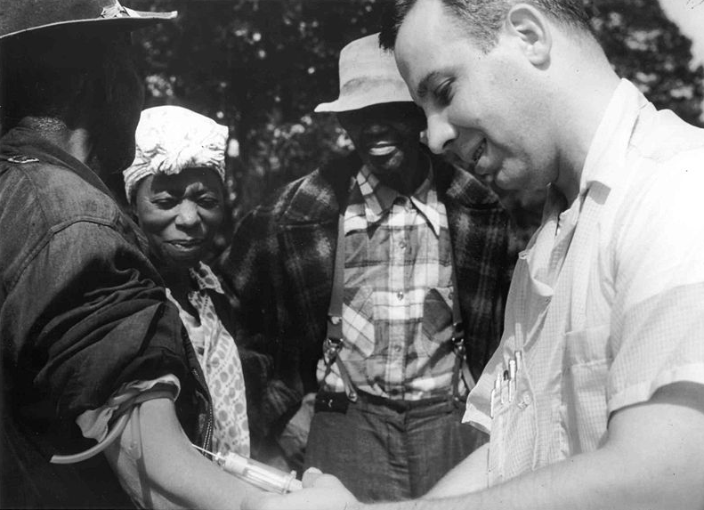
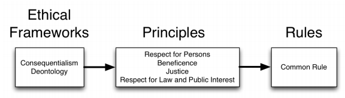
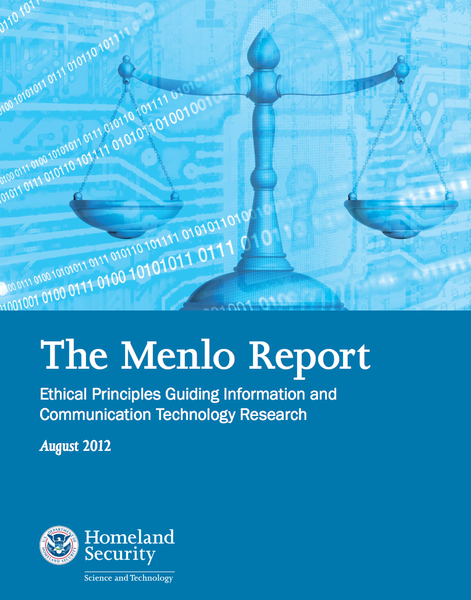

## Why Ethics in Lecture 2? {.center}

> The capabilities of computer-security and privacy research now let us **observe and perturb people without their consent or awareness.**

Before we build systems and run measurements, we need a shared vocabulary
for **what we are allowed to do — and what we *should* do.**

::: {.notes}
Frame the day: this is not a soft "values" lecture tacked on. Every measurement
study, every scan, every scraped dataset in this course raises a question that
law alone does not answer. The point of today is to give you a framework you can
actually apply in your labs and your debate.
:::

## A Cautionary Origin: Tuskegee {.smaller}

::: {.columns}
::: {.column width="55%"}
- U.S. Public Health Service, **1932–1972**: 600 Black men in Alabama
- Told they were treated for "bad blood"; **never told they had syphilis**
- **Penicillin withheld** even after it became the proven cure (1940s)
- A 1972 whistleblower exposed it → the **National Research Act (1974)** and the
  modern **IRB** system
:::
::: {.column width="45%"}

:::
:::

::: {.notes}
This is *the* case that created the apparatus we live under. Respect for persons,
beneficence, justice — all three were violated. The men were deceived (no consent),
harmed (treatment withheld), and the burden fell entirely on a poor, marginalized
population. The regulatory response was the National Research Act and IRBs.
:::

## Why This Hits Close to Home {.smaller}

Recent ethics flashpoints came from **computer-security and CS research**, not medicine:

- **"Hypocrite Commits" (2021):** researchers submitted intentionally buggy patches
  to the Linux kernel to study whether vulnerabilities could be slipped in — without
  maintainers' consent
- **Carna Botnet (2012):** an anonymous researcher compromised ~420,000 devices with
  default credentials to scan the entire IPv4 space ("Internet Census 2012")
- **Encore:** measured censorship by silently loading test resources in users' browsers
  **without their knowledge**

::: {.notes}
The recurring pattern: a genuinely interesting research question, pursued by treating
non-consenting third parties as instruments. Hypocrite Commits got Minnesota banned
from contributing to the kernel. Carna produced a beautiful dataset built on hundreds
of thousands of trespasses. We'll come back to these in breakouts.
:::

## A 2026 Lens: AI Bots on Reddit {.smaller}

::: {.vignette}
**April 2025** — moderators of Reddit's **r/changemyview** revealed that researchers
(later tied to the **University of Zurich**) had run **AI bots posing as humans** for
four months — over **1,700 comments** under fabricated personas (a sexual-assault
survivor, a trauma counselor) to test AI persuasion. **No consent, no community
approval, undisclosed deception.** Reddit's chief legal officer sent **formal legal
demands**; the team agreed **not to publish**, and the university's ethics board issued
a warning.
:::

Same playbook as Emotional Contagion — now with generative AI doing the manipulating.

::: {.notes}
This is the freshest, cleanest teaching case we have. Walk students through it against
the four principles before we even define them: consent (none), deception (extensive,
including fake trauma identities), harm (psychological manipulation of real people in a
sensitive forum), and the law/public-interest question (ToS violation, Reddit's legal
response). The IRB reportedly gave only minimal advisory review and flagged risks that
were ignored. Sources: Washington Post 2025-04-30; NBC News; Engadget.
:::

## Case Study: Emotional Contagion {.smaller}

::: {.columns}
::: {.column width="55%"}
- **2012:** Facebook altered the news feeds of **~700,000 users**, suppressing
  positive or negative posts
- Found small evidence of **"emotional contagion"** — moods spread through the feed
- **Users never consented**; the study underwent **no ethical review**
- Published in *PNAS* (2014); a firestorm followed
:::
::: {.column width="45%"}
**The hard part:** the manipulation was *within* normal product behavior. Where is the
line between **A/B testing** and **human-subjects research**?
:::
:::

::: {.notes}
This is the classic. The defense was "we tune the feed all the time." The objection:
a deliberate emotional manipulation done *to learn*, published as research, with no
consent and no review. Ask: would an IRB have approved it? Could it have, with a
debrief? Note the Reddit case is the 2025 echo of this exact debate.
:::

# A Framework, Not a Rulebook {.center}

> "Either no policies for conduct in these situations exist, or existing policies
> seem inadequate." — James Moor, on the **policy vacuum**

## Key Idea: Digital Is Different {.smaller}

- **Capabilities outrun rules, laws, and norms.** Increasing power is *not* matched by
  increasing clarity about how to use it
- Ubiquitous sensing + cheap storage → a **"database of ruin"**, chilling effects,
  unforeseen **secondary uses**
- Social research in the digital age "raises different ethical questions" (Salganik)

The temptation: treat **legal** as a synonym for **ethical**. It is not.

::: {.notes}
The whole reason medicine's framework doesn't just transfer: scale, deniability, and
distance. You can experiment on 700,000 people from a laptop. The harm is diffuse and
hard to measure (informational risk), which makes the precautionary reflex tempting —
but the precautionary principle can itself be harmful by blocking beneficial work.
:::

## Salganik's Layered Approach {.smaller}

Evaluate research at **three levels**: abstract **frameworks** inform broad
**principles**, which inform concrete **rules** (the Common Rule).

::: {.notes}
This diagram is the spine of the whole lecture — refer back to it. Rules tell you the
floor (what IRBs enforce). Principles tell you how to reason when the rules are silent
or outdated — which, for digital research, is most of the time. Frameworks
(consequentialism vs. deontology) tell you *why* the principles point where they do.
:::

## IRB, Belmont, Menlo {.smaller}

- **IRB** — Institutional Review Board: ensures the **rights and welfare** of human
  subjects are protected; required at federally funded institutions
- **Belmont Report (1979)** — written after Tuskegee; the intellectual basis for U.S.
  human-subjects regulation. Three principles
- **Menlo Report (2012)** — DHS-commissioned; **re-applies Belmont to information and
  communication technology (ICT) research** and adds a fourth principle

::: {.notes}
The lineage: Tuskegee → National Research Act (1974) → Belmont (1979) → Common Rule.
Then the security-research failures of the 2000s → Menlo (2012). Menlo exists precisely
because Belmont didn't anticipate scanning the whole internet or scraping social media.
:::

## The Four Principles {.smaller}

::: {.columns}
::: {.column width="50%"}
**Respect for Persons** *(Belmont)*

- Treat people as **autonomous**; honor their wishes
- Obtain **informed consent** where possible

**Beneficence** *(Belmont)*

- Understand the **risk/benefit profile**, then ask if it strikes the right balance
- *Not* simply "do no harm"
:::
::: {.column width="50%"}
**Justice** *(Belmont)*

- **Fair distribution** of risks and benefits across groups

**Respect for Law & Public Interest** *(Menlo)*

- **Compliance** + **transparency-based accountability**
:::
:::

::: {.notes}
Drill the nuance. Beneficence is *not* "do no harm" — learning what is beneficial
often requires exposing some people to risk. The job is to balance, and to involve
non-experts in judging that balance. Justice: historically the poor bore the research
burden while the rich got the benefit — Tuskegee again.
:::

## Respect for Persons: Informed Consent {.smaller}

- Some form of consent for most things — but consent is **hard** in digital research:
  it raises cost, can compromise the research goal, has logistical limits
- **Violations occur even in benign studies** (no harm intended, autonomy still ignored)

::: {.vignette}
The Reddit case fails here twice: bots **never disclosed** they were AI, and they wore
**fabricated identities** designed to make the deception more persuasive.
:::

::: {.notes}
Connect to the dark-patterns thread later in the course: is consent meaningful if
obtained through deception or a 14-click opt-out? Respect for persons requires *genuine*
choice. Ask the class for a study where consent is genuinely impossible — and what you
do then (debrief, minimal risk, community consultation).
:::

## Beneficence and Justice in Practice

- **Beneficence:** open and reproducible research generally *increases* the benefit
  side of the ledger — but reproducibility can also raise informational risk
- **Justice:** one group should not **bear the risks** while another **reaps the
  benefits**

**Concepts to know:** *minimal risk*, *power analysis*, *informational risk*

::: {.notes}
The Sweeney and Netflix de-anonymization work: all data is potentially identifiable and
sensitive, so the risk of disclosure is genuinely hard to estimate. Power analysis ties
to beneficence — an underpowered study exposes people to risk for no scientific benefit,
which is an ethics problem, not just a stats problem.
:::

## Respect for Law and Public Interest {.smaller}

::: {.columns}
::: {.column width="58%"}
- Menlo expands beneficence to include **all relevant stakeholders**
- **Compliance:** identify and obey relevant laws, contracts, terms of service…
- …but violating ToS may sometimes be **defensible** (e.g., to expose discrimination)
- **Transparency-based accountability:** be open about goals, methods, and results;
  don't do research in secret
:::
::: {.column width="42%"}

:::
:::

::: {.notes}
Compliance example: a researcher scraping a site should read its ToS. But ToS can be
abusive — Verizon and AT&T once forbade customers from criticizing them. So researchers
aren't automatically bound; if they violate ToS, ideally they explain openly. The catch:
that openness can create legal exposure under the CFAA. This is the bridge to the law
section.
:::

## Two Underlying Frameworks {.smaller}

::: {.columns}
::: {.column width="50%"}
**Consequentialism** *(the ends)*

- Bentham, Mill — take actions that lead to better outcomes
- Underlies **Beneficence**
:::
::: {.column width="50%"}
**Deontology** *(the means)*

- Kant — focus on **ethical duties**, regardless of consequences
- Underlies **Respect for Persons**
:::
:::

A pure **consequentialist** might waive consent when risk is zero; a pure
**deontologist** would not.

::: {.notes}
This is why reasonable people disagree about Emotional Contagion or the Reddit study.
The consequentialist asks "what was the net harm?" The deontologist asks "did you use
people as means without their consent?" — and that's a violation regardless of outcome.
The point isn't to pick a team; it's to recognize which framework you're arguing from.
:::

## Ethics ≠ Law {.smaller}

> "Law … a consistent set of universal rules that are widely published, generally
> accepted, and usually enforced."

- The two are **related but not identical**: things can be **legal but unethical**, or
  **ethical but illegal**
- A law can *illuminate* the line between beneficial and harmful acts — but it lags
- If the security-research community sets **standards of practice**, it makes the work
  of legislatures and courts easier

::: {.notes}
Hammer this: passing your IRB is not the end of ethical reasoning, and the absence of a
law does not make something ethical. The community-norms point is important — the more
self-regulation, the less heavy-handed (and ill-informed) the eventual legislation.
:::

## Laws Every Security Researcher Should Know {.smaller}

- **Computer Fraud and Abuse Act (CFAA):** illegal to access a computer "without
  authorization or in excess of authorization" — the scraping / scanning statute
- **Digital Millennium Copyright Act (DMCA) §1201:** no circumventing technical access
  controls — long a threat to vulnerability research
- **Electronic Communications Privacy Act (ECPA):** Wiretap Act, Pen Register Statute,
  Stored Communications Act
- **Sector rules:** **FERPA** (education records), **HIPAA** (health information)

::: {.notes}
These are the laws your labs and your CFAA debate will turn on. Note the chilling effect:
the *fear* of CFAA/DMCA liability deters legitimate security and measurement research.
There are now research-friendly carve-outs we'll discuss — but the baseline risk is real.
:::

## The Law Is (Slowly) Catching Up {.smaller}

::: {.vignette}
**Van Buren v. United States (2021):** the Supreme Court narrowed the CFAA, ruling that
"exceeds authorized access" does *not* cover misusing data you're allowed to see.
**hiQ v. LinkedIn (2022):** scraping **public** web data is generally not a CFAA
violation. Together they give security and measurement researchers meaningfully more
breathing room than they had a decade ago.
:::

- The **DMCA §1201 security-research exemption** (renewed by the Copyright Office) now
  shields good-faith vulnerability testing

::: {.notes}
These are the current-events updates to the old "you'll go to jail for scraping" slide.
Van Buren and hiQ genuinely changed the landscape for the kind of measurement work this
course teaches. But emphasize: narrower CFAA does not equal ethical clearance — the
Belmont/Menlo questions still apply even when the access is legal.
:::

## Codes, Contracts, and Other Standards {.smaller}

::: {.columns}
::: {.column width="50%"}
**Professional codes**

- **ACM Code of Ethics** — "contribute to society," "avoid harm," respect privacy
- **IEEE Code of Ethics** — honesty, avoid conflicts of interest, accept criticism
:::
::: {.column width="50%"}
**Contracts & policies**

- **EULAs** (don't reverse-engineer; you'll be monitored)
- **Organizational policies**
- Older standards: **Nuremberg Code (1947)**, **Helsinki Declaration (1964)**
:::
:::

::: {.notes}
The codes are aspirational but real — ACM updated theirs in 2018 with explicit attention
to systems that affect the public. EULAs are the everyday "contract" version of the
Law/Public-Interest principle. The EFF "grey hat guide" is a good practical resource for
researchers worried about legal exposure.
:::

## Breakout: Apply the Four Principles {.smaller}

For your assigned scenario — **Carna botnet**, **privacy-regulation compliance**, or
**open-source security (Hypocrite Commits)**:

1. Analyze it through **Respect for Persons, Beneficence, Justice, and Respect for Law
   & Public Interest**
2. What conclusions do you draw — if any?
3. **Would you have launched it?** Would you have modified it? How?

::: {.notes}
Give each group one scenario, ~10 minutes, then report out. Push them past "it was bad"
to *which principle* and *what specific design change* would have fixed it (a debrief? a
consent banner? a narrower scan? an opt-out?). Tie the report-out back to the Salganik
diagram: rules vs. principles vs. frameworks.
:::

# Takeaways {.center}

**Legal ≠ ethical.** Use the **four principles** to reason when the rules are silent —
and they usually are. Next: **trusting trust** and how cryptosystems fail.
