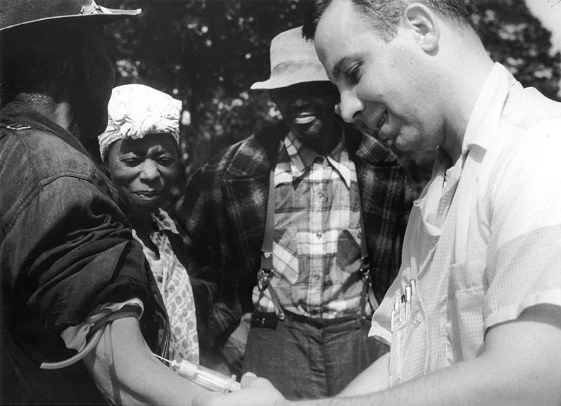
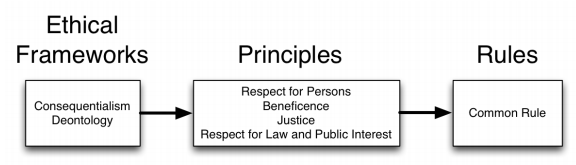
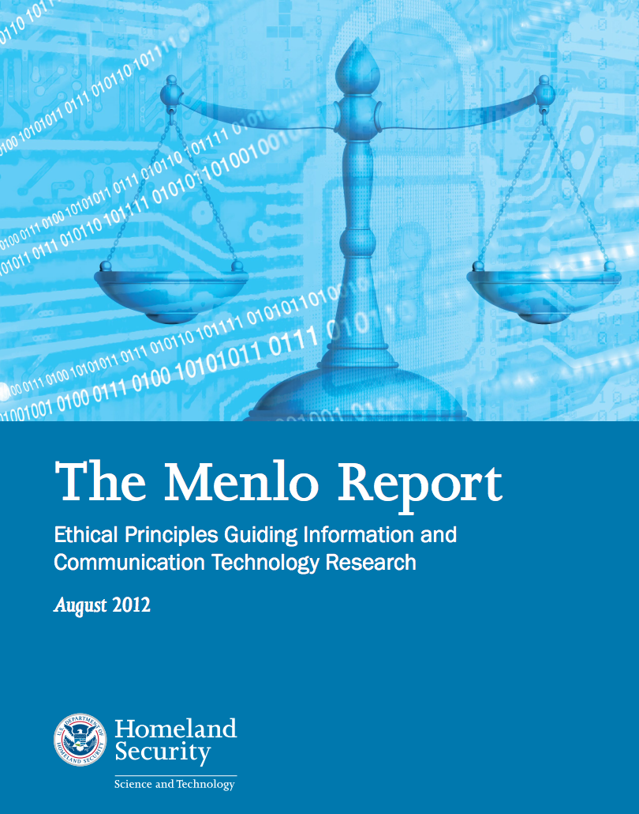

## Why Ethics in Lecture 2? {.center}

> The capabilities of computer-security and privacy research now let us **observe and perturb people without their consent or awareness.**

Before we build systems and run measurements, we need a shared vocabulary
for **what we are allowed to do — and what we *should* do.**

::: {.notes}
Frame the day: this is not a soft "values" lecture tacked on. Every measurement
study, every scan, every scraped dataset in this course raises a question that
law alone does not answer. Ethics sits in Meeting 2 on purpose so that every
subsequent lab and debate shares a vocabulary. Cold-call opener: name one thing
you could do with a laptop this afternoon that would be legal but you would
still feel bad about. Push past "hacking my roommate" to the ambiguous cases —
scraping a public Reddit thread, deanonymizing a leaked dataset, running an
unadvertised A/B test. The point of today is to give you a framework you can
actually apply in your labs and your debate, not a rulebook. We will end at
Belmont plus Menlo — four principles that translate the medical-ethics tradition
into the ICT world.
:::

## A Cautionary Origin: Tuskegee {.smaller}

::: {.columns}
::: {.column width="55%"}
- U.S. Public Health Service, **1932–1972**: 600 Black men in Alabama
- Told they were treated for "bad blood"; **never told they had syphilis**
- **Penicillin withheld** even after it became the proven cure (1940s)
- A 1972 whistleblower exposed it → the **National Research Act (1974)** and the
  modern **IRB** system
:::
::: {.column width="45%"}

:::
:::

::: {.notes}
This is *the* case that created the apparatus we live under. James H. Jones's
1993 book *Bad Blood* is the canonical academic history if a student wants a
primary. Trick cold-call: which of the three Belmont principles does Tuskegee
violate most badly? All three — the men were deceived (respect for persons),
harmed by withheld penicillin after the 1940s cure (beneficence), and the
research burden fell entirely on a poor, Black, marginalized population
(justice). The three Belmont principles were literally reverse-engineered from
these violations. Regulatory lineage: 1972 whistleblower exposure, National
Research Act of 1974, Belmont Report 1979, then the Common Rule and the modern
IRB system. Frame the whole apparatus of research ethics as a response to
specific past atrocities — that is why medicine leads and computing plays
catch-up.
:::

## Why This Hits Close to Home {.smaller}

Recent ethics flashpoints came from **computer-security and CS research**, not medicine:

- **"Hypocrite Commits" (2021):** researchers submitted intentionally buggy patches
  to the Linux kernel to study whether vulnerabilities could be slipped in — without
  maintainers' consent
- **Carna Botnet (2012):** an anonymous researcher compromised ~420,000 devices with
  default credentials to scan the entire IPv4 space ("Internet Census 2012")
- **Encore:** measured censorship by silently loading test resources in users' browsers
  **without their knowledge**

::: {.notes}
The recurring pattern: a genuinely interesting research question, pursued by
treating non-consenting third parties as instruments. Hypocrite Commits (Univ.
of Minnesota, 2020–2021) provoked Greg Kroah-Hartman to ban the entire
university from contributing to the Linux kernel — a nuclear-option response
that made the case a cautionary tale in every open-source community meeting for
years. Carna (2012) produced a beautiful IPv4-wide dataset built on ~420,000
trespasses, using the same default-credential trick Mirai would later
industrialize. Encore was our own — Burnett and Feamster, SIGCOMM 2015 — and
the SIGCOMM PC ended up publishing a "signing statement" flagging its ethics
concerns even as they accepted the paper. All three become case files in the
breakout and in the IRB activity. Cold-call: which of these three feels most
defensible, and why?
:::

## A 2026 Lens: AI Bots on Reddit {.smaller}

::: {.vignette}
**April 2025** — moderators of Reddit's **r/changemyview** revealed that researchers
(later tied to the **University of Zurich**) had run **AI bots posing as humans** for
four months — over **1,700 comments** under fabricated personas (a sexual-assault
survivor, a trauma counselor, a "Black person against BLM") to test AI persuasion.
**No consent, no community approval, undisclosed deception.** Reddit's chief legal
officer sent **formal legal demands**; the team agreed **not to publish**, the
university issued a **formal warning** to the lead researcher, and the ethics
committee committed to a **"stricter review process"** going forward — still the
canonical LLM-field-experiment ethics case as of 2026.
:::

Same playbook as Emotional Contagion — now with generative AI doing the manipulating.

::: {.notes}
This is the freshest, cleanest teaching case we have. Walk students through it
against the four principles before we even define them: consent (none),
deception (extensive, including fake trauma identities), harm (psychological
manipulation of real people in a sensitive forum), and the law/public-interest
question (ToS violation, Reddit CLO Ben Lee's formal legal demands). The
Zurich ethics committee gave only advisory review and flagged risks that were
ignored. Casey Fiesler on the record: "one of the worst violations of research
ethics I've ever seen." Outcome as of 2026: no publication, formal university
warning to the lead researcher, ethics-committee reforms. Frame this
explicitly as the 2025 replay of Facebook's 2012 Emotional Contagion study —
same playbook, generative AI upgrade. Cold-call before revealing the four
principles: what specifically was wrong here, in your own words? Then map their
answers onto Belmont plus Menlo on the next slides.
:::

## Case Study: Emotional Contagion {.smaller}

::: {.columns}
::: {.column width="55%"}
- **2012:** Facebook altered the news feeds of **~700,000 users**, suppressing
  positive or negative posts
- Found small evidence of **"emotional contagion"** — moods spread through the feed
- **Users never consented**; the study underwent **no ethical review**
- Published in *PNAS* (2014); a firestorm followed
:::
::: {.column width="45%"}
**The hard part:** the manipulation was *within* normal product behavior. Where is the
line between **A/B testing** and **human-subjects research**?
:::
:::

::: {.notes}
This is the classic. Primary source is Kramer, Guillory, and Hancock, PNAS 111(24),
2014; PNAS later ran an editorial expression of concern by editor Susan Fiske, which
itself is a teaching artifact. The defense was "we tune the feed all the time" — an
A/B test is not human-subjects research. The objection: a deliberate emotional
manipulation done *to learn*, published as research, with no consent and no review.
Cold-call: would an IRB have approved Emotional Contagion with a debrief? Would you
have? Then land the connection: the 2025 Zurich case is the same argument twelve
years later, only with generative AI doing the manipulating and a bigger scandal
because the deception is more visceral. If we could not agree in 2014, we still
have not agreed — hence the framework this course adopts.
:::

# A Framework, Not a Rulebook {.center}

> "Either no policies for conduct in these situations exist, or existing policies
> seem inadequate." — James Moor, on the **policy vacuum**

::: {.notes}
Pause here. The quote is from James H. Moor's 1985 essay "What Is Computer
Ethics?" in *Metaphilosophy* — the founding text for the whole ICT-ethics
literature. Name it out loud for the students who want to read the primary.
The pivot: we are done with cautionary stories; the next block is the
apparatus. Preview: three layers (frameworks, principles, rules), four
principles from Belmont plus Menlo, then the two underlying moral
frameworks. Nothing here is a rulebook — students will still need judgment.
:::

## Key Idea: Digital Is Different {.smaller}

- **Capabilities outrun rules, laws, and norms.** Increasing power is *not* matched by
  increasing clarity about how to use it
- Ubiquitous sensing + cheap storage → a **"database of ruin"**, chilling effects,
  unforeseen **secondary uses**
- Social research in the digital age "raises different ethical questions" (Salganik)

The temptation: treat **legal** as a synonym for **ethical**. It is not.

::: {.notes}
The whole reason medicine's framework does not just transfer: scale, deniability,
and distance. You can experiment on 700,000 people from a laptop. James Moor's
1985 essay "What Is Computer Ethics?" gave us the phrase "policy vacuum" — the
gap between what technology now lets us do and what norms tell us we should. The
"database of ruin" line is Paul Ohm's, from his 2010 UCLA Law Review piece
"Broken Promises of Privacy": once enough data exists, everyone is identifiable
and re-identifiable, and the harm is informational risk — diffuse, hard to
measure, chilling. That makes a precautionary reflex tempting, but the
precautionary principle itself can block beneficial work. The point of the
frameworks-to-rules ladder on the next slide is exactly to reason under that
uncertainty without defaulting to either "if it's legal, ship it" or "if we
can't prove no harm, forbid it."
:::

## Salganik's Layered Approach {.smaller}

Evaluate research at **three levels**: abstract **frameworks** inform broad
**principles**, which inform concrete **rules** (the Common Rule).

::: {.notes}
This diagram is the spine of the whole lecture — refer back to it every time a
student says "but is it legal?" The figure is from Matthew Salganik's *Bit by
Bit* (Princeton, 2018) chapter 6, our recommended companion reading for this
unit. Rules tell you the floor: what IRBs enforce, what the Common Rule covers.
Principles tell you how to reason when the rules are silent or outdated —
which, for digital research, is most of the time. Frameworks — consequentialism
versus deontology — tell you *why* the principles point where they do, and
predict which side of a debate a given speaker will land on. Every case in
today's lecture will run bottom-up: what rule did they break, which principle
was violated, which framework do their defenders and critics implicitly hold?
:::

## IRB, Belmont, Menlo {.smaller}

- **IRB** — Institutional Review Board: ensures the **rights and welfare** of human
  subjects are protected; required at federally funded institutions
- **Belmont Report (1979)** — written after Tuskegee; the intellectual basis for U.S.
  human-subjects regulation. Three principles
- **Menlo Report (2012)** — DHS-commissioned; **re-applies Belmont to information and
  communication technology (ICT) research** and adds a fourth principle

::: {.notes}
Walk the full lineage on the board: Nuremberg Code (1947, in response to Nazi
medical experiments) → Declaration of Helsinki (1964, World Medical Association)
→ Tuskegee → National Research Act (1974) → Belmont Report (1979) → the Common
Rule. Then the security-research failures of the 2000s — Encore, Carna, Weaver
and others — pushed DHS Science and Technology to commission the Menlo Report
(2012), authored by Erin Kenneally and David Dittrich. Menlo exists precisely
because Belmont did not anticipate scanning the entire IPv4 space or scraping
social media at scale. It reapplies the three Belmont principles to
information and communication technology research and adds a fourth (respect
for law and public interest). This slide is the map you will point at when a
lab writeup asks "what governs my scan?"
:::

## The Four Principles {.smaller}

::: {.columns}
::: {.column width="50%"}
**Respect for Persons** *(Belmont)*

- Treat people as **autonomous**; honor their wishes
- Obtain **informed consent** where possible

**Beneficence** *(Belmont)*

- Understand the **risk/benefit profile**, then ask if it strikes the right balance
- *Not* simply "do no harm"
:::
::: {.column width="50%"}
**Justice** *(Belmont)*

- **Fair distribution** of risks and benefits across groups

**Respect for Law & Public Interest** *(Menlo)*

- **Compliance** + **transparency-based accountability**
:::
:::

::: {.notes}
Drill the nuance — students consistently misremember beneficence as "do no harm."
It is not. Learning what is beneficial often requires exposing *some* people to
risk, and the job of beneficence is to weigh that risk-benefit profile
honestly and to include people outside the research team in that judgment.
Cold-call: give me a study that is beneficent but does not respect persons, and
one that respects persons but is not beneficent. (A well-designed vaccine
trial that under-consents. A perfectly consented but scientifically pointless
survey.) Justice: historically the poor bore the research burden while the
rich reaped the benefit — Tuskegee is the canonical example, and the modern
digital analog is data-brokered surveillance of low-income users who cannot
opt out. The fourth principle (Menlo's respect for law and public interest)
gets its own slide because it does the most work in security research.
:::

## Respect for Persons: Informed Consent {.smaller}

- Some form of consent for most things — but consent is **hard** in digital research:
  it raises cost, can compromise the research goal, has logistical limits
- **Violations occur even in benign studies** (no harm intended, autonomy still ignored)

::: {.vignette}
The Reddit case fails here twice: bots **never disclosed** they were AI, and they wore
**fabricated identities** designed to make the deception more persuasive.
:::

::: {.notes}
Connect to the dark-patterns thread that returns in the Privacy Law lecture:
is consent meaningful if obtained through deception or a fourteen-click
opt-out? Helen Nissenbaum's "Privacy as Contextual Integrity" (Washington Law
Review, 2004) is the underlying argument — consent is not context-free, and
information flowing appropriately in one context can be a violation when moved
to another. The Zurich case fails respect for persons twice: bots never
disclosed they were AI, and they wore fabricated identities (a sexual-assault
survivor, a trauma counselor) engineered to make the deception more
persuasive. Cold-call: name a study where consent is genuinely impossible.
Then push on what you do instead — debrief after the fact, restrict to
minimal-risk designs, community consultation, or simply do not run the study.
Not every research question deserves an answer.
:::

## Beneficence and Justice in Practice

- **Beneficence:** open and reproducible research generally *increases* the benefit
  side of the ledger — but reproducibility can also raise informational risk
- **Justice:** one group should not **bear the risks** while another **reaps the
  benefits**

**Concepts to know:** *minimal risk*, *power analysis*, *informational risk*

::: {.notes}
The three de-identification failures every security student should know:
Latanya Sweeney's 1997 work showing that ZIP plus birthdate plus sex uniquely
identifies most Americans (and re-identified then-Governor William Weld in an
"anonymized" hospital-discharge dataset); Narayanan and Shmatikov's 2008
Netflix Prize de-anonymization using IMDb as an auxiliary dataset; and the 2018
Strava heatmap that exposed the layout of forward operating bases because
soldiers wore fitness trackers. All three show that "anonymized" is not a
technical property of a dataset — it depends on what else exists in the world.
Power analysis ties to beneficence: an underpowered study (see Button et al.,
Nature Reviews Neuroscience 2013) exposes people to risk for no scientific
benefit, which is an ethics problem, not a stats problem. Concrete mitigations
worth naming: k-anonymity, differential privacy, and formal data-retention
plans; we return to these in the AI and privacy lecture.
:::

## Respect for Law and Public Interest {.smaller}

::: {.columns}
::: {.column width="58%"}
- Menlo expands beneficence to include **all relevant stakeholders**
- **Compliance:** identify and obey relevant laws, contracts, terms of service…
- …but violating ToS may sometimes be **defensible** (e.g., to expose discrimination)
- **Transparency-based accountability:** be open about goals, methods, and results;
  don't do research in secret
:::
::: {.column width="42%"}

:::
:::

::: {.notes}
Compliance example: a researcher scraping a site should read its ToS. But ToS
can be abusive — carriers have historically written clauses forbidding
customer criticism, and platforms have used ToS to block legitimate audits.
The canonical defensible-ToS-violation is ProPublica's 2016 investigation
that documented Facebook letting advertisers exclude users by race — the
audit arguably breached ToS but exposed real discrimination. That is what
Menlo means by weighing all relevant stakeholders. "Transparency-based
accountability" is a defined Menlo term: be open about goals, methods, and
results; do not do the research in secret. The catch: that openness can
create legal exposure under the CFAA, which is why the next slides pivot to
the law. Cold-call: if you had to scrape a platform to expose bias, would you
tell the platform first, tell them after, or never?
:::

## Two Underlying Frameworks {.smaller}

::: {.columns}
::: {.column width="50%"}
**Consequentialism** *(the ends)*

- Bentham, Mill — take actions that lead to better outcomes
- Underlies **Beneficence**
:::
::: {.column width="50%"}
**Deontology** *(the means)*

- Kant — focus on **ethical duties**, regardless of consequences
- Underlies **Respect for Persons**
:::
:::

A pure **consequentialist** might waive consent when risk is zero; a pure
**deontologist** would not.

::: {.notes}
This is why reasonable people disagree about Emotional Contagion or the Reddit
study. Consequentialism traces back to Bentham (1789) and Mill (1861): actions
are right insofar as they lead to better outcomes. Deontology traces to Kant's
*Groundwork of the Metaphysics of Morals* (1785): moral duties (do not lie, do
not use people as mere means) bind regardless of outcome. The consequentialist
asks "what was the net harm?" and can defend Facebook's study if the effect
size was small. The deontologist asks "did you use people as means without
their consent?" — and that is a violation regardless of outcome. The point is
not to pick a team; it is to recognize which framework you and your opponent
are arguing from so the debate can actually move. This slide is directly load
bearing for the ethics breakout and the CFAA debate later this term.
:::

## Ethics ≠ Law {.smaller}

> "Law … a consistent set of universal rules that are widely published, generally
> accepted, and usually enforced."

- The two are **related but not identical**: things can be **legal but unethical**, or
  **ethical but illegal**
- A law can *illuminate* the line between beneficial and harmful acts — but it lags
- If the security-research community sets **standards of practice**, it makes the work
  of legislatures and courts easier

::: {.notes}
Hammer this: passing your IRB is not the end of ethical reasoning, and the
absence of a law does not make something ethical. The Aaron Swartz case (2011
JSTOR bulk-download, felony CFAA charges, 2013 suicide) is the standing
reminder that "illegal" can badly overshoot "unethical" — and that the
community's silence about CFAA overreach for years contributed to that
outcome. Cold-call: name a research practice that is currently legal that you
think will be considered clearly unethical in twenty years. Push them past
"AI-generated deepfakes" to the harder cases — invisible A/B tests on kids,
scraping public court records to build a face-search database. The
community-norms point matters: the more visible, thoughtful self-regulation
this field does, the less heavy-handed and less well-informed the eventual
legislation will be.
:::

## Laws Every Security Researcher Should Know {.smaller}

- **Computer Fraud and Abuse Act (CFAA):** illegal to access a computer "without
  authorization or in excess of authorization" — the scraping / scanning statute
- **Digital Millennium Copyright Act (DMCA) §1201:** no circumventing technical access
  controls — long a threat to vulnerability research
- **Electronic Communications Privacy Act (ECPA):** Wiretap Act, Pen Register Statute,
  Stored Communications Act
- **Sector rules:** **FERPA** (education records), **HIPAA** (health information)

::: {.notes}
These are the laws your labs and the CFAA debate will turn on. Cite the code
sections aloud once so students recognize them: CFAA is 18 U.S.C. §1030;
DMCA §1201 is 17 U.S.C. §1201; the Wiretap Act, Pen Register Statute, and
Stored Communications Act live under 18 U.S.C. §§2510–2523; FERPA is 20
U.S.C. §1232g; HIPAA is administrative. The chilling effect matters as much
as the law itself: the *fear* of CFAA and DMCA liability deters legitimate
security and measurement research, and Mayer et al. (Science, 2019) documented
that chill empirically in the compliance-audit context. There are now
research-friendly carve-outs on the next slide, but the baseline risk is
real, and EFF's Coders' Rights Project is the practical playbook for anyone
worried about exposure.
:::

## The Law Is (Slowly) Catching Up {.smaller}

::: {.vignette}
**Van Buren v. United States (2021):** the Supreme Court narrowed the CFAA, ruling that
"exceeds authorized access" does *not* cover misusing data you're allowed to see.
**hiQ v. LinkedIn (2022):** scraping **public** web data is generally not a CFAA
violation. In **2022**, DOJ policy formally instructed federal prosecutors that
**good-faith security research** should not be charged under the CFAA. As of 2026
the "gates-up-or-down" test still controls.
:::

- The **DMCA §1201 security-research exemption** (renewed by the Copyright Office) now
  shields good-faith vulnerability testing — but **contract, copyright, and GDPR**
  claims remain live risks that Van Buren did not resolve

::: {.notes}
These are the current-events updates to the old "you will go to jail for
scraping" slide. *Van Buren v. United States*, 593 U.S. 374 (2021): the
Supreme Court adopted a "gates-up-or-down" reading of "exceeds authorized
access" — misusing data you were allowed to see is not itself a CFAA
violation. *hiQ Labs v. LinkedIn*, 9th Cir. 2022 remand: scraping publicly
accessible web data is generally outside CFAA. May 19, 2022: DOJ policy
formally instructed federal prosecutors not to charge good-faith security
research under CFAA. The Copyright Office's 2024 §1201 rulemaking renewed the
security-research exemption. All of this genuinely changed the landscape for
the measurement work this course teaches. But emphasize the pivot: narrower
CFAA does not equal ethical clearance, and the live legal risks in 2026 have
shifted to *contract*, *copyright*, and *GDPR* claims that Van Buren did not
resolve. Belmont plus Menlo still apply even when access is legal.
:::

## Codes, Contracts, and Other Standards {.smaller}

::: {.columns}
::: {.column width="50%"}
**Professional codes**

- **ACM Code of Ethics** — "contribute to society," "avoid harm," respect privacy
- **IEEE Code of Ethics** — honesty, avoid conflicts of interest, accept criticism
:::
::: {.column width="50%"}
**Contracts & policies**

- **EULAs** (don't reverse-engineer; you'll be monitored)
- **Organizational policies**
- Older standards: **Nuremberg Code (1947)**, **Helsinki Declaration (1964)**
:::
:::

::: {.notes}
The professional codes are aspirational but real — ACM revised its Code of
Ethics in 2018 with explicit attention to systems that affect the public, and
IEEE's code covers honesty, conflicts of interest, and the duty to accept
criticism. The Nuremberg Code (1947) and the Helsinki Declaration (1964,
revised 2013) are the medical-ethics predecessors that Belmont extends. EULAs
are the everyday "contract" version of the law-and-public-interest principle:
click-through terms can bind you to surveillance you never noticed. The 2017
FTC consent decree against Vizio — TVs collecting viewing data without
meaningful consent — is the concrete example. Cold-call: how many EULAs did
you agree to this week? Frame this as the bridge from abstract principles to
the everyday small print that governs research and product design alike.
:::

## Breakout: Apply the Four Principles {.smaller}

For your assigned scenario — **Carna botnet**, **privacy-regulation compliance**, or
**open-source security (Hypocrite Commits)**:

1. Analyze it through **Respect for Persons, Beneficence, Justice, and Respect for Law
   & Public Interest**
2. What conclusions do you draw — if any?
3. **Would you have launched it?** Would you have modified it? How?

::: {.notes}
Give each group one scenario, roughly ten minutes, then report out. Push them
past "it was bad" to *which principle* and *what specific design change* would
have fixed it — a debrief afterward, a consent banner, a narrower scan, an
opt-out, a coordinated disclosure timeline. Two sub-breakouts work well: LLM
field experiments (Zurich as prompt) and coordinated versus full disclosure
(Hypocrite Commits as prompt). Tie every report-out back to the Salganik
diagram — rules versus principles versus frameworks — so the same vocabulary
carries into the CFAA and backdoors debates later this term. Reserve five
minutes at the end for a whole-class comparison: is there one design pattern
(consent, minimal risk, debrief, community consultation) that would rescue
all three cases, or does each require a different fix?
:::

# Takeaways {.center}

**Legal ≠ ethical.** Use the **four principles** to reason when the rules are silent —
and they usually are. Next: **trusting trust** and how cryptosystems fail.

::: {.notes}
Bridge to the next lecture: Key Management and PKI is the same "who do you
trust?" question, now in the technical crypto plumbing. Recommended follow-on
reading: Salganik, *Bit by Bit*, chapter 6, end-to-end, and Kenneally and
Dittrich's Menlo Report companion in IEEE Security & Privacy 2012. Remind
students that today's four principles will recur every time we handle data
in the labs, and that the CFAA debate and the backdoors debate later this
term both replay these tensions in different guises. Close on the
one-sentence takeaway: passing legal review is a floor, not a ceiling; the
four principles are the tools you use when the floor is silent.
:::
