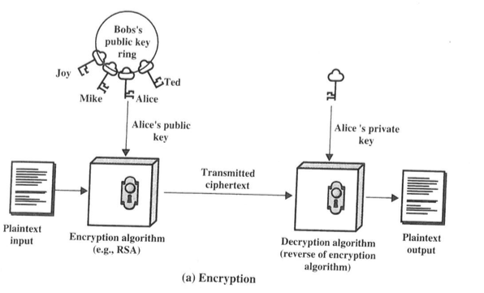
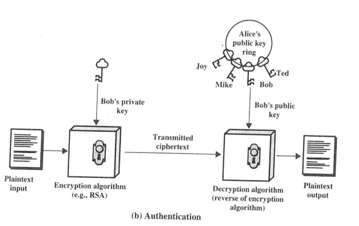
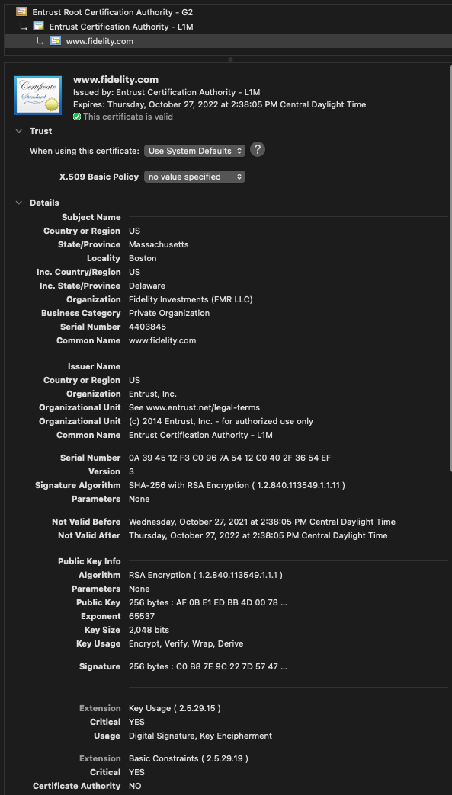
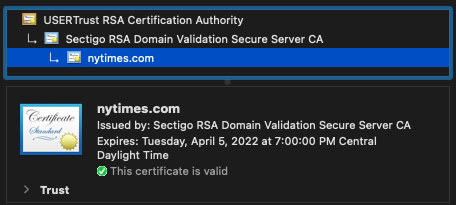
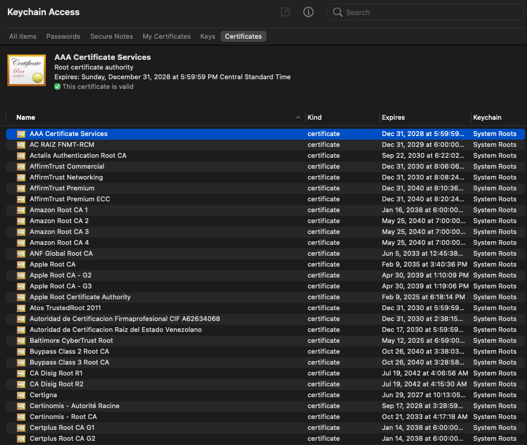
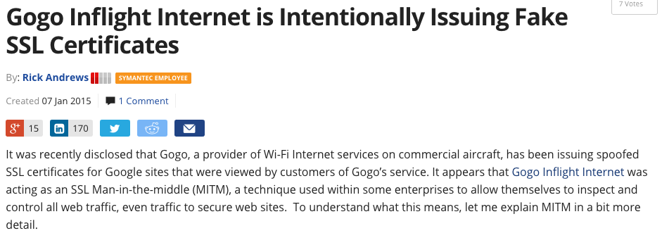
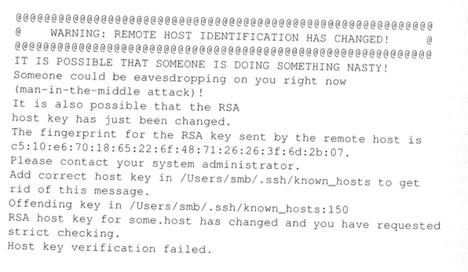
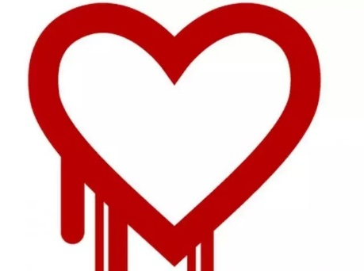

## Where We Are {.center}

Cryptography gives Alice and Bob **confidentiality** and **integrity** — *once
they share a key.*

> The hard part was never the math. It's the **keys**: who has them, who trusts
> them, and how you change your mind.

::: {.notes}
Frame the whole lecture: last time we treated the shared key as a given. Today's
question is the entire field of "key management" — and it turns out the social and
institutional problems (who do you trust?) are harder than the cryptographic ones.
:::

## The Setup: Alice, Bob, and Eve

- **Alice** wants to send **Bob** a message; **Eve** can read everything on the
  network
- **Confidentiality:** keep the contents secret from Eve
- **Integrity:** Bob can tell the message wasn't altered (think **Mallory**, the
  active attacker, not just a passive eavesdropper)
- Working model: **crypto is the only protection**, and every message is effectively
  a broadcast

::: {.notes}
Reinforce the threat-model framing from Meeting 1. Eve = passive eavesdropper,
Mallory = active man-in-the-middle. The "everything is a broadcast" assumption is
what makes key management non-trivial — you can't whisper.
:::

## Symmetric Crypto: Same Key Both Ways

- Encryption and decryption use the **same secret key**
- Fast — this is what actually encrypts bulk data on the wire
- **The catch:** Alice and Bob must *already* share a secret

::: {.vignette}
This is still how the web works underneath: TLS 1.3 uses public-key crypto only to
agree on a key, then switches to fast **symmetric** ciphers (AES-GCM, ChaCha20) for
the actual bytes.
:::

::: {.notes}
Students should leave knowing the division of labor: asymmetric crypto for key
agreement and signatures, symmetric crypto for bulk data. Don't dwell on cipher
internals — the agenda explicitly says we skip implementation details.
:::

## The Key-Distribution Problem

**Exercise:** 100 people all want to talk to each other, pairwise, using symmetric
keys. How many keys?

- Each pair needs its own key: $\binom{n}{2} = \frac{n(n-1)}{2}$
- 10 people → 45 keys 100 people → **4,950** 1,000 people → **499,500**

If everyone instead *shares one* key, anyone can read — and **impersonate** —
everyone else.

::: {.notes}
Cold-call the count. The quadratic blowup is the motivation for everything that
follows. Symmetric keys don't scale to a planet of strangers who've never met.
:::

# Diffie-Hellman: A Public Conversation, a Private Key {.center}

## 1976: "New Directions in Cryptography"

- **Whit Diffie & Marty Hellman** (with ideas from **Ralph Merkle**) showed Alice and
  Bob can derive a shared secret over a **public** channel
- No prior shared secret needed — Eve hears the whole conversation and still can't
  compute the key
- Secretly discovered earlier by **Malcolm Williamson** at the UK's GCHQ (declassified
  1997)

::: {.notes}
This was the conceptual breakthrough. Emphasize how counterintuitive it is: two
strangers shouting across a room can agree on a secret nobody listening can learn.
The GCHQ backstory is a nice "intelligence agencies got there first, in secret" hook.
:::

## How Diffie-Hellman Works (the Idea)

- Public parameters: a large prime $p$ and a generator $g$
- Alice picks secret $x$, sends $g^x \bmod p$ Bob picks secret $y$, sends $g^y \bmod p$
- Both compute the **same** shared value: $g^{xy} \bmod p$
- Eve sees $g^x$ and $g^y$ but recovering $x$ or $y$ is the **discrete-log problem** —
  no known efficient algorithm

::: {.notes}
Per the agenda, do NOT prove anything or compute discrete logs. The takeaway is the
*shape*: a one-way function (modular exponentiation) that's easy forward, hard to
invert. That asymmetry is the whole game.
:::

## D-H's Big Weakness: Man-in-the-Middle

- Alice runs D-H — but really with **Mallory**. Bob does too.
- Mallory ends up sharing one key with Alice and a different one with Bob, relaying
  and reading everything
- **Bottom line:** D-H gives you a secure *channel*, but tells you **nothing about who
  is on the other end**

> The chess-hustler trick: sit "in the middle" between Carlsen and a grandmaster, relay
> their moves, and beat one of them. *In the middle is a powerful place to be.*

::: {.notes}
This is the pivot of the entire lecture. Confidentiality without authentication is a
trap. Everything after this — certificates, CAs, PKI — exists to answer "who is on the
other end?" The SSH host-key warning later is the same problem made visible.
:::

# Public-Key (Asymmetric) Cryptography {.center}

## Two Keys Instead of One

- New idea (Diffie–Hellman, 1976 RSA, 1978): a **key pair** where you **can't derive
  one key from the other**
- Keep one key **private**; **publish** the other
- One key pair *per person*, not per pair — the quadratic blowup disappears
- Independently invented in secret at GCHQ by **Clifford Cocks** (1973)

::: {.notes}
Tie back to the key-distribution problem: n people now need n key pairs, not n²/2
shared keys, and the public halves can sit in a directory. RSA is mentioned, not
derived (per agenda).
:::

## Two Use Cases, One Idea {.smaller}

::: {.columns}
::: {.column width="50%"}
**Confidentiality**

Encrypt with the recipient's **public** key → only they can decrypt (private key).

*"For your eyes only."*

:::
::: {.column width="50%"}
**Integrity / Authentication**

Sign with **your private** key → anyone can verify with your public key.

*A digital signature.*

:::
:::

::: {.notes}
The symmetry is the point: same key pair, opposite directions. Real example for the
integrity side: software and OS updates are signed so your device only installs code
the vendor actually shipped (Apple, Microsoft, Android). Want both properties? Use the
key pairs twice.
:::

## What Public-Key Crypto Is *Not*

- **Not** inherently more secure than symmetric crypto — security comes from key length
  and hardness assumptions, not from being "asymmetric"
- **Not** a replacement for symmetric crypto — it's slow, so we use it only to set up
  keys and sign
- **Not** a replacement for **key distribution** — you still need infrastructure to
  answer: *whose public key is this?*

::: {.notes}
This slide kills three common misconceptions. The third one is the bridge to PKI: a
published public key is worthless if you can't tie it to the right identity.
:::

# Certificates and Public-Key Infrastructure {.center}

## The Problem with Public Keys

> "It is crucial that the public file of enciphering keys be protected from
> unauthorized modification." — Diffie & Hellman, 1976

- Where is the directory of public keys? Who runs it? How do you trust it?
- If Mallory can swap in *his* public key for Bob's, you're encrypting to Mallory
- **Partial answer:** certificates

::: {.notes}
This is the MITM problem again, now at the level of the key directory. The original
paper already flagged it. Certificates don't eliminate trust — they relocate it.
:::

## What a Certificate Is

- A signed statement that **binds an identity to a public key**
- Signed by an **issuer** — a **Certificate Authority (CA)**
- Contains the subject, the issuer, and an **expiration time**
- A **self-signed** cert vouches only for itself; a **CA-signed** cert is vouched for by
  someone your software already trusts

::: {.column width="60%"}

:::

::: {.notes}
Walk through the real fields on the right: subject name, issuer, "not valid
before/after," public key, signature algorithm. This is exactly what students inspect
in the hands-on activity. The self-signed vs. CA-signed distinction sets up the
chain-of-trust idea.
:::

## Chains of Trust

- A CA signs a server's cert → the server's cert "chains up" to the CA
- Your browser follows the chain from the **leaf** (the website) up to a **root** it
  already trusts
- Standard format: **X.509** (the "P" in "the PKI")

::: {.notes}
This mirrors the in-class Firefox activity: example chain was course website →
Let's Encrypt → ISRG Root X1. Have students walk a chain in their own browser. The key
question to plant: where does the chain *stop*? — answer on the next slide.
:::

## Where Does Trust Stop? Trust Anchors

- The chain ends at a **root CA** your browser/OS **ships with** and trusts implicitly
- How does the browser know Facebook's cert *should* come from a given CA? Because the
  cert says so — and the browser trusts that CA's root
- **The risk:** browsers/OSes ship with **~hundreds of root CAs**. If *any one* is
  malicious or compromised, it can forge a cert for *any* site

::: {.notes}
This is the structural weakness of the web PKI: trust is "any one of ~hundreds," not
"all of them." A single bad root anywhere can MITM your bank. That's why the rest of
the lecture is about catching and removing bad CAs.
:::

## Two Levels of Validation

::: {.columns}
::: {.column width="50%"}
**Domain Validation (DV)**

- Proves only **control of the domain** (e.g., place a token on the site)
- Usually free and automated — **Let's Encrypt** issues these
:::
::: {.column width="50%"}
**Extended Validation (EV)**

- Proves a **legal entity's identity** (e.g., Bank of America)
- More verification; historically a browser UI badge
:::
:::

Today browsers have **dropped the EV "green bar"** — the lock now means only "encrypted,
DV-or-better," not "this is the real company."

::: {.notes}
Important update: students raised on screenshots of the green company-name bar should
know it's gone (Chrome/Firefox removed it ~2019–2020 because users didn't read it). The
lesson: the lock icon says *the connection* is private, not *who* you're talking to.
:::

# When CAs Go Wrong {.center}

## DigiNotar, 2011: A CA Compromised

- Dutch CA **DigiNotar** was breached and issued **fraudulent certificates for
  `*.google.com`**
- Used to **man-in-the-middle ~300,000 Iranian users'** Gmail
- Detected weeks later browsers yanked DigiNotar's roots and the company **went
  bankrupt**

The perverse incentive: CAs are **paid by the very entities** they're supposed to
vet — looser rules mean more customers.

::: {.notes}
DigiNotar is the canonical "the trust model failed" story. One compromised CA =
silent interception of an entire country's email. Note the business-model conflict:
the customer pays the CA, but the public bears the risk.
:::

## Rogue Issuance in the Wild

::: {.columns}
::: {.column width="55%"}
- **CNNIC** (China): added as a Mozilla root, later caught issuing certs used for MITM
  (2015) — distrusted by Chrome/Firefox
- **Gogo Inflight** (2015): the in-flight Wi-Fi provider issued **fake Google certs** to
  inspect passengers' "secure" traffic
- Some **enterprises** install their own root to decrypt all employee TLS — the same
  mechanism, sanctioned internally
:::
::: {.column width="45%"}

:::
:::

::: {.notes}
These show the spectrum from clearly hostile (CNNIC MITM) to "it's our network" (Gogo,
corporate TLS inspection). All use the identical trick: a root the client trusts signs a
cert for a site it shouldn't. Good debate fodder for the backdoor question later.
:::

## 2025–2026: Browsers Are Still Pulling CAs {.smaller}

::: {.vignette}
The trust store is actively policed today. In **Chrome 139 (Aug 1, 2025)**, Google
**distrusted Chunghwa Telecom and Netlock** root CAs, citing a "pattern of compliance
failures." And on **April 15, 2026**, Chrome and Mozilla begin **distrusting the
DigiCert "Global Root CA" (G1)**. Sites on those roots show "Your connection is not
private."
:::

- Browser vendors — not governments — are the de facto regulators of the web's trust
- A CA can be removed for **misbehavior** *or* for **failing to keep up** with rules

::: {.notes}
Freshest hook in the deck, verified. The point for a policy class: enforcement of web
PKI is privatized — Apple/Google/Mozilla/Microsoft root programs decide who's trusted.
That's enormous, largely unaccountable power. Ask: should this be a public function?
:::

# Detecting and Limiting Damage {.center}

## Certificate Transparency

- Every CA must **log every certificate** it issues to public, append-only logs
- Anyone — including the site owner — can **watch for unexpected certs** for their
  domain
- Browsers require proof of CT logging before they trust a cert
- **Limitation:** CT detects misissuance *after the fact*; it doesn't prevent it

::: {.notes}
CT is the post-DigiNotar fix that actually scaled: make misissuance *visible*. A bogus
Google cert can't hide anymore — Google would see it in the logs. Detection, not
prevention, but detection is what was missing in 2011.
:::

## Key Pinning and the SSH Model

- **Pinning:** remember which key/CA a site used; alert if it suddenly changes
- Public keys rarely change, so a change is suspicious
- You've seen this: **SSH** pins the host key on first connection

::: {.notes}
SSH is "trust on first use" pinning made visible. Web key-pinning (HPKP) was tried and
mostly abandoned — too easy to brick your own site. The tension: pinning catches MITM
but is operationally brittle. Good place to discuss usable security.
:::

## Expiration and Revocation

::: {.columns}
::: {.column width="55%"}
- **Expiration:** certs die on a schedule — limits damage from undetected compromise and
  forces algorithm upgrades
- **Revocation:** killing a cert *early* (key lost/stolen)
  - **CRL** — a signed list of revoked certs
  - **OCSP** — an online "is this still valid?" check
- In practice, **detection** is the slow step, not the kill switch
:::
::: {.column width="45%"}

:::
:::

::: {.notes}
Heartbleed is the canonical mass-revocation event: a bug that could leak private keys
meant everyone had to reissue. Revocation is famously broken — soft-fail OCSP means an
attacker who can block the check just wins. Which motivates the next slide.
:::

## The 2026 Fix: Just Make Certs Short-Lived {.smaller}

::: {.vignette}
In **April 2025**, the CA/Browser Forum unanimously passed **Ballot SC-081v3**, cutting
the maximum TLS certificate lifetime from ~398 days toward **47 days**, phased in:
**200 days (Mar 2026) → 100 days (Mar 2027) → 47 days (Mar 2029)**. Shorter-lived certs
mean revocation matters less — a stolen cert expires on its own in weeks.
:::

- The trade-off: **automation becomes mandatory** (you can't renew by hand every 47
  days) — ACME / Let's Encrypt-style issuance is the new normal

::: {.notes}
This is the elegant systems answer to broken revocation: don't fix revocation, shrink
the window. Verified, dated. Connects to operations: short certs force automated
renewal, which centralizes more of the web on a few ACME providers — another
concentration-of-power discussion.
:::

## TLS in Practice {.smaller}

- The **TLS handshake** ties it all together: server presents its **certificate**, the
  parties run a **key exchange**, then switch to fast **symmetric** session keys
- **TLS 1.3** is faster and encrypts more of the handshake
- **Privacy gap:** the **SNI** (the site name) was historically sent **in the clear** —
  **Encrypted SNI / ECH** closes that leak

::: {.notes}
This is the Wireshark demo from class: capture a handshake, find the certificate, watch
the switch to symmetric keys. The SNI point is the bridge to the privacy half of the
course — even with TLS, the *name* of the site you visit can leak. ECH is the fix.
:::

## Policy Debate: Encryption Backdoors {.center}

Governments periodically demand **exceptional access** — a way for law enforcement to
read encrypted traffic with a warrant.

- Cryptographers' rebuttal: a backdoor for "the good guys" is a **deliberate
  vulnerability** for everyone — and **who holds the keys?**
- Every CA story today (DigiNotar, Chunghwa, Gogo) is a *preview* of what a mandated
  backdoor would look like

::: {.notes}
This is the term's recurring debate (also on the syllabus). Tie it directly to the
lecture: we just spent an hour seeing how a single trusted key-holder going bad
compromises everyone. A government backdoor is exactly that, by design. Run it Oxford
style; grade contribution, not the "winning" side.
:::

# Takeaways {.center}

- Crypto is easy; **key management and trust** are hard
- **D-H / public keys** solve key distribution but not **identity** → that's what
  **certificates and CAs** are for
- Web trust is **"any of ~hundreds of roots"** — fragile, and policed by **browser
  vendors**, not governments
- The modern playbook: **transparency**, **short-lived certs**, **automation**

::: {.notes}
Leave students with the throughline: every layer we added (certs → CAs → CT →
short-lived certs) is a patch on the same wound — *whom do you trust, and how do you
change your mind?* That question recurs in OAuth, BGP/RPKI, and the privacy lectures.
:::
