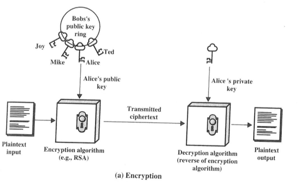
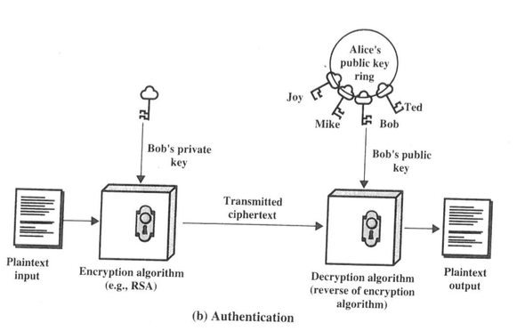
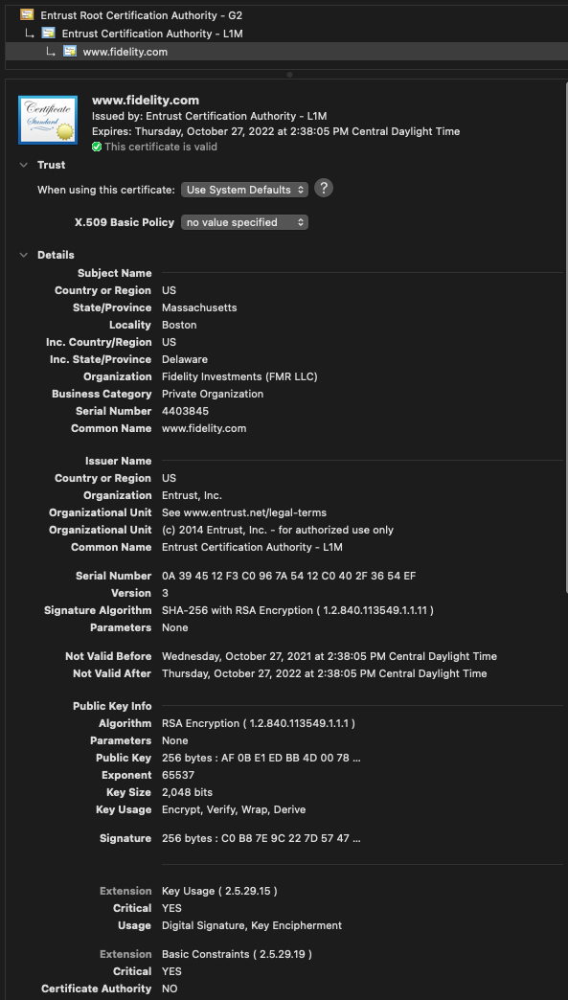
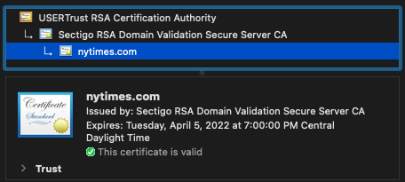
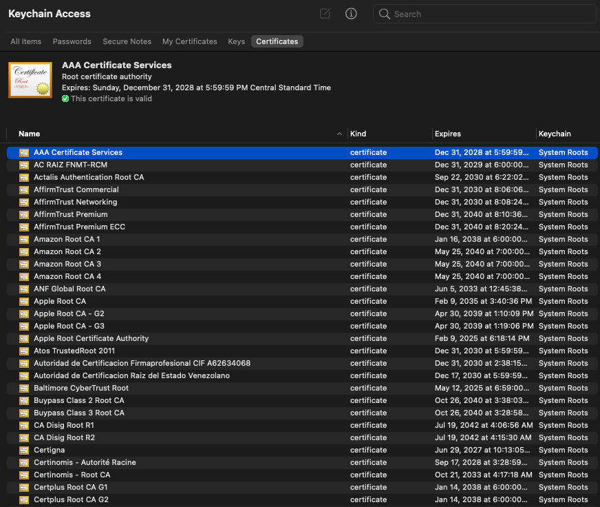
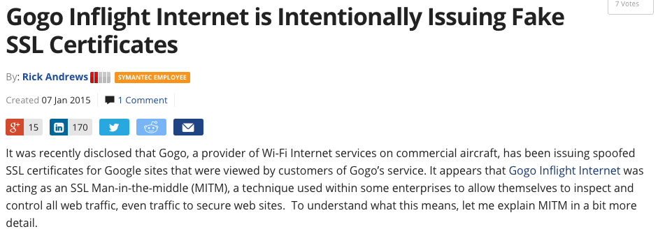
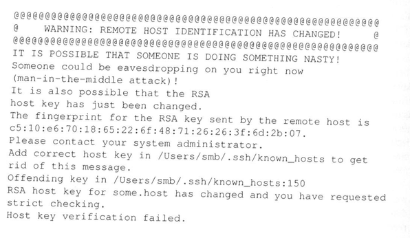
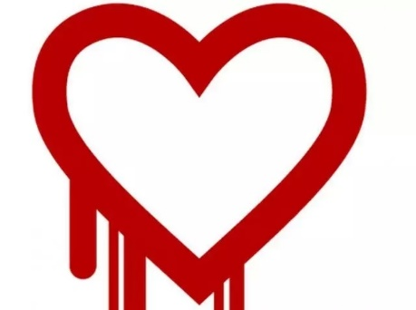

## Where We Are {.center}

Cryptography gives Alice and Bob **confidentiality** and **integrity** — *once
they share a key.*

> The hard part was never the math. It's the **keys**: who has them, who trusts
> them, and how you change your mind.

::: {.notes}
Frame the whole lecture: last time we treated the shared key as a given.
Today's question is the entire field of key management — and the social and
institutional problems (who do you trust?) are harder than the cryptographic
ones. Anchor to Ross Anderson's "Why Cryptosystems Fail" from Meeting 1 —
the math is rarely the failure mode. The framing quote paraphrases Diffie's
1976 line that "cryptography without key management is not cryptography, it
is arithmetic." Cold-call: if we agreed a shared secret in Lecture 1, what
did we actually assume, and where did that assumption break? Everything
downstream — Diffie-Hellman, RSA, certificates, CAs, revocation — is
scaffolding for one question: how do two strangers agree on a shared secret,
and how do you know who's on the other end?
:::

## The Setup: Alice, Bob, and Eve

- **Alice** wants to send **Bob** a message; **Eve** can read everything on the
  network
- **Confidentiality:** keep the contents secret from Eve
- **Integrity:** Bob can tell the message wasn't altered (think **Mallory**, the
  active attacker, not just a passive eavesdropper)
- Working model: **crypto is the only protection**, and every message is effectively
  a broadcast

::: {.notes}
Reinforce the threat-model framing from Meeting 1. Eve = passive
eavesdropper; Mallory = active man-in-the-middle. The Alice/Bob/Eve cast
comes from Rivest, Shamir, and Adleman's 1978 CACM paper on RSA — the full
character genealogy (Charlie, Mallory, Trent, Peggy) grew from there. The
"everything is a broadcast" assumption is what makes key management
non-trivial — you can't whisper. Cold-call two students to state
confidentiality vs. integrity in one sentence each, then use that split to
introduce Mallory as the active counterpart to passive Eve. Every mechanism
in the rest of the lecture defends against one or both of them.
:::

## Symmetric Crypto: Same Key Both Ways

- Encryption and decryption use the **same secret key**
- Fast — this is what actually encrypts bulk data on the wire
- **The catch:** Alice and Bob must *already* share a secret

::: {.vignette}
This is still how the web works underneath: TLS 1.3 uses public-key crypto only to
agree on a key, then switches to fast **symmetric** ciphers (AES-GCM, ChaCha20) for
the actual bytes.
:::

::: {.notes}
Students should leave knowing the division of labor: asymmetric crypto for
key agreement and signatures, symmetric crypto for bulk data. Name the
standards without derivation: AES (NIST FIPS 197, revised 2023) and
ChaCha20-Poly1305 (RFC 8439) are the two ciphers in every TLS 1.3
deployment. Don't dwell on cipher internals — the agenda explicitly says we
skip implementation details. The point is the speed gap: AES-GCM runs
gigabytes per second per core; RSA-2048 signs tens of ops per second. That
asymmetry is why we use public-key only for setup and signatures.
:::

## The Key-Distribution Problem

**Exercise:** 100 people all want to talk to each other, pairwise, using symmetric
keys. How many keys?

- Each pair needs its own key: $\binom{n}{2} = \frac{n(n-1)}{2}$
- 10 people → 45 keys 100 people → **4,950** 1,000 people → **499,500**

If everyone instead *shares one* key, anyone can read — and **impersonate** —
everyone else.

::: {.notes}
Cold-call the count: pick a student, say n = 100, see if they get 4,950.
The quadratic blowup is the motivation for everything that follows.
Symmetric keys don't scale to a planet of strangers who've never met.
Preview the fix: with public-key crypto, 100 people need 100 key pairs
published in a directory — linear, not quadratic. That directory becomes
its own trust problem, which is the second half of today's lecture.
:::

# Diffie-Hellman: A Public Conversation, a Private Key {.center}

## 1976: "New Directions in Cryptography"

- **Whit Diffie & Marty Hellman** (with ideas from **Ralph Merkle**) showed Alice and
  Bob can derive a shared secret over a **public** channel
- No prior shared secret needed — Eve hears the whole conversation and still can't
  compute the key
- Secretly discovered earlier by **Malcolm Williamson** at the UK's GCHQ (declassified
  1997)

::: {.notes}
This was the conceptual breakthrough — Diffie and Hellman, "New Directions
in Cryptography," IEEE Trans. Info. Theory, November 1976. Emphasize how
counterintuitive it is: two strangers shouting across a room can agree on
a secret nobody listening can learn. The GCHQ backstory is the "intelligence
agencies got there first, in secret" hook — Ellis proposed non-secret
encryption in 1970, Cocks worked out an RSA-shaped scheme in 1973, and
Williamson landed the Diffie-Hellman construction in 1974; all classified
until 1997. Steven Levy's Crypto (2001) is the readable social history if
students want more.
:::

## How Diffie-Hellman Works (the Idea)

- Public parameters: a large prime $p$ and a generator $g$
- Alice picks secret $x$, sends $g^x \bmod p$ Bob picks secret $y$, sends $g^y \bmod p$
- Both compute the **same** shared value: $g^{xy} \bmod p$
- Eve sees $g^x$ and $g^y$ but recovering $x$ or $y$ is the **discrete-log problem** —
  no known efficient algorithm

::: {.notes}
Per the agenda, do NOT prove anything or compute discrete logs. The takeaway
is the shape: a one-way function (modular exponentiation) that's easy
forward, hard to invert. That asymmetry is the whole game. If a student
wants the math, point them to Boneh and Shoup's free "A Graduate Course in
Applied Cryptography," chapter 10. Emphasize that the hardness is a
conjecture, not a theorem — which is exactly why the post-quantum migration
at the end of the deck matters.
:::

## D-H's Big Weakness: Man-in-the-Middle

- Alice runs D-H — but really with **Mallory**. Bob does too.
- Mallory ends up sharing one key with Alice and a different one with Bob, relaying
  and reading everything
- **Bottom line:** D-H gives you a secure *channel*, but tells you **nothing about who
  is on the other end**

> The chess-hustler trick: sit "in the middle" between Carlsen and a grandmaster, relay
> their moves, and beat one of them. *In the middle is a powerful place to be.*

::: {.notes}
This is the pivot of the entire lecture. Confidentiality without
authentication is a trap. Everything after this — certificates, CAs, PKI —
exists to answer "who is on the other end?" The SSH host-key warning later
in the deck is the same problem made visible. Formal treatment: Diffie,
van Oorschot, and Wiener, "Authentication and Authenticated Key Exchanges"
(1992), which named the STS protocol. Cold-call: where else does "in the
middle" win? Seed the list — BGP hijacks, DNS on-path attacks, enterprise
TLS-inspection proxies, ARP spoofing on the local network. All of them
extract value from sitting between two parties who assume they're alone.
:::

# Public-Key (Asymmetric) Cryptography {.center}

## Two Keys Instead of One

- New idea (Diffie–Hellman, 1976 RSA, 1978): a **key pair** where you **can't derive
  one key from the other**
- Keep one key **private**; **publish** the other
- One key pair *per person*, not per pair — the quadratic blowup disappears
- Independently invented in secret at GCHQ by **Clifford Cocks** (1973)

::: {.notes}
Tie back to the key-distribution problem: n people now need n key pairs,
not n^2/2 shared keys, and the public halves can sit in a directory. RSA
is mentioned, not derived (per agenda) — Rivest, Shamir, Adleman, CACM
February 1978. Clifford Cocks wrote the same construction in a 1973 CESG
memo that stayed classified for 24 years; the GCHQ story is a great
"who really invented this?" hook. The catch we're about to introduce:
publishing the public halves only helps if you can trust the directory.
:::

## Two Use Cases, One Idea {.smaller}

::: {.columns}
::: {.column width="50%"}
**Confidentiality**

Encrypt with the recipient's **public** key → only they can decrypt (private key).

*"For your eyes only."*

:::
::: {.column width="50%"}
**Integrity / Authentication**

Sign with **your private** key → anyone can verify with your public key.

*A digital signature.*

:::
:::

::: {.notes}
The symmetry is the point: same key pair, opposite directions. Real
example for the integrity side: software and OS updates are signed so your
device only installs code the vendor actually shipped — Apple Notarization,
Windows Authenticode, Google Play signing. Modern signed-supply-chain
systems like Sigstore and in-toto are worth flagging as the bridge to the
DigiCert code-signing compromise later in the deck. Want both
confidentiality and authentication? Use the key pairs twice — encrypt to
the recipient's public key, sign with your private key.
:::

## What Public-Key Crypto Is *Not*

- **Not** inherently more secure than symmetric crypto — security comes from key length
  and hardness assumptions, not from being "asymmetric"
- **Not** a replacement for symmetric crypto — it's slow, so we use it only to set up
  keys and sign
- **Not** a replacement for **key distribution** — you still need infrastructure to
  answer: *whose public key is this?*

::: {.notes}
This slide kills three common misconceptions. The most persistent one is
"asymmetric = more secure" — kill it with the speed numbers: AES-GCM at
5-10 GB/s per core versus RSA-2048 signing at tens of ops per second. That
performance gap is the entire reason TLS uses a hybrid design (public-key
for setup, symmetric for bulk). The third bullet is the bridge to PKI: a
published public key is worthless if you can't tie it to the right identity.
That question — whose public key is this? — carries the rest of the lecture.
:::

# Certificates and Public-Key Infrastructure {.center}

## The Problem with Public Keys

> "It is crucial that the public file of enciphering keys be protected from
> unauthorized modification." — Diffie & Hellman, 1976

- Where is the directory of public keys? Who runs it? How do you trust it?
- If Mallory can swap in *his* public key for Bob's, you're encrypting to Mallory
- **Partial answer:** certificates

::: {.notes}
This is the MITM problem again, now at the level of the key directory. The
Diffie-Hellman 1976 paper already flagged it in Section III — the quote on
the slide is verbatim. Certificates don't eliminate trust; they relocate
it, from "trust the wire" to "trust the signer." Every subsequent slide
about CAs, CT logs, and short-lived certs is really about how to make that
relocated trust auditable and revocable. Cold-call: if Mallory swaps in
his public key for Bob's, where in the pipeline should you have caught it?
:::

## What a Certificate Is

- A signed statement that **binds an identity to a public key**
- Signed by an **issuer** — a **Certificate Authority (CA)**
- Contains the subject, the issuer, and an **expiration time**
- A **self-signed** cert vouches only for itself; a **CA-signed** cert is vouched for by
  someone your software already trusts

::: {.column width="60%"}

:::

::: {.notes}
Walk through the real fields on the right: subject name, issuer, "not
valid before/after," public key, signature algorithm. Standard is X.509 v3,
defined in RFC 5280 — the "P" in "the PKI." This is exactly what students
inspect in the hands-on Certificate Chains activity, so preview it here.
The self-signed vs. CA-signed distinction sets up the chain-of-trust idea:
a self-signed cert only says "I am who I say I am," which is worthless
without prior context; a CA-signed cert delegates that vouching to someone
your software already trusts.
:::

## Chains of Trust

- A CA signs a server's cert → the server's cert "chains up" to the CA
- Your browser follows the chain from the **leaf** (the website) up to a **root** it
  already trusts
- Standard format: **X.509** (the "P" in "the PKI")

::: {.notes}
This mirrors the in-class Firefox activity — the example chain used last
year was the course website leaf, chained through Let's Encrypt's R3
intermediate, up to ISRG Root X1. Have students walk a chain in their own
browser right now: click the lock icon, view certificate, examine each
level. The key question to plant: where does the chain stop? Teed up for
the trust-anchors slide next. The Chain of Trust page on
letsencrypt.org has the canonical diagram if you want to project it.
:::

## Where Does Trust Stop? Trust Anchors

- The chain ends at a **root CA** your browser/OS **ships with** and trusts implicitly
- How does the browser know Facebook's cert *should* come from a given CA? Because the
  cert says so — and the browser trusts that CA's root
- **The risk:** browsers/OSes ship with **~hundreds of root CAs**. If *any one* is
  malicious or compromised, it can forge a cert for *any* site

::: {.notes}
This is the structural weakness of the web PKI: trust is "any one of
hundreds," not "all of them." A single bad root anywhere can forge a cert
for any site — MITM your bank, your email, your health portal. The four
big root programs (Mozilla, Chrome Root Store, Microsoft Trusted Root,
Apple) each publish their own list; students can reproduce the macOS count
by running `security find-certificate -a` against the SystemRootCertificates
keychain. Plant the governance question that recurs in Breakout A: should
this trust-store curation be a public function, or is browser-vendor
oversight the right model? That's why the rest of the lecture is about
catching and removing bad CAs.
:::

## Two Levels of Validation

::: {.columns}
::: {.column width="50%"}
**Domain Validation (DV)**

- Proves only **control of the domain** (e.g., place a token on the site)
- Usually free and automated — **Let's Encrypt** issues these
:::
::: {.column width="50%"}
**Extended Validation (EV)**

- Proves a **legal entity's identity** (e.g., Bank of America)
- More verification; historically a browser UI badge
:::
:::

Today browsers have **dropped the EV "green bar"** — the lock now means only "encrypted,
DV-or-better," not "this is the real company."

::: {.notes}
Important update: students raised on screenshots of the green
company-name bar should know it's gone. Chrome dropped the EV UI in
Chrome 77 (2019); Firefox followed in Firefox 70 (October 2019). Both cited
Stripe's 2019 usability research showing users didn't actually read the EV
bar — the identity signal wasn't reaching anyone. The current specification
lives in the CA/Browser Forum Baseline Requirements. The lesson to plant:
the lock icon says the connection is private, not who you're talking to.
Domain-validation certs — the free automated kind Let's Encrypt issues —
say only "someone controlled this domain long enough to prove it."
:::

# When CAs Go Wrong {.center}

## DigiNotar, 2011: A CA Compromised

- Dutch CA **DigiNotar** was breached and issued **fraudulent certificates for
  `*.google.com`**
- Used to **man-in-the-middle ~300,000 Iranian users'** Gmail
- Detected weeks later browsers yanked DigiNotar's roots and the company **went
  bankrupt**

The perverse incentive: CAs are **paid by the very entities** they're supposed to
vet — looser rules mean more customers.

::: {.notes}
DigiNotar is the canonical "the trust model failed" story — Fox-IT's
"Black Tulip" report (August 2012) is the definitive primary source. One
compromised CA equaled silent interception of an entire country's Gmail
for several weeks in summer 2011. The company was distrusted by all major
browsers within days and bankrupt within months. Note the business-model
conflict Schneier flagged in his 2011 post: the customer pays the CA, but
the public bears the risk — looser vetting means more paying customers.
That perverse incentive is what Certificate Transparency (two slides ahead)
was built to expose.
:::

## Rogue Issuance in the Wild

::: {.columns}
::: {.column width="55%"}
- **CNNIC** (China): added as a Mozilla root, later caught issuing certs used for MITM
  (2015) — distrusted by Chrome/Firefox
- **Gogo Inflight** (2015): the in-flight Wi-Fi provider issued **fake Google certs** to
  inspect passengers' "secure" traffic
- Some **enterprises** install their own root to decrypt all employee TLS — the same
  mechanism, sanctioned internally
:::
::: {.column width="45%"}

:::
:::

::: {.notes}
These show the spectrum from clearly hostile (CNNIC MITM, distrusted by
Mozilla and Google in April 2015) to "it's our network" (Gogo caught by
Ars Technica in January 2015, and enterprise TLS-inspection appliances that
do the same thing every day). Durumeric et al.'s NDSS 2017 paper "The
Security Impact of HTTPS Interception" is the classic empirical study of
how much traffic actually gets decrypted this way. All these cases use the
identical trick: a root the client trusts signs a cert for a site it
shouldn't. This is direct debate fodder for the backdoors debate at the
end of the deck — a mandated exceptional-access key is exactly this
attack, made legal.
:::

## 2025–2026: Browsers Are Still Pulling CAs {.smaller}

::: {.vignette}
The trust store is actively policed today. In **Chrome 139 (Aug 1, 2025)**, Google
**distrusted Chunghwa Telecom and Netlock** root CAs, citing a "pattern of compliance
failures." On **April 15, 2026**, Chrome and Mozilla removed the **DigiCert "Global
Root CA" (G1)** — not for compromise but because multi-purpose roots are being phased
out for TLS. And in **early April 2026**, DigiCert itself was **socially engineered**:
attackers phished a support analyst with a malicious `.scr` file, harvested EV
code-signing initialization codes, and got **~60 certificates revoked** — some used to
sign the *Zhong Stealer* malware.
:::

- Browser vendors — not governments — are the de facto regulators of the web's trust
- A CA can be removed for **misbehavior**, **failing to keep up** with rules, or —
  as with DigiCert 2026 — **losing control of an issuance pipeline**

::: {.notes}
Freshest hook in the deck, all three cases verified this session. Google's
May 30, 2025 Security Blog post announced the Chunghwa Telecom and Netlock
distrust for a "pattern of compliance failures." The DigiCert G1 removal
was an announced phase-out of multi-purpose roots, not a compromise. The
April 2026 DigiCert incident is more instructive: attackers phished a
support analyst with a malicious .scr file, harvested EV code-signing
initialization codes, and got roughly 60 certificates revoked — some already
used to sign Zhong Stealer malware. The point for a policy class:
enforcement of web PKI is privatized — Apple, Google, Mozilla, and
Microsoft root programs decide who's trusted. That's enormous, largely
unaccountable power. This is the framing question for Breakout A: should
this be a public function?
:::

# Detecting and Limiting Damage {.center}

## Certificate Transparency

- Every CA must **log every certificate** it issues to public, append-only logs
- Anyone — including the site owner — can **watch for unexpected certs** for their
  domain
- Browsers require proof of CT logging before they trust a cert
- **Limitation:** CT detects misissuance *after the fact*; it doesn't prevent it

::: {.notes}
CT is the post-DigiNotar fix that actually scaled — RFC 9162 (2021) is
the current specification, though the concept traces to Laurie, Langley,
and Kasper's 2013 ACM Queue introduction. The design goal: make
misissuance visible. A bogus Google cert can't hide anymore — Google would
see it in the logs. Detection, not prevention, but detection is exactly
what was missing in 2011. Walk students through querying their own domain
at crt.sh — it's a striking demo of just how public every cert issuance
now is. Cold-call: what would you monitor for if you ran a bank's
security team?
:::

## Key Pinning and the SSH Model

- **Pinning:** remember which key/CA a site used; alert if it suddenly changes
- Public keys rarely change, so a change is suspicious
- You've seen this: **SSH** pins the host key on first connection

::: {.notes}
SSH is "trust on first use" pinning made visible — the StrictHostKeyChecking
behavior is the canonical example. Web key-pinning via HPKP was tried and
mostly abandoned; Chris Palmer's 2017 Chromium deprecation post is worth
citing — you could brick your own site by pinning a key you then rotated.
The tension is real: pinning catches MITM but is operationally brittle.
Expect-CT filled part of the gap and is now largely superseded by
CT enforcement in the trust store itself. Good place to discuss usable
security — the mechanism that works for one sysadmin managing a handful of
hosts breaks at web scale.
:::

## Expiration and Revocation

::: {.columns}
::: {.column width="55%"}
- **Expiration:** certs die on a schedule — limits damage from undetected compromise and
  forces algorithm upgrades
- **Revocation:** killing a cert *early* (key lost/stolen)
  - **CRL** — a signed list of revoked certs
  - **OCSP** — an online "is this still valid?" check
- In practice, **detection** is the slow step, not the kill switch
:::
::: {.column width="45%"}

:::
:::

::: {.notes}
Heartbleed (April 2014) is the canonical mass-revocation event — Durumeric
et al.'s IMC 2014 paper "The Matter of Heartbleed" is the empirical
retrospective. A bug that could leak private keys meant everyone had to
reissue, and the CRLs bloated overnight. Revocation is famously broken:
Adam Langley's 2012 ImperialViolet post "Revocation is broken" is the
classic critique — soft-fail OCSP means an attacker who can block the
check just wins. Chrome went further and dropped OCSP checks entirely,
pushing a curated CRLSet via updates instead. All of this motivates the
next slide: if revocation doesn't work, shorten the lifetime.
:::

## The 2026 Fix: Just Make Certs Short-Lived {.smaller}

::: {.vignette}
In **April 2025**, the CA/Browser Forum unanimously passed **Ballot SC-081v3** (29–0,
all four major browsers voting yes), cutting max TLS certificate lifetimes from ~398
days toward **47 days**, phased in: **~200 days (in force since Mar 15, 2026)
→ 100 days (Mar 2027) → 47 days (Mar 2029)**. DigiCert, Sectigo, and others already
issue at the 199-day cap. Shorter-lived certs mean revocation matters less — a stolen
cert expires on its own in weeks.
:::

- The trade-off: **automation becomes mandatory** (you can't renew by hand every 47
  days) — ACME / Let's Encrypt-style issuance is the new normal, which concentrates
  the web on a handful of ACME providers

::: {.notes}
This is the elegant systems answer to broken revocation: don't fix
revocation, shrink the window. Primary source is CA/Browser Forum Ballot
SC-081v3 (April 11, 2025) — the vote was unanimous, 29-0, all four major
browsers in favor. Timeline: 199-day cap in force since March 2026, 100
days in March 2027, 47 days in March 2029. Let's Encrypt already offers
opt-in 45-day certs as of May 2026 and will default to them in February
2028. Connects to operations: short certs force automated renewal via ACME
(RFC 8555), which centralizes more of the web on a handful of issuers.
Cold-call: what new fragility does mandatory automation introduce? — teed
up for the issuer-concentration discussion in Breakout A.
:::

## TLS in Practice {.smaller}

- The **TLS handshake** ties it all together: server presents its **certificate**, the
  parties run a **key exchange**, then switch to fast **symmetric** session keys
- **TLS 1.3** is faster and encrypts more of the handshake
- **Privacy gap:** the **SNI** (the site name) was historically sent **in the clear** —
  **Encrypted SNI / ECH** closes that leak
- **Post-quantum today:** Chrome ships **hybrid X25519+ML-KEM-768** key exchange by
  default (since Chrome 131, Nov 2024); Cloudflare reports **~one-third** of human
  HTTPS traffic already uses hybrid PQ handshakes

::: {.notes}
This is the Wireshark demo from class: capture a handshake (RFC 8446 is
the spec), find the certificate, watch the switch to symmetric keys.
Sample PCAPs on the Wireshark wiki work fine if the room's network is
locked down. The SNI point is the bridge to the privacy half of the
course — even with TLS, the name of the site you visit historically leaked
in cleartext. Encrypted Client Hello (draft-ietf-tls-esni) closes that
leak and is default-on in Chrome, Firefox, and Safari when DoH is enabled.
The post-quantum bullet answers the "harvest now, decrypt later" concern —
Diffie-Hellman's discrete-log hardness breaks against a quantum adversary,
so Chrome 131 (November 2024) shipped hybrid X25519+ML-KEM-768 by default,
and Cloudflare Radar reports about one-third of human HTTPS traffic
already uses it. Hybrid means classical plus PQ in the same handshake;
safe if either survives.
:::

## Policy Debate: Encryption Backdoors {.center}

Governments periodically demand **exceptional access** — a way for law enforcement to
read encrypted traffic with a warrant.

- Cryptographers' rebuttal: a backdoor for "the good guys" is a **deliberate
  vulnerability** for everyone — and **who holds the keys?**
- Every CA story today (DigiNotar, Chunghwa, Gogo) is a *preview* of what a mandated
  backdoor would look like

::: {.notes}
This is the term's recurring debate (full prompts in the Backdoors debate
handout). Tie it directly to the lecture: we just spent an hour seeing how
a single trusted key-holder going bad compromises everyone — DigiNotar,
Chunghwa, DigiCert 2026. A government backdoor is exactly that failure
mode, but by design. The foundational rebuttal to exceptional-access
proposals is Abelson et al., "Keys Under Doormats" (MIT CSAIL, 2015);
Steven Levy's Crypto covers the 1990s Crypto Wars context. Live 2026
policy anchor: the UK Investigatory Powers (Amendment) Act 2024 led Apple
to pull end-to-end iCloud encryption from the UK in February 2025. Run it
Oxford style; grade contribution, not the "winning" side.
:::

# Takeaways {.center}

- Crypto is easy; **key management and trust** are hard
- **D-H / public keys** solve key distribution but not **identity** → that's what
  **certificates and CAs** are for
- Web trust is **"any of ~hundreds of roots"** — fragile, and policed by **browser
  vendors**, not governments
- The modern playbook: **transparency**, **short-lived certs**, **automation**

::: {.notes}
Leave students with the throughline: every layer we added — certs, CAs,
CT logs, short-lived certs, ACME automation — is a patch on the same
wound. Whom do you trust, and how do you change your mind? Preview the
bridge to next lecture: Authentication and OAuth asks the same question
about users and delegated access. Companion hands-on work: the Certificate
Chains activity, and the GPG key-signing / Web of Trust activity for a
non-CA answer to the same problem. Recommended follow-up reading: the
GCHQ Ellis/Cocks/Williamson history, Diffie and Hellman 1976, and the
Fox-IT Black Tulip DigiNotar report.
:::
