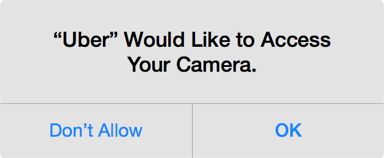
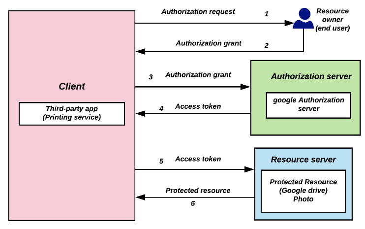
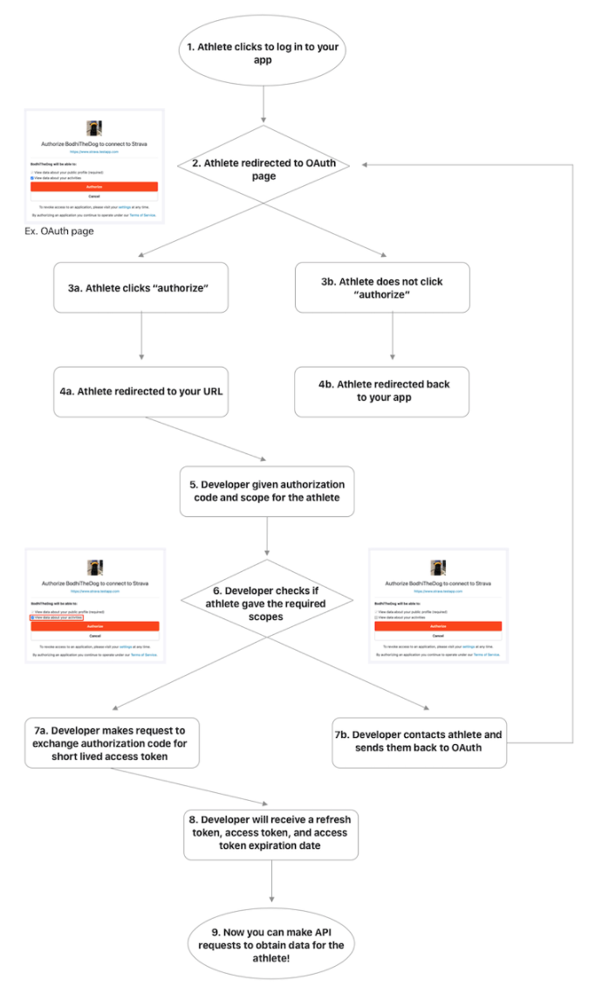
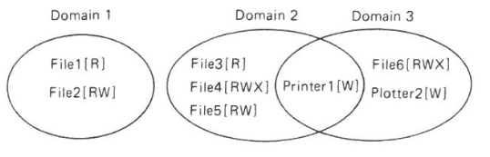

## What Access Control Is For {.center}

Four goals that keep showing up — in operating systems, phones, the cloud:

- Protect **users** from each other
- Protect **apps** from each other
- Protect the **system** from the network
- Still **allow sharing** across those boundaries

::: {.notes}
Frame the whole lecture as a tension: isolation vs. sharing. Every mechanism we
see — Unix permissions, Android sandboxes, OAuth scopes — is a different answer to
"how do I let things cooperate without letting them run wild?" Cold-call: where
have you personally hit an access-control wall this week (a "permission denied", an
app asking for your camera)?
:::

## The Threat Model Has Shifted {.smaller}

Old multi-user OS: machines were **expensive and shared**; apps were **trusted**
because users wrote them.

PC OS: still descends from multi-user OSes — apps run with **the user's full
privileges**.

The smartphone insight: that model would **kill the platform**. Phones were redesigned
from the ground up to run **untrusted apps** from anyone.

::: {.vignette}
"What's old is new again." The web browser is now an OS: a single user running dozens
of **untrusted apps** (web pages, extensions). The cloud — Google Docs, SaaS tenants —
is the new multi-user mainframe. The same access-control problems came back, just with
new names.
:::

::: {.notes}
This is the spine of the lecture. Techniques invented for 1970s timesharing got
repurposed for "multi-app" worlds. Ask: who do you trust on your phone? Almost no app.
Who did a 1975 mainframe user trust? Everyone with an account.
:::

## Who Are You Defending Against?

- **Casual prying** — curiosity, browsing what you shouldn't
- **Insider attacks** — snooping by people who already have access
- **Financial motive** — making money (fraud, ransomware, resale)
- **Espionage** — commercial or state-sponsored data theft

Note the split between **passive** (read-only snooping) and **active** (modifying)
intruders — and between **security** (keep people out) and **privacy** (limit what
even authorized parties learn).

::: {.notes}
From Tanenbaum's OS taxonomy. The point of naming intruders is that your design
changes with the adversary. Defending against a curious roommate is not the same as
defending against UNC6395 (we'll meet them later).
:::

## Identification, Authentication, Authorization {.smaller}

Three words students conflate — keep them straight (this is a likely **exam**
distinction):

- **Identification** — *who do you claim to be?* (a username)
- **Authentication** — *prove it.* (a password, key, or biometric)
- **Authorization** — *what are you allowed to do?* (the access-control decision)

The full sequence: **identify & authenticate → authorize → access control →
logging & auditing → accountability.** The first three are *preventive*; the last
two are *reactive* (forensics after the fact).

::: {.notes}
Physical analogy: your ID card *identifies* you, the guard checking your face against
it *authenticates*, the list of doors your badge opens is *authorization*, the badge
reader log is *accountability*. Access control is often breached, so logging is
defense-in-depth, not an afterthought.
:::

## The Three Modes of Authentication {.smaller}

How do you prove who you are? Exactly three categories (and **MFA** combines them):

::: {.columns}
::: {.column width="33%"}
**Something you know**

- Passwords, PINs
- Security questions
- *Weakness:* guessed, phished, reused, leaked
:::
::: {.column width="33%"}
**Something you have**

- Phone, hardware key (YubiKey)
- 2FA token, smart card
- *Weakness:* lost, stolen, cloned
:::
::: {.column width="33%"}
**Something you are**

- Fingerprint, face, iris
- *Weakness:* can't be revoked; spoofable; consent & privacy concerns
:::
:::

::: {.notes}
This is flagged "important for midterm" in the agenda. Drill the categories with quick
examples: a fingerprint reader on a door is "something you are"; a concert ticket is
"something you have." Biometrics' fatal property: you can't reset your fingerprint
after a breach.
:::

## Passwords Are Losing; Passkeys Are Winning {.smaller}

Passwords fail predictably: reuse, phishing, credential-stuffing from breach dumps.
The industry response is **passkeys** — public-key credentials (FIDO2 / WebAuthn) bound
to your device, so there's **no shared secret to steal or phish**.

::: {.vignette}
By **World Passkey Day, May 2026**, the FIDO Alliance reported **passkeys in use across
~48% of the top-100 websites** and surveys showing **~87% of enterprises deploying or
piloting** them; **NIST SP 800-63-4** (finalized July 2025) formally blesses
phishing-resistant authentication. Passwords aren't dead, but the default is shifting.
:::

::: {.notes}
Tie back to the three modes: a passkey is "something you have" (the device key)
unlocked by "something you are/know" (biometric or PIN) — MFA folded into one tap, with
no phishable secret crossing the wire. Verify the latest FIDO numbers before lecturing;
they move every few months.
:::

## A Common Framework: Subject, Verb, Object

Every access-control question reduces to one triple:

> Can **subject** *(a (user, program) pair)* perform **verb** *(an action)*
> on **object** *(a resource)*?

**Exercise:** Consider Facebook. Identify as many **subjects**, **verbs**, and
**objects** as you can.

::: {.notes}
Run this as a 60-second breakout. Subjects: you, a friend, the News Feed ranker, an
ad partner. Verbs: read/post/tag/delete/share. Objects: a photo, a wall, a friend list,
a DM. The triple is the through-line for the rest of the lecture.
:::

## ACLs vs. Capabilities {.smaller}

Two fundamentally different ways to store "who can do what":

::: {.columns}
::: {.column width="50%"}
**Access Control Lists**

*The object knows who may use it.*

- Examples: door fingerprint reader, passport control
- Needs **identity / authentication**
- Easy to **revoke** and change rights
- Delegation is hard
:::
::: {.column width="50%"}
**Capabilities (tokens)**

*Holding the token = having the right.*

- Examples: a house key, a concert ticket
- **No identity needed** → more private
- Just **copy the token** to delegate
- Tokens "**get away from you**" — hard to revoke
:::
:::

Remember this trade-off — **OAuth access tokens are capabilities**, and their
revocation problem will bite us shortly.

::: {.notes}
The whole second half of the lecture (OAuth, JWTs) is "capabilities on the web." Plant
the seed: capabilities are great for delegation and privacy, terrible for revocation.
That tension is exactly what the 2025 OAuth breaches exploit.
:::

## Unix: A Simplified ACL Model {.smaller}

::: {.columns}
::: {.column width="55%"}
- **Subject** = a user-space process (runs *as* a user)
- **Verb** = read / write / execute
- **Object** = files — and "file" means a *lot*: sockets, devices, OS functions
- **Root / superuser** owns the system; `sudo` = "super-user do"
- Some services run **as their own user** (e.g. `www-data`, `nobody`) so a compromise
  doesn't own the box
:::
::: {.column width="45%"}

:::
:::

::: {.notes}
This matches the live demo in the agenda: `ls -l`, `whoami`, `groups`, `ps` to show
processes running as users. Walk the permission bits left to right: type, then three
rwx triples for owner/group/world. Note that PC OSes are "multi-user" even with one
human — services get their own UIDs. That's the hack of repurposing a multi-user
feature for an untrusted-app world.
:::

## The Principle of Least Privilege {.smaller}

> Grant **only the minimum privileges** needed to do the task — and no more.

- Web servers run as **`www-data`/`nobody`**, not root, so a bug doesn't hand over the
  whole machine
- A **privilege-escalation** attack is precisely a flaw that lets a low-privilege
  process gain higher rights
- The same idea reappears as **OAuth scope** — give an app *read playlists*, not
  *full account access*

This single principle ties the OS half and the OAuth half of this lecture together.

::: {.notes}
Historical hook from the agenda: web servers *used* to run as root — disastrous.
Least privilege is the most exam-able design principle here. Ask students to find a
least-privilege violation in something they use (an app demanding contacts it doesn't
need).
:::

## Phones: Per-App Sandboxes {.smaller}

Android applies the same triple, but **each app gets its own user ID**:

- **Subjects:** apps (atop a Linux kernel)
- **Objects:** files, other apps, camera, telephony, personal data
- **Verbs:** each resource defines its own (an app declares them in its **manifest**)

Early Android dumped **hundreds of permissions** on users at install time — nobody read
them, *including developers*. The model got coarser (permission *groups*) and then
**just-in-time**.

::: {.notes}
The original Android ACL is the cautionary tale: too many decisions
(#principals × #actions × #objects) overwhelms users. Coarsening helped a little;
the real fix was changing *when* you ask. Segue to the iOS prompt next.
:::

## Make the Action the Permission {.smaller}

::: {.columns}
::: {.column width="55%"}
The iOS move: don't front-load a wall of permissions. Ask **at the moment of use**, in
**context**, with a reason the user can infer.

- "Why does Uber want my camera?" → because you tapped *scan my credit card*
- Grant **only when needed**, not forever
- Combine the user's *action* with the *permission grant* in one tap

This **emphasizes action over configuration** — and leans on sensible **defaults**.
:::
::: {.column width="45%"}

:::
:::

::: {.notes}
This is the usability payoff of the lecture: access control fails when it demands too
many up-front decisions. Contextual, just-in-time prompts cut the cognitive load and
make least privilege the default. Same lesson the web learned with OAuth consent
screens.
:::

# Delegated Access on the Web: OAuth 2.0 {.center}

How do I let an app act *for* me — without handing it my password?

## Life Before OAuth: Just Share the Password {.smaller}

The bad old pattern: a third-party app asks for your **actual username and password**.

- It gets **full control**, not limited access
- No way to **scope** what it can touch
- No clean way to **revoke** it (you'd have to change your password)
- Terrible **auditability** — every action looks like *you*

This is the **capability problem** at internet scale: sharing a credential is sharing
*everything*, forever.

::: {.notes}
Agenda example: banking aggregators that used to ask for your bank username/password.
Ask students if they've ever pasted one service's password into another app — and what
that app could then do.
:::

## What OAuth 2.0 Actually Is {.smaller}

- A **delegation protocol over HTTP** for *limited* access to resources
- Lets an app act on your behalf **without seeing your credentials**
- A **framework, not a full protocol** — it does **not** mandate token format or
  crypto (implementations choose)
- Separates **authentication** ("prove who you are" — to the auth server) from
  **authorization** ("this app may do these things")

The app only ever holds a **token** — a capability that can be **scoped, expired, and
revoked**.

::: {.notes}
Emphasize "framework not protocol" — it's why deployments differ and why so many go
wrong. OAuth is *authorization*; logging-in-with is layered on top (OIDC). The token,
not your password, is what crosses the wire to the app.
:::

## The Four Roles {.smaller}

| Role | Who it is | Slack + GitHub example |
|---|---|---|
| **Resource owner** | the user who owns the data | you |
| **Client** | the third-party app | Slack |
| **Authorization server** | issues tokens after consent | GitHub's OAuth server |
| **Resource server** | holds data, validates tokens | GitHub's API |

::: {.notes}
The agenda flags: "given a scenario (Slack + GitHub), identify the OAuth roles" as an
exam question. Drill it both directions — give a role, name it; name a role, give the
party. The live demo was wiring up the Slack–GitHub integration.
:::

## The Flow, Six Steps {.smaller}

::: {.columns}
::: {.column width="52%"}
1. Client asks the resource owner for access
2. User logs in & **approves** → gets an **authorization grant** (short code)
3. Client sends the grant + its **client credentials** to the auth server
   (server-to-server, not via the user)
4. Auth server validates → issues an **access token**
5. Client presents the token to the **resource server**
6. Resource server validates → returns the **protected resource**

When the short-lived token expires, a **refresh token** renews it without re-prompting.
:::
::: {.column width="48%"}

:::
:::

::: {.notes}
Walk the diagram with the printing-service-to-Google-Drive story. Key teaching point:
the client never sees the password, and the grant→token exchange happens server-to-
server with client credentials, so a leaked redirect alone shouldn't yield a token.
:::

## A Real OAuth Flow: Strava API {.smaller}

::: {.columns}
::: {.column width="45%"}

:::
::: {.column width="55%"}
The same six steps, concrete:

- Athlete clicks **log in**, lands on Strava's consent page
- If they **authorize**, the developer gets an **authorization code + scope**
- Developer exchanges the code for a **short-lived access token + refresh token**
- Now the app can call the API for that athlete's data

**Assignment 2** is exactly this: build a third-party app against any OAuth API
(GitHub, Google Calendar, Nest, Strava…).
:::
:::

::: {.notes}
Point at the two consent-screen branches: "authorize" vs "doesn't authorize." The
scope shown on that screen is least privilege in action — and is what the user is
actually consenting to. Tie to the GitHub personal-access-token demo where you pick
read-only vs repo scopes.
:::

## Tokens: Scope Is Least Privilege {.smaller}

- An **access token = delegated rights**, bounded by **scope** and **duration**
- It's a **capability**: opaque to the client, "bearer" — *whoever holds it, wins*
- Pick the **narrowest scope** that works: *read playlists*, not *manage account*;
  a GitHub PAT with *read-only*, not *repo + admin*
- **Short expiry + refresh tokens** limit the blast radius of a leak

**JSON Web Tokens (JWT)** are the common format: `header.payload.signature` —
self-contained **claims** (issuer, audience, expiry), **signed** so the resource server
can validate **statelessly** (HS256 shared secret, or RS256 public key).

::: {.notes}
Connect back to the ACL-vs-capability slide: tokens are capabilities, so revocation is
the hard part — hence short lifetimes. JWT lets you validate without a database round
trip, but the flip side is you can't easily un-issue one before it expires.
:::

## When OAuth Goes Wrong {.smaller}

The protocol is sound; **implementations** leak:

- **Token theft / leakage** — tokens in logs, URLs, browser history; bearer tokens
  need no password to replay
- **CSRF on the redirect** — mitigate with the **`state`** parameter
- **Redirect-URI manipulation** — require **exact match**, never prefix matching
- **Over-broad scope** — violates least privilege; minimize what you request
- **Defenses:** TLS everywhere, exact redirect matching, `state`, short scopes, never
  log tokens

::: {.notes}
The auth server is a single point of failure — compromise it and everything downstream
falls. This slide sets up the vignette: the 2025 breaches weren't OAuth being "broken,"
they were stolen *bearer tokens* being replayed, exactly the revocation/least-privilege
weakness we flagged.
:::

## 2025–26: Attackers Stopped Stealing Passwords {.smaller}

::: {.vignette}
**August 2025 — the Salesloft–Drift breach.** Threat actor **UNC6395** stole **OAuth
access tokens** from the Salesloft Drift app and *replayed* them to pull data from
Salesforce instances at **700+ organizations** (Cloudflare, Google, Palo Alto Networks,
Zscaler, and more) — **without ever tripping MFA**, because a valid bearer token needs
no second factor. In **2026**, the same playbook hit Vercel via a compromised
**Google Workspace OAuth token**, and phishing kits like **EvilTokens** harvested
OAuth consent across hundreds of Microsoft 365 tenants.
:::

The lesson of the whole lecture in one breach: **tokens are capabilities** — silent,
bearer, hard to revoke. Defenses that worked on passwords (MFA, login monitoring) don't
see a replayed token. **Scope tightly, expire fast, monitor token use.**

::: {.notes}
This is the freshest, most load-bearing example — verify the figures before lecturing.
Drive home why it matters here: every earlier idea converges. Capability tokens (slide
on ACL vs capability), least privilege (over-broad scope), revocation (refresh/expiry),
the auth server as single point of failure. Ask: would a passkey have stopped this?
(No — the token was already issued; this is post-auth abuse.)
:::

## Stepping Back: Timeless Design Principles {.smaller}

The 1975 Saltzer–Schroeder principles still hold:

- **Public design** — no security through obscurity
- **Default is "no access"** — fail closed
- **Check current authority** — at *time of use*, not just time of check
- **Least privilege** — the recurring theme
- Build security into the **lowest layers** possible

Classic exploits violated these: **TOCTTOU** races (check vs. use gap), **core-dump
overwrites** of `/etc/passwd`, and **timing attacks** (TENEX: align a password guess
across a page boundary, time the abort).

::: {.notes}
Timing attack is a lovely story: the OS aborted on the first wrong character, so guess
position determined whether the next page faulted — leaking the password one char at a
time. Same root cause as modern side channels. TOCTTOU connects to "check current
authority."
:::

## Scaling Access Control: Abstractions {.smaller}

The matrix of (subject × verb × object) is enormous and mostly empty — so we abstract:

::: {.columns}
::: {.column width="55%"}
- **Sparse storage** — default deny; store only the allowed triples as a list
  (Google Docs: millions of users × docs, but each user touches only a few)
- **Roles & groups** — assign rights to a *role*, not each person (corporate projects,
  collaborations)
- **Classification levels** — Bell–LaPadula: *no read up, no write down*
- **Lattices** — when clearances don't form a strict order (Secret-nuclear vs.
  Secret-bio are incomparable)
:::
::: {.column width="45%"}

:::
:::

::: {.notes}
Usability is the real constraint: too many decisions and users click through
everything. Roles, defaults, and just-in-time prompts all exist to shrink the decision
load. Lattice example: being cleared for Secret-nuclear gives you no biological
clearance — hence a partial order, not a line.
:::

# Wrapping Up {.center}

- One framework — **subject, verb, object** — from Unix to Android to OAuth
- **Least privilege** is the throughline; **revocation** is the hard part
- **OAuth tokens are capabilities** — and 2025–26 proved attackers know it

::: {.notes}
Land the plane: the exam-able core is the three authentication modes, Unix permissions,
least privilege, OAuth roles + flow, and scope. The breach vignette is the "why it
matters today." Preview Assignment 2 (build an OAuth app) and the next theme (DoS &
botnets).
:::
