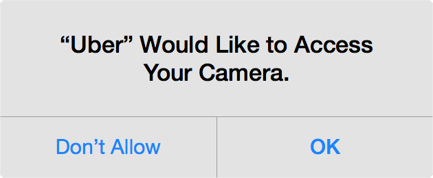
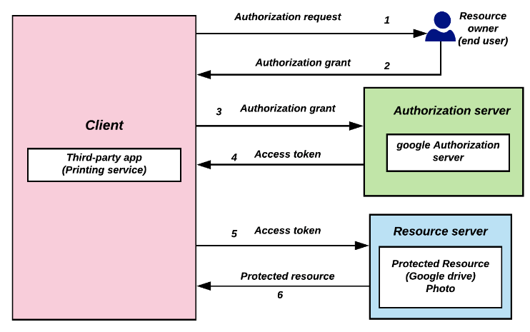
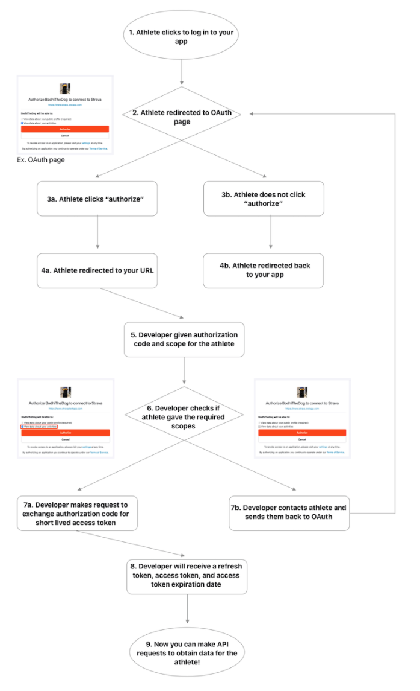
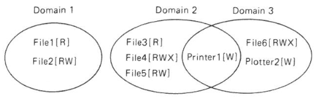

## What Access Control Is For {.center}

Four goals that keep showing up — in operating systems, phones, the cloud:

- Protect **users** from each other
- Protect **apps** from each other
- Protect the **system** from the network
- Still **allow sharing** across those boundaries

::: {.notes}
Frame the whole lecture as a tension: isolation versus sharing. Every
mechanism we see — Unix permissions, Android sandboxes, OAuth scopes — is
a different answer to "how do I let things cooperate without letting them
run wild?" The four-goal framing comes from Tanenbaum and Bos, Modern
Operating Systems, chapter 9. Cold-call: where have you personally hit
an access-control wall this week? A "permission denied" from a shared
drive, an app asking for camera access, a 403 from an API. Use two or
three examples to seed the subject/verb/object framing that arrives a
few slides in.
:::

## The Threat Model Has Shifted {.smaller}

Old multi-user OS: machines were **expensive and shared**; apps were **trusted**
because users wrote them.

PC OS: still descends from multi-user OSes — apps run with **the user's full
privileges**.

The smartphone insight: that model would **kill the platform**. Phones were redesigned
from the ground up to run **untrusted apps** from anyone.

::: {.vignette}
"What's old is new again." The web browser is now an OS: a single user running dozens
of **untrusted apps** (web pages, extensions). The cloud — Google Docs, SaaS tenants —
is the new multi-user mainframe. The same access-control problems came back, just with
new names.
:::

::: {.notes}
This is the spine of the lecture. Techniques invented for 1970s
timesharing got repurposed for multi-app worlds. Ask: who do you trust on
your phone? Almost no app. Who did a 1975 mainframe user trust? Everyone
with an account, because everyone with an account had submitted their
code through a systems programmer. The browser-as-OS observation is
concrete: Chrome's sandbox design docs describe a per-tab process with
almost no ambient authority, exactly the mainframe user-isolation model
recast for untrusted JavaScript. SaaS multi-tenancy (Google Workspace,
Salesforce) is the new shared mainframe — and the 2025-2026 breach
vignette at the end of the deck is what happens when that isolation
leaks.
:::

## Who Are You Defending Against?

- **Casual prying** — curiosity, browsing what you shouldn't
- **Insider attacks** — snooping by people who already have access
- **Financial motive** — making money (fraud, ransomware, resale)
- **Espionage** — commercial or state-sponsored data theft

Note the split between **passive** (read-only snooping) and **active** (modifying)
intruders — and between **security** (keep people out) and **privacy** (limit what
even authorized parties learn).

::: {.notes}
Taxonomy from Tanenbaum and Bos chapter 9.1; the passive/active and
security/privacy splits are Saltzer and Schroeder 1975 vocabulary. The
point of naming intruders is that your design changes with the adversary.
Defending against a curious roommate is not the same as defending against
UNC6395 — the threat actor behind the August 2025 Salesloft-Drift OAuth
token theft, whom we'll meet in the closing vignette. Cold-call: pick two
adversary categories and name one control that differs between them
(rate-limiting stops the curious, doesn't stop the espionage-motivated).
:::

## Identification, Authentication, Authorization {.smaller}

Three words students conflate — keep them straight (this is a likely **exam**
distinction):

- **Identification** — *who do you claim to be?* (a username)
- **Authentication** — *prove it.* (a password, key, or biometric)
- **Authorization** — *what are you allowed to do?* (the access-control decision)

The full sequence: **identify & authenticate → authorize → access control →
logging & auditing → accountability.** The first three are *preventive*; the last
two are *reactive* (forensics after the fact).

::: {.notes}
This is a very likely exam distinction — students conflate all three
words. Physical analogy: your ID card identifies you, the guard checking
your face against it authenticates, the list of doors your badge opens is
authorization, the badge-reader log is accountability. The canonical
technical treatment is NIST SP 800-63-4 (finalized July 31, 2025),
especially SP 800-63B, which walks the identify/authenticate/authorize/log
sequence. Access control is often breached, so logging is defense-in-depth,
not an afterthought — the whole point of the Salesloft-Drift breach is
that the audit logs are what told anyone the tokens had been abused.
:::

## The Three Modes of Authentication {.smaller}

How do you prove who you are? Exactly three categories (and **MFA** combines them):

::: {.columns}
::: {.column width="33%"}
**Something you know**

- Passwords, PINs
- Security questions
- *Weakness:* guessed, phished, reused, leaked
:::
::: {.column width="33%"}
**Something you have**

- Phone, hardware key (YubiKey)
- 2FA token, smart card
- *Weakness:* lost, stolen, cloned
:::
::: {.column width="33%"}
**Something you are**

- Fingerprint, face, iris
- *Weakness:* can't be revoked; spoofable; consent & privacy concerns
:::
:::

::: {.notes}
Flagged as midterm material in the agenda. Drill the categories with quick
examples: a fingerprint reader on a door is "something you are"; a
concert ticket is "something you have"; a Kerberos password is "something
you know." NIST SP 800-63B section 5 is the canonical reference for
authenticator requirements. Biometrics' fatal property: you can't reset
your fingerprint after a breach — the 2010 National Academies report
"Biometric Recognition: Challenges and Opportunities" laid this out
formally. Legal wrinkle worth flagging: US case law splits on whether
police can compel a biometric unlock (Fifth Amendment questions), whereas
compelled password disclosure has stronger protection.
:::

## Passwords Are Losing; Passkeys Are Winning {.smaller}

Passwords fail predictably: reuse, phishing, credential-stuffing from breach dumps.
The industry response is **passkeys** — public-key credentials (FIDO2 / WebAuthn) bound
to your device, so there's **no shared secret to steal or phish**.

::: {.vignette}
On **World Passkey Day, May 7, 2026**, the FIDO Alliance reported an estimated
**5 billion passkeys in use worldwide**, support across **~48% of the top-100 sites**,
**75% of consumers** having enabled a passkey on at least one account, and **68% of
organizations** deploying or piloting passkeys for employee sign-in. **NIST SP 800-63-4**
(finalized **July 31, 2025**) requires verifiers to offer a phishing-resistant option at
AAL2 and mandates it at AAL3. Passwords aren't dead, but the default is shifting.
:::

::: {.notes}
Tie back to the three modes: a passkey is "something you have" (the
device-bound private key) unlocked by "something you are or know"
(biometric or PIN) — MFA folded into one tap, with no phishable secret
crossing the wire. Verify the FIDO numbers before lecturing; the World
Passkey Day 2026 announcement is the primary source. NIST SP 800-63-4
(finalized July 31, 2025) is the regulatory anchor: verifiers at
Authenticator Assurance Level 2 must offer a phishing-resistant option;
AAL3 requires device-bound, non-exportable private keys. Cold-call: what
category of attack does a passkey not stop? Answers to seed: post-auth
token abuse, malware on the endpoint, account-recovery social engineering.
:::

## A Common Framework: Subject, Verb, Object

Every access-control question reduces to one triple:

> Can **subject** *(a (user, program) pair)* perform **verb** *(an action)*
> on **object** *(a resource)*?

**Exercise:** Consider Facebook. Identify as many **subjects**, **verbs**, and
**objects** as you can.

::: {.notes}
Run this as a 60-second breakout. The (subject, verb, object) triple is
Butler Lampson's 1971 access matrix — the ancestor of every access-control
model in this deck. Seed for Facebook: subjects (you, a friend, the
News Feed ranker, an ad partner, the moderation team); verbs (read, post,
tag, delete, share, download); objects (a photo, a wall, a friend list, a
DM, a group). Note that the same person is different subjects depending on
context (you-the-user vs. you-the-advertiser vs. you-the-page-admin). The
triple is the through-line for the rest of the lecture — Unix, Android,
OAuth all instantiate it.
:::

## ACLs vs. Capabilities {.smaller}

Two fundamentally different ways to store "who can do what":

::: {.columns}
::: {.column width="50%"}
**Access Control Lists**

*The object knows who may use it.*

- Examples: door fingerprint reader, passport control
- Needs **identity / authentication**
- Easy to **revoke** and change rights
- Delegation is hard
:::
::: {.column width="50%"}
**Capabilities (tokens)**

*Holding the token = having the right.*

- Examples: a house key, a concert ticket
- **No identity needed** → more private
- Just **copy the token** to delegate
- Tokens "**get away from you**" — hard to revoke
:::
:::

Remember this trade-off — **OAuth access tokens are capabilities**, and their
revocation problem will bite us shortly.

::: {.notes}
Foundational reading: Dennis and Van Horn's 1966 paper on programming
semantics for multiprogrammed computations invented capabilities; Miller,
Yee, and Shapiro's 2003 "Capability Myths Demolished" is the modern
defense. The whole second half of the lecture — OAuth, JWTs — is
capabilities on the web. Plant the seed now: capabilities are great for
delegation and privacy (no identity needed to use them, easy to copy),
terrible for revocation (holder can pass them on, no central "who has
this?" registry). That tension is exactly what the 2025 Salesloft-Drift
and 2026 Vercel OAuth breaches exploit — stolen tokens work just as well
as authorized ones.
:::

## Unix: A Simplified ACL Model {.smaller}

::: {.columns}
::: {.column width="55%"}
- **Subject** = a user-space process (runs *as* a user)
- **Verb** = read / write / execute
- **Object** = files — and "file" means a *lot*: sockets, devices, OS functions
- **Root / superuser** owns the system; `sudo` = "super-user do"
- Some services run **as their own user** (e.g. `www-data`, `nobody`) so a compromise
  doesn't own the box
:::
::: {.column width="45%"}

:::
:::

::: {.notes}
This matches the live demo in the agenda: run `ls -l`, `whoami`, `groups`,
and `ps` to show processes running as users. Walk the permission bits
left to right: file type, then three rwx triples for owner, group, and
world. Note that PC OSes are still "multi-user" even with one human —
services like `www-data` and `nobody` get their own UIDs so a compromised
web server doesn't own the machine. That's the hack of repurposing a
1970s multi-user feature (Unix on PDP-11) for an untrusted-app world.
Sets up the next slide on least privilege directly.
:::

## The Principle of Least Privilege {.smaller}

> Grant **only the minimum privileges** needed to do the task — and no more.

- Web servers run as **`www-data`/`nobody`**, not root, so a bug doesn't hand over the
  whole machine
- A **privilege-escalation** attack is precisely a flaw that lets a low-privilege
  process gain higher rights
- The same idea reappears as **OAuth scope** — give an app *read playlists*, not
  *full account access*

This single principle ties the OS half and the OAuth half of this lecture together.

::: {.notes}
Least privilege is Saltzer and Schroeder principle #4 from their 1975
paper "The Protection of Information in Computer Systems" — the most
exam-able design principle in the deck. Historical hook: pre-2000 Apache
often ran as root, so any RCE handed the whole box to the attacker;
dropping to `www-data` after binding port 80 became the standard fix. The
same idea reappears as OAuth scope — read playlists, not manage account.
Cold-call: name a phone app that asks for a permission it doesn't need
for its actual function. The over-permissioned flashlight app is the
canonical answer; contacts-hungry games and cameras-hungry keyboards are
the modern ones.
:::

## Phones: Per-App Sandboxes {.smaller}

Android applies the same triple, but **each app gets its own user ID**:

- **Subjects:** apps (atop a Linux kernel)
- **Objects:** files, other apps, camera, telephony, personal data
- **Verbs:** each resource defines its own (an app declares them in its **manifest**)

Early Android dumped **hundreds of permissions** on users at install time — nobody read
them, *including developers*. The model got coarser (permission *groups*) and then
**just-in-time**.

::: {.notes}
The original Android permission model is the cautionary tale: too many
decisions (principals x actions x objects) overwhelms users. Felt et al.'s
CCS 2011 paper "Android Permissions Demystified" showed that developers
over-requested and users didn't read — the model failed both ends. The
Android Application Sandbox docs describe the per-app UID isolation
underneath. Coarsening into permission groups helped a little; the real
fix was changing when you ask, which is what Android 6.0 (October 2015)
adopted after iOS proved it worked. Segue directly to the iOS prompt on
the next slide.
:::

## Make the Action the Permission {.smaller}

::: {.columns}
::: {.column width="55%"}
The iOS move: don't front-load a wall of permissions. Ask **at the moment of use**, in
**context**, with a reason the user can infer.

- "Why does Uber want my camera?" → because you tapped *scan my credit card*
- Grant **only when needed**, not forever
- Combine the user's *action* with the *permission grant* in one tap

This **emphasizes action over configuration** — and leans on sensible **defaults**.
:::
::: {.column width="45%"}

:::
:::

::: {.notes}
This is the usability payoff of the lecture: access control fails when it
demands too many up-front decisions. Apple's developer docs on requesting
access to protected resources codify the pattern — ask only at the moment
of use, with a purpose string the user can evaluate. The Uber
"scan my credit card" story is the classic teaching example: combining
the user's action with the permission grant in one tap makes least
privilege the default. Same lesson the web learned with OAuth consent
screens — which is exactly where the second half of the lecture goes.
Android 6.0 (October 2015) adopted the same runtime-permission model.
:::

# Delegated Access on the Web: OAuth 2.0 {.center}

How do I let an app act *for* me — without handing it my password?

## Life Before OAuth: Just Share the Password {.smaller}

The bad old pattern: a third-party app asks for your **actual username and password**.

- It gets **full control**, not limited access
- No way to **scope** what it can touch
- No clean way to **revoke** it (you'd have to change your password)
- Terrible **auditability** — every action looks like *you*

This is the **capability problem** at internet scale: sharing a credential is sharing
*everything*, forever.

::: {.notes}
Agenda example: banking aggregators like early Mint and pre-open-banking
Plaid used to ask for your actual bank username and password, then screen-
scrape your account. The CFPB's Personal Financial Data Rights rule
(Rule 1033, October 2024) formalized OAuth-style token access for US
financial data — though the 2025 rule status has been contested, so verify
before lecturing. Cold-call: have you ever pasted one service's password
into another app? What could that app then do? The answers — transfer
money, change your recovery email, delete everything — motivate the
delegation problem that OAuth exists to solve.
:::

## What OAuth 2.0 Actually Is {.smaller}

- A **delegation protocol over HTTP** for *limited* access to resources
- Lets an app act on your behalf **without seeing your credentials**
- A **framework, not a full protocol** — it does **not** mandate token format or
  crypto (implementations choose)
- Separates **authentication** ("prove who you are" — to the auth server) from
  **authorization** ("this app may do these things")

The app only ever holds a **token** — a capability that can be **scoped, expired, and
revoked**.

::: {.notes}
Canonical spec is RFC 6749 (October 2012); OAuth 2.1 is in draft and
consolidates the security best-current-practice (mandatory PKCE, no
implicit flow). Emphasize "framework not protocol" — it's why deployments
differ, why so many go wrong, and why every OAuth breach starts with a
sentence like "the vendor implemented step 3 incorrectly." OAuth is
authorization; "log in with Google" is OpenID Connect, layered on top.
The one sentence to leave with students: the token, not your password, is
what crosses the wire to the app — and that token can be scoped, expired,
and (in principle) revoked.
:::

## The Four Roles {.smaller}

| Role | Who it is | Slack + GitHub example |
|---|---|---|
| **Resource owner** | the user who owns the data | you |
| **Client** | the third-party app | Slack |
| **Authorization server** | issues tokens after consent | GitHub's OAuth server |
| **Resource server** | holds data, validates tokens | GitHub's API |

::: {.notes}
The agenda flags this as a midterm question: given a scenario like
Slack plus GitHub, identify the four OAuth roles. RFC 6749 section 1.1
is the canonical definition. Drill it both directions — give a role,
have the class name it; name a party, have them identify the role. The
live demo per the agenda is wiring up the Slack GitHub integration in
class. Common student mistake: conflating "authorization server" and
"resource server" when the same vendor runs both (Google, GitHub) — they
are logically distinct even when co-located.
:::

## The Flow, Six Steps {.smaller}

::: {.columns}
::: {.column width="52%"}
1. Client asks the resource owner for access
2. User logs in & **approves** → gets an **authorization grant** (short code)
3. Client sends the grant + its **client credentials** to the auth server
   (server-to-server, not via the user)
4. Auth server validates → issues an **access token**
5. Client presents the token to the **resource server**
6. Resource server validates → returns the **protected resource**

When the short-lived token expires, a **refresh token** renews it without re-prompting.
:::
::: {.column width="48%"}

:::
:::

::: {.notes}
Walk the diagram with the printing-service-to-Google-Drive story: you
click "let PrintCo print my docs," you land on Google, you consent, Google
sends a short code back to PrintCo, PrintCo trades it (with its own
secret) for an access token, and only then does PrintCo touch your files.
This is the Authorization Code Grant flow, RFC 6749 section 4.1; refresh
tokens are section 6; PKCE for public clients is RFC 7636. Key teaching
point: the client never sees your password, and the grant-for-token
exchange happens server-to-server with client credentials, so a leaked
redirect URL alone shouldn't yield a working token.
:::

## A Real OAuth Flow: Strava API {.smaller}

::: {.columns}
::: {.column width="45%"}

:::
::: {.column width="55%"}
The same six steps, concrete:

- Athlete clicks **log in**, lands on Strava's consent page
- If they **authorize**, the developer gets an **authorization code + scope**
- Developer exchanges the code for a **short-lived access token + refresh token**
- Now the app can call the API for that athlete's data

**Assignment 2** is exactly this: build a third-party app against any OAuth API
(GitHub, Google Calendar, Nest, Strava…).
:::
:::

::: {.notes}
Point at the two consent-screen branches: authorize vs. don't authorize.
The scope shown on that screen is least privilege in action — and it's
what the user is actually consenting to, in plain language. Tie to the
GitHub personal-access-token demo where you pick read-only vs. full repo
scopes, or to GitHub's fine-grained tokens (generally available since
March 2025). Strava's OAuth documentation is the model for the OAuth
activity handout. Assignment 2 is exactly this pattern — students build a
third-party app against any OAuth API (GitHub, Google Calendar, Nest,
Strava) and turn in the scope selection with a justification.
:::

## Tokens: Scope Is Least Privilege {.smaller}

- An **access token = delegated rights**, bounded by **scope** and **duration**
- It's a **capability**: opaque to the client, "bearer" — *whoever holds it, wins*
- Pick the **narrowest scope** that works: *read playlists*, not *manage account*;
  a GitHub PAT with *read-only*, not *repo + admin*
- **Short expiry + refresh tokens** limit the blast radius of a leak

**JSON Web Tokens (JWT)** are the common format: `header.payload.signature` —
self-contained **claims** (issuer, audience, expiry), **signed** so the resource server
can validate **statelessly** (HS256 shared secret, or RS256 public key).

::: {.notes}
Connect back to the ACL-vs-capability slide: tokens are capabilities, so
revocation is the hard part — hence short lifetimes and refresh tokens.
JWT (RFC 7519) is the common format: `header.payload.signature`. HS256
uses a shared secret; RS256 uses a public/private keypair so the resource
server can validate without holding the signing key. The Auth0 explainer
on signing algorithms is a useful student reference. Flip side: JWT lets
you validate statelessly, but you can't easily un-issue one before it
expires — which is why token lifetimes for anything sensitive should be
measured in minutes, not weeks.
:::

## When OAuth Goes Wrong {.smaller}

The protocol is sound; **implementations** leak:

- **Token theft / leakage** — tokens in logs, URLs, browser history; bearer tokens
  need no password to replay
- **CSRF on the redirect** — mitigate with the **`state`** parameter
- **Redirect-URI manipulation** — require **exact match**, never prefix matching
- **Over-broad scope** — violates least privilege; minimize what you request
- **Defenses:** TLS everywhere, exact redirect matching, `state`, short scopes, never
  log tokens

::: {.notes}
The auth server is a single point of failure — compromise it and
everything downstream falls. Reference the OAuth 2.0 Threat Model
(RFC 6819) and the updated Security Best Current Practice (BCP 240 draft).
The `state` parameter defense is called out explicitly in RFC 6749
section 10.12; redirect-URI exact match is section 4.1 of BCP 240. This
slide sets up the closing vignette: the 2025-2026 breaches weren't OAuth
being "broken." They were stolen bearer tokens being replayed — exactly
the revocation and least-privilege weaknesses we've been flagging all
lecture.
:::

## 2025–26: Attackers Stopped Stealing Passwords {.smaller}

::: {.vignette}
**August 2025 — the Salesloft–Drift breach.** Threat actor **UNC6395** stole **OAuth
access + refresh tokens** from the Salesloft Drift chatbot integration and *replayed*
them via the Salesforce API to exfiltrate data from **700+ organizations** (Cloudflare,
Google, Palo Alto Networks, Zscaler, PagerDuty, Proofpoint, Tanium, and more) between
Aug 9–17 — **without ever tripping MFA**, because a valid bearer token needs no second
factor. **April 2026:** the same playbook hit **Vercel** via a compromised **Context.ai
OAuth grant** into a Vercel engineer's Google Workspace, leading to stolen NPM/GitHub
tokens and a **$2M ransom demand**. Meanwhile, AiTM phishing kits (**Tycoon 2FA**,
**EvilProxy**, **EvilTokens**) sent **20M+ Microsoft-365-targeted messages per month**
in 2026.
:::

The lesson of the whole lecture in one breach: **tokens are capabilities** — silent,
bearer, hard to revoke. Defenses that worked on passwords (MFA, login monitoring) don't
see a replayed token. **Scope tightly, expire fast, monitor token use.**

::: {.notes}
Freshest, most load-bearing example in the deck — figures verified this
session. Salesloft-Drift primary sources: Google Cloud Threat Intelligence
report on UNC6395, and Mitiga's ShinyHunters recap. Cloudflare disclosed
104 stolen Salesforce Case API tokens. Vercel/Context.ai primary: Vercel's
own April 2026 security incident knowledge-base article; CEO Guillermo
Rauch confirmed the $2M BreachForums ransom on X. Tycoon 2FA: Microsoft
Security Blog "Inside Tycoon2FA" (March 4, 2026) — Microsoft blocked over
13 million Tycoon 2FA messages in October 2025 alone. Drive home why it
matters here: every earlier idea converges — capability tokens, least
privilege, revocation, auth server as single point of failure. Cold-call:
would a passkey have stopped Salesloft-Drift? No — the token was already
issued, this is post-auth abuse. Would it have stopped Vercel? Also no —
the OAuth grant was legitimate; the user was compromised via infostealer.
:::

## Stepping Back: Timeless Design Principles {.smaller}

The 1975 Saltzer–Schroeder principles still hold:

- **Public design** — no security through obscurity
- **Default is "no access"** — fail closed
- **Check current authority** — at *time of use*, not just time of check
- **Least privilege** — the recurring theme
- Build security into the **lowest layers** possible

Classic exploits violated these: **TOCTTOU** races (check vs. use gap), **core-dump
overwrites** of `/etc/passwd`, and **timing attacks** (TENEX: align a password guess
across a page boundary, time the abort).

::: {.notes}
Saltzer and Schroeder (1975) is required reading — the 50-year-old
principles list still holds. TOCTTOU (time-of-check to time-of-use) is
formalized in Bishop and Dilger 1996; the TENEX timing attack is written
up in Ross Anderson's Security Engineering, chapter 6. The TENEX story is
a lovely one: the OS aborted password comparison on the first wrong
character, so an attacker who aligned the password guess across a virtual-
memory page boundary could time the abort — page fault or not — and leak
the password one character at a time. Same root cause as modern side
channels like Spectre and Meltdown. TOCTTOU connects directly to "check
current authority" — the gap between check and use is where the exploit
lives.
:::

## Scaling Access Control: Abstractions {.smaller}

The matrix of (subject × verb × object) is enormous and mostly empty — so we abstract:

::: {.columns}
::: {.column width="55%"}
- **Sparse storage** — default deny; store only the allowed triples as a list
  (Google Docs: millions of users × docs, but each user touches only a few)
- **Roles & groups** — assign rights to a *role*, not each person (corporate projects,
  collaborations)
- **Classification levels** — Bell–LaPadula: *no read up, no write down*
- **Lattices** — when clearances don't form a strict order (Secret-nuclear vs.
  Secret-bio are incomparable)
:::
::: {.column width="45%"}

:::
:::

::: {.notes}
Usability is the real constraint: too many decisions and users click
through everything. Roles, defaults, and just-in-time prompts all exist
to shrink the decision load. Bell-LaPadula (1973 report) is the classic
"no read up, no write down" model; Denning's 1976 paper generalized it to
lattices for cases where clearances don't form a strict order — being
cleared for Secret-nuclear gives you no biological clearance, hence a
partial order, not a line. Modern practice worth naming: Google's Zanzibar
(2019) drives access-control decisions for G Suite sharing at planet
scale — an existence proof that the matrix problem is solvable when you
push it hard enough.
:::

# Wrapping Up {.center}

- One framework — **subject, verb, object** — from Unix to Android to OAuth
- **Least privilege** is the throughline; **revocation** is the hard part
- **OAuth tokens are capabilities** — and 2025–26 proved attackers know it

::: {.notes}
Land the plane: the exam-able core is the three authentication modes,
Unix permissions, least privilege, the four OAuth roles plus flow, and
scope as the operational form of least privilege. The 2025-2026 breach
vignette is the "why it matters today" — every mechanism in the deck
converges on that story. Preview Assignment 2: build a third-party OAuth
app against any provider, submit with scope justification. Next theme is
DoS and botnets — the point where availability becomes the security
property under attack. Debate paired with this material is Data Breaches;
small-group breakout is "Modern Authentication and Access Control."
:::
