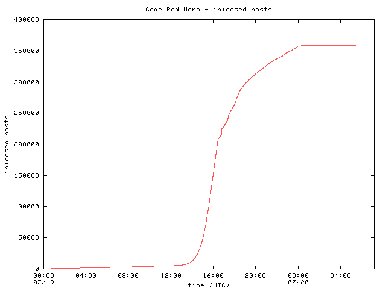
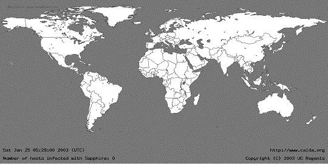
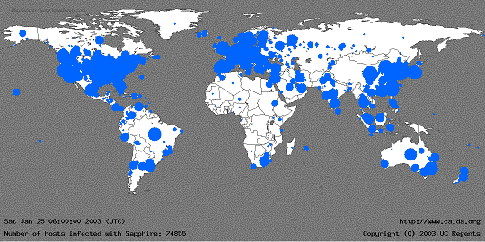
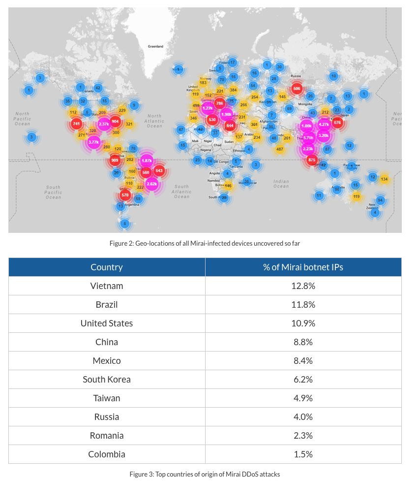

## From System Security to Internet Security {.center}

We've spent weeks on *one machine*: trusting code, crypto, authentication.

Today the threat model goes **network-scale**: thousands or millions of
machines, working together, against a single target.

::: {.notes}
This is the pivot in the course. Up to now the adversary attacked a host or a
protocol. Now the adversary *owns* a fleet of hosts. Frame the day: how do you
build a million-machine weapon, and what does it cost the victim?
:::

## What Is a Denial-of-Service Attack?

A **DoS attack** tries to exhaust a **limited resource** so legitimate users
can't be served.

What can be exhausted:

- **Network**: bandwidth / link capacity (saturate a 1 Gbps link)
- **Connection state**: max simultaneous connections (the TCP table)
- **Server compute**: CPU, memory (force expensive crypto, allocate state)

::: {.notes}
The unifying idea: every system has a finite resource somewhere. The attacker's
whole job is to find the cheapest resource to exhaust. Ask the room: what's the
scarcest resource in a TLS handshake? (Server-side key generation.)
:::

## Common Targets

- **Web servers** — the classic target
- **DNS servers** — take these down and *many* services vanish at once
- **Authentication services** — e.g., a two-factor provider
- **Update servers** — block patches, keep victims vulnerable
- File servers, network infrastructure (harder to reach)

::: {.notes}
The DNS point foreshadows the Dyn case study. Attacking infrastructure is
leverage: you don't attack Netflix, you attack what Netflix depends on.
:::

## Three Characteristics of Every DoS Attack {.smaller}

These three show up on the midterm — learn to spot them in any attack.

1. **Asymmetry** — attacker's cost ≪ victim's cost
2. **Hard to distinguish** attack traffic from legitimate traffic
3. **Hard to attribute** — source addresses are forged

::: {.notes}
This is the analytical core of the lecture. Tell students: when you read about
a new DoS attack, the exam question is "which of these three does it exploit,
and how?" Everything else today is an instance of these three.
:::

## 1. Asymmetry

The attacker spends little; the victim spends a lot.

- One small packet → server **allocates memory / state**
- Small request → server runs **expensive crypto**
- **Amplification**: small query → large response
- **Botnet**: each machine sends a trickle; victim sees a flood

::: {.notes}
Asymmetry is *why* DoS is practical. If costs were symmetric, the attacker would
exhaust their own resources first. Amplification and botnets are two different
ways to buy asymmetry — one via protocol, one via scale.
:::

## 2. Hard to Distinguish Attack From Legit

Attack traffic **looks like normal requests**.

- A botnet HTTP flood is just... a lot of HTTP requests
- Coming from **millions of different IPs**
- You can't block "the one bad IP" — there isn't one
- Any filter aggressive enough to stop the attack also blocks real users

::: {.notes}
This is what makes distributed attacks so much worse than single-source ones.
With one attacker you blackhole an IP. With a botnet the "attackers" are
indistinguishable from your customers. Connect to the Dyn death-spiral later.
:::

## 3. Hard to Attribute

The attacker doesn't care about the reply.

- **IP source spoofing** — forge the source address in each packet
- The attacker never needs the response, so the return path is irrelevant
- Tracing back through spoofed addresses is slow and often impossible
- Enables **reflection** (covered shortly): bounce traffic off a third party

::: {.notes}
Spoofing works for one-way floods because the attacker doesn't complete a
handshake. This is also why reflection is possible. Note: TCP-based attacks
can't fully spoof because you need the SYN-ACK back — a useful contrast.
:::

# How Did We Get Here? {.center}

A short history: **worms** built the machinery that **botnets** now industrialize.

## Worms vs. Viruses

- **Virus**: infects a program; spreads only when a **user runs** it
- **Worm**: **self-propagating** code that crosses the network by exploiting
  flaws in open services — no user action required
- Worms often carry a **payload** (defacement, backdoor, DDoS agent)

First worm: **Robert Morris, November 1988** — infected ~10% of Internet hosts
and triggered the first **CFAA** prosecution.

::: {.notes}
The Morris worm is the origin story: no malicious payload, just a reinfection
bug that bogged machines down until admins pulled them off the net. Multiple
vectors — fingerd buffer overflow, sendmail debug command, password guessing —
the same pattern that recurs for decades.
:::

## Worms Go Mainstream: 2001–2003 {.smaller}

::: {.columns}
::: {.column width="55%"}
- **Code Red** (Jul 2001): IIS buffer overflow; random IP scanning;
  350,000 hosts in **14 hours**; flooded whitehouse.gov
- **Nimda** (Sep 2001): multi-vector; *defeated signature-based filters* — the
  **zero-day detection** problem
- **Slammer** (Jan 2003): 404-byte UDP packet; **no connection setup**, so
  limited only by bandwidth
:::
::: {.column width="45%"}

:::
:::

::: {.notes}
The arc to emphasize: worms got faster as they shed dependencies. TCP worms wait
on round trips; Slammer's connectionless UDP design removed that limit entirely.
Nimda is the lesson that signatures can't catch a brand-new infection.
:::

## Slammer in 30 Minutes {.smaller}

::: {.columns}
::: {.column width="50%"}

:::
::: {.column width="50%"}

:::
:::

Doubling every **8.5 seconds**; saturated the Internet's capacity in ~10 minutes;
**$1.25B** damage — with **no malicious payload**, just bandwidth exhaustion.

::: {.notes}
Moore et al., "The Spread of the Sapphire/Slammer Worm." Knocked out a Korean
cell network, B of A ATMs, five root DNS servers, an airline's ticketing. The
takeaway: spread *speed* alone is a weapon; you don't need a payload.
:::

# Botnets {.center}

A worm gets you in. A **botnet** is what you do with thousands of compromised
machines once you control them.

## What Is a Botnet?

- A **bot** is an autonomous program doing a task (plenty are benign)
- A **botnet** is a large set of **compromised machines** under unified control
- Machines are **enlisted** via worms, malware, default-credential scanning
- Available for **simultaneous, on-command** action

What botnets do: **DDoS**, spam, credential theft, click fraud, crypto-mining,
mass identity theft.

::: {.notes}
Emphasize "unified, simultaneous control" — that's the qualitative jump from a
worm. The botnet is rentable infrastructure; today there are DDoS-for-hire
"booter" services. Most modern botnet use is commercial, not hobbyist.
:::

## Command and Control (C&C)

How the **botmaster** reaches the fleet:

::: {.columns}
::: {.column width="50%"}
**Centralized**

- Easy to set up, fast to command
- *But*: easy to detect; single point of failure
:::
::: {.column width="50%"}
**Peer-to-peer**

- Resilient, no single point of failure, harder to detect
- *But*: complex; delivery and latency are unreliable
:::
:::

Infected machines often rendezvous via **dynamic DNS**, so the controller can
move freely and survive takedown attempts.

::: {.notes}
The C&C topology is the design tradeoff at the heart of botnet defense. Take
down the central server and a centralized botnet dies; P2P botnets (Storm, 2007)
forced defenders to poison the overlay instead. Dynamic DNS / fast-flux is the
classic evasion.
:::

## Mirai (2016): The IoT Turn {.smaller}

::: {.columns}
::: {.column width="55%"}
- Compromised **IoT devices** — cameras, DVRs, home routers
- Method was almost embarrassingly simple: a table of
  **default usernames and passwords**
- ~50,000+ unique IPs across **160+ countries**
- Source code released publicly → countless variants
:::
::: {.column width="45%"}

:::
:::

::: {.notes}
Mirai is the inflection point: the bots are no longer PCs, they're appliances
that never get patched and ship with admin/admin. The release of the source code
is what made it an *ecosystem* rather than one botnet. This sets up Dyn.
:::

## Case Study: Mirai vs. Dyn, October 2016 {.smaller}

- Target was **Dyn** — a **DNS provider**, *not* the end services
- One outage took down **Twitter, Netflix, Spotify, Reddit**, and more
- Botnet: only ~**100,000** IoT endpoints — small by botnet standards
- **Why it still worked**: an **application-level** attack on DNS query
  processing, not raw bandwidth — exhaust the *server's* capacity, not the pipe

**Key insight:** attack the **infrastructure everyone depends on**, and you take
down many services with one blow.

::: {.notes}
This is the lecture's anchor case. The leverage point is the dependency: nobody
attacked Netflix directly. Tie back to "Common Targets" — DNS is the
force-multiplier target. And note the small size: scale isn't everything if you
pick an application-level resource to exhaust.
:::

## The Death Spiral {.smaller}

Why Dyn was so hard to stop — legitimate traffic *amplified* the attack:

1. Attack traffic overloads Dyn's DNS servers
2. Real users can't resolve domains
3. Their apps **automatically retry** (resilience by design!)
4. Retries pile onto the already-saturated servers
5. A "**storm of legitimate retry activity**" — indistinguishable from attack

This is **Characteristic #2 in the wild**: the attack traffic and the legitimate
traffic became literally the same packets.

::: {.notes}
The cruel irony: the resilience feature (auto-retry) becomes the amplifier. You
cannot filter your way out, because filtering the retries means filtering your
own customers. Great place to cold-call: "What would *you* do as Dyn's on-call
engineer at 3am?"
:::

## A 2026 Bookend: Mirai's Descendants {.smaller}

::: {.vignette}
In **November 2025**, Cloudflare mitigated a **31.4 Tbps** DDoS attack — the
largest ever publicly disclosed — from the **Aisuru/Kimwolf** botnet, a
Mirai-class IoT family of compromised Android TVs and home routers. In **March
2026**, the DoJ and international partners announced a takedown of Aisuru,
Kimwolf, and two other botnets spanning **over 3 million infected devices**.
:::

A decade after Dyn, the playbook is unchanged — **cheap, unpatched IoT** — only
the scale has grown from gigabits to **tens of terabits**.

::: {.notes}
Use this as the "current events" hook. The continuity is the lesson: Mirai wasn't
a one-off, it was a template. Aisuru is Mirai-class, same default-credential and
unpatched-device economics, now at 31.4 Tbps vs. Dyn's far smaller volumes. The
2026 DoJ takedown shows the defensive response is now coordinated and
international. Sources: Cloudflare Q4 2025 DDoS report; DoJ / District of Alaska
press release, March 2026.
:::

# Reflection and Amplification {.center}

How a *small* attacker buys *enormous* asymmetry — without a big botnet.

## DNS Reflection and Amplification {.smaller}

1. Attacker sends a **small DNS query** to an **open resolver**
2. Source IP is **spoofed** to the **victim's** address
3. Resolver sends a **large response** — to the victim, who never asked
4. **Amplification factor**: 60× to ~3,000×

The attacker does almost no work; the **DNS server generates the flood**. Use
many resolvers at once → distributed and huge.

This single attack hits **all three characteristics**: asymmetry (small→large),
indistinguishability (looks like normal DNS), and unattributability (spoofed
source).

::: {.notes}
**Open resolvers** answer queries from anyone — Google's 8.8.8.8, Cloudflare's
1.1.1.1 are intentionally open and well-run, but historically the Internet was
full of misconfigured ones. The misaligned incentive: securing *your* resolver
protects *other* people, so nobody bothers. Same logic as source-address
spoofing being everyone-else's problem.
:::

## Defense, and Its New Vulnerability {.smaller}

**Stateful firewall**: track outgoing queries, drop responses with no matching
request. Stops reflection — the victim never sent those queries.

::: {.vignette}
But the firewall now must **store state** — and **state is a limited resource**.
Flood it with spoofed queries: it remembers them all, runs out of memory, and
**crashes**. The defense became a new DoS target.
:::

**Layered fix**: **ingress filtering** (BCP 38) — drop packets that claim an
inside source but arrive from outside, so spoofing can't enter in the first place.

::: {.notes}
This is the most important *principle* slide of the day, flagged for the midterm.
The recurring question: "Have I introduced a new vulnerability?" Any defense that
requires per-flow state can itself be exhausted. The cleaner fix attacks the root
cause (spoofing) rather than filtering symptoms downstream.
:::

## Defenses: Monitoring and Takedown {.smaller}

- **Early days**: join the IRC C&C channel and watch — defeated as botnets moved
  to **encrypted, P2P** C&C
- **NIDS / signatures** (e.g., Snort) — fragile against zero-days, as Nimda showed
- **Honeypots / honeynets**: run unpatched hosts, get infected (often within ~10
  min), capture the binary, map scanning and C&C
- **DNS-based detection**: repetitive A queries, rogue-looking domains
  (`irc.big-bot.de`); **C&C sinkholing** estimates botnet size but blinds you to
  activity
- **Coordinated takedowns**: the 2026 Aisuru action shows the modern model —
  governments + cloud/CDN providers acting together

::: {.notes}
Walk the evolution: passive observation → signatures → active deception
(honeypots) → traffic analysis (DNS) → legal/operational takedown. Each step is
a response to attackers shedding the previous detection surface (clear-text IRC →
encrypted P2P → fast-flux DNS). Sinkholing has a real tradeoff: hijack the C&C
and the bots go dark, but so does your visibility.
:::

## What to Take Away {.smaller}

- Every DoS attack is an exercise in **resource exhaustion** — find the scarce
  resource
- Analyze any attack through the **three characteristics**: asymmetry,
  indistinguishability, unattributability
- **Distributed** attacks (botnets) and **amplification** are two routes to the
  same asymmetry
- **Infrastructure** (DNS) is the high-leverage target; dependencies create
  cascading failure
- **Cheap, unpatched IoT** is the durable supply of bots — Mirai → Aisuru
- Every stateful defense asks: **have I introduced a new vulnerability?**

::: {.notes}
This is the slide students should photograph. If they remember the three
characteristics and "any stateful defense is a potential DoS target," they can
reason about an attack they've never seen — which is exactly the midterm task.
:::
