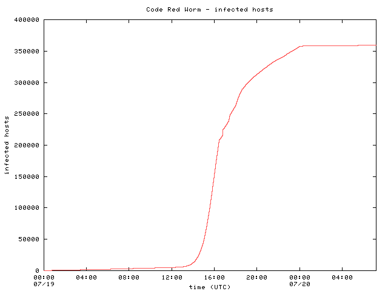
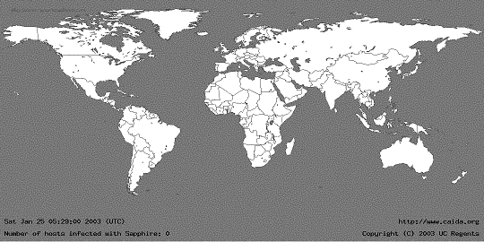
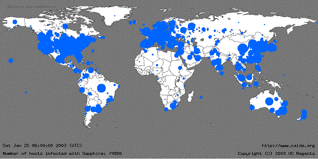
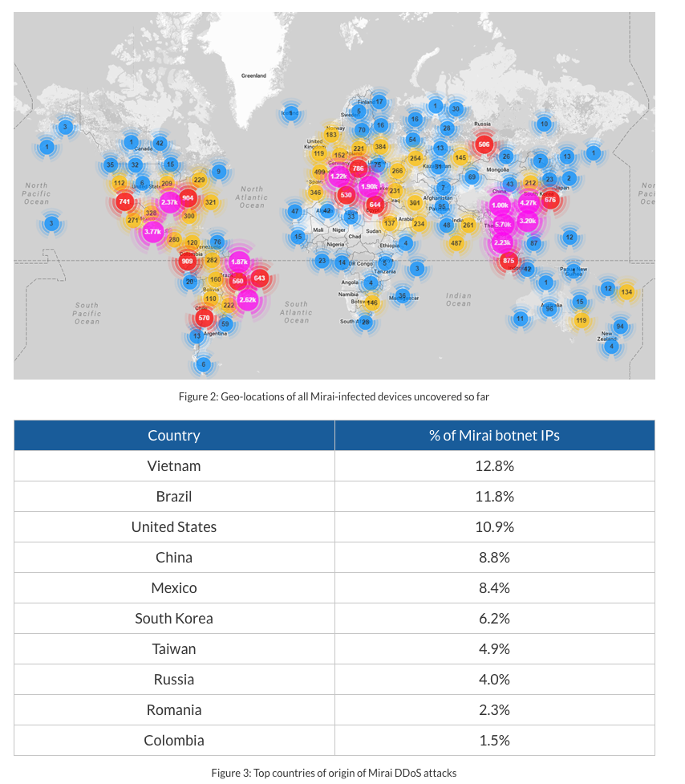

## From System Security to Internet Security {.center}

We've spent weeks on *one machine*: trusting code, crypto, authentication.

Today the threat model goes **network-scale**: thousands or millions of
machines, working together, against a single target.

::: {.notes}
This is the pivot in the course, and the agenda flags it explicitly as the
"theme shift: from system security to Internet security" in Meeting 3. Up to
now the adversary attacked a host or a protocol. Now the adversary *owns* a
fleet of hosts. Frame the day around one question: how do you build a
million-machine weapon, and what does it cost the target? Cold-call opener:
if you had a botnet of a hundred thousand home routers, what would you point
it at first — and why? Push past "a specific website" to the leverage
answer: infrastructure. The whole rest of the lecture is about that leverage.
Pair with the Backdoors debate scheduled the same week — same tension, state
capability versus consumer-device fragility.
:::

## What Is a Denial-of-Service Attack?

A **DoS attack** tries to exhaust a **limited resource** so legitimate users
can't be served.

What can be exhausted:

- **Network**: bandwidth / link capacity (saturate a 1 Gbps link)
- **Connection state**: max simultaneous connections (the TCP table)
- **Server compute**: CPU, memory (force expensive crypto, allocate state)

::: {.notes}
The unifying idea: every system has a finite resource somewhere, and the
attacker's whole job is to find the cheapest one to exhaust. The canonical
taxonomy lives in RFC 4732 (Internet Denial-of-Service Considerations, 2006) —
three resource classes: network bandwidth, connection state, and server
compute. Cold-call: what is the scarcest resource in a TLS handshake? The
server-side asymmetric key operation — RSA decrypt is about ten times more
expensive than encrypt, which is why one attacker box can overwhelm ten web
servers with a plain TLS renegotiation flood. This is the intuition students
need before amplification and application-layer DoS: the "cost" that matters
is CPU cycles and memory, not gigabits per second.
:::

## Common Targets

- **Web servers** — the classic target
- **DNS servers** — take these down and *many* services vanish at once
- **Authentication services** — e.g., a two-factor provider
- **Update servers** — block patches, keep victims vulnerable
- File servers, network infrastructure (harder to reach)

::: {.notes}
The DNS point foreshadows the Dyn case study — hold it in reserve. Attacking
infrastructure is pure leverage: you do not attack Netflix, you attack what
Netflix depends on. The authentication example is not hypothetical — a DoS
against Duo, Okta, or a similar 2FA provider locks every downstream service
out at once even though none of them were touched. Same shape as the update-
server pattern: block the patch pipeline and the victims stay vulnerable to
whatever comes next. Ask the room to name the highest-leverage dependency for
their own workflow — most will land on either Google Auth, Cloudflare, or
DNS. That is the shortlist attackers know too.
:::

## Three Characteristics of Every DoS Attack {.smaller}

These three show up on the midterm — learn to spot them in any attack.

1. **Asymmetry** — attacker's cost ≪ victim's cost
2. **Hard to distinguish** attack traffic from legitimate traffic
3. **Hard to attribute** — source addresses are forged

::: {.notes}
This is the analytical core of the lecture and it is explicitly flagged as
midterm material in the agenda. The reference is Mirkovic and Reiher's
"Taxonomy of DDoS Attack and DDoS Defense Mechanisms" (SIGCOMM CCR, 2004),
which is still the cleanest carve-up in the literature. Tell students: when
you read about a new DoS attack, the exam question is "which of these three
does it exploit, and how?" Everything else in today's deck — SYN floods, DNS
amplification, Mirai, the Dyn death spiral, TLS DoS — is an instance of these
three. Cold-call: pick a headline breach you know, and locate it on this
list. If they cannot, they do not understand the attack yet.
:::

## 1. Asymmetry

The attacker spends little; the victim spends a lot.

- One small packet → server **allocates memory / state**
- Small request → server runs **expensive crypto**
- **Amplification**: small query → large response
- **Botnet**: each machine sends a trickle; victim sees a flood

::: {.notes}
Asymmetry is *why* DoS is practical. If costs were symmetric, the attacker
would exhaust their own resources first. There are two orthogonal ways to buy
asymmetry: exploit a protocol (a small SYN forces a ~280-byte TCB per RFC
4987; a small DNS query yields kilobytes of response; a TLS ClientHello
triggers expensive server-side crypto per CVE-2011-1473), or exploit scale (a
botnet, where each machine sends a trickle but the victim sees a flood). The
next characteristic — indistinguishability — follows for free once you have
enough real sources. The whole rest of the lecture is variations on this
one idea; keep pointing back to it when a student asks "why is this so hard
to stop?"
:::

## 2. Hard to Distinguish Attack From Legit

Attack traffic **looks like normal requests**.

- A botnet HTTP flood is just... a lot of HTTP requests
- Coming from **millions of different IPs**
- You can't block "the one bad IP" — there isn't one
- Any filter aggressive enough to stop the attack also blocks real users

::: {.notes}
This is what makes distributed attacks so much worse than single-source ones.
With one attacker you blackhole an IP; with a botnet the "attackers" are
literally indistinguishable from your customers because many of them *are*
your customers' compromised devices. Empirical scale for the room: Cloudflare's
Q4 2025 report logged 47.1M attacks over the year, averaging 5,376 mitigations
per hour, up 121% year over year. Any filter aggressive enough to stop the
flood also blocks real users, which sets up the Dyn death-spiral slide later.
Connect this back to characteristic #2 as it appears in the wild: legitimate
retry traffic became the attack.
:::

## 3. Hard to Attribute

The attacker doesn't care about the reply.

- **IP source spoofing** — forge the source address in each packet
- The attacker never needs the response, so the return path is irrelevant
- Tracing back through spoofed addresses is slow and often impossible
- Enables **reflection** (covered shortly): bounce traffic off a third party

::: {.notes}
IP source spoofing is the enabling primitive for both unattributable floods
and reflection attacks. It works for one-way floods because the attacker
never completes a handshake — the SYN-ACK goes to a random address and the
attacker does not care. TCP-based attacks cannot fully spoof for the same
reason: they need the SYN-ACK back to complete the connection. RFC 2827 /
BCP 38 (Ferguson and Senie, 2000) is the twenty-five-year-old fix: routers
drop packets whose source address cannot legitimately come from that
direction. CAIDA's Spoofer project publishes ongoing deployment data — as of
2025 roughly 15–20% of tested ASes still permit spoofing. The recurring
policy question: whose job is it to fix an externality that harms
everyone else?
:::

# How Did We Get Here? {.center}

A short history: **worms** built the machinery that **botnets** now industrialize.

::: {.notes}
Ten-minute historical block. The point of walking through 1988–2003 is not
nostalgia — it is to show students where the primitives came from: worms
established random-scanning propagation, buffer-overflow exploitation, and
the CFAA case law that still governs security research. Botnets then
industrialized what worms proved possible. The arc from Morris to Slammer to
Mirai is one continuous story about attackers shedding constraints and
about defenders always fighting the last war.
:::

## Worms vs. Viruses

- **Virus**: infects a program; spreads only when a **user runs** it
- **Worm**: **self-propagating** code that crosses the network by exploiting
  flaws in open services — no user action required
- Worms often carry a **payload** (defacement, backdoor, DDoS agent)

First worm: **Robert Morris, November 1988** — infected ~10% of Internet hosts
and triggered the first **CFAA** prosecution.

::: {.notes}
The Morris worm (Robert Tappan Morris, then a Cornell grad student, November 2,
1988) is the origin story. Spafford's ACM classic "The Internet Worm Program:
An Analysis" is the canonical write-up if a student wants the primary. No
malicious payload — just a reinfection bug that Morris coded aggressively to
avoid trivial detection, which bogged machines down until admins pulled them
off the net. Multiple vectors: a fingerd buffer overflow, the sendmail debug
command, and password guessing. Same pattern that recurs for decades. It also
produced the first CFAA prosecution — *United States v. Morris* (1990) — which
is the historical link to today's ethics and law discussion. NIST SP 800-83
is the reference for the virus/worm/malware taxonomy.
:::

## Worms Go Mainstream: 2001–2003 {.smaller}

::: {.columns}
::: {.column width="55%"}
- **Code Red** (Jul 2001): IIS buffer overflow; random IP scanning;
  350,000 hosts in **14 hours**; flooded whitehouse.gov
- **Nimda** (Sep 2001): multi-vector; *defeated signature-based filters* — the
  **zero-day detection** problem
- **Slammer** (Jan 2003): 404-byte UDP packet; **no connection setup**, so
  limited only by bandwidth
:::
::: {.column width="45%"}

:::
:::

::: {.notes}
The arc to emphasize: worms got faster as they shed dependencies. Code Red
(CERT CA-2001-19; Moore, Shannon, Voelker, Savage IMW 2002) exploited an IIS
buffer overflow and scanned random IPv4 addresses; 350,000 hosts in fourteen
hours, and it turned on whitehouse.gov as a coordinated flood target. Nimda
(CERT CA-2001-26) went multi-vector and evaded signature-based filters — the
canonical demonstration of the zero-day detection problem. Slammer (Jan 2003)
was 404 bytes of UDP with no connection setup, so spread was limited only by
bandwidth. TCP worms wait on round trips; Slammer's connectionless design
removed that limit entirely. Cold-call: which of these three would be
hardest to defend against today?
:::

## Slammer in 30 Minutes {.smaller}

::: {.columns}
::: {.column width="50%"}

:::
::: {.column width="50%"}

:::
:::

Doubling every **8.5 seconds**; saturated the Internet's capacity in ~10 minutes;
**$1.25B** damage — with **no malicious payload**, just bandwidth exhaustion.

::: {.notes}
Moore et al., "The Spread of the Sapphire/Slammer Worm" (CAIDA 2003) is the
canonical measurement paper — put those two images (five minutes apart) side
by side and let the visual do the work. Doubling every 8.5 seconds; saturated
usable Internet capacity in about ten minutes. Collateral damage: a Korean
cell network went down, Bank of America ATMs went dark, five root DNS servers
were knocked out, and Continental Airlines ticketing failed. Computer
Economics estimated $1.25B in damage. All of it from a 404-byte UDP packet
with no malicious payload — just bandwidth exhaustion from replication.
The takeaway students should remember: spread *speed* alone is a weapon; you
do not need a payload to cause an outage.
:::

# Botnets {.center}

A worm gets you in. A **botnet** is what you do with thousands of compromised
machines once you control them.

::: {.notes}
Transition beat. The qualitative jump: worms are contagion (they reproduce),
botnets are fleets (they take orders). Modern botnet economics are
commercial — DDoS-for-hire booters, credential-stuffing services, ad-fraud
farms, crypto-mining rentals — not hobbyist. Preview the case-study arc:
we will spend the next block on Mirai and Dyn (2016), and then on
Aisuru/Kimwolf as the 2025–2026 direct descendant. Same design, thirty
times the scale.
:::

## What Is a Botnet?

- A **bot** is an autonomous program doing a task (plenty are benign)
- A **botnet** is a large set of **compromised machines** under unified control
- Machines are **enlisted** via worms, malware, default-credential scanning
- Available for **simultaneous, on-command** action

What botnets do: **DDoS**, spam, credential theft, click fraud, crypto-mining,
mass identity theft.

::: {.notes}
Emphasize "unified, simultaneous control" — that is the qualitative jump from a
worm. A worm is contagion; a botnet is a fleet. The canonical measurement
treatment is Rajab, Zarfoss, Monrose, and Terzis, "A Multifaceted Approach to
Understanding the Botnet Phenomenon" (IMC 2006). Today most modern botnet use
is commercial, not hobbyist: DDoS-for-hire "booter" services rent capacity by
the minute, and Krebs on Security's recurring booter takedowns (FBI Operation
Power Off, with EUROPOL, has hit dozens over the last decade) document the
market. Cold-call: if you can rent a hundred gigabits per second for twenty
dollars, what does that change about who gets attacked and why?
:::

## Command and Control (C&C)

How the **botmaster** reaches the fleet:

::: {.columns}
::: {.column width="50%"}
**Centralized**

- Easy to set up, fast to command
- *But*: easy to detect; single point of failure
:::
::: {.column width="50%"}
**Peer-to-peer**

- Resilient, no single point of failure, harder to detect
- *But*: complex; delivery and latency are unreliable
:::
:::

Infected machines often rendezvous via **dynamic DNS**, so the controller can
move freely and survive takedown attempts.

::: {.notes}
The C&C topology is the design tradeoff at the heart of botnet defense. Take
down the central server and a centralized botnet dies — which is why the
Storm botnet (2007) went peer-to-peer and forced defenders to poison the
overlay instead of decapitating a head. Fast-flux DNS (ICANN SSAC SAC 025) is
the classic evasion for centralized designs: the controller domain resolves
to a rotating pool of compromised proxies, so takedowns hit an infinite bench
of stand-ins. Encrypted P2P C&C then hides even the message traffic. The
arc: every generation of defenders shed the previous detection surface, and
attackers moved to whatever came next. Sinkholing (later slide) is the
current tradeoff — hijack the controller and the bots go dark, but so does
your visibility.
:::

## Mirai (2016): The IoT Turn {.smaller}

::: {.columns}
::: {.column width="55%"}
- Compromised **IoT devices** — cameras, DVRs, home routers
- Method was almost embarrassingly simple: a table of
  **default usernames and passwords**
- ~50,000+ unique IPs across **160+ countries**
- Source code released publicly → countless variants
:::
::: {.column width="45%"}

:::
:::

::: {.notes}
Mirai is the inflection point: the bots are no longer PCs, they are
appliances that never get patched and ship with admin/admin. Canonical
measurement study is Antonakakis et al., "Understanding the Mirai Botnet"
(USENIX Security 2017) — read it if you want the definitive account.
"Anna-Senpai" posted the source code to Hack Forums in September 2016; Krebs
on Security's investigation identified Paras Jha and colleagues, who pled
guilty in 2017. The release of the code is what made Mirai an *ecosystem*
rather than one botnet — Aisuru/Kimwolf and every "TurboMirai" descendant
inherits from that codebase. This slide directly sets up Dyn on the next
slide and the 2025–2026 vignette after it. Bots are cheap because devices
are cheap and unpatched — the economics have not changed in a decade.
:::

## Case Study: Mirai vs. Dyn, October 2016 {.smaller}

- Target was **Dyn** — a **DNS provider**, *not* the end services
- One outage took down **Twitter, Netflix, Spotify, Reddit**, and more
- Botnet: only ~**100,000** IoT endpoints — small by botnet standards
- **Why it still worked**: an **application-level** attack on DNS query
  processing, not raw bandwidth — exhaust the *server's* capacity, not the pipe

**Key insight:** attack the **infrastructure everyone depends on**, and you take
down many services with one blow.

::: {.notes}
This is the lecture's anchor case, October 21, 2016. Three waves; Dyn's own
post-mortem documented the sequence. The leverage point is the dependency:
nobody attacked Netflix, Twitter, Spotify, or Reddit directly — they
attacked what all four resolved through. Tie back to "Common Targets": DNS
is the force-multiplier target. Note the small size — ~100,000 endpoints is
tiny by botnet standards — because scale is not everything if you pick an
application-level resource to exhaust (DNS query processing, not raw
bandwidth). Peak attack traffic was around 1.2 Tbps, which the next-slide
vignette will make look modest. If time permits, mention that the same year
Mirai took KrebsOnSecurity offline — Krebs had published the "Anna-Senpai"
identification, and Aisuru would return to hit Krebs again in May 2025 at
6.35 Tbps, closing a nice ten-year loop.
:::

## The Death Spiral {.smaller}

Why Dyn was so hard to stop — legitimate traffic *amplified* the attack:

1. Attack traffic overloads Dyn's DNS servers
2. Real users can't resolve domains
3. Their apps **automatically retry** (resilience by design!)
4. Retries pile onto the already-saturated servers
5. A "**storm of legitimate retry activity**" — indistinguishable from attack

This is **Characteristic #2 in the wild**: the attack traffic and the legitimate
traffic became literally the same packets.

::: {.notes}
The cruel irony: the resilience feature (auto-retry) becomes the amplifier.
Dyn's own post-mortem estimated the death spiral produced "a legitimate
response to malicious activity" that was "10 to 20 times more DNS traffic
than what was actually consumed by the botnet." You cannot filter your way
out, because filtering the retries means filtering your own customers'
browsers — the retries came from real users' devices, not the bots. This is
characteristic #2 in its purest form: attack and legitimate traffic became
literally the same packets. Cold-call: you are Dyn's on-call engineer at
3am — what do you do? Push past "block Mirai's IPs" (there are millions,
scattered across every consumer ISP) to the honest answer: you shed load,
you anycast wider, you call your CDN, and you wait it out.
:::

## A 2026 Bookend: Mirai's Descendants {.smaller}

::: {.vignette}
In **November 2025**, Cloudflare mitigated a **31.4 Tbps** DDoS attack — the
largest ever publicly disclosed, lasting just **35 seconds** — from the
**Aisuru/Kimwolf** botnet, a Mirai-class IoT family running on ~2M compromised
off-brand **Android TVs** plus home routers, cameras, and DVRs. A "Night Before
Christmas" follow-on campaign (Dec 19, 2025) issued **200M+ HTTP requests/sec**.
On **March 19, 2026**, the DoJ (District of Alaska), FBI, EUROPOL, and Canadian
and German partners announced a coordinated takedown of Aisuru, Kimwolf,
JackSkid, and Mossad — **~3M infected devices**, with alleged Kimwolf operator
"Dort" (Jacob Butler, 23, Ottawa) arrested May 20, 2026.
:::

A decade after Dyn, the playbook is unchanged — **cheap, unpatched IoT** — only
the scale has grown from gigabits to **tens of terabits**.

::: {.notes}
Use this as the current-events hook. The continuity is the lesson: Mirai was
not a one-off, it was a template. Aisuru is Mirai-class — same default-
credential trick, same unpatched-device economics — now at 31.4 Tbps versus
Dyn's roughly 1.2 Tbps in 2016. Escalation curve for the board: 5.6 Tbps
(Oct 2024) → 7.3 Tbps (Jun 2025) → 15.72 Tbps (Oct 2025, Microsoft) → 31.4
Tbps (Nov 2025) → 200M+ HTTP requests per second in the December 2025
"Night Before Christmas" campaign. The March 19, 2026 DoJ (District of
Alaska) takedown, coordinated with EUROPOL, Germany's BKA, and Canadian
authorities, shows the defensive response is now coordinated and
international; private-sector assist list includes Akamai, AWS, Cloudflare,
Google, Lumen, Nokia, Team Cymru, and QiAnXin XLab. Alleged Kimwolf
operator "Dort" — Jacob Butler, age 23, Ottawa — was arrested May 20, 2026.
Coda: FastNetMon reported new C2 scanning within weeks; the takedown cycle
continues. Sources: Cloudflare Q4 2025 DDoS Threat Report; DoJ press
release; Krebs on Security, March 2026.
:::

# Reflection and Amplification {.center}

How a *small* attacker buys *enormous* asymmetry — without a big botnet.

::: {.notes}
Pause and reset. The last block was about scale (millions of bots).
Reflection and amplification are the alternative: a single attacker with a
laptop and a list of misconfigured servers can buy the same effect via
protocol asymmetry. Draw the flow on the board before the slide: attacker →
resolver (small, spoofed source) → victim (large response). Amplification
factors up to ~50,000× for memcached — that is what makes the record-setting
attacks possible without record-setting botnets. This is also the cleanest
example of all three characteristics stacking on a single attack.
:::

## DNS Reflection and Amplification {.smaller}

1. Attacker sends a **small DNS query** to an **open resolver**
2. Source IP is **spoofed** to the **victim's** address
3. Resolver sends a **large response** — to the victim, who never asked
4. **Amplification factor**: 60× to ~3,000×

The attacker does almost no work; the **DNS server generates the flood**. Use
many resolvers at once → distributed and huge.

This single attack hits **all three characteristics**: asymmetry (small→large),
indistinguishability (looks like normal DNS), and unattributability (spoofed
source).

::: {.notes}
Open resolvers answer queries from anyone. Google's 8.8.8.8 and Cloudflare's
1.1.1.1 are intentionally open and well-run public services; historically the
Internet was full of misconfigured resolvers that inherited that behavior by
accident (see the Open Resolver Project, Rossow and Kuehrer). Amplification
factor table for the board: DNS ~28–54×, NTP ~556×, SSDP ~30×, memcached
~10,000–51,000× (US-CERT TA13-088A and TA14-017A). The February 2018 GitHub
attack hit 1.35 Tbps using memcached alone. The misaligned incentive:
securing *your* resolver protects *other* people, so nobody bothers. Same
logic as source-address spoofing being everyone else's problem. This slide
hits all three characteristics at once — asymmetry (small to large),
indistinguishability (looks like normal DNS), and unattributability (spoofed
source) — which is why it appears every year on the midterm.
:::

## Defense, and Its New Vulnerability {.smaller}

**Stateful firewall**: track outgoing queries, drop responses with no matching
request. Stops reflection — the victim never sent those queries.

::: {.vignette}
But the firewall now must **store state** — and **state is a limited resource**.
Flood it with spoofed queries: it remembers them all, runs out of memory, and
**crashes**. The defense became a new DoS target.
:::

**Layered fix**: **ingress filtering** (BCP 38) — drop packets that claim an
inside source but arrive from outside, so spoofing can't enter in the first place.

::: {.notes}
This is the most important *principle* slide of the day, flagged for the
midterm. The recurring question: have I introduced a new vulnerability? Any
defense that requires per-flow state can itself be exhausted — the stateful
firewall is the canonical example, but the pattern generalizes to any
security appliance that tracks connections, sessions, or requests. The
cleaner fix attacks the root cause (spoofing) rather than filtering symptoms
downstream, which is why BCP 38 keeps showing up. MANRS (Mutually Agreed
Norms for Routing Security) tracks source-address-validation adoption
publicly; CAIDA Spoofer measures the residual. Cold-call: how would you
attack this stateful firewall — what packets would you send? Answer:
spoofed queries that the firewall must remember, until it runs out of
memory. That is the midterm question.
:::

## Defenses: Monitoring and Takedown {.smaller}

- **Early days**: join the IRC C&C channel and watch — defeated as botnets moved
  to **encrypted, P2P** C&C
- **NIDS / signatures** (e.g., Snort) — fragile against zero-days, as Nimda showed
- **Honeypots / honeynets**: run unpatched hosts, get infected (often within ~10
  min), capture the binary, map scanning and C&C
- **DNS-based detection**: repetitive A queries, rogue-looking domains
  (`irc.big-bot.de`); **C&C sinkholing** estimates botnet size but blinds you to
  activity
- **Coordinated takedowns**: the 2026 Aisuru action shows the modern model —
  governments + cloud/CDN providers acting together

::: {.notes}
Walk the evolution as a co-evolution story: passive observation → signatures →
active deception (honeypots) → traffic analysis (DNS) → legal and operational
takedown. Freiling, Holz, and Wicherski's "Botnet Tracking" (ESORICS 2005) is
the reference for IRC-C&C monitoring. Provos and Holz's *Virtual Honeypots*
(2007) is the honeypot playbook — unpatched hosts get infected in about ten
minutes, which is enough to capture the binary, map scanning targets, and
watch C&C flow. Each defensive step provoked attackers to shed the previous
detection surface: clear-text IRC → encrypted P2P → fast-flux DNS →
domain-generation algorithms. Sinkholing has a real tradeoff: hijack the
controller and the bots go dark, but so does your visibility (see the 2014
Zeus/GameOver takedown). The March 2026 Aisuru action is the modern model —
governments plus cloud and CDN providers acting together, not any one
technique alone.
:::

## What to Take Away {.smaller}

- Every DoS attack is an exercise in **resource exhaustion** — find the scarce
  resource
- Analyze any attack through the **three characteristics**: asymmetry,
  indistinguishability, unattributability
- **Distributed** attacks (botnets) and **amplification** are two routes to the
  same asymmetry
- **Infrastructure** (DNS) is the high-leverage target; dependencies create
  cascading failure
- **Cheap, unpatched IoT** is the durable supply of bots — Mirai → Aisuru
- Every stateful defense asks: **have I introduced a new vulnerability?**

::: {.notes}
This is the slide students should photograph. If they remember the three
characteristics — asymmetry, indistinguishability, unattributability — plus
"any stateful defense is a potential DoS target," they can reason about an
attack they have never seen, which is exactly the midterm task. Preview the
next lecture: Internet Routing Security (BGP hijacks, RPKI, path
authentication) — same "how do you trust anything at Internet scale?"
question, applied to how packets actually get from A to B. This deck pairs
with the Backdoors debate (state security versus consumer-device fragility)
and the DoS/Botnets breakout (regulate the IoT externality or treat
scrubbing providers as common carriers). Close on the through-line: the
attacks scale with insecure IoT, and until device economics change the
Mirai-to-Aisuru arc keeps going.
:::
