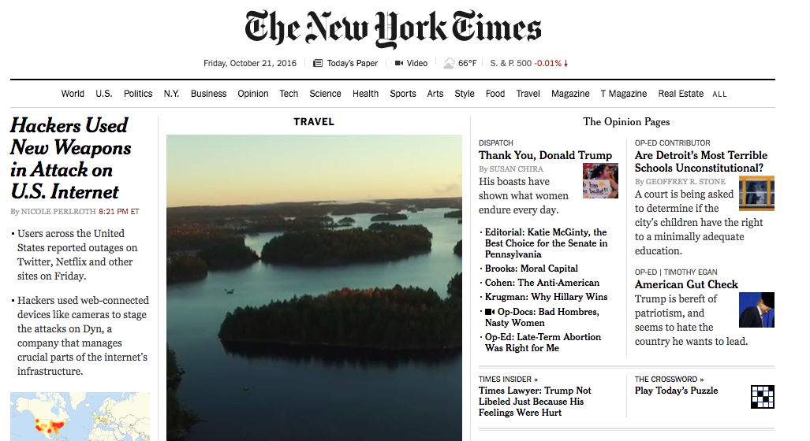
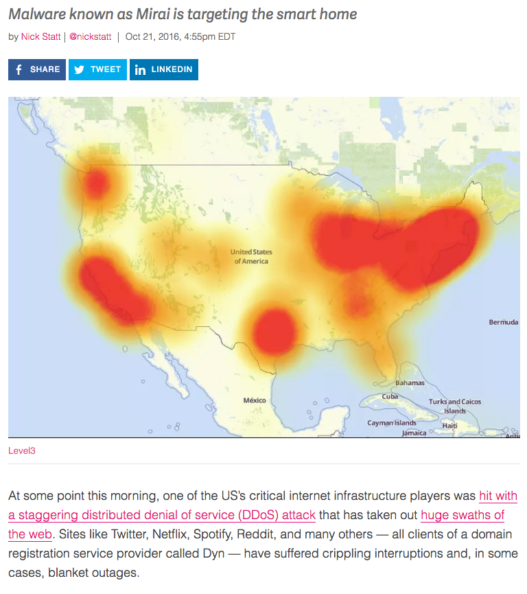
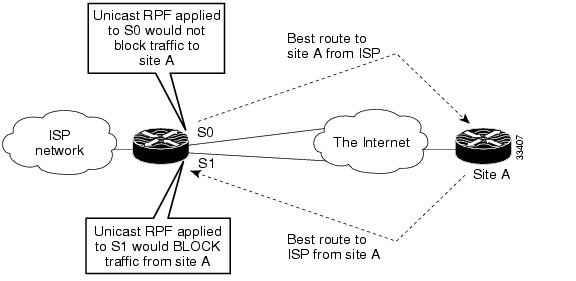
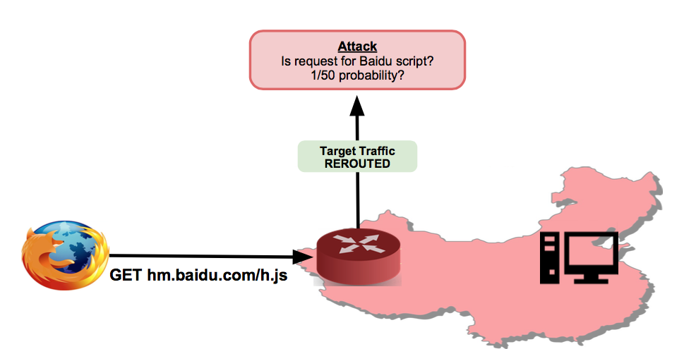

## From System Security to Internet Security {.center}

We shift from securing a single machine to securing the **network between
machines**. The first internet-scale threat: an attacker who doesn't break in —
they just make sure **nobody else can get in**.

::: {.notes}
Frame the transition. The previous weeks were about trusting code and the host
(trusting trust, crypto, auth). DoS is the first attack where the adversary never
compromises the target's confidentiality or integrity at all — they go after
*availability*, the A in CIA. Ask the room: which is worse for a bank, a leaked
file or a site that's down on payday?
:::

## A Recent Hook: The Biggest Attack Ever Recorded {.smaller}

::: {.vignette}
In its **Q4 2025 DDoS report (published Feb 2026)**, Cloudflare disclosed
mitigating a **record 31.4 Tbps** attack — the largest ever made public. It lasted
about **35 seconds** and was stopped autonomously. The source was the
**Aisuru / Kimwolf "TurboMirai" botnet** — a Mirai descendant of **300,000+
compromised IoT devices**, including Android TV / streaming boxes. On **March 19,
2026**, international law enforcement announced a takedown of its
command-and-control infrastructure.
:::

The playbook hasn't changed since **Mirai (2016)** — only the scale has: cheap,
insecure consumer devices, conscripted into a weapon.

::: {.notes}
This is the freshest concrete example tying the whole lecture together. Note the
through-line: Mirai's source code leaked in 2016, and Aisuru/Kimwolf is a direct
descendant ("TurboMirai"). 31.4 Tbps vs. the ~1 Tbps Dyn attack — two orders of
magnitude in a decade. The 35-second duration matters: modern attacks are short,
sharp, and automated, so defenses must be too. Sources: Cloudflare Q4 2025 DDoS
threat report; NETSCOUT ASERT; law-enforcement takedown March 2026.
:::

## Denial of Service: What Is It?

An attempt to **exhaust a limited resource** so legitimate users can't get service.

- **Network** — bandwidth / link capacity (saturate a 1 Gbps link)
- **Transport** — TCP connection state (the connection table)
- **Application / server** — CPU, memory, processing (e.g., a TLS handshake)

Goal is **availability**, not theft. Often — but not always — **high-rate**.

::: {.notes}
The key word is *limited*. Every layer has a finite resource, and DoS finds the
scarcest one. Application-layer exhaustion (a few expensive requests) can be far
cheaper for the attacker than brute bandwidth — keep that contrast in mind for the
asymmetry slide. "Distributed" (DDoS) just means the attack comes from many
sources at once.
:::

## Targets of Attack

::: {.columns}
::: {.column width="50%"}
**Critical servers**

- Web servers (most common)
- File and update servers
- **Authentication** (e.g., taking down Duo/2FA locks everyone out)
- **DNS** — a force multiplier
:::
::: {.column width="50%"}
**Infrastructure**

- Routers within an organization
- Routers along the upstream path
- (Harder to reach, higher payoff)
:::
:::

**Why DNS?** Knock out the *directory* and you knock out everything behind it.

::: {.notes}
The strategic insight: you don't have to attack Netflix to take down Netflix — you
attack the infrastructure it depends on. DNS is the classic example and sets up the
Dyn case study. Authentication is another high-value target: if 2FA is down,
nobody logs in, even though no individual service was touched.
:::

## Three Common Characteristics {.smaller}

These three recur in almost every DoS attack — know them cold.

1. **Asymmetry** — attacker's cost ≪ victim's cost. One small packet forces the
   server to allocate state, do crypto, or emit a large response.
2. **Hard to distinguish legit from attack traffic** — requests look normal; you
   can't just block "the bad IP" when traffic comes from everywhere.
3. **Hard to attribute** — **IP source spoofing** is common; the attacker never
   needs the reply, so forged addresses cost nothing.

::: {.notes}
These are explicitly flagged as midterm material. Drill them. Asymmetry is the
deepest idea — it's the lens for the rest of the lecture (amplification,
state exhaustion, TLS). Note that botnets give you characteristics 2 and 3 for
free: many real (compromised) sources means the traffic *is* genuinely
distributed, no spoofing even required.
:::

## Asymmetry, Concretely

The attacker wants to spend **one unit of effort** and force the victim to spend
**many**.

- Single packet → server allocates a buffer / connection record
- Small "hello" → server generates keys or does an expensive decryption
- Small query → server emits a large response (**amplification**)
- Many compromised hosts each send a little → victim sees a **flood**

::: {.notes}
This is the unifying principle. Everything that follows — SYN floods, DNS
amplification, TLS DoS — is just a different way to make the victim's cost dwarf
the attacker's. When students propose defenses later, the test is always: does this
restore symmetry, or does it create a *new* asymmetric resource to exhaust?
:::

## Case Study: Mirai and the Dyn Attack {.smaller}

{width="70%"}

**October 2016:** the **Mirai** botnet — IoT devices (cameras, DVRs, home gadgets)
with default passwords — flooded **Dyn**, a major DNS provider. Twitter, Netflix,
Spotify, Reddit, and others went dark.

::: {.notes}
The strategic move: they didn't attack the websites, they attacked **Dyn**, the
DNS provider those sites depended on. Take out the directory, take out everyone in
it. Mirai's source code was later released publicly — which is exactly why
descendants like Aisuru exist today.
:::

## Why a "Small" Botnet Hurt So Much {.smaller}

::: {.columns}
::: {.column width="55%"}
- Estimated **~100,000** endpoints — *small* for a botnet
- It was an **application-level** attack: exhausting DNS query-processing capacity,
  not just raw bandwidth
- The **death spiral**: as resolution failed, legitimate clients **auto-retried**,
  generating **10–20×** normal traffic
- Attack and legitimate retries came from **millions of IPs** — impossible to
  cleanly separate
:::
::: {.column width="45%"}

:::
:::

::: {.notes}
This is the richest teaching moment in the lecture. Two lessons: (1) attacking
infrastructure (DNS) creates cascading, multi-service failures; (2) systems
designed for resilience — automatic retries — can *amplify* an attack. The retry
storm is why Dyn couldn't just count IPs: legitimate users' own clients were
adding to the flood. This is characteristic #2 (indistinguishability) in its purest
form.
:::

## Reflection and Amplification

The most asymmetric attack of all — and you don't even send the traffic yourself.

1. Attacker sends a **small query** to an open server (e.g., a DNS resolver)
2. Source IP is **spoofed** to the **victim's** address
3. Server sends a **large response** — to the **victim**, who never asked
4. Use **many** servers at once → distributed flood the victim can't trace

**Amplification factors of 60× to 3,000×** are achievable.

::: {.notes}
Draw it on the board: attacker → resolver (small, spoofed) → victim (large).
"Reflection" = bounce off a third party so the victim sees the reflector, not you.
"Amplification" = the reflector does the heavy lifting (small in, large out). DNS,
NTP, and memcached have all been abused this way. The agenda lists "given a
reflection diagram, explain how it works" as a likely midterm question — make sure
everyone can reproduce this flow.
:::

## Open Resolvers and Misaligned Incentives

- **Open resolver** = a DNS server that answers queries from *anyone*
- Public examples exist by design (Google **8.8.8.8**, Cloudflare **1.1.1.1**) —
  but historically *millions* of misconfigured servers were open too
- The reflector isn't the victim — so why would its operator bother to fix it?

**Misaligned incentives:** you secure *your* server to protect *someone else*.

::: {.notes}
This is a policy/economics point dressed up as a technical one — perfect for this
course. The externality: an open resolver harms third parties, not its owner, so
there's little incentive to close it. Prevention is "reject queries from external
addresses," but who pays to deploy it? Connect to ingress filtering later, which
has the same incentive problem.
:::

## TCP SYN Flooding {.smaller}

Classic **state-exhaustion** attack on the TCP **three-way handshake**.

::: {.columns}
::: {.column width="55%"}
- Client → **SYN**; server allocates a **TCB** (~280 bytes) and replies **SYN-ACK**
- Connection is **half-open** until the client's ACK or a timeout
- There's a **fixed bound** on half-open connections
- Attacker sends many SYNs with **spoofed, non-existent** sources → no final ACK →
  the table fills → legitimate clients are rejected
:::
::: {.column width="45%"}
**No client authentication happens before the server commits resources** — that's
the flaw.
:::
:::

::: {.notes}
We treated this lightly in lecture (it was on the "not covered in detail" list),
but it's the cleanest illustration of asymmetric state allocation: one 40-byte SYN
costs the server a ~280-byte record it must hold until timeout. Historical example:
MS Blaster (2003) SYN-flooded windowsupdate.com. Keep this slide as the bridge to
the cookies defense — the fix is "don't allocate state until the client proves
it's real."
:::

## Application-Layer and Crypto DoS

Asymmetry again — at the **server's CPU**, not its bandwidth:

- **TLS handshake DoS:** RSA *decrypt* is ~10× costlier than *encrypt*. A single
  client can force a server to do far more work than it does — **one machine can
  overwhelm ten web servers**.
- **Expensive requests:** ask for a huge PDF or a costly database query — trivial
  for the client, heavy for the server.

::: {.notes}
The point: you don't need a botnet or gigabits if each request is cheap to send and
expensive to serve. This is why application-layer DDoS is so dangerous and so hard
to filter — the requests are individually legitimate. Modern attacks (including
Aisuru's HTTPS-layer floods) increasingly target this layer rather than raw
bandwidth.
:::

# Defenses {.center}

The recurring test for every defense: **have I introduced a new resource to
exhaust?**

## Defense: Ingress Filtering (BCP 38 / RFC 2827)

Routers **drop packets whose source address can't legitimately come from that
direction** — kills spoofing at the source network.

- Easy at the **edge** (you know your own address block)
- Hard near the **core** (routing is complex, asymmetric)
- **Incentive problem again:** filtering protects *others*, not you, so deployment
  has lagged for 25+ years

::: {.notes}
If everyone deployed BCP 38, spoofing-based reflection would largely die. They
don't — same externality as open resolvers. This is a great spot to ask whether the
fix should be technical, regulatory, or market-driven. Note the date: RFC 2827 is
from 2000 and we *still* don't have universal deployment.
:::

## Defense: SYN Cookies

Don't allocate state until the client proves it can receive your reply.

- Server encodes the connection state into the **SYN-ACK sequence number** as a
  cryptographic **cookie** = `HMAC(time, nonce, src/dst IP & port)`
- Server stores **nothing** until the client returns a valid ACK
- Honest client echoes the cookie back → server validates → *then* allocates a
  buffer

**Restores symmetry:** the responder is stateless until the initiator sends a
second, verified message.

::: {.notes}
This is the canonical "make the attacker do real work first" defense, and it
generalizes far beyond TCP (it's the same idea as cryptographic puzzles / proof of
reachability). The cookie is easy to create and validate but hard to forge. Trade-
off: a few TCP options can't be carried, but you survive the flood. Tie back to the
opening principle — this defense adds *no* new exhaustible state.
:::

## When Defenses Backfire: Stateful Firewalls {.smaller}

A natural reflection defense: a **stateful firewall** that tracks outgoing DNS
queries and **drops responses that don't match**.

- **The new attack:** the firewall must now *remember* every query — that's a
  **limited resource**
- Send spoofed queries *through* it → it stores state for each → **memory exhausts
  → firewall crashes**

> Any defense that requires **state** creates a **new** thing to exhaust.

::: {.notes}
This is the lecture's punchline and a likely midterm question ("how would you attack
the stateful firewall? what traffic would you send?"). The meta-lesson: security
features can introduce vulnerabilities. The mitigation here loops back to ingress
filtering (don't let spoofed packets reach the firewall in the first place). Always
ask: *have I introduced a new vulnerability?*
:::

## Defense: uRPF and Its Limits

**Unicast Reverse Path Forwarding:** accept a packet on an interface only if the
route *back* to its source uses that same interface — anti-spoofing in the router.

::: {.columns}
::: {.column width="55%"}
- Cisco: `ip verify unicast reverse-path`
- Works when routing is **symmetric**
- **Breaks with asymmetric routing** — legitimate traffic arrives on a different
  interface than the return path, and gets dropped
:::
::: {.column width="45%"}

:::
:::

::: {.notes}
uRPF is the router-level cousin of ingress filtering. The catch: the modern
Internet is full of asymmetric routes (traffic out one path, back another), so
strict uRPF drops legitimate packets. There are looser modes, but they're weaker.
Real defense is layered — no single mechanism is sufficient.
:::

## Operational Defenses: The Mirai/Dyn Playbook

- **Traffic shaping** — rate-limit and prioritize
- **Rebalancing** across **load-balanced / anycast** services (root DNS survives
  attacks this way — many sites, one address)
- **Third-party scrubbing** services (Cloudflare, Akamai, etc.) absorb and clean
  traffic upstream

Modern scrubbing is **autonomous** — the 31.4 Tbps attack was mitigated in seconds.

::: {.notes}
This connects the historical defense list to the present-day vignette. Anycast is
why the DNS root survived the Feb 2007 botnet attack (13 root "servers," hundreds
of physical machines sharing addresses). Scrubbing has become the dominant
commercial defense — note the centralization/policy implication: a handful of
companies now sit in front of much of the web's traffic.
:::

## Weaponizing the Network: China's Great Cannon {.smaller}

Not exhaustion of the target — **redirection of bystanders' browsers** into a DoS
weapon.

::: {.columns}
::: {.column width="55%"}
- **March 2016:** GitHub pages run by GreatFire.org were flooded
- An **on-path** system (co-located with the Great Firewall) intercepted requests
  to **Baidu** scripts and **injected JavaScript**
- Innocent users worldwide unknowingly hammered the target
:::
::: {.column width="45%"}

:::
:::

::: {.notes}
We touched this only briefly, but it's a powerful example of a *new* DoS class: the
attacker controls the network path and turns ordinary web users into an attack
fleet. Distinguish from the Great Firewall (which only *blocks*) — the Great Cannon
*injects*. Most-injected domain was pos.baidu.com (Baidu was a top-visited site),
so the bystander pool was enormous. The attacking "clients" were located all over
the world (TW, HK, US, MY...), which is what made attribution and filtering so hard.
:::

## Takeaways {.smaller}

- DoS targets **availability** by exhausting a **limited resource** — at the
  network, transport, or application layer
- Three signatures: **asymmetry**, **indistinguishable** traffic, **spoofed /
  unattributable** sources
- **Reflection + amplification** and **botnets** maximize asymmetry; **infrastructure**
  (DNS) is the highest-value target
- Defenses must **restore symmetry without creating new state to exhaust**
- Many fixes (ingress filtering, closing open resolvers) fail on **incentives**,
  not technology
- The threat scales with **insecure consumer IoT** — Mirai (2016) → Aisuru (2025)

::: {.notes}
Close by reconnecting to the vignette: same playbook, 30× the scale, because the
underlying problem — millions of insecure devices and unfiltered spoofing — is
unsolved. Tee up the policy debate: should device makers be liable? Should ISPs be
required to filter? That's the bridge to the regulation half of the course.
:::
