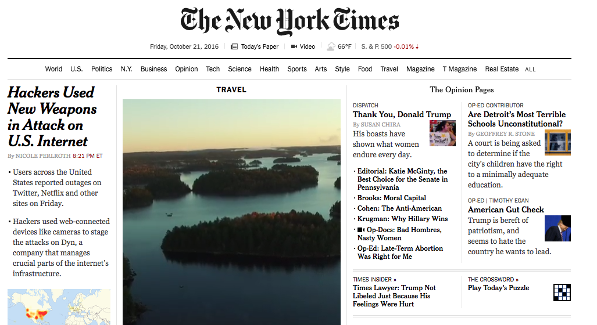
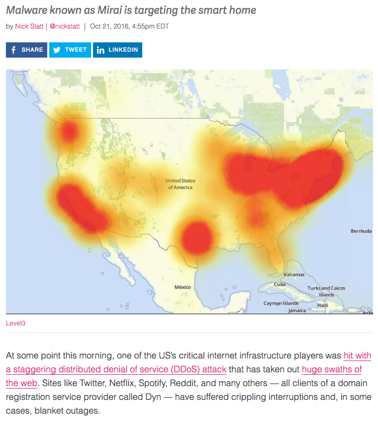
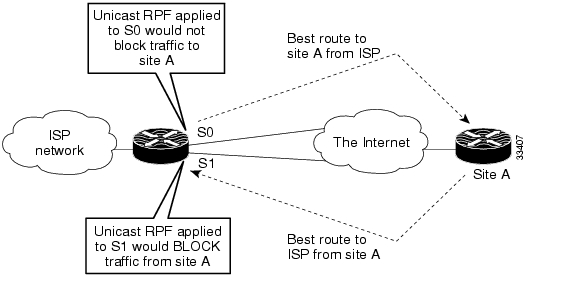
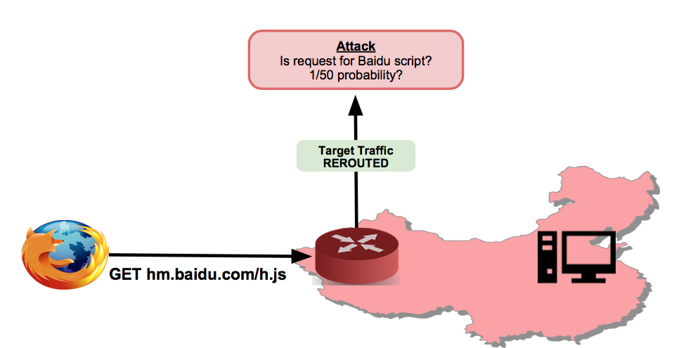

## From System Security to Internet Security {.center}

We shift from securing a single machine to securing the **network between
machines**. The first internet-scale threat: an attacker who doesn't break in —
they just make sure **nobody else can get in**.

::: {.notes}
Frame the transition. The previous weeks were about trusting code and the
host — trusting trust, cryptography, authentication. DoS is the first attack
this term where the adversary never compromises the target's confidentiality
or integrity at all; they go after *availability*, the A in the CIA triad.
Cold-call opener: which is worse for a bank on payday — a leaked file, or a
site that is down for four hours? Most students will jump to the leak; push
them on downstream harm (missed payroll, missed rent, cascading late fees)
and the fact that many regulators (FDIC guidance, GLBA safeguards) explicitly
treat sustained unavailability as a reportable incident. Preview the arc:
we will meet the three characteristics, then walk Mirai and Dyn (2016), then
end on the 31.4 Tbps 2025 attack that proves the playbook has not aged.
:::

## A Recent Hook: The Biggest Attack Ever Recorded {.smaller}

::: {.vignette}
In its **Q4 2025 DDoS report (published Feb 2026)**, Cloudflare disclosed
mitigating a **record 31.4 Tbps** attack in **November 2025** — the largest ever
made public. It lasted about **35 seconds** and was stopped autonomously. The
source was the **Aisuru / Kimwolf "TurboMirai" botnet** — a Mirai descendant of
**1–4 million compromised IoT devices** (most of them off-brand Android TV /
set-top boxes). On **March 19, 2026**, a U.S.-led international operation (DoJ,
BKA Germany, Canadian authorities) seized C2 domains and servers behind Aisuru,
Kimwolf, JackSkid, and Mossad — botnets covering **3M+ infected devices**.
:::

The playbook hasn't changed since **Mirai (2016)** — only the scale has: cheap,
insecure consumer devices, conscripted into a weapon.

::: {.notes}
This is the freshest concrete example that ties the whole lecture together.
Note the through-line: Mirai's source code leaked to Hack Forums in September
2016 under the handle "Anna-Senpai," and Aisuru/Kimwolf is a direct
"TurboMirai" descendant of that codebase. 31.4 Tbps versus the ~1.2 Tbps Dyn
attack — roughly thirty times the scale in a decade, because the underlying
economics (cheap, unpatched IoT plus unfiltered spoofing) have not changed.
The 35-second duration matters: modern attacks are short, sharp, and
automated, so defenses must be too. Callback that closes a nice loop:
Aisuru also took KrebsOnSecurity offline in May 2025 at 6.35 Tbps — Krebs
was Mirai's most famous 2016 target after he identified "Anna-Senpai."
March 19, 2026 takedown was DoJ (District of Alaska), German BKA, Canadian
partners, EUROPOL; 3M+ devices, hundreds of thousands in the US. Sources:
Cloudflare Q4 2025 DDoS Threat Report; DoJ press release; XLab / Lumen
research. Coda for the notes: FastNetMon reported scanning from new C2
infrastructure within weeks — the takedown cycle continues.
:::

## Denial of Service: What Is It?

An attempt to **exhaust a limited resource** so legitimate users can't get service.

- **Network** — bandwidth / link capacity (saturate a 1 Gbps link)
- **Transport** — TCP connection state (the connection table)
- **Application / server** — CPU, memory, processing (e.g., a TLS handshake)

Goal is **availability**, not theft. Often — but not always — **high-rate**.

::: {.notes}
The key word is *limited*. Every layer has a finite resource and DoS finds
the scarcest one — that framing traces to RFC 4732 (Internet Denial-of-
Service Considerations, 2006). Three resource classes: network bandwidth
(the 1 Gbps link), connection state (the TCB slot), and server compute (the
TLS handshake or expensive database query). Application-layer exhaustion —
a few expensive requests — can be far cheaper for the attacker than brute
bandwidth, and 2025's most damaging attacks were increasingly at that layer.
"Distributed" (DDoS) just means the attack comes from many sources at once;
it does not require a different taxonomy, only more sources. Keep the
resource lens; every attack later in the deck maps back to which resource
class it targets.
:::

## Targets of Attack

::: {.columns}
::: {.column width="50%"}
**Critical servers**

- Web servers (most common)
- File and update servers
- **Authentication** (e.g., taking down Duo/2FA locks everyone out)
- **DNS** — a force multiplier
:::
::: {.column width="50%"}
**Infrastructure**

- Routers within an organization
- Routers along the upstream path
- (Harder to reach, higher payoff)
:::
:::

**Why DNS?** Knock out the *directory* and you knock out everything behind it.

::: {.notes}
The strategic insight: you do not have to attack Netflix to take down Netflix
— you attack the infrastructure it depends on. DNS is the classic example
and sets up the Dyn case study on the next few slides. Authentication is
another high-value target and it is a live 2026 concern: the October 2023
Okta support-system breach is the reference for "the auth provider is now a
single point of failure." If Duo or Okta is down, nobody logs in even though
no individual application was touched. Update servers are the third pattern —
block the patch pipeline (Kaseya 2021 is the supply-chain variant) and the
victims stay vulnerable to whatever comes next. Cold-call: name the highest-
leverage dependency in your own daily workflow. Most students will land on
Google Auth, Cloudflare, or DNS — that is the attacker's shortlist too.
:::

## Three Common Characteristics {.smaller}

These three recur in almost every DoS attack — know them cold.

1. **Asymmetry** — attacker's cost ≪ victim's cost. One small packet forces the
   server to allocate state, do crypto, or emit a large response.
2. **Hard to distinguish legit from attack traffic** — requests look normal; you
   can't just block "the bad IP" when traffic comes from everywhere.
3. **Hard to attribute** — **IP source spoofing** is common; the attacker never
   needs the reply, so forged addresses cost nothing.

::: {.notes}
These are explicitly flagged as midterm material — drill them. The reference
is Mirkovic and Reiher's "Taxonomy of DDoS Attack and DDoS Defense Mechanisms"
(SIGCOMM CCR 2004). Asymmetry is the deepest idea and it is the lens for the
rest of the lecture — amplification, state exhaustion, TLS DoS are all
different asymmetry recipes. Indistinguishability and unattributability fall
out of botnets and reflection for free: many real (compromised) sources means
the traffic *is* genuinely distributed, so no spoofing is even required. BCP
38 (RFC 2827, 2000) is the twenty-five-year-old fix for spoofing that still
has not been fully deployed. Cold-call for any new attack in the news: which
of the three does it exploit, and how? If a student cannot answer that,
they do not understand the attack yet.
:::

## Asymmetry, Concretely

The attacker wants to spend **one unit of effort** and force the victim to spend
**many**.

- Single packet → server allocates a buffer / connection record
- Small "hello" → server generates keys or does an expensive decryption
- Small query → server emits a large response (**amplification**)
- Many compromised hosts each send a little → victim sees a **flood**

::: {.notes}
This is the unifying principle of the entire lecture. Every attack in the
deck — SYN floods, DNS amplification, TLS DoS, Mirai, Aisuru — is just a
different way to make the victim's cost dwarf the attacker's. Every defense
in the deck — SYN cookies, ingress filtering, scrubbing, anycast — is either
a way to restore symmetry or a way that inadvertently creates a *new*
asymmetric resource for the attacker to exhaust (the stateful firewall
slide is the punchline). When students propose defenses later in the deck,
the test is always the same: does this restore symmetry, or does it create
a new asymmetric resource? Hold onto that question all lecture.
:::

## Case Study: Mirai and the Dyn Attack {.smaller}

{width="70%"}

**October 2016:** the **Mirai** botnet — IoT devices (cameras, DVRs, home gadgets)
with default passwords — flooded **Dyn**, a major DNS provider. Twitter, Netflix,
Spotify, Reddit, and others went dark.

::: {.notes}
October 21, 2016, three attack waves. The strategic move: they did not attack
the websites, they attacked Dyn, the DNS provider those sites depended on.
Take out the directory, take out everyone in it. Peak traffic around 1.2 Tbps,
which felt enormous in 2016 and looks modest now. Mirai's source code was
released on Hack Forums in September 2016 by "Anna-Senpai" — Krebs on
Security's investigation identified Paras Jha and colleagues, who pled
guilty in 2017 — and that public release is exactly why descendants like
Aisuru/Kimwolf exist today. The full Antonakakis et al. measurement study
(USENIX Security 2017) is the reference. Cold-call: if you were designing
Dyn's redundancy in September 2016, would anycast alone have saved you?
Answer: not for an application-layer attack that exhausted DNS query
processing, not the pipe.
:::

## Why a "Small" Botnet Hurt So Much {.smaller}

::: {.columns}
::: {.column width="55%"}
- Estimated **~100,000** endpoints — *small* for a botnet
- It was an **application-level** attack: exhausting DNS query-processing capacity,
  not just raw bandwidth
- The **death spiral**: as resolution failed, legitimate clients **auto-retried**,
  generating **10–20×** normal traffic
- Attack and legitimate retries came from **millions of IPs** — impossible to
  cleanly separate
:::
::: {.column width="45%"}

:::
:::

::: {.notes}
This is the richest teaching moment in the lecture. Two lessons to land:
first, attacking infrastructure like DNS creates cascading, multi-service
failures because everything downstream depends on it; second, systems
designed for resilience — automatic retries — can *amplify* an attack rather
than absorb it. Dyn's own post-mortem quantified the retry storm at 10–20×
normal traffic, and the retries came from real users' browsers and apps, not
from the botnet. That is characteristic #2 (indistinguishability) in its
purest form: attack traffic and legitimate traffic became literally the same
packets. Cold-call: you are Dyn's on-call at 3am — you cannot blackhole the
Mirai IPs (millions, scattered across every consumer ISP), you cannot
blackhole the retries (they are your customers), so what do you do?
Answer: shed load, anycast wider, call your upstream scrubbers, wait it out.
:::

## Reflection and Amplification

The most asymmetric attack of all — and you don't even send the traffic yourself.

1. Attacker sends a **small query** to an open server (e.g., a DNS resolver)
2. Source IP is **spoofed** to the **victim's** address
3. Server sends a **large response** — to the **victim**, who never asked
4. Use **many** servers at once → distributed flood the victim can't trace

**Amplification factors of 60× to 3,000×** are achievable.

::: {.notes}
Draw it on the board before revealing the slide: attacker → resolver (small,
spoofed source) → victim (large response). Reflection means bouncing off a
third party so the victim sees the reflector, not you. Amplification means
the reflector does the heavy lifting — small in, large out. Amplification
factor table for the board: DNS ~28–54×, NTP ~556×, SSDP ~30×, memcached
~10,000–51,000× (US-CERT TA13-088A and TA14-017A). The February 2018 GitHub
attack hit 1.35 Tbps using memcached reflection alone. The agenda flags
"given a reflection diagram, explain how it works" as a likely midterm
question — every student should be able to reproduce this flow. Note this
attack stacks all three characteristics on one incident: asymmetric,
indistinguishable, unattributable.
:::

## Open Resolvers and Misaligned Incentives

- **Open resolver** = a DNS server that answers queries from *anyone*
- Public examples exist by design (Google **8.8.8.8**, Cloudflare **1.1.1.1**) —
  but historically *millions* of misconfigured servers were open too
- The reflector isn't the victim — so why would its operator bother to fix it?

**Misaligned incentives:** you secure *your* server to protect *someone else*.

::: {.notes}
This is a policy and economics point dressed up as a technical one, which is
exactly why it belongs in this course. The externality: an open resolver
harms third parties, not its owner, so there is little incentive to close
it. Google's 8.8.8.8 and Cloudflare's 1.1.1.1 are intentionally open public
services that are also carefully rate-limited and monitored — the problem is
the millions of misconfigured home routers, ISP resolvers, and small
enterprise DNS servers that were open by accident. The Open Resolver Project
scans historically found tens of millions. Prevention is trivial ("reject
queries from external addresses") but who pays for the audit and the
deployment? Same shape as BCP 38 later — this is the entry point for
Breakout A on IoT liability. Ask: technical fix, regulatory mandate, or
market incentive — which actually deploys?
:::

## TCP SYN Flooding {.smaller}

Classic **state-exhaustion** attack on the TCP **three-way handshake**.

::: {.columns}
::: {.column width="55%"}
- Client → **SYN**; server allocates a **TCB** (~280 bytes) and replies **SYN-ACK**
- Connection is **half-open** until the client's ACK or a timeout
- There's a **fixed bound** on half-open connections
- Attacker sends many SYNs with **spoofed, non-existent** sources → no final ACK →
  the table fills → legitimate clients are rejected
:::
::: {.column width="45%"}
**No client authentication happens before the server commits resources** — that's
the flaw.
:::
:::

::: {.notes}
We treat this lightly in lecture — it is on the agenda's "not covered in
detail" list — but it is the cleanest illustration of asymmetric state
allocation: one ~40-byte SYN costs the server a ~280-byte TCB record it
must hold until timeout (RFC 4987 is the reference). The design flaw is
that no client authentication happens before the server commits resources.
Historical example: MS Blaster (2003) SYN-flooded windowsupdate.com to
block Windows patches from reaching infected machines — a classic
combination of exploit worm plus DoS on the patch server. Keep this slide as
the bridge to the SYN cookies defense two slides later; the fix pattern is
"do not allocate state until the client proves it is real," which
generalizes far beyond TCP.
:::

## Application-Layer and Crypto DoS

Asymmetry again — at the **server's CPU**, not its bandwidth:

- **TLS handshake DoS:** RSA *decrypt* is ~10× costlier than *encrypt*. A single
  client can force a server to do far more work than it does — **one machine can
  overwhelm ten web servers**.
- **Expensive requests:** ask for a huge PDF or a costly database query — trivial
  for the client, heavy for the server.

::: {.notes}
The point: you do not need a botnet or gigabits if each request is cheap to
send and expensive to serve. The TLS asymmetry is stark — RSA decrypt is
about ten times more expensive than encrypt, so one attacker box can
overwhelm roughly ten servers with a plain renegotiation flood. The
THC-SSL-DoS tool (2011) demonstrated this publicly. Application-layer DDoS
is the hardest class to filter because individual requests look legitimate;
you cannot pattern-match "big PDF" or "expensive JOIN" out of your traffic
without breaking real users. Modern attacks — including Aisuru's December
2025 "Night Before Christmas" campaign at 200M+ HTTP requests per second —
increasingly target this layer rather than raw bandwidth. Cold-call: what
request on *your* web service would be a nightmare if a bot hit it a
million times an hour?
:::

# Defenses {.center}

The recurring test for every defense: **have I introduced a new resource to
exhaust?**

::: {.notes}
Pause and reset. We spent the first half of the lecture on the attack side —
resource exhaustion, three characteristics, Mirai/Dyn, reflection, TLS DoS.
The second half is defenses, and the question the students should hold in
their head for every one is the same: does this defense restore symmetry,
or does it create a new asymmetric resource for the attacker to exhaust?
Preview the four defenses we will walk: ingress filtering (root cause,
externality problem), SYN cookies (stateless, generalizes), stateful
firewalls (the punchline — defense becomes target), and uRPF (router-level
cousin of ingress filtering, breaks on asymmetric routing). Then
operational defenses and the Great Cannon as a twist.
:::

## Defense: Ingress Filtering (BCP 38 / RFC 2827)

Routers **drop packets whose source address can't legitimately come from that
direction** — kills spoofing at the source network.

- Easy at the **edge** (you know your own address block)
- Hard near the **core** (routing is complex, asymmetric)
- **Incentive problem again:** filtering protects *others*, not you, so deployment
  has lagged for 25+ years

::: {.notes}
If everyone deployed BCP 38 (Ferguson and Senie, RFC 2827, 2000), spoofing-
based reflection would largely die. They do not — same externality as open
resolvers, because filtering at your edge protects everyone else, not you.
CAIDA's Spoofer project publishes ongoing measurements; MANRS (Mutually
Agreed Norms for Routing Security) tracks source-address validation
adoption among ISPs and IXPs. Note the date: RFC 2827 is from 2000 and we
*still* do not have universal deployment twenty-five years later. This is
the direct entry point to the DoS / Botnets breakout on IoT liability —
should the fix be a technical mandate, a regulatory rule (perhaps under
Section 5 of the FTC Act), or a market-driven push from downstream
scrubbers? Cold-call: whose incentive would you change first?
:::

## Defense: SYN Cookies

Don't allocate state until the client proves it can receive your reply.

- Server encodes the connection state into the **SYN-ACK sequence number** as a
  cryptographic **cookie** = `HMAC(time, nonce, src/dst IP & port)`
- Server stores **nothing** until the client returns a valid ACK
- Honest client echoes the cookie back → server validates → *then* allocates a
  buffer

**Restores symmetry:** the responder is stateless until the initiator sends a
second, verified message.

::: {.notes}
This is the canonical "make the initiator do real work first" defense, and
it generalizes far beyond TCP — it is the same shape as cryptographic
proof-of-work puzzles and proof-of-reachability challenges. Origin: D. J.
Bernstein's SYN cookies page. Mechanics: the cookie is HMAC(time, nonce,
src IP + port + dst IP + port), encoded into the SYN-ACK's 32-bit sequence
number. Server stores *nothing* until the client returns a valid ACK
containing that cookie. Cookie is easy to create and validate but hard to
forge. Tradeoff: a handful of TCP options cannot be negotiated at handshake
time, but the server survives the flood. The critical point for the design
principle running through the whole lecture: this defense adds *no* new
exhaustible state — the server is stateless until the initiator has proven
reachability. Contrast that with the stateful firewall two slides ahead.
:::

## When Defenses Backfire: Stateful Firewalls {.smaller}

A natural reflection defense: a **stateful firewall** that tracks outgoing DNS
queries and **drops responses that don't match**.

- **The new attack:** the firewall must now *remember* every query — that's a
  **limited resource**
- Send spoofed queries *through* it → it stores state for each → **memory exhausts
  → firewall crashes**

> Any defense that requires **state** creates a **new** thing to exhaust.

::: {.notes}
This is the lecture's punchline and a likely midterm cold-call: how would you
attack the stateful firewall — what packets would you send? Answer: spoofed
DNS-response-shaped packets, one after another, so the firewall must store
state for each expected match until it runs out of memory and crashes.
Meta-lesson: security features can introduce new vulnerabilities. The
mitigation here loops back to ingress filtering — do not let spoofed packets
reach the firewall in the first place — but that is a whole-Internet fix
you cannot deploy alone. This slide is the recurring test the students
should carry into every lecture from here on: *have I introduced a new
resource to exhaust?* Any per-connection, per-session, or per-request state
is a candidate answer.
:::

## Defense: uRPF and Its Limits

**Unicast Reverse Path Forwarding:** accept a packet on an interface only if the
route *back* to its source uses that same interface — anti-spoofing in the router.

::: {.columns}
::: {.column width="55%"}
- Cisco: `ip verify unicast reverse-path`
- Works when routing is **symmetric**
- **Breaks with asymmetric routing** — legitimate traffic arrives on a different
  interface than the return path, and gets dropped
:::
::: {.column width="45%"}

:::
:::

::: {.notes}
uRPF is the router-level cousin of ingress filtering. Cisco syntax
`ip verify unicast reverse-path` — the router accepts a packet on an
interface only if the return route to its source would use that same
interface. It works when routing is symmetric. The catch: the modern
Internet is full of asymmetric routes (traffic out one BGP path, back
another) — a legitimate customer packet may arrive at the wrong interface
for entirely benign reasons and get dropped. Looser uRPF modes exist that
accept any interface with *some* valid return path, but they are weaker
defenses. Real defense is layered — no single mechanism is sufficient, and
that layering is why scrubbing services now dominate commercial defense.
Bridge to the next slide: what BCP 38 and uRPF fail to deploy universally,
scrubbing centralizes into a handful of providers.
:::

## Operational Defenses: The Mirai/Dyn Playbook

- **Traffic shaping** — rate-limit and prioritize
- **Rebalancing** across **load-balanced / anycast** services (root DNS survives
  attacks this way — many sites, one address)
- **Third-party scrubbing** services (Cloudflare, Akamai, etc.) absorb and clean
  traffic upstream

Modern scrubbing is **autonomous** — the 31.4 Tbps attack (Nov 2025) was
mitigated in seconds; Cloudflare reports averaging **~5,376 mitigations per
hour** across 2025.

::: {.notes}
This connects the historical defense list to the present-day vignette.
Anycast is why the DNS root survived the February 2007 botnet attack —
thirteen root "servers" but hundreds of physical machines sharing the same
IP addresses across the world; ICANN's post-mortem is the canonical
account. Third-party scrubbing (Cloudflare, Akamai, Google Shield, AWS
Shield) has become the dominant commercial defense; the Aisuru 31.4 Tbps
mitigation happened autonomously in seconds. Cloudflare's Q4 2025 report:
about 5,376 mitigations per hour across the year. Note the centralization
and policy implication: a handful of companies now sit in front of much of
the web's traffic — which is what the November 18, 2025 Cloudflare outage
reminded everyone about. This is the setup for the breakout on scrubbing
as common-carrier infrastructure. Cold-call: is centralized DDoS defense
a public good, a monopoly, or both?
:::

## Weaponizing the Network: China's Great Cannon {.smaller}

Not exhaustion of the target — **redirection of bystanders' browsers** into a DoS
weapon.

::: {.columns}
::: {.column width="55%"}
- **March 2015:** GreatFire.org (Mar 16) and GitHub pages hosting its
  anti-censorship mirrors (Mar 26) were flooded
- An **on-path** system (co-located with the Great Firewall) intercepted requests
  to **Baidu** analytics scripts and **injected JavaScript**
- Innocent users worldwide unknowingly hammered the target
:::
::: {.column width="45%"}

:::
:::

::: {.notes}
We touch this only briefly, but it is a powerful example of a *new* DoS
class: the attacker controls the network path and turns ordinary web users
into an unwitting attack fleet. Corrected date: March 2015, not 2016 —
GreatFire.org was hit March 16, GitHub March 26, injection stopped
around April 7. Primary sources: Citizen Lab's "China's Great Cannon" (Apr
10, 2015) and Marczak, Weaver, et al. at USENIX FOCI '15. Distinguish
clearly from the Great Firewall, which only *blocks* — the Cannon *injects*
JavaScript into unencrypted responses returning from within China. Most-
injected domain was pos.baidu.com, so the bystander pool was every user in
the world who loaded Baidu analytics — traffic came from Taiwan, Hong Kong,
the US, Malaysia, which is what made attribution and filtering brutally
hard. Great bridge to the Backdoors debate scheduled this day: state actors
already weaponize the network path — what does adding backdoors to
*endpoints* add to or subtract from that capability?
:::

## Takeaways {.smaller}

- DoS targets **availability** by exhausting a **limited resource** — at the
  network, transport, or application layer
- Three signatures: **asymmetry**, **indistinguishable** traffic, **spoofed /
  unattributable** sources
- **Reflection + amplification** and **botnets** maximize asymmetry; **infrastructure**
  (DNS) is the highest-value target
- Defenses must **restore symmetry without creating new state to exhaust**
- Many fixes (ingress filtering, closing open resolvers) fail on **incentives**,
  not technology
- The threat scales with **insecure consumer IoT** — Mirai (2016, ~1 Tbps) →
  Aisuru/Kimwolf (Nov 2025, 31.4 Tbps)

::: {.notes}
Close by reconnecting to the opening vignette: same playbook, thirty times
the scale, because the underlying problem — millions of insecure consumer
IoT devices plus unfiltered spoofing — is unsolved. Tee up the policy
debate: should device makers be liable for shipping default credentials?
Should ISPs be required to deploy BCP 38, and if so, under what statutory
authority? Should Cloudflare or Akamai be treated as common carriers when
half the web hides behind them? This is the direct bridge to the DoS /
Botnets breakout (regulate the IoT externality, or Cloudflare-as-common-
carrier) and to the Backdoors debate this same week — same underlying
tension, different framings. If students remember only two things: the
three characteristics, and "every stateful defense is a potential DoS
target," they can reason about any attack they have not yet seen.
:::
