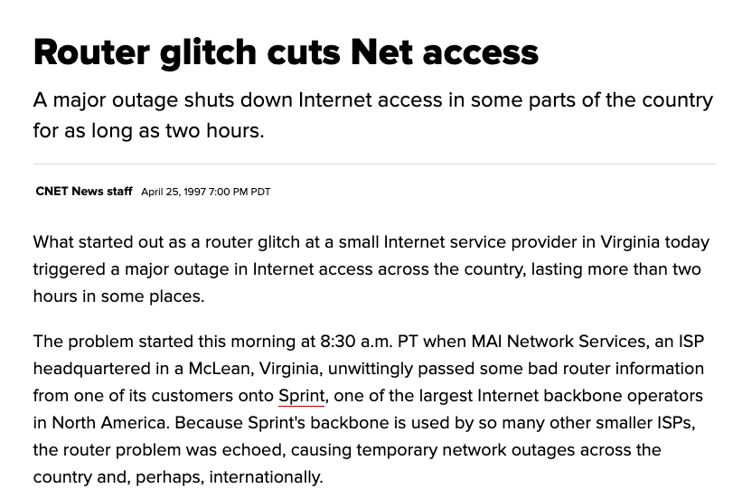
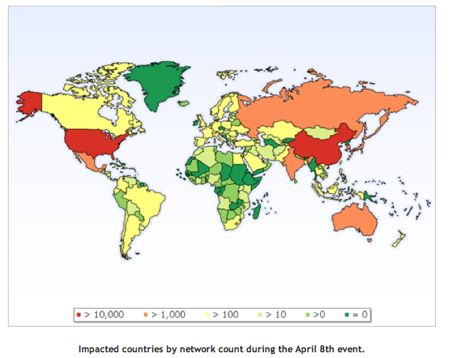
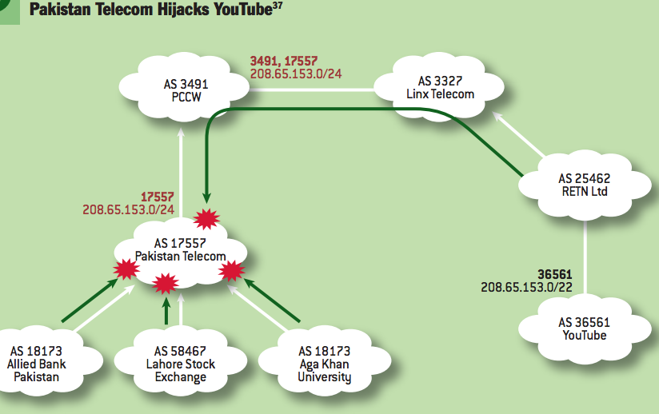

## Three Pieces of Internet Infrastructure {.center}

Almost every attack we study rides on one of three shared systems:

- **Routing** — how traffic gets from A to B (**BGP**) ← today
- **Naming** — how names map to addresses (**DNS**)
- **The web** — what runs on top

If you can lie to the routing system, you can intercept, drop, or impersonate
*anyone* — before any crypto or login ever happens.

::: {.notes}
Frame routing as the foundation. The recurring theme this week: these systems
were designed for a small, trusting Internet and bolted on security later.
Today is BGP; DNS is next meeting.
:::

## What BGP Actually Does

- The Internet is an **inter-network** — a network of networks
- An **Autonomous System (AS)** is an independently operated network:
  UChicago, Google, Comcast, Netflix each have an **AS number**
- **BGP** (Border Gateway Protocol) is how ASes tell each other *which
  destinations they can reach*

**Analogy:** BGP is like asking for directions in chunks. You don't get
turn-by-turn from Chicago to Toronto — each network only knows how to reach
its own boundary, then hands you off to the next.

::: {.notes}
Keep this intuitive — agenda says NOT to go deep on protocol mechanics.
Destination-based, hop-by-hop. Each AS advertises prefixes (blocks of IP
addresses) it can reach, plus the AS path to get there. Cold-call: what's
UChicago's "network of networks" upstream?
:::

## BGP Has Essentially No Security

> A router will believe **any** route advertised by a neighbor.

The protocol was designed for a small, mutually trusting Internet. There is
no built-in check that a network is *allowed* to announce what it announces.

Two ways this goes wrong:

- **Route leak** *(accidental)* — a misconfiguration spreads bad routing info
- **Route hijack** *(intentional)* — a network deliberately announces routes
  it has no right to

::: {.notes}
This is THE fundamental problem. "Transitive trust": a provider can and should
filter what it accepts from a customer, but historically didn't. Everything
that follows is an attempt to add the missing authentication.
:::

## Case Study: The 1997 Route Leak

{width="70%"}

A small Virginia ISP (MAI Network Services) misconfigured a router and
**accidentally announced routes to the entire Internet**. Sprint propagated
the leak; traffic poured toward an ISP that couldn't carry it. Outage > 2 hrs.

::: {.notes}
Classic accidental leak — no malice, just a fat-fingered config and no
filtering upstream. The "AS 7007 incident." The point: even accidents are
catastrophic because everyone trusts everyone.
:::

## Case Study: China's "Accidental" Hijack (2010)

::: {.columns}
::: {.column width="55%"}
On **April 8, 2010**, China Telecom announced ~**50,000 prefixes** belonging
to **170 countries** (including ~60,000 US blocks) for about **18 minutes**.

Traffic between US providers (AT&T, Verizon) briefly flowed *through China*.

- Why did most people not notice?
- How could *more* traffic have been intercepted?
:::
::: {.column width="45%"}

:::
:::

::: {.notes}
Renesys "China's 18-minute mystery." Probably a leak, not a deliberate attack
— but it demonstrates the capability. Performance was poor, so it was noticed;
a subtler, shorter-prefix attack on a few targets could be near-invisible.
Bridge to the mechanism on the next slides.
:::

## How a Hijack Wins: The AS Path

{width="62%"}

BGP picks among competing routes largely by **shortest AS path** (fewest
networks). Advertise the *same prefix* with a *shorter* path and you win
traffic.

::: {.notes}
Walk the diagram: AS 4134 (China Telecom) originates 66.174.161.0/24, which
Verizon Wireless's AS 22394 legitimately owns. AT&T picks the bogus route
because it looks shorter; Level 3 keeps the real one — so traffic *splits*.
Agenda's analogy: choosing a road trip by number of states crossed, not miles
— illogical, but that's what BGP does. This shortest-path greed is exactly
what the attacker exploits.
:::

## Case Study: Pakistan vs. YouTube (2008)

{width="58%"}

**Feb 24, 2008:** ordered to censor YouTube *domestically*, Pakistan Telecom
announced a **more-specific /24** of YouTube's /22. **Longest-prefix match**
means the /24 always wins — and the announcement leaked worldwide. YouTube
went dark globally for ~2 hours.

::: {.notes}
Two new ideas here: (1) censorship intent escaped its borders — a domestic
policy action became a global outage; (2) more-specific prefixes beat
shorter ones regardless of AS path (longest-prefix match). Connects routing
to the censorship lecture later in the term.
:::

## What Attackers Can Do With a Hijack

- **Redirection** for **phishing** — capture traffic to a bank or login page
- **Blackholing** — silently drop a victim's traffic (censorship, DoS)
- **Spam** — announce someone else's space, send, withdraw
- **Interception / MITM** — pass traffic *through* you, then on to the real
  destination, nearly invisibly

::: {.vignette}
**July 2025:** APNIC and LACNIC documented a hijack where the attacker didn't
*break* RPKI at all — they **social-engineered an upstream provider** into
provisioning BGP for them without verifying corporate identity or domain
ownership. The bogus routes spread widely because **Route Origin Validation
is still inconsistently deployed** and overly broad ROA `maxLength` values let
more-specific hijacks look valid.
:::

::: {.notes}
The 2025 case is the freshest hook and a great teaching moment: crypto is only
as strong as the human process around it. Tie phishing back to "even SSL
should protect, but..." — a MITM can also intercept the cert-issuance or
ACME validation traffic. Sources in coverage-notes.
:::

## Two Problems We Must Solve {.center}

To trust a route, a receiver needs to verify two things:

1. **Origin authentication** — is the AS announcing this prefix *actually
   allowed* to?
2. **Path authentication** — is the **AS path** real and unmodified?

These map onto the China/Pakistan attacks: a bogus *origin*, and a falsified
*path*.

::: {.notes}
Set up the rest of the lecture. Origin auth is the "base case"; path auth is
the harder inductive step. Foreshadow: one is deployed, one isn't — and the
reason is incentives, not cryptography.
:::

## Origin Authentication With RPKI

**Resource Public Key Infrastructure (RPKI)** — the same PKI idea as web
certificates, applied to *address ownership*.

- A **Route Origin Authorization (ROA)** binds a **prefix** to an
  **AS number**, e.g. `66.174.161.0/24 → AS 22394`
- ROAs are signed by **Internet registries** (ARIN, RIPE, APNIC, …) — the
  organizations that actually allocate address space
- A router doing **Route Origin Validation (ROV)** marks each announcement
  **Valid**, **Invalid**, or **NotFound**, and can drop Invalids

::: {.notes}
Reuse the PKI mental model from earlier lectures: CA → registry; cert →
ROA; identity → address ownership. Verifying origin is like verifying "Toronto
is in Ontario, not Kentucky." Emphasize the registry is the natural root of
trust because it hands out the addresses in the first place.
:::

## Why Origin Authentication Got Deployed

- **Incentives align:** an ROA protects *your own* prefixes from being
  hijacked — you benefit directly
- It's a **local** decision: you can publish ROAs and turn on ROV without
  waiting for everyone else

As of **2025, ~54% of routes** in the global table are covered by ROAs, and
roughly **three-quarters of Internet traffic** heads to ROA-covered
destinations (NIST / Kentik). It still took **over a decade**.

::: {.notes}
Contrast with path auth on the next slides. The deployment lesson: security
spreads when the deployer is also the beneficiary. Even so, "incremental and
slow" — and ROV enforcement lags ROA publication, which is why the 2025 hijack
still propagated.
:::

## But RPKI Only Checks the Origin {.smaller}

RPKI says *"AS 22394 may originate this prefix."* It says **nothing** about
whether the **rest of the AS path is true**.

So an attacker can simply **claim the real origin is right behind them**:

```
Legitimate:  AS100 → AS6167 → AS22394   (origin AS22394 ✓)
Forged:      AS100 →           AS22394   (origin AS22394 ✓ — still "Valid"!)
```

The forged path passes origin validation *and* looks shorter, so it wins.
This is a **path-shortening attack**.

::: {.notes}
Key midterm-style insight: a Valid ROA does not mean a valid path. AS100 keeps
the genuine origin (so RPKI is happy) but lies about being directly adjacent
to it, deleting AS6167. Shorter path → attracts more traffic → better MITM.
:::

## Path Authentication: Sign the Path

Idea (S-BGP / BGPsec): each AS adds a **signed attestation** as it forwards a
route. Critically, each signature covers **the path so far *and* the AS it is
sending to**.

- AS6167 signs: *"path 6167 22394, and I'm handing this to AS100"*
- AS100 can no longer pretend AS6167 wasn't there — it can't forge AS6167's
  signature, and the signature names AS100 as the next hop

This is exactly the same trick that makes a chain of certificates trustworthy.

::: {.notes}
This is the crux the agenda flags for the midterm: *what must be signed* to
stop the attack. Signing only the prefix+origin isn't enough; signing the
recipient AS is what prevents shortening and false edges. Have students reason
about it like an induction step.
:::

## What Path Authentication Still Can't Do

Even fully signed paths leave gaps:

- **No data-plane guarantee** — signatures secure the *control plane*; packets
  can still be forwarded somewhere else, or deflected by misconfiguration
- **Message suppression** — an AS can just *fail to forward* a withdrawal
- **Replay** — re-advertise a path that was legitimately withdrawn
- **Collusion** — two cooperating ASes can fabricate an edge between them

::: {.notes}
Important honesty: securing routing is not solving routing. Control plane vs.
data plane is a clean distinction worth stating explicitly. These residual
attacks are why "BGPsec is deployed" would still not be "routing is safe."
:::

## So Why Isn't Path Authentication Deployed?

After ~30 years, origin auth is rolling out — **path authentication is
essentially not deployed**. The blocker is **incentives**, not cryptography:

- It only works if **(almost) every AS participates** — partial deployment
  gives little protection
- It means **upgrading routers** and signing/verifying at scale — real cost
- You pay to protect **other networks**, not primarily yourself

::: {.notes}
Name it: a coordination problem / tragedy of the commons / prisoner's dilemma.
The asymmetry with origin auth (self-protecting, locally deployable) is the
whole story. Assigned reading: "Why is it taking so long to secure Internet
routing?" Good debate seed: should this be regulated into existence?
:::

## A Policy Lever: The FCC Steps In {.smaller}

If incentives won't deploy it voluntarily, maybe regulation will.

In **June 2024** the FCC opened a proceeding (NPRM) requiring **retail
broadband providers** to maintain **BGP security risk-management plans**:

- The **nine largest** providers file confidential plans plus periodic reports
- A provider can be **excused** if it attests to ROAs covering **≥ 90%** of
  the routes it originates

This is the **technical → policy translation** this course is about: a
coordination failure met with a reporting mandate.

::: {.notes}
Connects routing to the regulatory thread of the course. Note it targets the
*deployable* part (ROAs / origin validation), not the hard path-auth problem —
regulators went where the technology actually works. Good cold-call: is a
reporting requirement the right tool, or too weak / too strong?
:::

## Bonus Defenses You'll See in the Wild {.smaller}

Cheap, partial measures that predate RPKI and are still everywhere:

::: {.columns}
::: {.column width="50%"}
**Session authentication**

- **TCP-MD5 / TCP-AO** — authenticate the BGP session so a stranger can't
  inject messages
:::
::: {.column width="50%"}
**The TTL "GTSM" hack**

- Most eBGP peers are **one hop** away
- Send packets with **TTL 255**, reject anything arriving with **TTL < 254**
- Remote attackers can't forge a high enough TTL
:::
:::

These protect the *session*, not *what* is announced — necessary, not
sufficient.

::: {.notes}
Quick coverage so students recognize these terms. GTSM is a clever, deployable
hack worth one minute. Emphasize again: protecting the pipe is not the same as
validating the contents.
:::

## What to Take Away {.center}

- BGP trusts whatever neighbors say → **leaks** and **hijacks**
- **Origin auth (RPKI)** answers *"can this AS announce this prefix?"* —
  deployable, self-protecting, ~half-deployed
- **Path auth (BGPsec)** answers *"is the path real?"* — harder, and stuck on
  **incentives**, not crypto
- Even perfect control-plane security doesn't secure the **data plane**

::: {.notes}
Recap aligned to the likely midterm questions: origin vs. path auth, what
signatures guarantee, why path auth is the hard inductive step, and the
incentive story. Next meeting: DNS, which reuses this same PKI hierarchy idea
(DNSSEC).
:::
