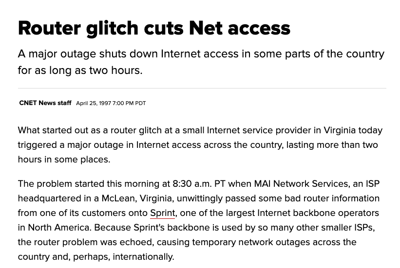
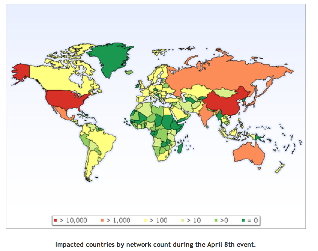
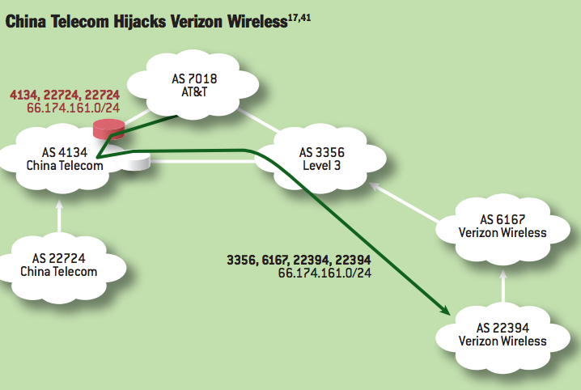
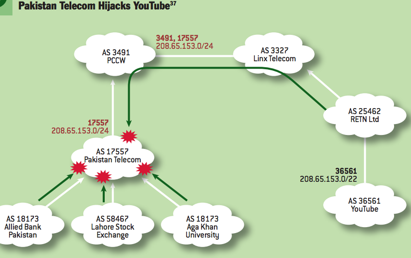

## Three Pieces of Internet Infrastructure {.center}

Almost every attack we study rides on one of three shared systems:

- **Routing** — how traffic gets from A to B (**BGP**) ← today
- **Naming** — how names map to addresses (**DNS**)
- **The web** — what runs on top

If you can lie to the routing system, you can intercept, drop, or impersonate
*anyone* — before any crypto or login ever happens.

::: {.notes}
Frame routing as the *first* shared system attackers subvert — if you lie to
the routing layer, every crypto and login check downstream operates on the
wrong endpoint. The recurring theme this week: these systems were designed for
a small, trusting Internet and had security bolted on later. Today is BGP; DNS
is next meeting and reuses the same PKI hierarchy idea. Cold-call: name one
service you used today whose safety depended on the packet actually reaching
where you thought it was going. Foreshadow the arc — leaks, then hijacks, then
partial fixes that stalled on incentives, not cryptography.
:::

## What BGP Actually Does

- The Internet is an **inter-network** — a network of networks
- An **Autonomous System (AS)** is an independently operated network:
  UChicago, Google, Comcast, Netflix each have an **AS number**
- **BGP** (Border Gateway Protocol) is how ASes tell each other *which
  destinations they can reach*

**Analogy:** BGP is like asking for directions in chunks. You don't get
turn-by-turn from Chicago to Toronto — each network only knows how to reach
its own boundary, then hands you off to the next.

::: {.notes}
Keep this intuitive — the agenda explicitly says NOT to go deep on protocol
mechanics. Destination-based, hop-by-hop. Each AS advertises prefixes (blocks
of IP addresses) it can reach, plus the AS path to get there. Analogy: asking
for directions in chunks — each AS knows only how to reach its own boundary,
then hands you off. Cold-call: what is UChicago's upstream ASN? Answer to
have ready: AS 6535 (UCHICAGO-AS), verifiable on the Hurricane Electric BGP
looking glass. Reference: BGP is specified in RFC 4271; AS numbers are IANA-
assigned. This grounds the abstraction before we break it.
:::

## BGP Has Essentially No Security

> A router will believe **any** route advertised by a neighbor.

The protocol was designed for a small, mutually trusting Internet. There is
no built-in check that a network is *allowed* to announce what it announces.

Two ways this goes wrong:

- **Route leak** *(accidental)* — a misconfiguration spreads bad routing info
- **Route hijack** *(intentional)* — a network deliberately announces routes
  it has no right to

::: {.notes}
Name the fundamental issue: transitive trust — a router will believe any route
advertised by a neighbor, and providers historically didn't filter what they
accepted from customers. Distinguish the two failure modes explicitly. Route
leak is accidental — misconfiguration; route hijack is intentional. Both
propagate because everyone trusts everyone. Everything that follows this slide
is an attempt to add the missing authentication. Foreshadow: we will see one
of each in a moment — a leak (AS 7007, 1997) and a hijack (Pakistan/YouTube,
2008) — before layering on the fixes.
:::

## Case Study: The 1997 Route Leak

{width="70%"}

A small Virginia ISP (MAI Network Services) misconfigured a router and
**accidentally announced routes to the entire Internet**. Sprint propagated
the leak; traffic poured toward an ISP that couldn't carry it. Outage > 2 hrs.

::: {.notes}
This is the canonical "AS 7007 incident" of April 25, 1997. MAI Network
Services, a small Virginia ISP, misconfigured a router and re-announced the
entire global routing table with itself as origin; Sprint accepted the
announcement and passed it on. No malice, just a fat-fingered config and no
filtering upstream. Bill Manning's NANOG retrospective is the historical
anchor. The teaching point: even accidents are catastrophic because everyone
trusts everyone — you don't need an attacker to break the Internet, you just
need one operator's typo and one upstream that doesn't filter. Ask: what would
have stopped Sprint from accepting that announcement?
:::

## Case Study: China's "Accidental" Hijack (2010)

::: {.columns}
::: {.column width="55%"}
On **April 8, 2010**, China Telecom announced ~**50,000 prefixes** belonging
to **170 countries** (including ~60,000 US blocks) for about **18 minutes**.

Traffic between US providers (AT&T, Verizon) briefly flowed *through China*.

- Why did most people not notice?
- How could *more* traffic have been intercepted?
:::
::: {.column width="45%"}

:::
:::

::: {.notes}
The event Renesys wrote up as "China's 18-Minute Mystery" in November 2010:
China Telecom (AS 23724) re-originated roughly 50,000 prefixes for about 18
minutes. Probably a leak, not a deliberate attack — but the incident is
important because it *demonstrates the capability*, and the 2010 US-China
Economic and Security Review Commission report (pp. 243-246) treated it as a
policy concern. FCC Chair Jessica Rosenworcel later cited this at the 2024
NPRM vote as one of "at least six occasions" of Chinese misrouting. Ask the
two questions on the slide: why did most people not notice? Performance just
degraded. How could the attacker have hidden? Fewer, more-specific prefixes;
shorter window. Bridge to the mechanism on the next slide.
:::

## How a Hijack Wins: The AS Path

{width="62%"}

BGP picks among competing routes largely by **shortest AS path** (fewest
networks). Advertise the *same prefix* with a *shorter* path and you win
traffic.

::: {.notes}
Walk the diagram slowly: AS 4134 (China Telecom) originates 66.174.161.0/24,
which Verizon Wireless's AS 22394 legitimately owns. AT&T picks the bogus
route because the AS path looks shorter; Level 3 keeps the real one, so
traffic *splits* between honest and hijacked paths. The analogy to sell it:
choosing a road trip by the number of states crossed rather than the miles
driven — illogical, but that's what BGP's best-path algorithm does. Reference
for the tiebreaker order is Cisco's BGP best-path selection algorithm doc.
This shortest-path greed is exactly what the attacker exploits, and it is the
mechanism the Pakistan/YouTube case on the next slide weaponizes with a
different trick — longest-prefix match.
:::

## Case Study: Pakistan vs. YouTube (2008)

{width="58%"}

**Feb 24, 2008:** ordered to censor YouTube *domestically*, Pakistan Telecom
announced a **more-specific /24** of YouTube's /22. **Longest-prefix match**
means the /24 always wins — and the announcement leaked worldwide. YouTube
went dark globally for ~2 hours.

::: {.notes}
On February 24, 2008, Pakistan Telecom (AS 17557) was ordered by its
government to block YouTube domestically, so it announced a more-specific /24
of YouTube's /22 into its internal routing. The announcement leaked upstream
via PCCW, and because longest-prefix match always beats shorter matches, the
/24 won globally — YouTube dark for about two hours. RIPE published the
post-mortem in 2008; it is the classic teaching case. Two ideas to draw out:
(1) a domestic censorship action escaped its borders and became a global
outage — regulation by BGP mistake; (2) more-specific prefixes beat shorter
ones regardless of AS path. This is the bridge to the censorship lecture
later in the term and to the FCC policy discussion at the end of today.
:::

## What Attackers Can Do With a Hijack

- **Redirection** for **phishing** — capture traffic to a bank or login page
- **Blackholing** — silently drop a victim's traffic (censorship, DoS)
- **Spam** — announce someone else's space, send, withdraw
- **Interception / MITM** — pass traffic *through* you, then on to the real
  destination, nearly invisibly

::: {.vignette}
**July 9–12, 2025:** APNIC and LACNIC documented three short hijacks (presented
at APRICOT 2026 / APNIC 61) where the attacker didn't *break* RPKI at all —
they **social-engineered a multinational upstream provider** with forged
identity documents and a lookalike domain, and got a BGP session turned up for
an unauthorized ASN. LACNIC address space was then re-originated from Asia;
first detected because email to a user silently vanished. The bogus routes
spread widely because **Route Origin Validation is still inconsistently
deployed** and broad ROA `maxLength` values let more-specific hijacks look
valid.
:::

::: {.notes}
The July 9-12, 2025 APNIC/LACNIC hijack is the freshest hook and a great
teaching moment. Presented at APRICOT 2026 / APNIC 61 by Carlos Martinez-
Cagnazzo (LACNIC CTO) and Sanjaya (APNIC): three short attacks where the
attacker used forged corporate identity documents and a lookalike domain to
convince a multinational upstream provider to enable a BGP session for an
unauthorized ASN, then injected short announcements of LACNIC address space.
First detection: a user's email silently vanished. Resolved by coordinated
confirmation from APNIC, LACNIC, APJII/IDNIC, and the real ASN holder. The
teaching moment: crypto is only as strong as the human process around it.
ASPA (RFC 9774) would have caught the forged upstream relationship. Tie
phishing back to "even SSL should protect, but..." — a MITM can also intercept
cert issuance or ACME validation traffic, so downstream defenses don't rescue
you from a compromised route.
:::

## Two Problems We Must Solve {.center}

To trust a route, a receiver needs to verify two things:

1. **Origin authentication** — is the AS announcing this prefix *actually
   allowed* to?
2. **Path authentication** — is the **AS path** real and unmodified?

These map onto the China/Pakistan attacks: a bogus *origin*, and a falsified
*path*.

::: {.notes}
Set up the rest of the lecture. The two-part question a receiver must answer:
origin auth (was this AS allowed to originate?) and path auth (is the AS path
real and unmodified?). Map back to the case studies: 2010 China Telecom was a
bogus origin; a path-shortening attack is a falsified path. Origin auth is
the "base case," path auth is the harder inductive step — same shape as
certificate chains, which students have already seen in the PKI lecture.
Foreshadow: only one is deployed, and the reason is incentives, not crypto.
This is where the technology-versus-policy tension we return to at the end of
the lecture actually lives.
:::

## Origin Authentication With RPKI

**Resource Public Key Infrastructure (RPKI)** — the same PKI idea as web
certificates, applied to *address ownership*.

- A **Route Origin Authorization (ROA)** binds a **prefix** to an
  **AS number**, e.g. `66.174.161.0/24 → AS 22394`
- ROAs are signed by **Internet registries** (ARIN, RIPE, APNIC, …) — the
  organizations that actually allocate address space
- A router doing **Route Origin Validation (ROV)** marks each announcement
  **Valid**, **Invalid**, or **NotFound**, and can drop Invalids

::: {.notes}
Reuse the PKI mental model from the earlier lecture: CA becomes the registry,
cert becomes the ROA, identity becomes address ownership. RPKI architecture
is RFC 6480; ROA format is RFC 6482; ROV states (Valid, Invalid, NotFound)
are RFC 6483. Verifying origin is like verifying "Toronto is in Ontario, not
Kentucky." Emphasize the registry is the natural root of trust because it
hands out the addresses in the first place — ARIN, RIPE, APNIC, LACNIC,
AFRINIC each anchor their own tree. Ask: who is the analogue of the browser's
built-in root store in this system? Answer: your router's set of RIR trust
anchors.
:::

## Why Origin Authentication Got Deployed

- **Incentives align:** an ROA protects *your own* prefixes from being
  hijacked — you benefit directly
- It's a **local** decision: you can publish ROAs and turn on ROV without
  waiting for everyone else

As of **mid-2026, ~60% of IPv4 routes** in the global table are covered by
ROAs (Qrator Q1 2026; NIST RPKI Monitor), and roughly **~70% of Internet
traffic** heads to ROA-covered destinations (Kentik). It still took **over a
decade** — and **only ~12% of ASes are "fully protected"** by ROV filtering
(RoVista / NANOG 90).

::: {.notes}
The incentive story is the whole point of this slide. RPKI got deployed
because it is self-protecting and locally deployable — the opposite of the
path-auth case on the next slides. Numbers to have ready: NIST RPKI Monitor
shows ~60% of IPv4 routes covered by ROAs (up from the ~50% milestone in May
2024 per Kentik); roughly 70% of Internet traffic heads to ROA-covered
prefixes; but only ~12.3% of ASes are "fully protected" by ROV filtering
(RoVista / NANOG 90). Coverage is not enforcement. Recent Tier-1 flips to
enforce include Bell Canada (Aug 2025) and Sparkle (Feb 2026), tracked at
isbgpsafeyet.com. The deployment lesson: security spreads when the deployer
is also the beneficiary — and even then, "incremental and slow." That
enforcement lag is exactly why the 2025 APNIC/LACNIC hijack still propagated.
:::

## But RPKI Only Checks the Origin {.smaller}

RPKI says *"AS 22394 may originate this prefix."* It says **nothing** about
whether the **rest of the AS path is true**.

So an attacker can simply **claim the real origin is right behind them**:

```
Legitimate:  AS100 → AS6167 → AS22394   (origin AS22394 ✓)
Forged:      AS100 →           AS22394   (origin AS22394 ✓ — still "Valid"!)
```

The forged path passes origin validation *and* looks shorter, so it wins.
This is a **path-shortening attack**.

::: {.notes}
This is the key midterm-style insight: a Valid ROA does not mean a valid
path. The path-shortening attack keeps the true origin (RPKI is happy) but
deletes an intermediate AS to appear more attractive. AS100 lies about being
directly adjacent to AS22394, deleting AS6167 — the origin field is still
truthful. Shorter path attracts more traffic, which means a better MITM
opportunity. Have students reason about it as an induction step: if origin
auth is the base case, path auth is the inductive step, and each hop must
attest to who it received from. That framing sets up the BGPsec design on
the next slide. Ask: what would you have to sign to make this attack
impossible?
:::

## Path Authentication: Sign the Path

Idea (S-BGP / BGPsec): each AS adds a **signed attestation** as it forwards a
route. Critically, each signature covers **the path so far *and* the AS it is
sending to**.

- AS6167 signs: *"path 6167 22394, and I'm handing this to AS100"*
- AS100 can no longer pretend AS6167 wasn't there — it can't forge AS6167's
  signature, and the signature names AS100 as the next hop

This is exactly the same trick that makes a chain of certificates trustworthy.

::: {.notes}
This is the crux the agenda flags for the midterm: *what must be signed* to
stop the attack. BGPsec is RFC 8205; the historical precursor was S-BGP
(Kent, Lynn, Seo, IEEE JSAC 2000). Signing only the prefix and origin is not
enough; each signature must cover both the path so far *and* the recipient
AS. That's what stops shortening and false-edge attacks: AS100 can no longer
pretend AS6167 wasn't there because it can't forge AS6167's signature, and
the signature names AS100 as the next hop. Same trick that makes a chain of
certificates trustworthy — reuse the mental model. Ask students to reason
about it as an induction step: what property is preserved at each hop?
:::

## What Path Authentication Still Can't Do

Even fully signed paths leave gaps:

- **No data-plane guarantee** — signatures secure the *control plane*; packets
  can still be forwarded somewhere else, or deflected by misconfiguration
- **Message suppression** — an AS can just *fail to forward* a withdrawal
- **Replay** — re-advertise a path that was legitimately withdrawn
- **Collusion** — two cooperating ASes can fabricate an edge between them

::: {.notes}
Important honesty: securing routing is not solving routing. Control plane
versus data plane is a clean distinction worth stating explicitly — the
signatures secure what routers *say*, not what they actually *do* with
packets. Even fully signed paths still leave: no data-plane guarantee,
message suppression (an AS can simply fail to forward a withdrawal), replay
of a legitimately withdrawn path, and collusion between two cooperating ASes
who fabricate an edge between them. Recent Cloudflare guidance on BGP first-
AS enforcement makes this concrete: "BGPsec is deployed" would still not
mean "routing is safe." Ask: which of these residual attacks matters most
for a censorship regime? For an intelligence agency? For a botnet operator?
:::

## So Why Isn't Path Authentication Deployed?

After ~30 years, origin auth is rolling out — **path authentication is
essentially not deployed**. The blocker is **incentives**, not cryptography:

- It only works if **(almost) every AS participates** — partial deployment
  gives little protection
- It means **upgrading routers** and signing/verifying at scale — real cost
- You pay to protect **other networks**, not primarily yourself

::: {.notes}
Name it plainly: coordination problem, tragedy of the commons, prisoner's
dilemma — whichever framing lands. The asymmetry with origin auth (self-
protecting, locally deployable) is the whole story. Assigned reading is
Sharon Goldberg, "Why is it taking so long to secure Internet routing?" —
Communications of the ACM, October 2014, still the canonical explainer.
Point them at the routing breakouts, which argue both sides of this mandate.
Debate seed: should path auth be regulated into existence, or does mandating
BGPsec just create paper compliance without changing router behavior? Bring
this thread forward when the FCC NPRM appears in two slides.
:::

## A Policy Lever: The FCC Steps In {.smaller}

If incentives won't deploy it voluntarily, maybe regulation will.

In **June 2024** the FCC opened a proceeding (NPRM, PS Docket 24-146) requiring
**retail broadband providers** to maintain **BGP security risk-management
plans**:

- The **nine largest** providers file confidential plans plus periodic reports
- A provider can be **excused** if it attests to ROAs covering **≥ 90%** of
  the routes it originates
- Comments closed Aug 2024; **no final rule as of mid-2026** — the proceeding
  is still open

This is the **technical → policy translation** this course is about: a
coordination failure met with a reporting mandate.

::: {.notes}
Connects routing to the regulatory thread of the course. FCC NPRM opened
June 6, 2024 as PS Docket 24-146; the nine largest BIAS providers must file
confidential annual plans plus quarterly reports, excused if ROAs cover 90%
of originated routes. Comments closed August 1, 2024; no final rule adopted
as of mid-2026 and the proceeding is still open. Note the rule targets the
*deployable* part (ROAs / origin validation), not the hard path-auth problem
— regulators went where the technology actually works. Rosenworcel's floor
statement cited China Telecom "on at least six occasions." The 2025 FCC
leadership change plus legal challenges to Title II reclassification (which
supplied the authority) put the rule's future in question — a live example
of how regulatory action tracks political control. Cold-call: is a reporting
requirement the right tool, or is it too weak or too strong? The routing
breakouts run both sides.
:::

## Bonus Defenses You'll See in the Wild {.smaller}

Cheap, partial measures that predate RPKI and are still everywhere:

::: {.columns}
::: {.column width="50%"}
**Session authentication**

- **TCP-MD5 / TCP-AO** — authenticate the BGP session so a stranger can't
  inject messages
:::
::: {.column width="50%"}
**The TTL "GTSM" hack**

- Most eBGP peers are **one hop** away
- Send packets with **TTL 255**, reject anything arriving with **TTL < 254**
- Remote attackers can't forge a high enough TTL
:::
:::

These protect the *session*, not *what* is announced — necessary, not
sufficient.

::: {.notes}
Quick coverage so students recognize these terms in an ops context. TCP-MD5
is RFC 2385, replaced by TCP-AO in RFC 5925; GTSM (Generalized TTL Security
Mechanism) is RFC 5082. GTSM is the clever one worth a minute — most eBGP
peers are one hop away, so you send with TTL=255 and reject any packet
arriving with TTL<254; a remote attacker literally cannot forge a TTL that
high because it decrements at each hop. Cheap, deployable, and been around
for years. Emphasize again: these protect the *session* between two routers,
not *what* is announced over it — necessary, not sufficient, and completely
orthogonal to RPKI. Protecting the pipe is not the same as validating the
contents.
:::

## What to Take Away {.center}

- BGP trusts whatever neighbors say → **leaks** and **hijacks**
- **Origin auth (RPKI)** answers *"can this AS announce this prefix?"* —
  deployable, self-protecting, ~60% of routes covered but only ~12% of ASes
  fully enforce
- **Path auth (BGPsec)** answers *"is the path real?"* — harder, and stuck on
  **incentives**, not crypto
- Even perfect control-plane security doesn't secure the **data plane**

::: {.notes}
Recap aligned to likely midterm questions: origin versus path auth; what a
signature must cover to stop shortening; why path auth is the hard inductive
step; the incentive story. Bridge to the day's hands-on activity — students
will run RouteViews looking-glass queries against UChicago's prefix and see a
live BGP table before the breakouts. After that, the routing breakouts (FCC
mandate; operational fragility à la Facebook October 4, 2021) get much more
concrete. Next lecture: DNS, which reuses this exact PKI hierarchy idea
(DNSSEC) and adds a privacy dimension routing doesn't have.
:::
