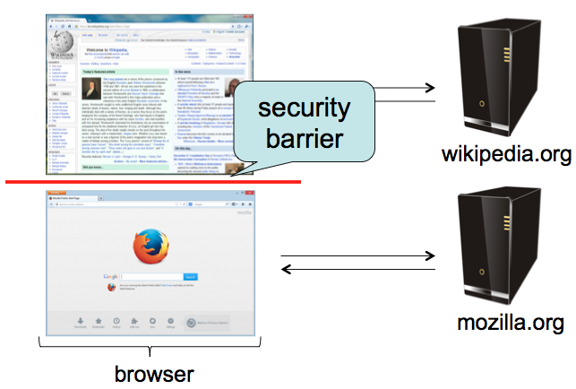
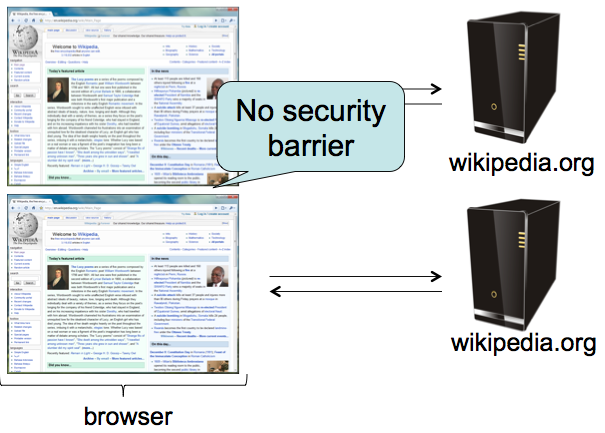
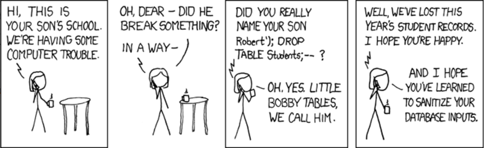

## The Question Behind Everything Today {.center}

> Browsing to **evil.com** should not let evil.com read your **Gmail**, spend your
> **Amazon** balance, or wire money from your **bank**.

Almost every web vulnerability is a variation on one mistake: **the browser, or the
server, confused untrusted *data* with trusted *code*.**

::: {.notes}
Open with the framing. The web is a single program you assemble at runtime from dozens
of origins you've never audited. The whole lecture is one idea seen four ways: code
injection (SQLi, XSS) and the policy that's supposed to contain it (Same-Origin Policy),
plus a request you didn't mean to send (CSRF). Tell them: if you remember one sentence,
make it "data must stay data."
:::

## A 2026 Vignette: When the Firewall Has the Bug {.smaller}

::: {.vignette}
In July 2025, **Fortinet FortiWeb** — a *web application firewall*, a product whose
entire job is to block attacks like SQL injection — was found to contain an
**unauthenticated SQL injection** flaw (**CVE-2025-25257**, CVSS 9.6). A crafted
`Authorization` header let attackers inject SQL, write a file via MySQL's `INTO
OUTFILE`, and achieve **remote code execution**. After watchTowr published a
proof-of-concept on July 11, the Shadowserver Foundation tracked **dozens of
compromised appliances within days**; CISA added it to the Known Exploited
Vulnerabilities catalog with an August 8 patch deadline.
:::

The lesson is not "buy a firewall." It is that **the data/code confusion is everywhere**
— even inside the security product.

::: {.notes}
This is the freshest, most teachable hook: the irony that a SQL-injection-blocking
appliance shipped a SQL-injection bug. Sources: Fortinet PSIRT FG-IR-25-151, CISA KEV,
watchTowr, Shadowserver. Use it to motivate that injection is not a "solved, 1998"
problem — it is on the current actively-exploited list. Ask: why does this keep
happening 25 years after it was understood?
:::

# Same-Origin Policy {.center}

The browser's foundational isolation rule.

## Browser Security: The Goal

- A page from one site must not **spy on or tamper with** your data on another site
- The web grew up with **no isolation at all**; the **Same-Origin Policy (SOP)** was
  grafted on afterward and is **enforced by the browser**
- Intuition: **each site is sandboxed** from every other site

{width="60%"}

::: {.notes}
Stress "grafted on after the fact" — SOP is not a clean design, it's a patch on a system
that assumed everything was trusted. That's why the rules are full of exceptions, which
is exactly where attackers live. The image: wikipedia.org and mozilla.org are walled off
from each other inside the same browser.
:::

## What Is an "Origin"?

**Origin = protocol + hostname + port.** All three must match.

| URL | Same origin as `https://bank.com/`? |
|---|---|
| `https://bank.com/account` | Yes |
| `http://bank.com/` | **No** — different protocol |
| `https://bank.com:8443/` | **No** — different port |
| `https://login.bank.com/` | **No** — different hostname |

Within one origin, JavaScript can **read, change, and interact** with every page freely.

{width="42%"}

::: {.notes}
Cold-call the table. The subdomain row trips everyone up: login.bank.com and bank.com
are *different* origins by the strict rule. The right image shows two pages from the same
site with no barrier between them — same origin, full access.
:::

## The Rule, and the Key Question {.smaller}

**SOP:** only scripts running in a page's **own origin** may read that page's
elements — DOM, cookies, stored data.

The question to ask about *any* script: **"What origin am I running under?"**

::: {.columns}
::: {.column width="50%"}
**Allowed cross-origin**

- *Load* an image, script, stylesheet, font
- *Embed* another page in an `<iframe>`
- *Send* a form POST or navigation
:::
::: {.column width="50%"}
**Blocked cross-origin**

- *Read* the pixels of a cross-origin image
- *Read* the response body of a cross-origin `fetch`
- *Reach into* a cross-origin iframe's DOM
:::
:::

::: {.notes}
This is the crux of every SOP exam question. The distinction is **loading vs. reading**:
the browser will happily *fetch* cross-origin resources, but it won't let a script *read*
their contents. Walk the four agenda takeaways here.
:::

## Two Subtleties That Trip People Up

::: {.columns}
::: {.column width="50%"}
**Scripts take the origin of the *embedding page*, not where they loaded from**

```html
<script src="//cdn.example/jquery.js">
```

jQuery loaded from a CDN runs as **your** origin. That's why CDNs work — and why a
compromised CDN script owns your page.
:::
::: {.column width="50%"}
**iframes keep their *own* origin**

```html
<iframe src="https://gmail.com/">
```

The Gmail iframe runs as `gmail.com`. The parent page **cannot read inside it** — and it
cannot read the parent.
:::
:::

::: {.notes}
The CDN point is a great segue to supply-chain risk (Polyfill.io 2024, the long line of
compromised JS libraries) — flag it for the privacy/supply-chain lectures. The iframe
boundary is what makes embedded login widgets and payment frames safe-ish.
:::

# Code Injection {.center}

The programmer expected data. The attacker sent code.

## Confusing Data and Code

```php
echo system("ls " . $_GET["path"]);
```

Expected: `?path=/home/user/` → lists a directory.

Attacker sends: `?path=$(rm -rf /)` →

```php
system("ls $(rm -rf /)");   // catastrophe
```

One root cause, many names:

- **Shell injection**  ·  **SQL injection**  ·  **Cross-Site Scripting (XSS)**  ·
  **Buffer overflow / control-flow hijack**

::: {.notes}
This single slide is the thesis of the lecture. Every attack that follows is this
picture in a different syntax. The fix is always the same shape: keep a hard boundary
between the command and the untrusted bytes.
:::

## SQL: A Language to Question Databases

```sql
SELECT COUNT(*) FROM users WHERE location = 'Chicago'

SELECT * FROM users WHERE username='bob' AND password='abc123'
```

A login query is just a **string** the server assembles — often by **concatenating user
input** directly into the SQL text.

That's the whole problem.

::: {.notes}
Show that the login check is a string built at runtime. The moment user input lands
inside the quotes, the attacker is co-authoring your query.
:::

## SQL Injection

The server builds: `SELECT * FROM users WHERE location='$city'` where the attacker
controls `$city`.

Attacker sets:

```text
$city = Chicago'; DELETE FROM users WHERE '1'='1
```

The query becomes **two statements**:

```sql
SELECT * FROM users WHERE location='Chicago';
DELETE FROM users WHERE '1'='1'
```

The closing quote, the `;`, and the trailing comment let the attacker **break out of the
data context** and run their own SQL.

::: {.notes}
This is the exam-style mechanic: "given this code, write an injection." Walk the
metacharacters one at a time — quote closes the string, semicolon starts a new statement,
`WHERE '1'='1'` matches every row. Authentication bypass (`' OR '1'='1`) is the other
canonical payload; ask them to construct it.
:::

## Little Bobby Tables



::: {.notes}
The canonical example. `Robert'); DROP TABLE Students;--` — the `--` comments out the
rest of the original query so it doesn't throw a syntax error. Now that they've seen the
mechanics, the joke lands. "Sanitize your database inputs."
:::

## SQL Injection Defense: Make Data Stay Data {.smaller}

**Weak:** escape control characters (quotes, comments) by hand — easy to miss a case.

**Strong: prepared statements.** Declare the query shape *first*, bind data *second*.
The database **never reparses** the data as SQL.

```php
$pstmt = $db->prepare(
    "SELECT * FROM users WHERE location = ?");
$pstmt->execute(array($city));   // $city can only ever be data
```

Also: **least-privilege DB accounts** and **input validation** as defense in depth.

::: {.notes}
Prepared statements are the answer, period. The `?` placeholder is sent to the DB as
structure; the bound value can never become a new statement. Note that ORMs do this for
you — but raw string-building still happens (cf. the FortiWeb bug, which concatenated an
HTTP header into SQL).
:::

# Cross-Site Scripting (XSS) {.center}

The same bug, now in the browser — and it *bypasses* the Same-Origin Policy.

## XSS: HTML Injection Becomes Script Injection {.smaller}

```php
echo "Hello, " . $_GET["user"] . "!";
```

::: {.columns}
::: {.column width="33%"}
`?user=Bob`

→ `Hello, Bob!`

*(harmless)*
:::
::: {.column width="33%"}
`?user=<u>Bob</u>`

→ `Hello, `<u>`Bob`</u>`!`

*(input is HTML)*
:::
::: {.column width="33%"}
`?user=<script>...`

→ script **executes**

*(input is code)*
:::
:::

If user input is echoed into the page unescaped, the attacker's `<script>` runs **in the
victim's session, in the vulnerable site's origin**.

::: {.notes}
Same progression as the agenda's "Robert → bold Robert → script." The escalation is the
teaching moment: the instant the browser treats the input as markup rather than text,
you've lost.
:::

## Why XSS Is So Dangerous: It Defeats SOP {.smaller}

SOP **blocks** evil.com from reading gmail.com. But XSS doesn't break SOP — it
**works around it** by getting attacker code to run **inside** the trusted origin.

**Reflected XSS attack flow:**

1. Attacker crafts a link: `gmail.com/?user=<script>steal()</script>`
2. Victim (logged in) clicks it
3. Gmail **echoes the script back** in its response, unescaped
4. Script now runs **as gmail.com** — same origin → it can read your inbox and exfiltrate it

The browser can't tell the script was injected: it just sees HTML from gmail.com.

::: {.notes}
This is the punchline of the whole SOP→XSS arc. SOP is still being enforced perfectly —
the attacker just made their code part of the trusted page. Connect back to the "what
origin am I running under?" question: the injected script's origin is the victim site's.
:::

## Reflected vs. Stored XSS

::: {.columns}
::: {.column width="50%"}
**Reflected**

- Payload rides in the **URL/request**, echoed back immediately
- Requires luring the victim to click a crafted link
- One victim at a time
:::
::: {.column width="50%"}
**Stored (persistent)**

- Payload is **saved on the server** — a comment, profile, forum post
- Fires for **every visitor** who loads the page
- The 2026 disclosures below are nearly all this kind
:::
:::

::: {.vignette}
**2026, still everywhere:** stored XSS in **Palo Alto PAN-OS** (CVE-2026-0256, web
interface) and a steady stream of WordPress-plugin XSS (e.g., CVE-2026-1923). XSS has
sat on the OWASP Top 10 for two decades and isn't leaving.
:::

::: {.notes}
Stored XSS is worse: persistent and self-spreading (think Samy worm on MySpace, 2005).
The 2026 examples make the point that this is current, not historical. PAN-OS source:
Palo Alto Networks security advisories.
:::

## XSS Defenses {.smaller}

**Make data display as data, not execute as code** — escape on output, *per context*:

| Context | Example | Escape |
|---|---|---|
| HTML body | `<div>$data</div>` | `<` `>` `&` |
| Attribute | `<a href="...$data">` | quotes + URL-encode |
| Inside JS | `var x = "$data";` | JS string escaping |

- Miss **one** instance and you're vulnerable → let a **framework auto-escape** (React,
  Django templates do this by default)
- **Content Security Policy (CSP):** an HTTP header that tells the browser which script
  sources to trust — blocks inline scripts and `eval`, containing damage even if a bug
  slips through

```http
Content-Security-Policy: default-src 'self'; script-src 'self'
```

::: {.notes}
CSP is the defense-in-depth layer the agenda calls out. It's not a substitute for
escaping — it's the seatbelt for when escaping fails. Note the real-world friction: CSP
that forbids inline scripts often breaks legacy sites, so adoption is uneven. Frameworks
+ CSP together is the modern posture.
:::

# Cross-Site Request Forgery (CSRF) {.center}

Not reading your data — making *requests* as you.

## CSRF: The Browser Sends Your Cookie Automatically {.smaller}

You log in to bank.com; the browser stores a session cookie:

```http
Set-Cookie: login=fde874...
```

From then on, the browser attaches that cookie to **every** request to bank.com —
**including requests triggered by other sites.**

```html
<!-- on evil.com -->

```

Visiting evil.com fires that request **with your cookie**. The bank sees a valid,
authenticated transfer and executes it.

::: {.notes}
The vulnerability is ambient authority: the cookie is sent automatically, and the server
can't tell a click *you* made from a request *evil.com* made on your behalf. Note this is
allowed by SOP — sending a cross-origin request is fine; it's reading the response that's
blocked. CSRF doesn't need to read anything; the side effect is the attack.
:::

## A Realistic CSRF: Polluting What a Service Knows About You {.smaller}

Beyond bank transfers, CSRF can **silently shape personalized services**:

- You search a store; a competitor barely ranks
- You visit an innocent-looking page that fires background requests **as you**: fake
  searches, fake clicks, items added to a cart
- The service "learns" from this forged activity — now the competitor ranks first, or
  your recommendations are polluted

> Xing et al., *"Take This Personally: Pollution Attacks on Personalized Services,"*
> USENIX Security 2013.

::: {.notes}
This is the live-demo from the agenda (search-history pollution / "muffin website").
It reframes CSRF from "rare bank-transfer hypothetical" to "quietly manipulating the
profile a service builds of you" — which connects directly to the upcoming tracking and
personalization lectures.
:::

## CSRF Defenses {.smaller}

::: {.columns}
::: {.column width="50%"}
**Anti-CSRF tokens**

- Server embeds an unpredictable, per-session token in each form
- Action accepted only if the token matches
- Attacker **can't read it** (SOP blocks cross-origin reads) and **can't guess it**

```html
<input type="hidden" name="token"
       value="8d64...">
```
:::
::: {.column width="50%"}
**SameSite cookies** *(modern, browser-level)*

- `SameSite=Lax` (today's default): cookie **not** sent on cross-site POSTs / embeds
- `SameSite=Strict`: not sent on cross-site navigation either
- Protects even if the developer forgets a token
:::
:::

**Defense in depth: `SameSite=Lax` *and* CSRF tokens together.**

::: {.notes}
Tokens are the classic answer; SameSite is the browser-default backstop that landed in
the last several years and quietly neutered most drive-by CSRF. The exam ask is
"describe the token-based defense" — make sure they can explain *why* the attacker can't
obtain the token (SOP again). Everything rhymes today.
:::

# The Common Thread {.center}

## What to Remember {.smaller}

::: {.columns}
::: {.column width="50%"}
**The one bug, four faces**

- **SQLi / shell injection:** data interpreted as a *command*
- **XSS:** data interpreted as *script* in a trusted origin
- **CSRF:** a *request* your browser made that you never intended
:::
::: {.column width="50%"}
**The fixes rhyme**

- Keep a hard boundary: **prepared statements**, **output escaping**
- Let **frameworks** enforce it; add **CSP** as a backstop
- Authenticate intent: **CSRF tokens + SameSite**
- **Least privilege** everywhere
:::
:::

The Same-Origin Policy is the floor, not the ceiling: it isolates origins, but **a single
injected script inside a trusted origin defeats it.** Defense in depth is not optional.

::: {.notes}
Close by returning to the opening sentence: data must stay data. Tie back to the FortiWeb
vignette — a 25-year-old bug class, actively exploited in 2025, inside a security product.
Note for students: TLS/HTTPS (which protects the *channel*) is covered in the PKI lecture;
today was about the *application* on top of it. Preview next session: web tracking and
privacy, where third-party code runs *inside* the first-party origin by design.
:::
