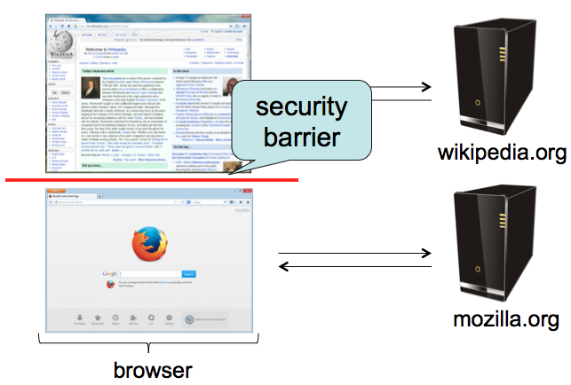
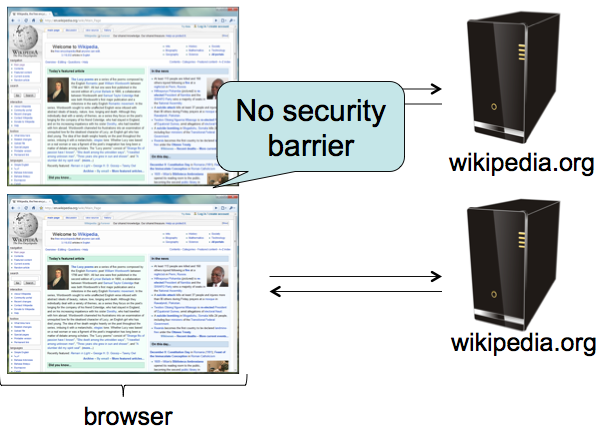
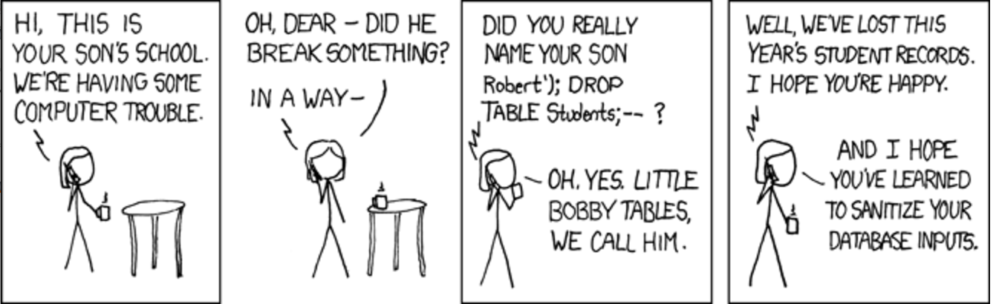

## The Question Behind Everything Today {.center}

> Browsing to **evil.com** should not let evil.com read your **Gmail**, spend your
> **Amazon** balance, or wire money from your **bank**.

Almost every web vulnerability is a variation on one mistake: **the browser, or the
server, confused untrusted *data* with trusted *code*.**

::: {.notes}
Open with the framing. The one-sentence thesis is "data must stay data." Every
attack in this deck is a syntactic confusion of the two — an untrusted string
that the browser or server later re-interprets as code, script, or a request.
This is the same failure mode as buffer overflows in the systems lecture, just
with SQL, HTML, or the browser's cookie machinery as the interpreter instead
of the CPU. The web is a single program you assemble at runtime from dozens
of origins you've never audited. The whole lecture is that one idea seen four
ways: SQL injection, XSS, the Same-Origin Policy meant to contain them, and
CSRF. Tell them: if you remember one sentence, make it "data must stay data."
:::

## A 2026 Vignette: When the Firewall Has the Bug {.smaller}

::: {.vignette}
In July 2025, **Fortinet FortiWeb** — a *web application firewall*, a product whose
entire job is to block attacks like SQL injection — was found to contain an
**unauthenticated SQL injection** flaw (**CVE-2025-25257**, CVSS 9.6) in its
Fabric Connector. A crafted `Authorization` header let attackers inject SQL,
write a Python file via MySQL's `INTO OUTFILE`, and achieve **remote code
execution**. After watchTowr published a proof-of-concept on July 11, the
Shadowserver Foundation tracked **~85 compromised appliances by July 14**; CISA
added it to the Known Exploited Vulnerabilities catalog on July 18, 2025.
:::

The lesson is not "buy a firewall." It is that **the data/code confusion is everywhere**
— even inside the security product.

::: {.notes}
This is the freshest, most teachable hook: the irony that a SQL-injection-
blocking appliance shipped a SQL-injection bug. Sources: watchTowr Labs
technical write-up (July 11, 2025), Fortinet PSIRT FG-IR-25-151, CISA KEV
addition (July 18, 2025), Shadowserver daily counts. The mechanism to walk:
a crafted `Authorization` header hit `get_fabric_user_by_token`, MySQL's
`INTO OUTFILE` wrote a `.pth` file into `site-packages`, and a Python CGI
picked it up for RCE. Shadowserver counted 85 compromised appliances on
July 14, 77 the next day, 35 by July 18 as patches rolled. Use it to make
the point that injection is not a "solved, 1998" problem — it is on the
current actively-exploited list. Ask: why does this keep happening 25 years
after Chris Anley named it? The FortiWeb bug is the FortiWeb bug's own use
case.
:::

# Same-Origin Policy {.center}

The browser's foundational isolation rule.

## Browser Security: The Goal

- A page from one site must not **spy on or tamper with** your data on another site
- The web grew up with **no isolation at all**; the **Same-Origin Policy (SOP)** was
  grafted on afterward and is **enforced by the browser**
- Intuition: **each site is sandboxed** from every other site

{width="60%"}

::: {.notes}
Stress "grafted on after the fact" — SOP is not a clean design, it is a patch
on a system that assumed everything was trusted. Netscape 2 shipped
JavaScript in 1995 before SOP existed; SOP was retrofitted afterward as a
security patch. That is why the rules are full of exceptions, which is
exactly where attackers live. Reference: MDN's Same-origin policy page.
The image shows wikipedia.org and mozilla.org walled off from each other
inside the same browser. Ask: what other core web technology was designed
under similar "everyone is trusted" assumptions? Answer thread: BGP and DNS
from the last two lectures — same story, different layer.
:::

## What Is an "Origin"?

**Origin = protocol + hostname + port.** All three must match.

| URL | Same origin as `https://bank.com/`? |
|---|---|
| `https://bank.com/account` | Yes |
| `http://bank.com/` | **No** — different protocol |
| `https://bank.com:8443/` | **No** — different port |
| `https://login.bank.com/` | **No** — different hostname |

Within one origin, JavaScript can **read, change, and interact** with every page freely.

{width="42%"}

::: {.notes}
Cold-call the table. The `scheme + host + port` triple is the exam-style
question every year — canonical reference is RFC 6454, The Web Origin
Concept. The subdomain row trips everyone up: login.bank.com and bank.com
are *different* origins by the strict rule, which is where students lose
points. The right image shows two pages from the same site with no barrier
between them — same origin, full access. Ask them to predict each row before
revealing it; the port-number row usually surprises people who have never
run a dev server on 8443.
:::

## The Rule, and the Key Question {.smaller}

**SOP:** only scripts running in a page's **own origin** may read that page's
elements — DOM, cookies, stored data.

The question to ask about *any* script: **"What origin am I running under?"**

::: {.columns}
::: {.column width="50%"}
**Allowed cross-origin**

- *Load* an image, script, stylesheet, font
- *Embed* another page in an `<iframe>`
- *Send* a form POST or navigation
:::
::: {.column width="50%"}
**Blocked cross-origin**

- *Read* the pixels of a cross-origin image
- *Read* the response body of a cross-origin `fetch`
- *Reach into* a cross-origin iframe's DOM
:::
:::

::: {.notes}
This is the crux of every SOP exam question. The distinction is loading
versus reading: cross-origin *sends* are legal; cross-origin *reads* are
blocked. That is precisely why CSRF works (it only needs to write) but full
data theft from a cross-origin page does not (it would need to read). The
browser will happily fetch cross-origin resources — that is what makes CDNs,
image hotlinking, and script embedding work — but it will not let a script
read their contents. Walk the four rows in the columns and connect each
allowed action to a common web pattern; the blocked column is where the
security promise actually lives.
:::

## Two Subtleties That Trip People Up

::: {.columns}
::: {.column width="50%"}
**Scripts take the origin of the *embedding page*, not where they loaded from**

```html
<script src="//cdn.example/jquery.js">
```

jQuery loaded from a CDN runs as **your** origin. That's why CDNs work — and why a
compromised CDN script owns your page.
:::
::: {.column width="50%"}
**iframes keep their *own* origin**

```html
<iframe src="https://gmail.com/">
```

The Gmail iframe runs as `gmail.com`. The parent page **cannot read inside it** — and it
cannot read the parent.
:::
:::

::: {.notes}
Scripts inherit the *embedding* origin's privileges — this is why a
compromised CDN script owns the page. The clean 2024 case: Polyfill.io
supply-chain attack (Sansec forensics, June 25, 2024). A Chinese CDN
acquired the polyfill.io domain and served malware to roughly 100k websites
through a legitimate third-party script tag; Andrew Betts (the polyfill's
original author) had warned in February 2024, "If your website uses
polyfill.io, remove it IMMEDIATELY." The mitigating defense is Subresource
Integrity — a hash in the `<script>` tag that pins what the browser is
willing to execute. Flag this for the privacy/supply-chain lectures later
in the term. The iframe boundary on the right is what makes embedded login
widgets and payment frames safe-ish — the parent cannot reach in, the child
cannot reach out.
:::

# Code Injection {.center}

The programmer expected data. The attacker sent code.

## Confusing Data and Code

```php
echo system("ls " . $_GET["path"]);
```

Expected: `?path=/home/user/` → lists a directory.

Attacker sends: `?path=$(rm -rf /)` →

```php
system("ls $(rm -rf /)");   // catastrophe
```

One root cause, many names:

- **Shell injection**  ·  **SQL injection**  ·  **Cross-Site Scripting (XSS)**  ·
  **Buffer overflow / control-flow hijack**

::: {.notes}
This single slide is the thesis of the lecture. Injection is a metavariable
— the SQL/HTML/shell target is a syntactic detail, not the point. Every
attack that follows is this picture in a different syntax: the programmer
expected data, the attacker sent code. The fix is always the same shape:
keep a hard boundary between the command and the untrusted bytes. Cold-call:
name a codebase you've written where you concatenated user input into a
shell command, a URL, or a query — most students have done this without
thinking of it as a vulnerability.
:::

## SQL: A Language to Question Databases

```sql
SELECT COUNT(*) FROM users WHERE location = 'Chicago'

SELECT * FROM users WHERE username='bob' AND password='abc123'
```

A login query is just a **string** the server assembles — often by **concatenating user
input** directly into the SQL text.

That's the whole problem.

::: {.notes}
Set up: user input lands *inside* the quotes of a query string that the
database will later re-parse. The moment concatenation happens, the attacker
is co-authoring your query. Show that the login check is not some special
authentication primitive — it is a plain string the server assembles at
runtime and hands to a SQL parser. That framing is what makes the next
slide's payload obvious rather than mysterious.
:::

## SQL Injection

The server builds: `SELECT * FROM users WHERE location='$city'` where the attacker
controls `$city`.

Attacker sets:

```text
$city = Chicago'; DELETE FROM users WHERE '1'='1
```

The query becomes **two statements**:

```sql
SELECT * FROM users WHERE location='Chicago';
DELETE FROM users WHERE '1'='1'
```

The closing quote, the `;`, and the trailing comment let the attacker **break out of the
data context** and run their own SQL.

::: {.notes}
This is the exam-style mechanic: "given this code, write an injection." Walk
the metacharacters one at a time — the closing quote breaks out of the data
context, the semicolon starts a new SQL statement, `WHERE '1'='1'` matches
every row, and a trailing comment (like `--`) neutralizes any leftover query
fragment so the parser doesn't throw. Have a companion payload ready if a
student asks about authentication bypass: `' OR '1'='1'-- `. Ask them to
construct it and explain each character. This is the moment the metaphor
"attacker is co-authoring your query" becomes concrete.
:::

## Little Bobby Tables



::: {.notes}
The canonical example: xkcd 327, "Exploits of a Mom." Randall Munroe's
`Robert'); DROP TABLE Students;--` — the `--` comments out the rest of the
original query so it doesn't throw a syntax error. Now that they have seen
the mechanics on the previous slide, the joke lands. The mom's punchline —
"I hope you've learned to sanitize your database inputs" — is the whole
folk-wisdom answer, and it is not quite right; the next slide explains why
parameterized queries are the real fix, not sanitization. Robert'); DROP
TABLE Students has been the enduring mascot of the field since 2007.
:::

## SQL Injection Defense: Make Data Stay Data {.smaller}

**Weak:** escape control characters (quotes, comments) by hand — easy to miss a case.

**Strong: prepared statements.** Declare the query shape *first*, bind data *second*.
The database **never reparses** the data as SQL.

```php
$pstmt = $db->prepare(
    "SELECT * FROM users WHERE location = ?");
$pstmt->execute(array($city));   // $city can only ever be data
```

Also: **least-privilege DB accounts** and **input validation** as defense in depth.

::: {.notes}
Prepared statements are the answer, period — see the OWASP SQL Injection
Prevention Cheat Sheet for the canonical guidance. The `?` placeholder is
sent to the database as structure; the bound value can never become a new
statement because the query plan is fixed before the data arrives. Note
that modern ORMs (Django, ActiveRecord, SQLAlchemy) do this for you by
default — but raw string-building still happens, which is exactly how the
opening FortiWeb vignette landed: the vendor concatenated an HTTP header
into a MySQL query. A 2025 bug that a 2005 prepared statement would have
prevented. Add least-privilege database accounts and input validation as
defense in depth so a slip doesn't become a full compromise.
:::

# Cross-Site Scripting (XSS) {.center}

The same bug, now in the browser — and it *bypasses* the Same-Origin Policy.

## XSS: HTML Injection Becomes Script Injection {.smaller}

```php
echo "Hello, " . $_GET["user"] . "!";
```

::: {.columns}
::: {.column width="33%"}
`?user=Bob`

→ `Hello, Bob!`

*(harmless)*
:::
::: {.column width="33%"}
`?user=<u>Bob</u>`

→ `Hello, `<u>`Bob`</u>`!`

*(input is HTML)*
:::
::: {.column width="33%"}
`?user=<script>...`

→ script **executes**

*(input is code)*
:::
:::

If user input is echoed into the page unescaped, the attacker's `<script>` runs **in the
victim's session, in the vulnerable site's origin**.

::: {.notes}
The three-stage escalation (`Bob` → `<u>Bob</u>` → `<script>`) is the
pedagogical move: the moment the browser treats the input as *markup*
instead of *text*, you have lost. Same story as SQL injection, one layer up
— the interpreter is now the HTML parser instead of the SQL parser. Cold-
call: at what point did the developer make the mistake? The answer they
usually miss: not when they wrote the `echo`, but when they decided the
output context was HTML without escaping for that context. Bridge: the
`<script>` case is what the next slide develops into the full SOP-bypass
attack.
:::

## Why XSS Is So Dangerous: It Defeats SOP {.smaller}

SOP **blocks** evil.com from reading gmail.com. But XSS doesn't break SOP — it
**works around it** by getting attacker code to run **inside** the trusted origin.

**Reflected XSS attack flow:**

1. Attacker crafts a link: `gmail.com/?user=<script>steal()</script>`
2. Victim (logged in) clicks it
3. Gmail **echoes the script back** in its response, unescaped
4. Script now runs **as gmail.com** — same origin → it can read your inbox and exfiltrate it

The browser can't tell the script was injected: it just sees HTML from gmail.com.

::: {.notes}
Punchline of the whole SOP-to-XSS arc: SOP is still being enforced perfectly
— the attacker just made their code part of the trusted origin. Reference:
OWASP XSS Prevention Cheat Sheet. Historical anchor: the Samy worm on
MySpace (2005) — the first mass stored-XSS worm; Samy Kamkar's payload
added about one million "friends" to his profile in twenty hours before
MySpace pulled the plug. Connect back to the "what origin am I running
under?" question from earlier: the injected script's origin is the victim
site's, so SOP correctly grants it every privilege of that origin. The
browser cannot tell the script was injected — it just sees HTML from
gmail.com. Ask: how would a defender detect this at runtime?
:::

## Reflected vs. Stored XSS

::: {.columns}
::: {.column width="50%"}
**Reflected**

- Payload rides in the **URL/request**, echoed back immediately
- Requires luring the victim to click a crafted link
- One victim at a time
:::
::: {.column width="50%"}
**Stored (persistent)**

- Payload is **saved on the server** — a comment, profile, forum post
- Fires for **every visitor** who loads the page
- The 2026 disclosures below are nearly all this kind
:::
:::

::: {.vignette}
**2026, still everywhere:** stored XSS in **Palo Alto PAN-OS** web interface —
CVE-2026-0256 (May) and CVE-2026-0266 (June), both stored XSS in a *firewall's*
admin UI — and a steady stream of WordPress-plugin XSS (e.g., Social Rocket
CVE-2026-1923). XSS has sat on the OWASP Top 10 for two decades and isn't leaving.
:::

::: {.notes}
Stored XSS is worse: persistent and self-spreading. Samy Kamkar's MySpace
worm (October 2005) is the historical anchor — the profile itself carried
the payload, so anyone who viewed Samy's page became a carrier. The 2026
examples make the point that this is current, not historical: CVE-2026-0256
(PAN-OS stored XSS, May 13, 2026) and CVE-2026-0266 (second PAN-OS variant,
June 10, 2026) — both stored XSS in a *firewall's* admin UI, sourced from
Palo Alto Networks security advisories. Plus CVE-2026-1923 in the WordPress
Social Rocket plugin, tracked in Wordfence's weekly reports. XSS has sat on
the OWASP Top 10 for two decades and isn't leaving; the FortiWeb vignette
and these PAN-OS bugs together are the recurring theme — security products
themselves keep shipping the bugs they were designed to block.
:::

## XSS Defenses {.smaller}

**Make data display as data, not execute as code** — escape on output, *per context*:

| Context | Example | Escape |
|---|---|---|
| HTML body | `<div>$data</div>` | `<` `>` `&` |
| Attribute | `<a href="...$data">` | quotes + URL-encode |
| Inside JS | `var x = "$data";` | JS string escaping |

- Miss **one** instance and you're vulnerable → let a **framework auto-escape** (React,
  Django templates do this by default)
- **Content Security Policy (CSP):** an HTTP header that tells the browser which script
  sources to trust — blocks inline scripts and `eval`, containing damage even if a bug
  slips through

```http
Content-Security-Policy: default-src 'self'; script-src 'self'
```

::: {.notes}
Context-aware output escaping is the primary defense — HTML body, attribute,
and JS-string contexts each need different escaping, and missing one is a
bug. That is why framework auto-escape (React JSX, Django templates, ERB
with html-safe defaults) is the right posture: it makes escaping the
default, not the exception. CSP is the defense-in-depth layer — MDN's
Content Security Policy page is the canonical reference. It is not a
substitute for escaping; it is the seatbelt for when escaping fails,
blocking inline scripts and `eval` so a bug that lands can't easily
exfiltrate. Real-world friction: CSP that forbids `'unsafe-inline'` breaks
a lot of legacy sites, which is why adoption is uneven. Frameworks plus CSP
together is the modern posture.
:::

# Cross-Site Request Forgery (CSRF) {.center}

Not reading your data — making *requests* as you.

## CSRF: The Browser Sends Your Cookie Automatically {.smaller}

You log in to bank.com; the browser stores a session cookie:

```http
Set-Cookie: login=fde874...
```

From then on, the browser attaches that cookie to **every** request to bank.com —
**including requests triggered by other sites.**

```html
<!-- on evil.com -->

```

Visiting evil.com fires that request **with your cookie**. The bank sees a valid,
authenticated transfer and executes it.

::: {.notes}
The root cause is ambient authority: the cookie is attached to *every*
request to the target origin, including cross-origin embed loads and image
tags, and the server can't tell a click you made from a request evil.com
made on your behalf. Reference: OWASP CSRF Prevention Cheat Sheet. Callback
to the earlier "allowed cross-origin" column: sending a cross-origin request
is fine — that is what CDNs and image embeds rely on. It is reading the
*response* that SOP blocks. CSRF doesn't need to read anything; the side
effect is the attack. That is why bank transfers, password changes, and
"add friend" endpoints are the classic targets — a POST with an effect, and
the attacker never needs to see the reply.
:::

## A Realistic CSRF: Polluting What a Service Knows About You {.smaller}

Beyond bank transfers, CSRF can **silently shape personalized services**:

- You search a store; a competitor barely ranks
- You visit an innocent-looking page that fires background requests **as you**: fake
  searches, fake clicks, items added to a cart
- The service "learns" from this forged activity — now the competitor ranks first, or
  your recommendations are polluted

> Xing et al., *"Take This Personally: Pollution Attacks on Personalized Services,"*
> USENIX Security 2013.

::: {.notes}
This is the live-demo from the agenda — search-history pollution, sometimes
called the "muffin website" attack. Source: Xing, Meng, Doozan, Snoeren,
Feamster, and Lee, "Take This Personally: Pollution Attacks on Personalized
Services," USENIX Security 2013. It reframes CSRF from "rare bank-transfer
hypothetical" to "quietly manipulating the model a service builds of you" —
the ranking, the recommendations, the ad targeting. Bridges directly to the
upcoming tracking and personalization lectures. Ask: how would a user even
notice this? Answer: usually they wouldn't; that is the point. The attack
is a strictly worse version of the CSRF that only makes the news when it
transfers money.
:::

## CSRF Defenses {.smaller}

::: {.columns}
::: {.column width="50%"}
**Anti-CSRF tokens**

- Server embeds an unpredictable, per-session token in each form
- Action accepted only if the token matches
- Attacker **can't read it** (SOP blocks cross-origin reads) and **can't guess it**

```html
<input type="hidden" name="token"
       value="8d64...">
```
:::
::: {.column width="50%"}
**SameSite cookies** *(modern, browser-level)*

- `SameSite=Lax` (today's default): cookie **not** sent on cross-site POSTs / embeds
- `SameSite=Strict`: not sent on cross-site navigation either
- Protects even if the developer forgets a token
:::
:::

**Defense in depth: `SameSite=Lax` *and* CSRF tokens together.**

::: {.notes}
Tokens are the classical defense — embedded, unpredictable, per-session; the
attacker cannot read the token because SOP forbids the cross-origin read.
That is the exam ask: describe the token-based defense and explain *why*
the attacker cannot obtain the token (SOP again — everything rhymes today).
SameSite is the browser-default backstop; `SameSite=Lax` has been Chrome's
default since the August 2020 Chromium rollout and quietly neutered most
drive-by CSRF. Gotcha for the paranoid: Chrome's "Lax+POST" two-minute
window means a freshly-set cookie *can* still ride a cross-site POST — see
PortSwigger's writeup on bypassing SameSite restrictions. Defense in depth:
`SameSite=Lax` plus tokens, together.
:::

# The Common Thread {.center}

## What to Remember {.smaller}

::: {.columns}
::: {.column width="50%"}
**The one bug, four faces**

- **SQLi / shell injection:** data interpreted as a *command*
- **XSS:** data interpreted as *script* in a trusted origin
- **CSRF:** a *request* your browser made that you never intended
:::
::: {.column width="50%"}
**The fixes rhyme**

- Keep a hard boundary: **prepared statements**, **output escaping**
- Let **frameworks** enforce it; add **CSP** as a backstop
- Authenticate intent: **CSRF tokens + SameSite**
- **Least privilege** everywhere
:::
:::

The Same-Origin Policy is the floor, not the ceiling: it isolates origins, but **a single
injected script inside a trusted origin defeats it.** Defense in depth is not optional.

::: {.notes}
Close by returning to the opening sentence: data must stay data. The one
bug, four faces — SQLi, XSS, CSRF, plus the SOP that is supposed to contain
them. Tie back to the FortiWeb vignette: a 25-year-old bug class, actively
exploited in 2025, inside a security product. Note for students: TLS/HTTPS
(which protects the *channel*) is covered in the PKI lecture; today was
about the *application* on top of it. Preview the debate: CFAA safe harbor
for security researchers — anchor cases include Van Buren v. United States
(2021), hiQ Labs v. LinkedIn (9th Cir. 2022 on remand), and the DOJ CFAA
charging-policy revision of May 19, 2022 that announced good-faith security
research would not be charged. Aaron Swartz's story is the background
history students should know. Preview next session: web tracking and
privacy, where third-party code runs *inside* the first-party origin by
design.
:::
