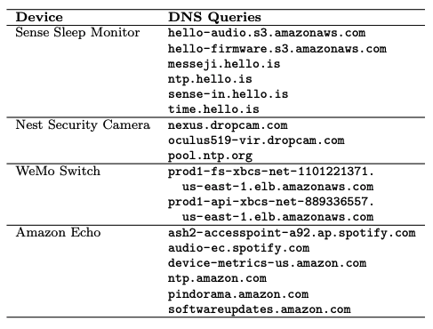
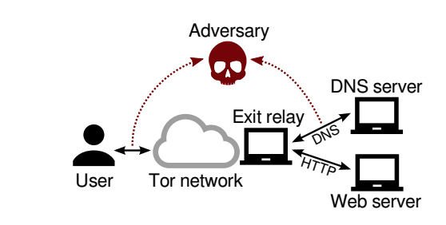
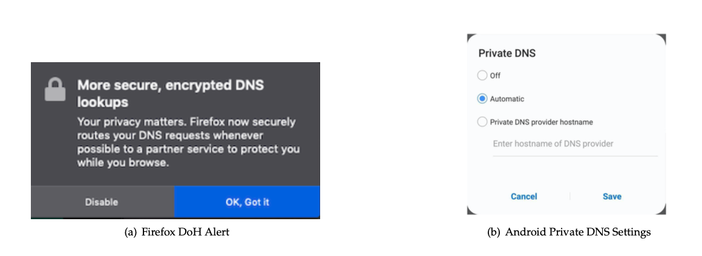
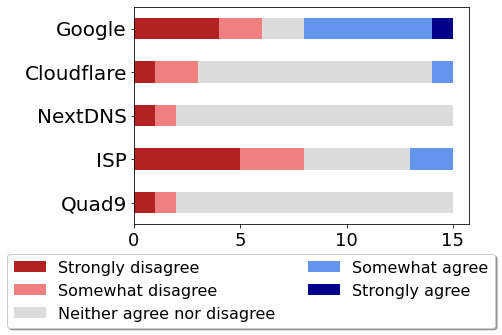
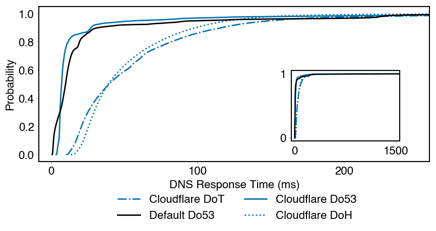
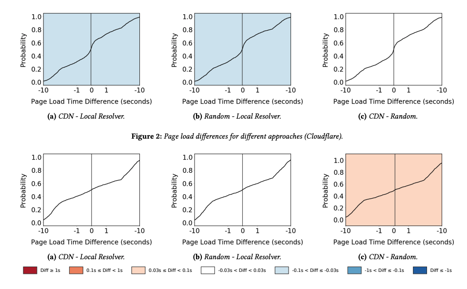

## When DNS Breaks, the Internet Breaks {.center}

::: {.vignette}
**October 20, 2025:** a latent race condition in **Amazon's DynamoDB DNS
automation** left an empty record for `dynamodb.us-east-1.amazonaws.com`.
Resolvers returned errors, stale entries persisted across availability zones,
and the failure cascaded — taking down Fortnite, Snapchat, Signal, Coinbase,
Ring, and much more for up to ~15 hours. **Not an attack — just DNS.**
:::

The naming layer is small, old, and quietly load-bearing. This lecture is about
its **security** (integrity) and its **privacy** (confidentiality).

::: {.notes}
Open with the AWS outage — most students felt it. The point: DNS is a single
dependency that, when it fails, takes down "half the internet." Hold that
centralization thread; we return to it with DoH. Source: AWS post-event summary,
ThousandEyes / InfoQ analyses, Oct 2025.
:::

## What DNS Does

**Translate human-readable names into machine addresses.**

- `uchicago.edu` → `128.135.x.x`
- Must **scale** to billions of names, many users, constant updates
- **Global scope**: a name means the same thing everywhere
- **Decentralized** maintenance and **robust** to failure

::: {.notes}
DNS is the phone book. Emphasize the design goals — scalability, decentralized
control, global consistency. These goals are exactly what gets strained by the
encrypted-DNS centralization story later.
:::

## The DNS Hierarchy

A name space split into **zones**, served by a hierarchy of servers:

- **Stub resolver** — on your device; launches queries
- **Local recursive resolver** — on your network; **caches** answers
- **Root servers** → **TLD servers** (`.com`, `.edu`) → **authoritative servers**

Each level **refers** the query one step down the hierarchy.

::: {.notes}
Draw the hierarchy on the board. The recursive resolver is the workhorse and the
privacy chokepoint — it sees who you are AND what you ask. Caching is why one
machine can answer most queries without hitting the root every time.
:::

## A Single Lookup, Step by Step {.smaller}

1. Stub sends `www.foo.com?` to the **local recursive resolver**
2. If not cached, recursive asks a **root** server
3. Root refers it to the **`.com` TLD** server
4. TLD refers it to the **authoritative** server for `foo.com`
5. Authoritative returns `www.foo.com → 3.4.5.6`
6. Recursive **caches** the answer and returns it to the client

**Why caching matters:** a single web page can trigger **hundreds** of DNS
lookups (scripts, trackers, images, CDNs).

::: {.notes}
Walk this slowly — it is a likely midterm question ("trace a lookup"). The
"hundreds of lookups per page" fact sets up website fingerprinting: each page has
a distinctive set of names.
:::

# Integrity: Can You Trust the Answer? {.center}

## The Problem: DNS Had No Authentication

Until roughly a decade ago, DNS responses carried **no signatures and no
encryption**.

- A malicious or on-path resolver can simply **lie** — return the wrong IP
- **Cache poisoning:** trick a resolver into caching a forged record, so it
  hands the bad answer to *everyone* behind it
- The classic **Kaminsky attack (2008)** exploited weak query randomization to
  inject forged answers at scale

::: {.notes}
Cache poisoning is the integrity threat. Don't drill protocol mechanics — the
agenda flags Kaminsky as conceptual only. The takeaway: without authentication,
a lie propagates through the cache to every downstream user. Motivates DNSSEC.
:::

## DNSSEC: Signatures Up the Hierarchy

**DNS Security Extensions** add a **public-key chain of trust** — the same PKI
idea as web certificates and RPKI for BGP.

- Authoritative server **signs** its records with its private key
- Its public key is **signed by the TLD**; the TLD's key is **signed by the
  root**
- The **root key is the trust anchor**, shipped inside resolver software

DNSSEC protects **integrity**, *not* confidentiality — queries are still visible.

::: {.notes}
Use DNSSEC as a test of whether students understand PKI: who signs what, where
the chain bottoms out. Connect to web PKI and RPKI from earlier lectures.
:::

## Where Does the Chain of Trust Stop?

> You trust the **root key** because it's baked into the resolver software you
> installed — so you trust **whoever shipped that software**.

This is **"trusting trust"** again: the chain must terminate in *something* you
take on faith. DNSSEC moves the trust, it doesn't eliminate it.

::: {.notes}
Callback to the first lecture (Thompson's "Reflections on Trusting Trust").
Every trust hierarchy bottoms out in a root you can't independently verify.
Recurs throughout the course.
:::

# Privacy: Who Sees Your Queries? {.center}

## DNS Leaks More Than You Think

Even with DNSSEC, **every query is sent in the clear**.

- **Eavesdroppers on the path** see every name you look up
- Your **local recursive resolver** (ISP / university) sees **both** your
  identity *and* what you look up
- *"It's just metadata"* should make your **antenna go up**

DNS metadata reveals **the sites you visit, the devices you own, and your
activity patterns**.

::: {.notes}
The "just metadata" line is the hook. Metadata IS content here: the names you
resolve are the sites you read. Ask: do you trust your ISP/university with the
full log of everything you look up?
:::

## Your Devices Announce Themselves

{width="55%"}

A Nest camera, an Echo, a sleep monitor — each makes a **signature set of
lookups**. DNS alone can inventory your home.

::: {.notes}
This table is the most memorable artifact in the deck. Even encrypted *content*
leaves these names exposed if DNS is unencrypted. Ties to the smart-home /
surveillance themes later in the course.
:::

## Website Fingerprinting

::: {.columns}
::: {.column width="48%"}

:::
::: {.column width="52%"}
- Each page loads a **unique set** of objects → a distinctive DNS pattern
- **>90%** of the Alexa top 1M have at least one **unique** domain name
- **ML classifiers** can infer *which page* you viewed — without seeing content
- On **Tor**, a large fraction of exit DNS is resolved by **Google**
:::
:::

::: {.notes}
The point: even an anonymity network leaks at the naming layer if DNS isn't
handled carefully. The unique-name statistic is why fingerprinting works so well.
:::

# Encrypting DNS {.center}

## Existing Approaches

**Confidentiality / integrity in transit:**

- **DNS-over-TLS (DoT)**, **DNS-over-HTTPS (DoH)**, DNS-over-QUIC
- DNSCurve, DNSCrypt
- **DNSSEC** — integrity only, *not* privacy

**Minimize what's exposed:** **QNAME minimization** (only reveal the label each
server needs).

::: {.notes}
Distinguish two goals: encrypt the channel (DoT/DoH) vs. reveal less per hop
(QNAME minimization). DNSSEC is in a different column — integrity, not secrecy.
Agenda flags DoT-vs-DoH mechanics as out of scope; keep it conceptual.
:::

## The First Hop Is the Adversary

The classic encrypted-DNS schemes secure traffic **between resolvers** — but
your **local recursive resolver is run by your ISP**, and it still sees
everything.

**ISPs operate the resolver, so they can monitor every customer's browsing.**

This is the threat model DoH was built to change.

::: {.notes}
Set up the DoH pitch: the eavesdropper you most worry about is often the first
hop, the network you're sitting on. Encrypting to that resolver doesn't help if
that resolver is the adversary.
:::

## DNS-over-HTTPS (DoH)

**Mozilla, 2018:** the **browser** does the lookup itself and sends the query
**inside an HTTPS request** to a chosen resolver.

- DNS query is **embedded in HTTPS** — indistinguishable from web traffic
- **Encrypted channel** from browser straight to the resolver
- Defeats **on-path eavesdropping** of your queries
- Firefox default partner: **Cloudflare**; Chrome: **Google Public DNS**

::: {.notes}
Key shift: DNS moves up out of the OS stub into the browser, and out to a
third-party resolver over HTTPS. Solves the eavesdropping problem. Now ask the
hard question on the next slide.
:::

## DoH Changes *Who* You Trust — Not *Whether*

::: {.columns}
::: {.column width="50%"}
**Before DoH**

Your **ISP / university** sees your queries (in the clear, on path).
:::
::: {.column width="50%"}
**After DoH**

**Cloudflare or Google** sees *all* your queries (encrypted on path).
:::
:::

> Changing resolvers only **shifts the problem of trust** — you've swapped one
> all-seeing observer for another.

::: {.notes}
The central trade-off. DoH genuinely fixes path eavesdropping, but the
third-party resolver now holds the complete log. "You changed who you trust, not
whether you trust someone." This is the slide they should remember.
:::

## On by Default — Do Users Know?

{width="80%"}

Encrypted DNS now ships **on by default** in browsers and OSes, with the
**trusted resolver pre-selected**. *Do users want it? Understand it? Know how to
change it?*

::: {.notes}
Tie to the in-class user-study work: most people stick with defaults, hold
misconceptions, and don't know they can change the resolver. That makes the
*choice of default* a major policy lever. Default = de facto policy.
:::

## Users Don't Understand — or Trust — Resolvers

::: {.columns}
::: {.column width="52%"}

:::
::: {.column width="48%"}
Pilot-study findings:

- Most users **never change** the default setting
- Many thought the default was **required for the phone to work**
- **Limited knowledge** of who the resolvers even are
- More information **does** shift *some* choices
:::
:::

::: {.notes}
The interface and information matter. If you give people context, some switch —
but the default still dominates. This is where security/privacy engineering meets
consumer-protection policy.
:::

## DoH Can Even Perform Well

{width="62%"}

Performance is **not** the blocker — the open questions are about **trust and
centralization**.

::: {.notes}
Kill the "encryption is too slow" objection with data: DoH is competitive,
better in the tail. So the real debate is governance, not latency. Note this
foreshadows Cloudflare's original ODoH objection ("too much latency") being
wrong.
:::

## The Architectural Crisis: Centralization {.smaller}

DoH encrypts DNS — but funnels nearly all queries to a **handful of resolvers**.

- Browsers/OSes pick **one** trusted resolver by default
- A small set of providers gains a **near-complete view** of global browsing
- **Single point of failure** — recall the **AWS Oct 2025 outage**
- Centralization is **not inevitable**: 100+ encrypted-DNS resolvers already exist

::: {.notes}
Bring the opening vignette full circle. Encryption solved confidentiality on the
wire but made the trust/availability problem worse by concentrating it. The
2021 "25% of top sites on AWS" paper warned of exactly this; the 2025 outage
proved it.
:::

# Re-Decentralizing Private DNS {.center}

## The Core DoH Flaw: One Server Sees Both

A DoH resolver learns **two things at once**:

- **Your identity** (your IP address)
- **Your queries** (the names you ask for)

**Oblivious DoH (ODoH)** idea: **split** those two facts across **two**
parties, so **neither** ever holds both.

::: {.notes}
This is the conceptual pivot. The privacy failure is the *coupling* of identity
and query at a single point. Decouple them and you get privacy without trusting
any single resolver fully.
:::

## How Oblivious DNS Works {.smaller}

1. Stub **encrypts** the query with the **ODoH server's public key**
2. Appends a **`.odns`** suffix in the clear and sends it to a **recursive
   resolver / proxy**
3. The proxy **sees your IP but can't read the query**; it forwards to the ODoH
   target
4. The **ODoH target decrypts** and resolves it — **sees the query but not your
   IP**
5. Response travels back **encrypted** through the proxy

**Recursive resolver:** identity, not content. **ODoH target:** content, not
identity. Collusion is the only way to recombine them.

::: {.notes}
Encrypted with the *target's* key, not the proxy's — that's what blinds the
proxy. The proxy acts as a masking relay. Stress the "neither alone has both"
property; this is the whole security argument.
:::

## From Rejected Idea to Deployed Standard

::: {.vignette}
Our group proposed Oblivious DNS at the **IETF DNS Privacy** working group; a
Cloudflare engineer initially called it *"horrible, too much latency, too
complex."* Cloudflare later shipped it as **Oblivious DoH (ODoH)**, and as of
2026 it underpins **Apple's iCloud Private Relay** DNS. Strong opposition often
marks a threatening — and valuable — idea.
:::

::: {.notes}
The research-process lesson: if a good idea makes people angry, keep running.
The latency objection was empirically wrong (see the DoH CDF). ODoH is now real
infrastructure. Sources: Cloudflare ODoH docs/blog; Apple iCloud Private Relay.
:::

## Distributing Queries Across Resolvers

{width="70%"}

Beyond a single ODoH target: **spread queries across many trusted resolvers** —
round-robin, random, "sticky random," or CDN-affinity — so no one observer sees
your whole pattern.

**Open question:** which distribution strategy best preserves privacy against an
eavesdropper?

::: {.notes}
The decentralization endgame: no single resolver, oblivious or not, should see
your full query stream. The plot shows performance cost is modest. Leaves an open
research question — good for the breakout/debate.
:::

## What to Take Away {.smaller}

- **DNS resolution** is a referral walk down a caching hierarchy
- **DNSSEC** = integrity via a PKI chain to a **root trust anchor** — not privacy
- DNS **metadata** leaks sites, devices, and behavior; **fingerprinting** works
- **DoH** stops on-path eavesdropping but **shifts trust** to one big resolver
- **Centralization** is the new risk — *availability and surveillance*
- **ODoH** decouples identity from query; **distribution** re-decentralizes

::: {.notes}
Map each bullet to a likely midterm question: trace a lookup, DNSSEC hierarchy,
what DNSSEC does/doesn't protect, the DoH before/after trust model, ODoH split.
End on the recurring theme: every fix relocates trust rather than removing it.
:::

# Discussion {.center}

If a browser must pick a **default resolver** for millions of users, who should
decide — the vendor, the user, or a regulator? Is that a **technical** choice or
a **policy** choice?
