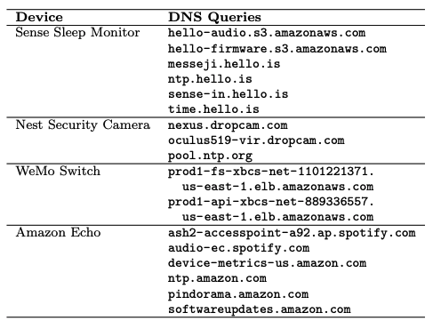
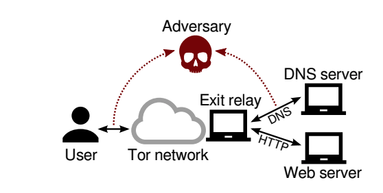
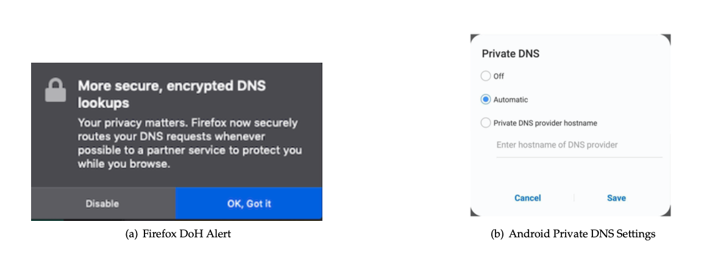
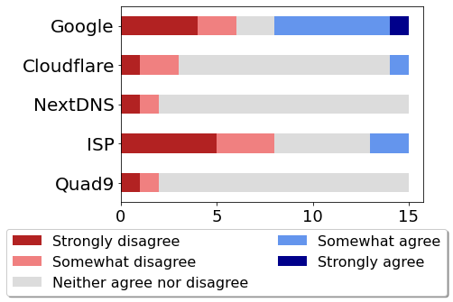
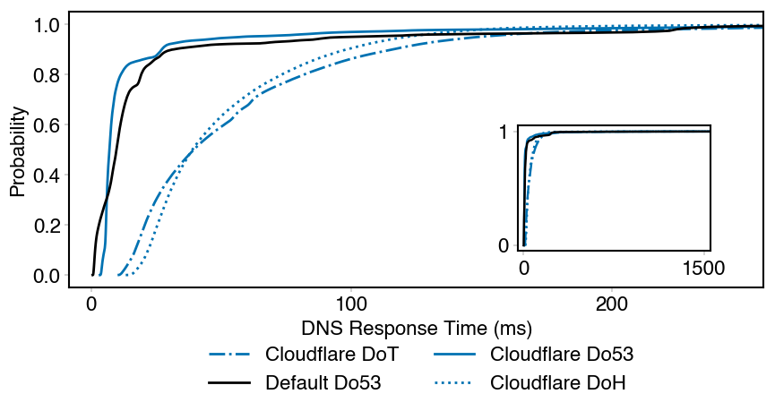
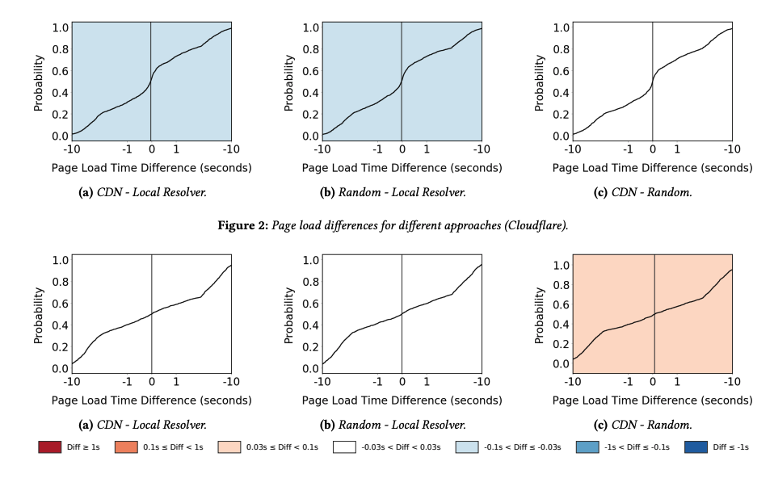

## When DNS Breaks, the Internet Breaks {.center}

::: {.vignette}
**October 20, 2025:** a latent race condition in **Amazon's DynamoDB DNS
automation** left an empty record for `dynamodb.us-east-1.amazonaws.com`.
Resolvers returned errors, stale entries persisted across availability zones,
and the failure cascaded — taking down Fortnite, Snapchat, Signal, Coinbase,
Ring, and much more for up to ~15 hours. **Not an attack — just DNS.**
:::

The naming layer is small, old, and quietly load-bearing. This lecture is about
its **security** (integrity) and its **privacy** (confidentiality).

::: {.notes}
Open with the AWS us-east-1 DynamoDB outage of October 20, 2025 — most
students felt it. The mechanism is worth having ready: a stale-plan check in
the DNS Enactor allowed an old plan to overwrite a newer one, and cleanup
automation then deleted the plan entirely, leaving dynamodb.us-east-1.
amazonaws.com with an empty DNS record. Cascade: DynamoDB down took out
DropletWorkflow Manager, which triggered EC2 lease timeouts, which produced
"congestive collapse." About 15 hours; Snapchat, Fortnite, Roblox, Ring,
McDonald's mobile, HMRC. Sources: AWS post-event summary, InfoQ, ThousandEyes,
The Register, The Pragmatic Engineer. Not an attack — just DNS. The teaching
point: DNS is a single dependency small enough for the whole cloud to trip
over. Hold this centralization thread; we return to it under "Architectural
Crisis" at the end of the lecture.
:::

## What DNS Does

**Translate human-readable names into machine addresses.**

- `uchicago.edu` → `128.135.x.x`
- Must **scale** to billions of names, many users, constant updates
- **Global scope**: a name means the same thing everywhere
- **Decentralized** maintenance and **robust** to failure

::: {.notes}
DNS is the phone book. Emphasize the design goals explicitly — scalability
to billions of names, decentralized control, global consistency (a name
means the same thing everywhere), and robustness to individual failures.
These are exactly the goals that get strained by the encrypted-DNS
centralization story we get to in the second half. References for framing:
MDN's "What is DNS?" and Cloudflare Learning's "What is DNS?" Ask: which
of these design goals is *hardest* to preserve if we bolt on encryption to
a small set of providers? Foreshadow: the answer is decentralization.
:::

## The DNS Hierarchy

A name space split into **zones**, served by a hierarchy of servers:

- **Stub resolver** — on your device; launches queries
- **Local recursive resolver** — on your network; **caches** answers
- **Root servers** → **TLD servers** (`.com`, `.edu`) → **authoritative servers**

Each level **refers** the query one step down the hierarchy.

::: {.notes}
Draw the hierarchy on the board while you talk. The recursive resolver is
both the workhorse of the system and the privacy chokepoint — it sees who
you are (your IP) *and* what you ask (the name). That coupling is exactly
what ODoH is designed to break at the end of the lecture. Caching is why
one recursive resolver can answer the vast majority of queries without ever
hitting the root — most root servers see traffic dominated by junk and TTL
expirations, not real queries. Reference for the walk-through: ICANN's
Beginner's Guide to DNS. Cold-call: at which level of the hierarchy would
you be most worried about surveillance, and why?
:::

## A Single Lookup, Step by Step {.smaller}

1. Stub sends `www.foo.com?` to the **local recursive resolver**
2. If not cached, recursive asks a **root** server
3. Root refers it to the **`.com` TLD** server
4. TLD refers it to the **authoritative** server for `foo.com`
5. Authoritative returns `www.foo.com → 3.4.5.6`
6. Recursive **caches** the answer and returns it to the client

**Why caching matters:** a single web page can trigger **hundreds** of DNS
lookups (scripts, trackers, images, CDNs).

::: {.notes}
Walk this slowly — it is a likely midterm question ("trace a lookup for
www.foo.com"). Have students name each transition and where the cache
lives. The "hundreds of lookups per page" fact sets up website
fingerprinting later in the deck: each modern page loads scripts, trackers,
images, and CDN assets from dozens of distinct domains, so every page has a
distinctive set of names. That is what makes even encrypted-content
traffic fingerprintable at the DNS layer. Ask: on a page you visited this
morning, how many third-party domains do you think were resolved?
:::

# Integrity: Can You Trust the Answer? {.center}

## The Problem: DNS Had No Authentication

Until roughly a decade ago, DNS responses carried **no signatures and no
encryption**.

- A malicious or on-path resolver can simply **lie** — return the wrong IP
- **Cache poisoning:** trick a resolver into caching a forged record, so it
  hands the bad answer to *everyone* behind it
- The classic **Kaminsky attack (2008)** exploited weak query randomization to
  inject forged answers at scale

::: {.notes}
Cache poisoning is the integrity threat. Don't drill protocol mechanics —
the agenda flags Kaminsky as conceptual only. The primary anchor is CERT
Vulnerability Note VU#800113 (July 8, 2008): "Multiple DNS implementations
vulnerable to cache poisoning." Dan Kaminsky's finding was coordinated with
all major vendors before disclosure; the fix (mostly) was source-port
randomization on top of TXID randomization, reducing the attacker's guess
space from 2^16 to ~2^32. Not the end of the story — SAD DNS (2020) showed
cache poisoning could return via ICMP side channels. The takeaway: without
authentication, a lie propagates through the cache to every downstream
user. That's what motivates DNSSEC on the next slide. Keep the exam framing
at "why did the lie propagate to everyone."
:::

## DNSSEC: Signatures Up the Hierarchy

**DNS Security Extensions** add a **public-key chain of trust** — the same PKI
idea as web certificates and RPKI for BGP.

- Authoritative server **signs** its records with its private key
- Its public key is **signed by the TLD**; the TLD's key is **signed by the
  root**
- The **root key is the trust anchor**, shipped inside resolver software

DNSSEC protects **integrity**, *not* confidentiality — queries are still visible.

::: {.notes}
Use DNSSEC as a live test of whether students actually internalized PKI:
who signs what, where the chain bottoms out. Reference: RFCs 4033-4035;
ICANN's "DNSSEC What Is It and Why Is It Important?" page. Validation
stats: still under 40% globally by end-user resolver share as of mid-2026,
per APNIC's DNSSEC validation dashboards — deployment lags DNSSEC's age.
Connect explicitly to the two PKI stories students have already seen: web
PKI (from the crypto lecture) and RPKI (from last week's routing lecture).
Same architectural shape, different resource being certified: cert binds
identity to key, ROA binds prefix to AS, DNSSEC record binds name to
address. Ask: what does DNSSEC *not* protect? Answer for the next slide:
confidentiality.
:::

## Where Does the Chain of Trust Stop?

> You trust the **root key** because it's baked into the resolver software you
> installed — so you trust **whoever shipped that software**.

This is **"trusting trust"** again: the chain must terminate in *something* you
take on faith. DNSSEC moves the trust, it doesn't eliminate it.

::: {.notes}
Callback to Lecture 1 (Ken Thompson's 1984 Turing Award lecture, "Reflections
on Trusting Trust"). Every trust hierarchy bottoms out in a root you can't
independently verify — for DNSSEC, that root is the key ICANN and Verisign
hold, and the copy of it that shipped with your resolver software. DNSSEC
moves the trust, it does not eliminate it: you now trust whoever built the
software instead of every intermediate resolver. This is a pattern that
recurs throughout the course — browser CA stores, RPKI trust anchors, DNS
root keys, Signal's key transparency, all of them terminate in something
you take on faith. Ask: which of these roots would you trust *least*, and
why?
:::

# Privacy: Who Sees Your Queries? {.center}

## DNS Leaks More Than You Think

Even with DNSSEC, **every query is sent in the clear**.

- **Eavesdroppers on the path** see every name you look up
- Your **local recursive resolver** (ISP / university) sees **both** your
  identity *and* what you look up
- *"It's just metadata"* should make your **antenna go up**

DNS metadata reveals **the sites you visit, the devices you own, and your
activity patterns**.

::: {.notes}
The "just metadata" line is the hook — and it should make your antenna go
up every time you hear it. Metadata *is* content here: the names you
resolve are the sites you read, the apps you run, the devices you own, and
the activity patterns you exhibit. There is no meaningful distinction
between "the log of every hostname you asked for" and "the log of every
site you visited." Ask: do you trust your ISP or your university with the
full log of everything you look up? Do you trust them enough to publish it
without anonymization? The intuitive answer is no, but until DoH landed,
that log existed at every recursive resolver on the path. This grounds the
transition to encrypted DNS.
:::

## Your Devices Announce Themselves

{width="55%"}

A Nest camera, an Echo, a sleep monitor — each makes a **signature set of
lookups**. DNS alone can inventory your home.

::: {.notes}
This table from the IoT-inspection work is the most memorable artifact in
the deck. Even fully encrypted *content* leaves these names exposed if DNS
is unencrypted, so an ISP or a coffee-shop network operator can inventory
every smart device in a home just from the DNS traffic. Companion reference:
the IoT Inspector line of work at Princeton, at iotinspector.org. Ties
directly to the smart-home and surveillance themes later in the course.
Ask: how many devices in your dorm room or apartment would show up in this
table? Most students underestimate — thermostats, TVs, and even light
switches often make distinctive DNS queries to vendor telemetry endpoints.
:::

## Website Fingerprinting

::: {.columns}
::: {.column width="48%"}

:::
::: {.column width="52%"}
- Each page loads a **unique set** of objects → a distinctive DNS pattern
- **>90%** of the Alexa top 1M have at least one **unique** domain name
- **ML classifiers** can infer *which page* you viewed — without seeing content
- On **Tor**, a large fraction of exit DNS is resolved by **Google**
:::
:::

::: {.notes}
The point: even an anonymity network leaks at the naming layer if DNS
isn't handled carefully. Anchor paper: Greschbach, Pulls, Roberts, Winter,
and Feamster, "The Effect of DNS on Tor's Anonymity," NDSS 2017 — showed
that Tor exit DNS is disproportionately resolved by a small set of
providers (Google prominently), and that page-load DNS patterns are unique
enough to fingerprint the site being visited even without seeing content.
The unique-name statistic (over 90% of the Alexa top 1M have at least one
unique domain name) is why the ML classifiers work so well. Ask: if you
wanted to defeat this, what would you change? Answer thread: fewer
distinct names per page, padding queries, or splitting queries across
resolvers — foreshadows ODoH.
:::

# Encrypting DNS {.center}

## Existing Approaches

**Confidentiality / integrity in transit:**

- **DNS-over-TLS (DoT)**, **DNS-over-HTTPS (DoH)**, DNS-over-QUIC
- DNSCurve, DNSCrypt
- **DNSSEC** — integrity only, *not* privacy

**Minimize what's exposed:** **QNAME minimization** (only reveal the label each
server needs).

::: {.notes}
Distinguish two goals: encrypt the channel (DoT, DoH, DoQ) versus reveal
less per hop (QNAME minimization). References: RFC 7858 for DNS over TLS,
RFC 8484 for DNS over HTTPS, RFC 9250 for DNS over QUIC, RFC 9156 for
QNAME minimization. DNSSEC is in a different column entirely — integrity,
not secrecy — which is why encrypted-DNS and DNSSEC are complementary, not
alternatives. Agenda flags DoT-versus-DoH mechanics as out of scope; keep
it conceptual and focus on which threat each defends against. Ask: if you
had to pick just one to deploy at scale, which would you pick? The right
answer depends entirely on who the threat model puts on the wire.
:::

## The First Hop Is the Adversary

The classic encrypted-DNS schemes secure traffic **between resolvers** — but
your **local recursive resolver is run by your ISP**, and it still sees
everything.

**ISPs operate the resolver, so they can monitor every customer's browsing.**

This is the threat model DoH was built to change.

::: {.notes}
Set up the DoH pitch: the eavesdropper you most worry about is often the
first hop, the network you are sitting on — your ISP, your university,
the coffee-shop Wi-Fi. Encrypting DNS traffic *to* that resolver doesn't
help if that resolver is itself the adversary. The classic encrypted-DNS
schemes (DoT between resolvers) protect between-recursive traffic but
leave the identity-plus-content log intact at the ISP resolver that runs
by default on your device. That is precisely the gap DoH was designed to
close, and it does so by re-routing the query to a resolver you choose
rather than the one your network assigns. This framing is the pivot for
the whole encrypted-DNS half of the deck.
:::

## DNS-over-HTTPS (DoH)

**Mozilla, 2018:** the **browser** does the lookup itself and sends the query
**inside an HTTPS request** to a chosen resolver.

- DNS query is **embedded in HTTPS** — indistinguishable from web traffic
- **Encrypted channel** from browser straight to the resolver
- Defeats **on-path eavesdropping** of your queries
- Firefox default partner: **Cloudflare**; Chrome: **Google Public DNS**

::: {.notes}
Key architectural shift: DNS moves *up* out of the OS stub into the
browser, and *out* to a third-party resolver over HTTPS. Mozilla began
rolling this out in 2018 (see Firefox's "Understand DNS-over-HTTPS"
support page); Chrome followed with Secure DNS in Chrome 83 (May 2020,
Google Security Blog). Firefox's default partner is Cloudflare (1.1.1.1);
Chrome uses Google Public DNS (8.8.8.8) when it can. Because the query is
inside HTTPS on port 443, it is indistinguishable from web traffic on the
wire — that also makes it much harder for a network to block or downgrade.
Solves the eavesdropping problem. Now ask the hard question on the next
slide: who is looking on the *other* end?
:::

## DoH Changes *Who* You Trust — Not *Whether*

::: {.columns}
::: {.column width="50%"}
**Before DoH**

Your **ISP / university** sees your queries (in the clear, on path).
:::
::: {.column width="50%"}
**After DoH**

**Cloudflare or Google** sees *all* your queries (encrypted on path).
:::
:::

> Changing resolvers only **shifts the problem of trust** — you've swapped one
> all-seeing observer for another.

::: {.notes}
This is the slide they should remember. The central trade-off: DoH
genuinely fixes path eavesdropping, but the third-party resolver now holds
the complete log of every name your device asks for. "You changed who you
trust, not whether you trust someone." A concrete framing: before DoH,
your ISP could sell your DNS log; after DoH, Cloudflare or Google could
(and both have public no-logs promises, but those are contractual
commitments, not technical guarantees). Ask: which is worse — the ISP that
sees only its own customers, or the global resolver that sees a large
fraction of the entire Web? There is no obvious right answer, which is
exactly what makes it a policy question.
:::

## On by Default — Do Users Know?

{width="80%"}

Encrypted DNS now ships **on by default** in browsers and OSes, with the
**trusted resolver pre-selected**. *Do users want it? Understand it? Know how to
change it?*

::: {.notes}
Tie to our lab's user-study work on encrypted-DNS defaults and
understanding. The Firefox and Android UI screenshots on the slide are the
artifacts most students recognize — most people stick with defaults, hold
misconceptions about what the setting even does, and don't know they can
change the resolver at all. That makes the *choice of default* a major
policy lever: default equals de facto policy. If Firefox picks Cloudflare
and Chrome picks Google, then two vendors have effectively chosen who sees
the DNS traffic of a large fraction of the world's browsers. Ask: is that a
technical decision, a business decision, or a policy decision? The right
answer is "all three," which is precisely the discussion prompt at the end
of the deck.
:::

## Users Don't Understand — or Trust — Resolvers

::: {.columns}
::: {.column width="52%"}

:::
::: {.column width="48%"}
Pilot-study findings:

- Most users **never change** the default setting
- Many thought the default was **required for the phone to work**
- **Limited knowledge** of who the resolvers even are
- More information **does** shift *some* choices
:::
:::

::: {.notes}
Pilot-survey findings from our lab's work. The interface and information
matter: if you give people context — who runs the resolver, what they can
see, what happens if you change it — some switch, but the default still
dominates the population. Many users thought the default resolver was
*required* for their phone to work, which is a striking measure of how
opaque this is. This is exactly where security and privacy engineering
meets consumer-protection policy: the FTC's "reasonable steps to inform
consumers" theory applies whenever a default setting has significant
privacy consequences. Cold-call: how would you redesign the setting
interface so users actually understand the choice they're making?
:::

## DoH Can Even Perform Well

{width="62%"}

Performance is **not** the blocker — the open questions are about **trust and
centralization**.

::: {.notes}
Kill the "encryption is too slow" objection with data: DoH is competitive
with Do53 on average and *better* in the tail — Cloudflare DoH beats DoT
for about 50% of queries and edges out plain DNS in the slow tail. So the
real debate is governance and trust, not latency. This also foreshadows
Cloudflare's later objection to Oblivious DoH ("horrible, too much
latency, too complex") being empirically wrong when we measured it — the
same story twice. Ask: if performance isn't the blocker, what actually is?
Answer thread: business models (who runs the resolver and monetizes the
log), regulatory jurisdiction, and the network operators who lose
visibility they used for filtering.
:::

## The Architectural Crisis: Centralization {.smaller}

DoH encrypts DNS — but funnels nearly all queries to a **handful of resolvers**.

- Browsers/OSes pick **one** trusted resolver by default
- A small set of providers gains a **near-complete view** of global browsing
- **Single point of failure** — recall the **AWS Oct 2025 outage**
- Centralization is **not inevitable**: 100+ encrypted-DNS resolvers already exist

::: {.vignette}
**Centralization = a single takedown target.** In **Jan 2026** Italy's AGCOM fined
**Cloudflare €14.2M** (1% of global revenue) for refusing to filter pirate domains
on public **1.1.1.1**; Matthew Prince called it "DISGUSTING" and threatened to pull
Italian infrastructure. In **March 2026** the **Paris Court of Appeal** rejected
appeals from Google, Cloudflare, and Cisco and held that public DNS resolvers *can*
be compelled to block sites. Cisco pulled OpenDNS out of France.
:::

::: {.notes}
Bring the opening AWS vignette full circle and add the 2026 coercion
vector. Encryption solved confidentiality on the wire but made the
trust/availability problem worse *and* concentrated the takedown target.
Two axes to name: availability (AWS October 2025) and coercion. Italy's
AGCOM fined Cloudflare €14.2 million in January 2026 (1% of global
revenue) for refusing to filter pirate domains on public 1.1.1.1; Cloudflare
appealed on March 8, 2026. CEO Matthew Prince publicly threatened to pull
Italian infrastructure. Then the Paris Court of Appeal, March 27, 2026
(RG 24/09372), rejected appeals by Google, Cloudflare, and Cisco and held
that third-party public DNS resolvers *can* be compelled to block domains
under Article L.333-10 (dynamic sports-rightsholder blocking); Cisco
pulled OpenDNS out of France pending appeal. The block moved *up* to the
public resolvers precisely because users had escaped ISP resolution.
Sources: TorrentFreak, Cloudflare's "Standing up for the open Internet"
blog, heise online.
:::

# Re-Decentralizing Private DNS {.center}

## The Core DoH Flaw: One Server Sees Both

A DoH resolver learns **two things at once**:

- **Your identity** (your IP address)
- **Your queries** (the names you ask for)

**Oblivious DoH (ODoH)** idea: **split** those two facts across **two**
parties, so **neither** ever holds both.

::: {.notes}
This is the conceptual pivot for the last section. The privacy failure of
DoH is precisely the *coupling* of identity and query at a single point —
one server sees your IP AND what you asked for, so it holds the full
compromising log. Decouple those two facts across two parties, and you get
privacy without having to fully trust any single resolver. The design goal
is a strong property: even if either party is fully compromised,
individually they cannot reconstruct your query stream. This is the same
"split trust" idea students may have seen in Signal's sealed sender or
Tor's circuit design — spread the knowledge so no one node has enough to
identify you.
:::

## How Oblivious DNS Works {.smaller}

1. Stub **encrypts** the query with the **ODoH server's public key**
2. Appends a **`.odns`** suffix in the clear and sends it to a **recursive
   resolver / proxy**
3. The proxy **sees your IP but can't read the query**; it forwards to the ODoH
   target
4. The **ODoH target decrypts** and resolves it — **sees the query but not your
   IP**
5. Response travels back **encrypted** through the proxy

**Recursive resolver:** identity, not content. **ODoH target:** content, not
identity. Collusion is the only way to recombine them.

::: {.notes}
The critical detail: the query is encrypted with the *target's* public key,
not the proxy's — that is what blinds the proxy. The proxy acts as a
masking relay that sees your IP but cannot read the query, and the target
sees the query but not your IP. Reference: RFC 9230, Oblivious DNS over
HTTPS (June 2022). Original academic paper: Edmundson, Schmitt, Feamster,
and Mankin, "Oblivious DNS: Practical Privacy for DNS Queries," PoPETS
2019; the design was first presented at IETF 102 DPRIVE (July 2018).
Stress the "neither alone has both" property; this is the whole security
argument, and collusion between the proxy and the target is the only way
to reassemble the linkage. Ask: what stops the proxy and the target from
colluding? Answer: pick them from non-cooperating operators — same trust
model as Tor guard-versus-exit.
:::

## From Rejected Idea to Deployed Standard

::: {.vignette}
Our group proposed Oblivious DNS at the **IETF DNS Privacy** working group; a
Cloudflare engineer initially called it *"horrible, too much latency, too
complex."* Cloudflare later shipped it as **Oblivious DoH (ODoH)**, standardized
as **RFC 9230 (June 2022)**, and it now underpins **Apple's iCloud Private
Relay** DNS on Cloudflare/Akamai/Fastly. Strong opposition often marks a
threatening — and valuable — idea.
:::

::: {.notes}
The research-process lesson: if a good idea makes people angry, keep
running. Cloudflare later shipped the design as Oblivious DoH, and it was
standardized as RFC 9230 in June 2022; Apple's iCloud Private Relay now
uses an ODoH-style split between an Apple ingress proxy and a third-party
egress (Cloudflare, Akamai, or Fastly). The latency objection was
empirically wrong when we measured it — see the DoH CDF two slides back.
Sources: Cloudflare 1.1.1.1 ODoH documentation and blog; Apple's "About
iCloud Private Relay" support page. Strong opposition to an idea from an
incumbent is often a signal the idea is threatening — and therefore
valuable. Ask: what other proposals in this course faced the same shape
of pushback? Threads to pull: BGPsec, DNS-over-HTTPS itself, end-to-end
messaging encryption.
:::

## Distributing Queries Across Resolvers

{width="70%"}

Beyond a single ODoH target: **spread queries across many trusted resolvers** —
round-robin, random, "sticky random," or CDN-affinity — so no one observer sees
your whole pattern.

**Open question:** which distribution strategy best preserves privacy against an
eavesdropper?

::: {.notes}
The decentralization endgame: no single resolver, oblivious or not, should
see your full query stream. Spread queries across many trusted resolvers
via round-robin, random, "sticky random," or CDN-affinity strategies, and
no one observer reconstructs your whole pattern. The plot shows the
performance cost is modest, so the argument against isn't latency. This
leaves an open research question — which strategy best defeats which
adversary model — and it is exactly the material for Breakout A on the
"encrypted DNS chokepoint." Good debate framing: is architectural
decentralization achievable at scale, or does it inevitably re-centralize
around whichever provider users end up trusting?
:::

## What to Take Away {.smaller}

- **DNS resolution** is a referral walk down a caching hierarchy
- **DNSSEC** = integrity via a PKI chain to a **root trust anchor** — not privacy
- DNS **metadata** leaks sites, devices, and behavior; **fingerprinting** works
- **DoH** stops on-path eavesdropping but **shifts trust** to one big resolver
- **Centralization** is the new risk — *availability and surveillance*
- **ODoH** decouples identity from query; **distribution** re-decentralizes

::: {.notes}
Map each bullet to a likely midterm question: trace a lookup step by step;
DNSSEC hierarchy and where the trust anchor lives; what DNSSEC does and
doesn't protect (integrity yes, confidentiality no); the DoH before/after
trust model; the ODoH identity/query split. End on the recurring theme of
the course: every fix relocates trust rather than removing it — Thompson,
Anderson, PKI, RPKI, DoH, ODoH all instantiate the same lesson. Bridge to
the day's hands-on: the Wireshark + DoH activity lets students watch their
own plaintext DNS queries and then switch them off. If run before the
breakout, the discussion is much more concrete because they've just seen
their own traffic.
:::

# Discussion {.center}

If a browser must pick a **default resolver** for millions of users, who should
decide — the vendor, the user, or a regulator? Is that a **technical** choice or
a **policy** choice?

::: {.notes}
Bridge to the two breakouts. Breakout A ("Encrypted DNS Just Moved the
Chokepoint") pairs directly with the centralization vignette and the Italy
and France coercion cases. Breakout B ("Kaminsky at 18 — Why Isn't DNSSEC
Everywhere?") pairs with the DNSSEC deployment gap. Hands-on companion is
the Wireshark + DoH activity — students can do it the same day. If they
run the activity first, they'll have just watched their own plaintext DNS
queries and switched them off, which makes the discussion much more
visceral. Cold-call: name one stakeholder whose interests are not fully
represented by any of "vendor, user, regulator" — good candidates include
enterprise IT (loses filtering), CDNs (lose observability), and children/
guardianship contexts. There is no clean answer, which is the point.
:::
