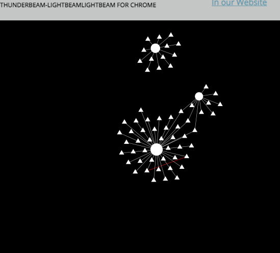
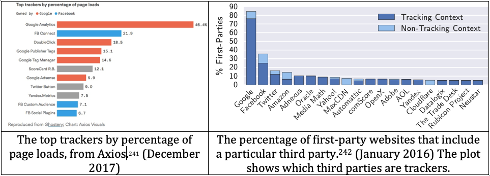
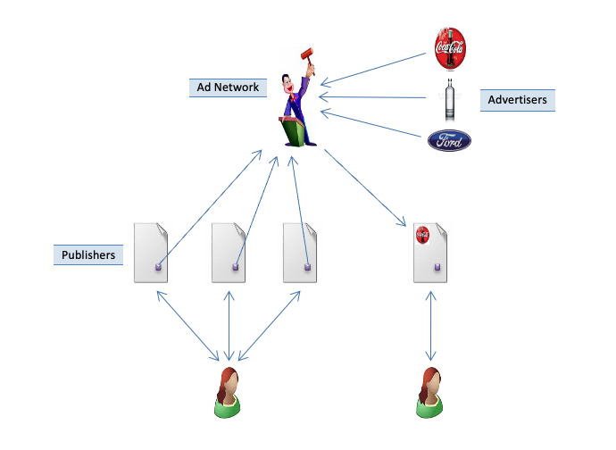
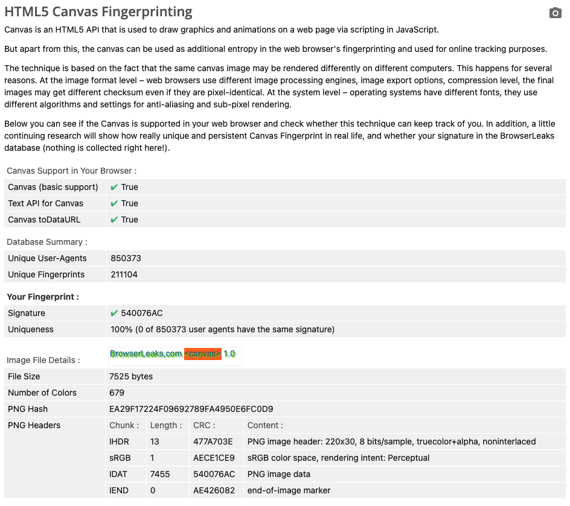
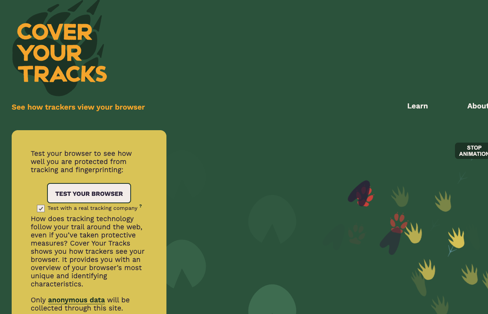
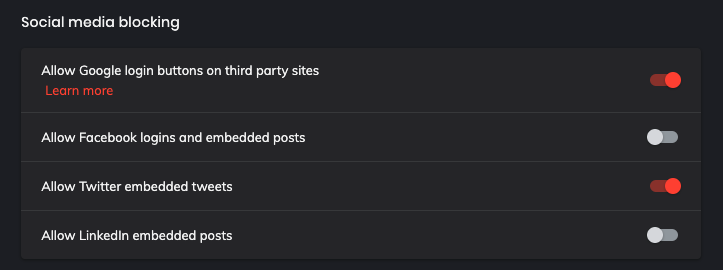

## On the Internet, They Know You're a Dog {.center}

> The 1993 cartoon said *"On the Internet, nobody knows you're a dog."*
> Today they know your breed, your favorite brand of pet food, and the
> name of the poodle at the park you have a crush on.

The web is built so that **sites other than the one you visit** can watch
where you go.

::: {.notes}
Open with the cartoon framing. The joke from 1993 has completely inverted.
Ask the room: in the last hour of browsing, how many companies do you think
saw at least one page you loaded? The honest answer is usually dozens, and
almost none of them are companies the student chose to interact with. That is
the puzzle of this lecture: tracking is invisible, pervasive, and largely
not consensual.
:::

## What We'll Cover

- **Third-party tracking**: who watches you across sites, and how
- **Cookies**: the original cross-site identifier — and why blocking them is
  no longer enough
- **Browser fingerprinting**: identifying a device with *no* stored state
- **Linking identities**: cookie syncing, leakage, cross-device
- **Defenses**: blocking, anti-fingerprinting, and opt-out signals like GPC

::: {.notes}
Map the arc: we go from the mechanism (third parties + cookies), to the harder
problem (fingerprinting that survives cookie deletion), to linking, then to
defenses. The recurring theme is an arms race — every defense provokes a new
evasion. Flag the midterm framing now: "is deleting cookies enough?" is a
classic exam question and the answer is no.
:::

# Third-Party Tracking {.center}

## What Is a "Third Party"?

When you load `nytimes.com`, your browser also fetches content from sites you
never typed:

- **First party**: the site in your address bar
- **Third party**: everything else the page pulls in — ad networks,
  analytics, social widgets, tag managers
- Typically **invisible**, and **the same third party appears on thousands of
  first-party sites**

That recurrence is the whole game: one tracker embedded everywhere can stitch
your visits into a **profile of your browsing history**.

::: {.notes}
The key insight is recurrence, not any single page load. BlueKai or Google
Analytics on both Amazon and Walmart means that company sees you on both. Most
people have never heard of these firms (BlueKai, LiveRamp, Criteo) yet they
observe a huge fraction of a person's web activity. Cold-call: name a third
party you'd expect on a news site.
:::

## A Single Page, Dozens of Trackers

::: {.columns}
::: {.column width="55%"}
A 2012 Stanford study boxed in red every request a news homepage made to a
**different** domain than the one in the address bar.

Modern news sites are worse: **4+ advertising domains plus analytics and
social widgets** on a single load.
:::
::: {.column width="45%"}

:::
:::

::: {.notes}
The red boxes are content the NYT does not serve. The mechanism that makes
third-party tracking work is the combination of a **cookie** (a persistent
ID) and the **Referer** header (which tells the tracker which first-party page
you were on). Funny aside: the HTTP spec misspells "referrer" as "referer" —
it is baked into the protocol and cannot be fixed.
:::

## Visualizing the Web of Trackers

{width="60%"}

Each **hub** is a tracker; each **spoke** is a first-party site you visited.
The hub sees *all* of them.

::: {.notes}
Tools like Lightbeam (and today the Disconnect extension visualization) draw
this graph live as you browse. After a few minutes of normal browsing you get
a dense web with a handful of giant hubs — usually Google and Meta. This is the
single most effective way to make the abstraction concrete in class; consider a
live demo with the Disconnect plugin.
:::

## Who Are the Third Parties?

The market is **highly consolidated** — a few companies see most of the web:

- **Google**: a Google tracker is present on roughly **3 out of 4** sites
- **Meta** (Facebook Connect / Meta Pixel): on a majority of sites
- Plus a long tail: **DoubleClick, LiveRamp, Criteo, media.net, Yandex**

{width="78%"}

::: {.notes}
The data plot makes the consolidation visceral: Google Analytics alone is on a
huge share of page loads. Stat from class: ~50% of page loads carry Google
Analytics, ~75% of sites carry some Google tracker. Ask why these firms are in
the tracking business — the answer is the advertising auction on the next slide.
The figures are from 2016–2017 studies and are almost certainly higher now.
:::

## Why They Track: Behavioral Targeting

{width="62%"}

- The **ad network** sits between publishers and advertisers
- Your browsing **profile** feeds a **real-time auction**: advertisers bid to
  show *you* an ad in the milliseconds the page loads
- Tracking is not the goal; **selling your attention** is

::: {.notes}
This is the business model that funds the whole apparatus. Profiles built from
past activity let advertisers bid for specific users via real-time bidding
(RTB). Worth naming the privacy worries this raises: intellectual privacy (what
you read), price discrimination (different prices for different profiles), and
government piggybacking — the NSA was documented using ad cookies to pinpoint
surveillance targets (Washington Post, 2013).
:::

## Social Buttons Are Trackers Too

- A **Like** button or share widget on a page loads content from Facebook /
  X — so they learn you visited, **even if you never click**
- Same for embedded posts, login buttons, and comment widgets

::: {.vignette}
**September 2024:** the EU's top court (CJEU), in *Meta v. Bundeskartellamt*
and related rulings, held that combining off-Facebook data collected via the
Like button and Pixel across the web requires a valid legal basis — reinforcing
earlier holdings that a site embedding a social plugin can be a **joint
controller** liable for the tracking it triggers.
:::

::: {.notes}
The teaching point: merely loading a widget tracks you. The legal point is
newer and important for the policy half of the course — embedding a third
party's code can make the FIRST party legally responsible for the data that
code collects (joint controllership under GDPR; class actions under CCPA and
wiretap statutes in the US, e.g., the Meta Pixel healthcare suits). State the
CJEU point as a reinforcement of joint-controllership, not a new doctrine.
:::

## First-Party Tracking with Third-Party Code

A subtler model: the third party's code runs **inside the first party's
origin**.

- Site embeds an advertiser's script directly → **no same-origin restriction**
- That code sees **everything**: cart contents, clicks, form fields
- Add an item to a cart on one site → see an ad for it on Instagram an hour
  later

**Legal consequence:** the first party is liable for what the embedded code
collects — including PII it never meant to share.

::: {.notes}
Distinguish from the third-party-resource model: here there is no SOP boundary
at all because the code runs as first-party JavaScript. This is exactly how
session-replay and re-marketing scripts vacuum up form inputs. It is also the
fact pattern behind a wave of class actions where embedded ad/analytics code
captured SSNs, health data, or search terms. First parties must audit what they
embed.
:::

# Cookies {.center}

## How Cookies Enable Cross-Site Tracking

1. Visit Amazon → a request to `bluekai.com` returns **`Set-Cookie: id=35c1…`**
2. Browser **stores** the cookie for `bluekai.com`
3. Visit Walmart (also embeds `bluekai.com`) → browser **automatically resends**
   the same cookie
4. BlueKai: *"same browser — correlate the two visits"*

The cookie is a **persistent ID** the tracker assigns once and recognizes
everywhere it's embedded.

::: {.notes}
Walk through the mechanics slowly; this is a guaranteed midterm question.
Set-Cookie from the server, automatic resend by the browser, third-party
cookies sent to the tracker across many first-party sites. The combination of
cookie + Referer is what links the ID to a specific page.
:::

## Browsers Fought Back — Mostly

- **Safari** (ITP) and **Firefox** (ETP) now **block third-party cookies by
  default**; the setting is "Block cross-site cookies"
- This breaks **relatively little** — and stops cross-site cookie tracking

But two big caveats:

- It **does not stop fingerprinting** (next section)
- **Chrome still allows** third-party cookies

::: {.vignette}
**April 2025:** Google reversed course and announced it will **not** deprecate
third-party cookies in Chrome — no phase-out, no new consent prompt. By
**October 2025** it began **retiring most of its Privacy Sandbox** replacement
APIs after low adoption. The cookie the industry declared dead is, in the
browser with the largest share, very much alive.
:::

::: {.notes}
This is the freshest, most counterintuitive update in the deck. For ~5 years
"the death of the third-party cookie" was conventional wisdom; in 2025 Google
walked it back and gutted Privacy Sandbox. The takeaway for students: technical
defaults are set by a tiny number of browser vendors, and their commercial
incentives (Google is also the largest ad network) shape what protections
billions of people get. Great debate fodder.
:::

## "Just Delete Your Cookies"?

Deleting cookies is good hygiene — but **not sufficient**. The tracker can
re-identify the same device with **no stored state at all**.

That technique is **browser fingerprinting**.

::: {.notes}
This slide is the pivot and the setup for the classic exam question: "Is
deleting cookies enough to stop tracking?" Answer: no, because fingerprinting
identifies the device from its configuration, not from anything stored. Pause
here and let them sit with why deletion fails before revealing fingerprinting.
:::

# Browser Fingerprinting {.center}

## Fingerprinting: Watching the Browser's Behavior

Instead of *storing* an ID, the tracker *derives* one from how your browser
looks and behaves:

::: {.columns}
::: {.column width="50%"}
- User-Agent (browser + OS)
- Screen size & resolution
- Installed fonts
- Language & timezone
:::
::: {.column width="50%"}
- Browser extensions / plugins
- HTTP `Accept` headers
- Graphics card (rendering)
- Clock skew
:::
:::

Any single attribute is common — but the **combination** is often unique among
millions of devices.

::: {.notes}
The insidious part: fingerprinting leaves **no trace** in the browser, so the
user has no signal they are being tracked and nothing to "delete." JavaScript
reads most of these properties freely. No single value identifies you; entropy
comes from the joint distribution. Connect to the DNS lecture: website
fingerprinting used ML on traffic patterns — same idea, different signal.
:::

## Canvas Fingerprinting

The site asks the browser to **draw text/graphics to a hidden canvas**, then
hashes the pixels.

- Tiny differences in **GPU, drivers, and font rendering** make the output
  device-specific
- No permission prompt; runs silently in JavaScript

{width="55%"}

::: {.notes}
Canvas is the canonical example because it is so non-obvious — you are
fingerprinted by how your machine renders the letter "g." The vast majority of
browser/device combinations turn out to be unique. Mention WebGL and AudioContext
fingerprinting as the same idea applied to other subsystems.
:::

## Hands-On: Cover Your Tracks

The EFF's **Cover Your Tracks** (`coveryourtracks.eff.org`) tests how unique —
and how trackable — your browser is.

{width="58%"}

Run it on your own browser before next class: note which attributes are **rare**
(high entropy) and whether your fingerprint is **unique**.

::: {.notes}
This is the in-class / take-home exercise. Live-demo on the projector: my
Firefox shows some common attributes and some near-unique ones, and the
combination is identifying even with tracking protection on. Have students
report their results — it always lands harder when it's their own browser.
Tie to the assignment if one is active.
:::

# Linking Identities Across Boundaries {.center}

## "Anonymous" Tracking Isn't

Trackers don't need your name to start — but the pseudonym rarely stays
anonymous:

1. **The third party is sometimes a first party.** You *log in* to Google /
   Meta, then their tracker recognizes you everywhere → cookie ID becomes a
   **real identity**
2. **Identifiers leak.** A `Referer` or query string carries your email or
   search terms to a third party:

```
GET     http://ad.doubleclick.net/adj/...
Referer: http://submit.sports.com/...?email=jdoe@email.com
Cookie:  id=35c192bcfe0000b1...
```

::: {.notes}
Two distinct deanonymization paths. (1) Login: the Like-button cookie is
anonymous until you log into Facebook, at which point it's tied to your real
identity across the whole web. (2) Leakage: careless first-party programming
puts the email/search term in the URL, and the Referer forwards it to every
embedded third party. Search terms leak this way constantly.
:::

## Cookie Syncing

**Problem:** Tracker X knows you as `x`, Tracker Y knows you as `y`. How do they
learn that `x` and `y` are the *same* person?

**Answer:** the **browser** relays it. When you visit a page with both, X
redirects to Y with its own ID attached:

```
GET     https://trackerY.com/?uid=xxxxxxx
Referer: http://trackerX.com/...
Cookie:  id=yyyyyyy
```

Now Y can map `y ↔ x`. Repeat across the ecosystem and **every tracker's
profile merges**.

::: {.notes}
Cookie syncing is the glue of the tracking economy: it lets independent
databases reconcile their IDs. Combine with **onboarding** (matching to
offline retail databases) and **cross-device tracking** (linking your phone and
laptop), and a tracker links across nearly every boundary. The hint to give
students: it has to happen through the browser, because that's the only thing
both trackers can touch.
:::

# Defenses {.center}

## Referer and Cookie Blocking

::: {.columns}
::: {.column width="50%"}
**Block the Referer header**

- Breaks many sites
- Sites use Referer for **CSRF defense**
- Third-party JS can still read the URL (unless in an iframe)
- Doesn't stop **cooperative** tracking
:::
::: {.column width="50%"}
**Block third-party cookies**

- **Little breakage** — now the default in Safari & Firefox
- Stops cross-site cookie tracking
- But **does not stop fingerprinting**
:::
:::

::: {.notes}
Referer blocking is the heavy-handed option that breaks the web and is
defeated by cooperative tracking (where the first party hands the URL to the
third party directly). Third-party cookie blocking is the pragmatic win that
shipped by default — but it's only half the problem, because fingerprinting
needs no cookies.
:::

## Request Blocking: The Most Effective Defense

The approach that actually works at scale (uBlock Origin, EasyPrivacy,
Disconnect, Ghostery):

- Maintain a **big crowd-curated list** of known tracker domains/patterns
- Browser extension downloads the list and **blocks requests** to anything on it

**Drawbacks:** false positives/negatives, and you must **trust the list
maintainer**.

::: {.columns}
::: {.column width="50%"}

:::
::: {.column width="50%"}
This is fundamentally an **arms race**: if trackers rotate domains or
first-party-disguise their requests, the list must adapt.
:::
:::

::: {.notes}
By far the most successful approach in practice. The exercise to pose: if
trackers wanted to dodge these tools, what would they do (CNAME cloaking,
first-party disguising, server-side tagging) — and in an arms race, who has the
advantage? Note the recent wrinkle: Chrome's Manifest V3 limits the blocking
APIs extensions like uBlock Origin rely on, which weakens content blockers in
Chrome specifically.
:::

## Opt-Out Signals: From "Do Not Track" to GPC

- **Do Not Track (DNT)**, ~2011: a single browser header asking sites not to
  track. Voluntary → almost universally **ignored**. Standardization deadlocked.
- **Global Privacy Control (GPC)**: same idea, but now **legally backed** —
  several state laws *require* businesses to honor it as a valid opt-out.

::: {.vignette}
**September 2025:** the California Privacy Protection Agency and the Attorneys
General of **California, Colorado, and Connecticut** launched a joint
investigative sweep of businesses that **fail to honor GPC** opt-out signals.
And from **January 1, 2026**, revised CCPA rules require businesses to confirm
they have processed a GPC request. The opt-out header that failed as DNT now has
legal teeth.
:::

::: {.notes}
The arc is the whole point: the same technical idea (a header expressing a
preference) failed when purely voluntary (DNT) and is succeeding only because
law now compels compliance (GPC). This is the bridge to the privacy-law
lectures: technology proposes, regulation disposes. Twelve+ state laws now
recognize universal opt-out mechanisms.
:::

## Takeaways {.center}

- Tracking is **invisible, pervasive, and consolidated** in a few firms
- **Cookies** are blockable — but the cookie isn't dead (Chrome, 2025)
- **Fingerprinting** survives cookie deletion: no stored state to clear
- Defenses are an **arms race**; the most durable wins are **list-based
  blocking** and **legally backed opt-outs (GPC)**

::: {.notes}
Close by reconnecting to the exam framing and the policy bridge. The single
most important conceptual takeaway: deleting cookies is not enough because of
fingerprinting. The single most important policy takeaway: purely technical
opt-outs fail without legal backing — which is exactly why the next block of the
course is privacy law.
:::
