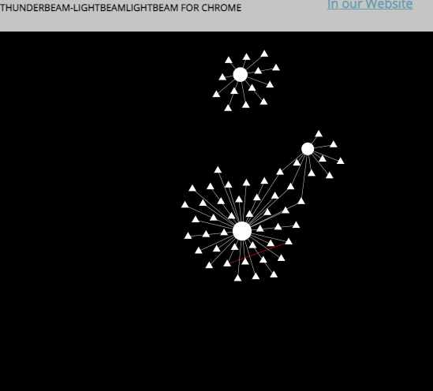
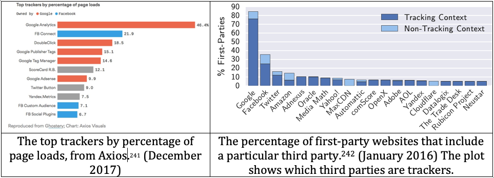
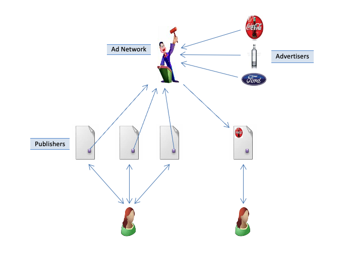
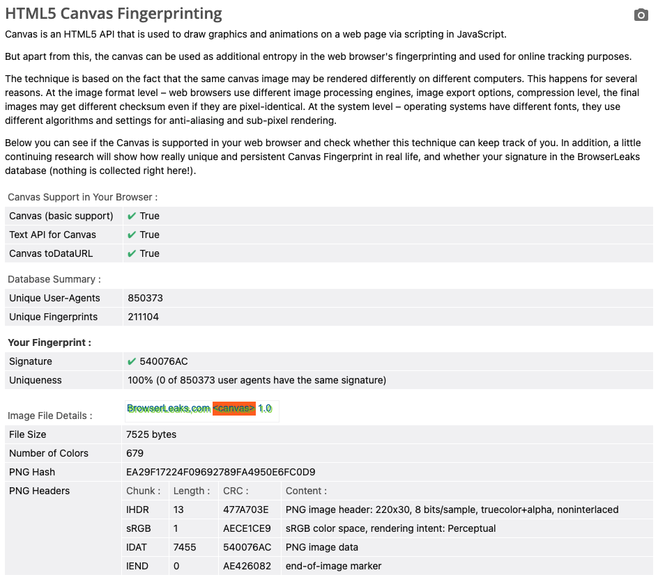
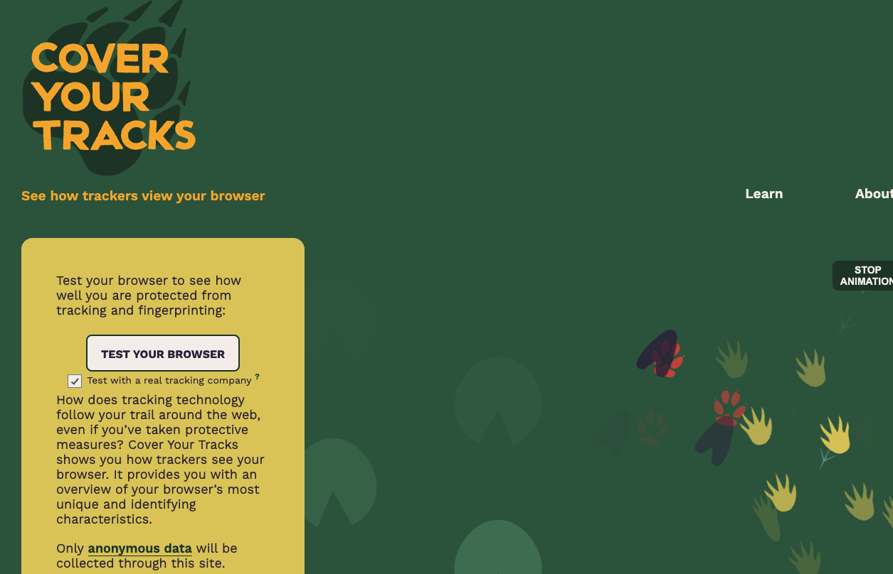
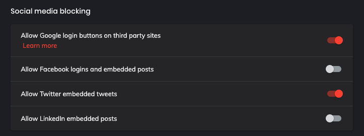

## On the Internet, They Know You're a Dog {.center}

> The 1993 cartoon said *"On the Internet, nobody knows you're a dog."*
> Today they know your breed, your favorite brand of pet food, and the
> name of the poodle at the park you have a crush on.

The web is built so that **sites other than the one you visit** can watch
where you go.

::: {.notes}
Open with the Peter Steiner cartoon from The New Yorker, July 5, 1993 — the
"nobody knows you're a dog" joke has completely inverted three decades later.
Cold-call the room: in the last hour of browsing, how many companies do you
think saw at least one page you loaded? Honest answer is usually dozens, and
almost none are companies the student chose to interact with. Name the puzzle
of the lecture up front — tracking is invisible, pervasive, largely
non-consensual, and increasingly the subject of law. Foreshadow the companion
Web Tracking hands-on activity later this week. The whole deck is an inversion
joke on Steiner: today they know your breed, your food, the poodle at the park.
:::

## What We'll Cover

- **Third-party tracking**: who watches you across sites, and how
- **Cookies**: the original cross-site identifier — and why blocking them is
  no longer enough
- **Browser fingerprinting**: identifying a device with *no* stored state
- **Linking identities**: cookie syncing, leakage, cross-device
- **Defenses**: blocking, anti-fingerprinting, and opt-out signals like GPC

::: {.notes}
Map the arc explicitly. We move from the mechanism (third parties + cookies)
to the harder problem (fingerprinting that survives cookie deletion), then to
linking identities, then to defenses both technical and legal. The recurring
theme is an arms race — every defense provokes a new evasion. Flag the midterm
framing now: "is deleting cookies enough?" is a classic exam question and the
answer is no, because of fingerprinting. Preview the bridge to Meeting 11 on
privacy law — the GPC arc at the end is the handoff. Tell them to expect a
recurring pattern in this section of the course: technology proposes, regulation
disposes.
:::

# Third-Party Tracking {.center}

## What Is a "Third Party"?

When you load `nytimes.com`, your browser also fetches content from sites you
never typed:

- **First party**: the site in your address bar
- **Third party**: everything else the page pulls in — ad networks,
  analytics, social widgets, tag managers
- Typically **invisible**, and **the same third party appears on thousands of
  first-party sites**

That recurrence is the whole game: one tracker embedded everywhere can stitch
your visits into a **profile of your browsing history**.

::: {.notes}
The key insight is recurrence, not any single page load. Google Analytics or
LiveRamp on both Amazon and Walmart means that one company sees you on both.
Most students have never heard of these firms — BlueKai, LiveRamp, Criteo,
media.net — yet they observe a huge fraction of a person's web activity.
Cold-call: name a third party you'd expect on a news site. Prime the room with
the usual suspects — Google Analytics, Meta Pixel, LiveRamp, Criteo, DoubleClick,
Google Tag Manager. This recurrence property is exactly what enables one
tracker to stitch your visits into a profile of your browsing history.
:::

## A Single Page, Dozens of Trackers

::: {.columns}
::: {.column width="55%"}
A 2012 Stanford study boxed in red every request a news homepage made to a
**different** domain than the one in the address bar.

Modern news sites are worse: **4+ advertising domains plus analytics and
social widgets** on a single load.
:::
::: {.column width="45%"}

:::
:::

::: {.notes}
Point at the red boxes and be clear these are content the New York Times does
not serve. The mechanism that makes third-party tracking work is the
combination of a cookie (a persistent ID) and the Referer header (which tells
the tracker which first-party page you were on). Funny aside: the HTTP spec
misspells "referrer" as "referer" — it is baked into the protocol and cannot
be fixed. The original red-boxed image is from a 2012 Stanford study; modern
news sites are strictly worse today. Ask a student to count the distinct
third-party domains they see — the exercise makes the abstraction visceral.
:::

## Visualizing the Web of Trackers

{width="60%"}

Each **hub** is a tracker; each **spoke** is a first-party site you visited.
The hub sees *all* of them.

::: {.notes}
Mozilla Lightbeam was the original tool; the modern equivalent is the
Disconnect extension visualization. Both draw this graph live as you browse.
After a few minutes of normal browsing you get a dense web with a handful of
giant hubs — usually Google and Meta. This is the single most effective way to
make the abstraction concrete in class; consider a live demo with the Disconnect
plugin — browse two minutes and project the graph. Ask which hubs students
expect to see, then reveal. The teaching point: consolidation and recurrence
are why a small number of firms observe most of the web.
:::

## Who Are the Third Parties?

The market is **highly consolidated** — a few companies see most of the web:

- **Google**: a Google tracker is present on roughly **3 out of 4** sites
- **Meta** (Facebook Connect / Meta Pixel): on a majority of sites
- Plus a long tail: **DoubleClick, LiveRamp, Criteo, media.net, Yandex**

{width="78%"}

::: {.notes}
The data plot makes the consolidation visceral: Google Analytics alone is on a
huge share of page loads. Concrete numbers to say out loud: roughly 50% of
page loads carry Google Analytics, roughly 75% of sites carry some Google
tracker. Beyond Google and Meta there is a long tail — LiveRamp, Criteo,
media.net, Yandex — that most students have never heard of. Ask why these
firms are in the tracking business; the answer is the real-time-bidding ad
auction on the next slide. Note the figures are from 2016–2017 measurement
studies and are almost certainly higher now. Debate hook: if three firms
observe most of the web, is "notice and consent" a coherent regulatory model?
:::

## Why They Track: Behavioral Targeting

{width="62%"}

- The **ad network** sits between publishers and advertisers
- Your browsing **profile** feeds a **real-time auction**: advertisers bid to
  show *you* an ad in the milliseconds the page loads
- Tracking is not the goal; **selling your attention** is

::: {.notes}
This is the business model that funds the whole apparatus — call it out
explicitly. Profiles built from past activity let advertisers bid for specific
users via real-time bidding, or RTB, in the milliseconds a page loads. Name the
privacy harms plainly: intellectual privacy (what you read), price
discrimination (different prices for different profiles), and government
piggybacking — the Washington Post reported in December 2013 that the NSA used
Google PREF cookies to pinpoint surveillance targets. The strongest
anti-RTB legal precedent is the Belgian DPA's 2022 ruling that the IAB Europe
TCF consent framework is unlawful. Ask: is targeted advertising a legitimate
business model with side effects, or the side effect itself? Good debate seed
for the omnibus prompt later this month.
:::

## Social Buttons Are Trackers Too

- A **Like** button or share widget on a page loads content from Facebook /
  X — so they learn you visited, **even if you never click**
- Same for embedded posts, login buttons, and comment widgets

::: {.vignette}
The **CJEU** long ago held (**Fashion ID**, C-40/17, 2019) that a site
embedding the Facebook **Like** button is a **joint controller** for the data
it triggers. Its follow-on **Meta v. Bundeskartellamt** (C-252/21, 2023) then
knocked out most non-consent legal bases for combining off-platform data;
Germany's Federal Cartel Office closed its Meta case in **October 2024** on
that footing. Embedding a widget is not a free pass — the first party is on
the hook for what the third-party code collects.
:::

::: {.notes}
Lead with the technical teaching point: merely loading a Like button tells
Facebook you visited — no click required. The legal point is newer and
important for the policy half of the course — embedding a third party's code
can make the FIRST party legally responsible for the data that code collects.
That's the joint-controllership doctrine from Fashion ID GmbH v.
Verbraucherzentrale NRW, CJEU C-40/17, decided July 29, 2019. Meta v.
Bundeskartellamt (C-252/21, July 4, 2023) went further and knocked out most
non-consent legal bases for combining off-platform data; Germany's Federal
Cartel Office closed its Meta case in October 2024 on that footing. The U.S.
analogue is the Meta Pixel healthcare wave — dozens of hospital-website class
actions and HHS/OCR guidance treating the pixel as an impermissible disclosure
of protected health information. Cross-reference to Meeting 11: joint
controllership is the doctrine you'll see cited whenever a first party embeds
tracking code.
:::

## First-Party Tracking with Third-Party Code

A subtler model: the third party's code runs **inside the first party's
origin**.

- Site embeds an advertiser's script directly → **no same-origin restriction**
- That code sees **everything**: cart contents, clicks, form fields
- Add an item to a cart on one site → see an ad for it on Instagram an hour
  later

**Legal consequence:** the first party is liable for what the embedded code
collects — including PII it never meant to share.

::: {.notes}
Distinguish carefully from the prior model: here there is no same-origin-policy
boundary at all because the code runs as first-party JavaScript. This is
exactly how session-replay and re-marketing scripts vacuum up form inputs
including cart contents, clicks, and text as it's typed. It's also the fact
pattern behind the wiretap and CIPA (California Invasion of Privacy Act)
class-action wave — embedded ad/analytics code captured SSNs, health data,
or search terms and the plaintiffs argued the first party effectively
wiretapped its own visitors. The remediation lesson is uncomfortable: first
parties must audit what they embed, because they are liable for what that
code collects even when it collects things they never intended. Ask students
whether that's a fair allocation of responsibility or one that only large
firms can meet.
:::

# Cookies {.center}

## How Cookies Enable Cross-Site Tracking

1. Visit Amazon → a request to `bluekai.com` returns **`Set-Cookie: id=35c1…`**
2. Browser **stores** the cookie for `bluekai.com`
3. Visit Walmart (also embeds `bluekai.com`) → browser **automatically resends**
   the same cookie
4. BlueKai: *"same browser — correlate the two visits"*

The cookie is a **persistent ID** the tracker assigns once and recognizes
everywhere it's embedded.

::: {.notes}
Walk the four-step mechanic slowly; this is a guaranteed midterm question.
Set-Cookie from the server, automatic browser resend, third-party cookies sent
to the tracker across many first-party sites, then Cookie + Referer link the
ID to a specific page. Draw the state machine on the board if the room is
confused — the browser doing this "helpful" behavior by default is the whole
game. This is why blocking third-party cookies works at all: you're refusing
to send the cookie back on cross-site requests. Foreshadow the next slide:
Safari and Firefox now block third-party cookies by default; Chrome does not.
:::

## Browsers Fought Back — Mostly

- **Safari** (ITP) and **Firefox** (ETP) now **block third-party cookies by
  default**; the setting is "Block cross-site cookies"
- This breaks **relatively little** — and stops cross-site cookie tracking

But two big caveats:

- It **does not stop fingerprinting** (next section)
- **Chrome still allows** third-party cookies

::: {.vignette}
**April 2025:** Google reversed course and announced it will **not** deprecate
third-party cookies in Chrome — no phase-out, no new consent prompt. On
**October 17, 2025** it **shut down most of Privacy Sandbox** (Topics,
Protected Audience, Attribution Reporting, IP Protection, Related Website
Sets), citing low adoption. Roughly a year in, third-party cookies remain
Chrome-default with **no timeline for removal** — the cookie the industry
declared dead is, in the browser with the largest share, very much alive.
:::

::: {.notes}
This is the freshest, most counterintuitive update in the deck. Safari shipped
Intelligent Tracking Prevention in 2020; Firefox shipped Total Cookie Protection
by default in June 2022. For roughly five years "the death of the third-party
cookie" was conventional wisdom. Then on April 22, 2025 Google reversed the
Chrome third-party-cookie deprecation, and on October 17, 2025 shut down most
of Privacy Sandbox — Topics, Protected Audience, Attribution Reporting, IP
Protection, and Related Website Sets. What survives is CHIPS, FedCM, and
Private State Tokens. Roughly a year in, third-party cookies remain
Chrome-default with no timeline for removal. Takeaway for students: technical
defaults are set by a tiny number of browser vendors, and their commercial
incentives shape what protections billions of people get. The world's largest
ad network also ships the world's largest browser — great debate fodder.
:::

## "Just Delete Your Cookies"?

Deleting cookies is good hygiene — but **not sufficient**. The tracker can
re-identify the same device with **no stored state at all**.

That technique is **browser fingerprinting**.

::: {.notes}
This slide is the pivot and the setup for the classic exam question: is
deleting cookies enough to stop tracking? Answer: no, because fingerprinting
identifies the device from its configuration, not from anything stored. Pause
here and let the room sit with why deletion fails before revealing
fingerprinting. Cold-call: if the tracker doesn't store anything on your
machine, what could it possibly use to recognize you? The right intuition to
draw out is that your browser broadcasts a huge amount of information about
your device just to render pages — and that information is more unique than
students expect.
:::

# Browser Fingerprinting {.center}

## Fingerprinting: Watching the Browser's Behavior

Instead of *storing* an ID, the tracker *derives* one from how your browser
looks and behaves:

::: {.columns}
::: {.column width="50%"}
- User-Agent (browser + OS)
- Screen size & resolution
- Installed fonts
- Language & timezone
:::
::: {.column width="50%"}
- Browser extensions / plugins
- HTTP `Accept` headers
- Graphics card (rendering)
- Clock skew
:::
:::

Any single attribute is common — but the **combination** is often unique among
millions of devices.

::: {.notes}
The insidious part: fingerprinting leaves no trace in the browser, so the user
has no signal they are being tracked and nothing to delete. JavaScript reads
most of these properties freely without any permission prompt. No single value
identifies you; the entropy comes from the joint distribution of many
attributes. Foundational paper: Peter Eckersley, "How Unique Is Your Web
Browser?" from EFF at PETS 2010 — the paper that turned fingerprinting from
folklore into a measured entropy estimate. Connect to the DNS lecture:
website fingerprinting used machine learning on traffic patterns — same idea,
different signal. Cross-reference AmIUnique as a companion measurement site
alongside Cover Your Tracks.
:::

## Canvas Fingerprinting

The site asks the browser to **draw text/graphics to a hidden canvas**, then
hashes the pixels.

- Tiny differences in **GPU, drivers, and font rendering** make the output
  device-specific
- No permission prompt; runs silently in JavaScript

{width="55%"}

::: {.notes}
Canvas is the canonical example because it is so non-obvious — you are
fingerprinted by how your machine renders the letter "g." The vast majority of
browser/device combinations turn out to be unique on that pixel hash alone.
The canonical measurement is Acar et al., "The Web Never Forgets," ACM CCS
2014 — the paper that first showed canvas fingerprinting deployed at scale in
the wild. Mention WebGL and AudioContext fingerprinting as the same idea
applied to other subsystems — anywhere the browser exposes a deterministic
output that depends on GPU, drivers, or audio stack, someone will hash it.
No permission prompt is required for any of these APIs.
:::

## Hands-On: Cover Your Tracks

The EFF's **Cover Your Tracks** (`coveryourtracks.eff.org`) tests how unique —
and how trackable — your browser is.

{width="58%"}

Run it on your own browser before next class: note which attributes are **rare**
(high entropy) and whether your fingerprint is **unique**.

::: {.notes}
This is the in-class or take-home exercise. Live-demo on the projector — my
own Firefox shows some common attributes and some near-unique ones, and the
combination is identifying even with tracking protection on. Have two or three
students report their results out loud; it always lands harder when it's their
own browser. Tie to the companion Web Tracking activity, which uses Cover Your
Tracks as its first step. AmIUnique is the alternate site if EFF is down.
Emphasize: even with every anti-tracking measure enabled, the fingerprint is
often unique, which is exactly the "cookies aren't enough" punchline from two
slides back.
:::

# Linking Identities Across Boundaries {.center}

## "Anonymous" Tracking Isn't

Trackers don't need your name to start — but the pseudonym rarely stays
anonymous:

1. **The third party is sometimes a first party.** You *log in* to Google /
   Meta, then their tracker recognizes you everywhere → cookie ID becomes a
   **real identity**
2. **Identifiers leak.** A `Referer` or query string carries your email or
   search terms to a third party:

```
GET     http://ad.doubleclick.net/adj/...
Referer: http://submit.sports.com/...?email=jdoe@email.com
Cookie:  id=35c192bcfe0000b1...
```

::: {.notes}
Two distinct deanonymization paths, both worth naming. First, login: the
Like-button cookie is anonymous until you log into Facebook or Google, at
which point that same cookie ID is tied to your real identity across the whole
web — the third party is quietly also a first party. Second, leakage: careless
first-party programming puts the email address or search term in the URL, and
the Referer header forwards it to every embedded third party without the user
noticing. Search terms leak this way constantly — you type into a form, the
form does a GET, and every tracker on the results page sees what you typed.
Cold-call: which of your logged-in accounts follows you across the most sites?
:::

## Cookie Syncing

**Problem:** Tracker X knows you as `x`, Tracker Y knows you as `y`. How do they
learn that `x` and `y` are the *same* person?

**Answer:** the **browser** relays it. When you visit a page with both, X
redirects to Y with its own ID attached:

```
GET     https://trackerY.com/?uid=xxxxxxx
Referer: http://trackerX.com/...
Cookie:  id=yyyyyyy
```

Now Y can map `y ↔ x`. Repeat across the ecosystem and **every tracker's
profile merges**.

::: {.notes}
Cookie syncing is the glue of the tracking economy: it lets independent
databases reconcile their IDs. The hint to give students first: it has to
happen through the browser, because that's the only thing both trackers can
touch. Combine cookie syncing with onboarding — LiveRamp matches online IDs
to offline retail and location data — and with cross-device tracking that
links your phone to your laptop, and one tracker's ID links across nearly
every boundary you can name. This is why "just don't log in" isn't a defense:
even pseudonymous profiles get stitched into a single identity through
these joins. Debate seed: does the ad industry's own plumbing violate the
purpose-limitation principle of every modern privacy framework?
:::

# Defenses {.center}

## Referer and Cookie Blocking

::: {.columns}
::: {.column width="50%"}
**Block the Referer header**

- Breaks many sites
- Sites use Referer for **CSRF defense**
- Third-party JS can still read the URL (unless in an iframe)
- Doesn't stop **cooperative** tracking
:::
::: {.column width="50%"}
**Block third-party cookies**

- **Little breakage** — now the default in Safari & Firefox
- Stops cross-site cookie tracking
- But **does not stop fingerprinting**
:::
:::

::: {.notes}
Referer blocking is the heavy-handed option that breaks the web — sites use
Referer for CSRF defense — and is defeated anyway by cooperative tracking,
where the first party hands the URL to the third party directly. Third-party
cookie blocking is the pragmatic win that shipped by default in Safari (2020)
and Firefox — but it's only half the problem, because fingerprinting needs no
cookies. This is the arms-race moment: every clean defense has an evasion.
Contrast the "break the web" defense with the "block a subset by policy"
defense — the second is where the sustainable wins live.
:::

## Request Blocking: The Most Effective Defense

The approach that actually works at scale (uBlock Origin, EasyPrivacy,
Disconnect, Ghostery):

- Maintain a **big crowd-curated list** of known tracker domains/patterns
- Browser extension downloads the list and **blocks requests** to anything on it

**Drawbacks:** false positives/negatives, and you must **trust the list
maintainer**.

::: {.columns}
::: {.column width="50%"}

:::
::: {.column width="50%"}
This is fundamentally an **arms race**: if trackers rotate domains or
first-party-disguise their requests, the list must adapt.
:::
:::

::: {.notes}
By far the most successful defensive approach in practice. Name the tools out
loud: uBlock Origin, the EasyPrivacy filter list, Disconnect, Ghostery — each
maintains a big crowd-curated list of tracker domains and patterns. The
exercise to pose: if trackers wanted to dodge these tools, what would they
do — CNAME cloaking, first-party disguising, server-side tagging — and in an
arms race, who has the advantage? The recent wrinkle: Chrome permanently
disabled Manifest V2 in Chrome 138 on July 24, 2025, and the flag-based
workarounds go away in Chrome 151 around July 2026. The full uBlock Origin no
longer runs on Chrome; users get uBlock Origin Lite (declarativeNetRequest,
static rule cap, fewer filters) or must switch to Firefox or Brave. That the
world's largest ad-network vendor also ships the world's largest browser is
the conflict-of-interest teaching point — connect to the Web Privacy breakout.
:::

## Opt-Out Signals: From "Do Not Track" to GPC

- **Do Not Track (DNT)**, ~2011: a single browser header asking sites not to
  track. Voluntary → almost universally **ignored**. Standardization deadlocked.
- **Global Privacy Control (GPC)**: same idea, but now **legally backed** —
  several state laws *require* businesses to honor it as a valid opt-out.

::: {.vignette}
**Enforcement is live.** A CA/CO/CT joint sweep of businesses ignoring GPC
launched Sept 2025; revised CCPA rules **in force since Jan 1, 2026** require
businesses to *confirm* a GPC opt-out was processed. **12 states** now require
recognition of a universal opt-out signal (CA, CO, CT, DE, MD, MN, MT, NE, NH,
NJ, OR, TX). California's **AB 566 "Opt Me Out" Act** (effective Jan 1, 2027)
will force Chrome, Safari, and Edge to *ship* a GPC control. The header that
failed as DNT now has legal teeth.
:::

::: {.notes}
The arc is the whole point: the same technical idea — a browser header
expressing a preference — failed when purely voluntary as Do Not Track around
2011, and is succeeding only because law now compels compliance as Global
Privacy Control. This is the bridge to the privacy-law lectures: technology
proposes, regulation disposes. Landmark enforcement: California AG's Sephora
settlement ($1.2M, August 2022) was the first major GPC case; Healthline
($1.55M, July 2025) was the largest CCPA settlement to date, partly for
failure to honor GPC. Twelve states now require recognition of a universal
opt-out mechanism, and California AB 566 (effective Jan 1, 2027) will force
Chrome, Safari, and Edge to actually ship a GPC control. The header that
failed as DNT now has legal teeth — cross-reference to the state-privacy slide
in Meeting 11.
:::

## Takeaways {.center}

- Tracking is **invisible, pervasive, and consolidated** in a few firms
- **Cookies** are blockable — but the cookie isn't dead (Chrome, 2025)
- **Fingerprinting** survives cookie deletion: no stored state to clear
- Defenses are an **arms race**; the most durable wins are **list-based
  blocking** and **legally backed opt-outs (GPC)**

::: {.notes}
Close by reconnecting to the exam framing and the policy bridge. The single
most important conceptual takeaway: deleting cookies is not enough because of
fingerprinting. The single most important policy takeaway: purely technical
opt-outs fail without legal backing — which is exactly why the next block of
the course is privacy law. Two debate hooks for the term: the Web Privacy /
Omnibus breakout asks whether a U.S. federal law would fix any of this, and
the IoT debate pulls on the same technical-versus-legal tension. Land the
plane on the through-line the course has been drawing since Meeting 1: the
math is rarely the problem; the institutions around it are.
:::
