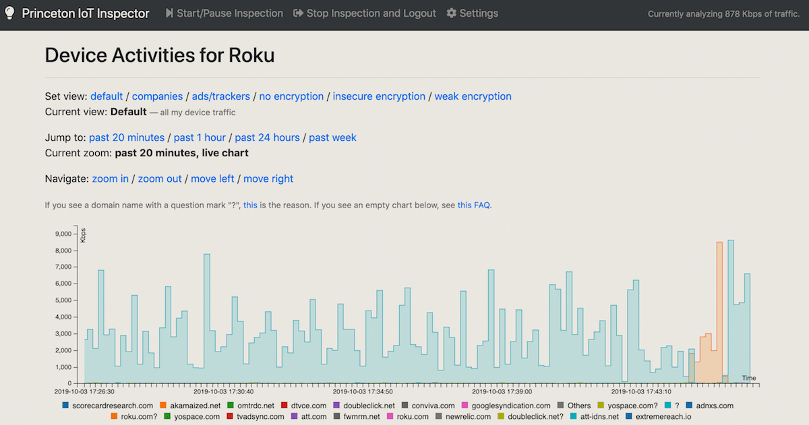
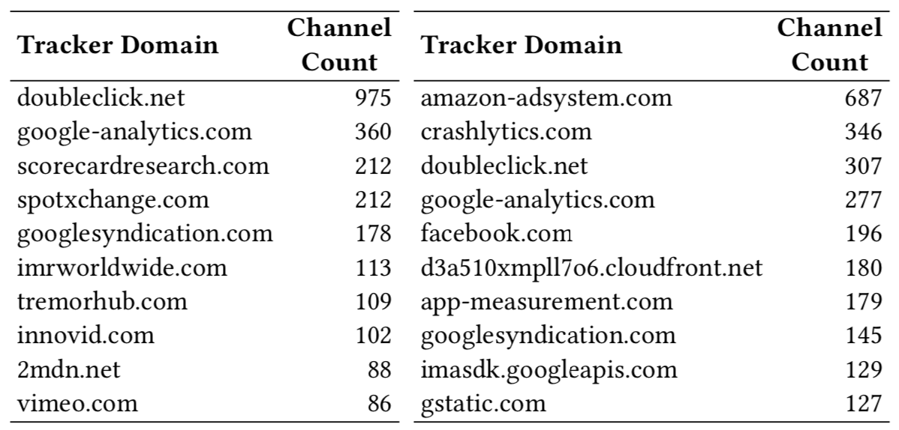
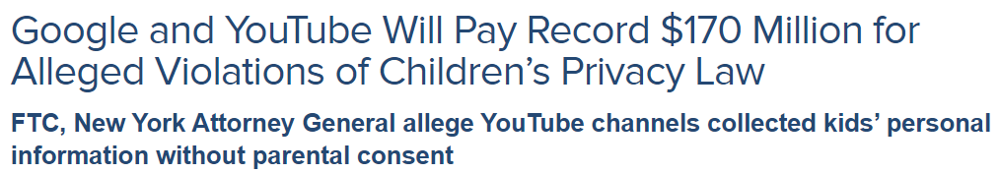

## Why the Smart Home Is Hard {.center}

> The devices in your home are **always on**, **rarely patched**, and **talking to
> servers you never chose** — and almost nobody is watching the traffic.

A smart speaker, a thermostat, a doorbell camera, and a streaming stick share one Wi-Fi
network. Each is a small, opaque computer with sensors, an internet connection, and a
business model.

::: {.notes}
Frame the lecture: this is where *security* (devices can be discovered and controlled)
and *privacy* (devices leak what you do at home) collide. The recurring research
question for the whole deck: "What are these devices doing, and who are they talking
to?" We have studied this for years; the answers keep getting worse.
:::

## Two Questions That Drive the Lecture

::: {.columns}
::: {.column width="50%"}
**Security**

- Can a *website* you visit reach into your home network?
- Can it **discover** and **control** your devices?
- What happens when devices are not isolated from each other?
:::
::: {.column width="50%"}
**Privacy**

- Who do your devices **contact** when you're not looking?
- What **identifiers** and **content** leak to third parties?
- Do the privacy settings vendors offer actually work?
:::
:::

::: {.notes}
This is the roadmap. First half: web-based attacks that cross the boundary from browser
to LAN. Second half: measurement studies of what devices leak (IoT Inspector + the smart
TV crawler). Tie back to earlier lectures — same-origin policy, third-party tracking,
DNS — all reappear here in the IoT setting.
:::

## Studying IoT Is Genuinely Hard

- **Anecdotal reports** don't generalize — one teardown of one camera tells you little
- **Internet-wide scans** (Shodan-style) see only what's *exposed* to the public internet
- The interesting traffic happens *inside* **home and enterprise networks** — proprietary,
  unobservable, behind NAT
- Heterogeneity: thousands of device types, vendors, and protocols (Wi-Fi, **Z-Wave**,
  Zigbee, BLE)

The core methodological problem: **how do you observe real devices in real homes, at scale,
without violating users' privacy?**

::: {.notes}
Set up why measurement is the contribution. You cannot study the smart home the way you
study the web (crawlers) or mobile (app stores + instrumentation). The two systems in
this deck — IoT Inspector and the TV crawler — are answers to this observability problem.
:::

# Part 1: Web-Based Attacks on Local Devices {.center}

## Many IoT Devices Run an Unauthenticated Web Server

Most smart-home gadgets talk to their phone app through a **local HTTP server** on the
device — often with **no authentication and no encryption**.

That means the **classic web-attack toolkit applies to your living room**:

- A malicious web page can try to **find** devices on your LAN
- ...and then **talk to them directly**, as if it were the companion app

::: {.notes}
This is the key insight of Acar, Huang, Li, Narayanan, Feamster (SIGCOMM IoT S&P
Workshop 2018). Circa 2015 we bought the top devices on Amazon expecting hard reverse
engineering — and found almost no encryption. The device's "API" is just an open web
server. So the browser security model becomes the IoT security model.
:::

## Attack 1: Discover Local Devices from a Web Page {.smaller}

A page you visit runs JavaScript that fingerprints your LAN — without your knowledge:

1. **Get the local IP** of the victim via a **WebRTC** SDP candidate (e.g. `192.168.6.6`)
2. **Scan the subnet**: fire `fetch()` GETs at port 81 across `192.168.6.*`; time the
   responses — **TCP RST is fast** (host up, port closed), **timeout is slow** (no host)
3. **Identify devices**: request known device endpoints (e.g. `GET /setup.xml`) and read
   the **`MediaError` message** from an HTML5 `<audio>` element — a **side channel** that
   leaks whether a cross-origin resource exists

::: {.notes}
Walk the three steps slowly. Step 3 is the clever part: the same-origin policy is supposed
to stop a page from learning anything about a cross-origin response (except images/CSS).
The differing MediaError strings ("DEMUXER_ERROR..." vs "Format error") leak existence —
a new side channel. Chrome paid a bug bounty for it. Note the defenses landed later:
Safari timed the fetches out, Edge gave no error strings, so the attack didn't work there.
This is the lateral, "stepping-stone" pattern: browser → LAN reconnaissance.
:::

## Attack 2: DNS Rebinding to Control Devices {.smaller}

The discovery side channel only *reads*. To **send commands**, the attacker fully bypasses
the same-origin policy with **DNS rebinding** (Dean, Felten, Wallach, IEEE S&P 1996):

1. You visit `attacker.com`; its **authoritative nameserver** answers with the attacker's
   web-server IP and a **very short TTL**
2. The page loads, then keeps probing for a resource
3. When the cached record expires, the nameserver **rebinds** `attacker.com` to a **local
   IP** (`192.168.6.88`) with a long TTL
4. Now the browser believes `attacker.com` *is* your device — so requests to it are
   **same-origin** and the SOP no longer protects the device

**Demonstrated on Google Home / Chromecast:** play arbitrary YouTube videos, reboot the
device, scan for nearby Wi-Fi networks.

::: {.notes}
The attacker needs to control a domain, its web server, *and* its authoritative DNS. The
trick is exploiting the gap between what the browser's SOP keys on (the hostname) and what
the network actually routes to (the rebound IP). Emphasize: this is a 1996 attack that
still works against 2018-era IoT because devices had no Host-header checks, no auth, no
TLS. Defenses: DNS pinning, rejecting private IPs in public responses, Host allow-listing
on the device.
:::

## Why These Attacks Matter

::: {.columns}
::: {.column width="55%"}
- **No isolation**: devices trust anything on the LAN, so a browser becomes a foothold
- **Stepping stone**: discovery + control chains into full device compromise
- **Privacy leakage**: even *discovery* fingerprints your home (which devices you own)
- The barrier to entry is **a single malicious web page** — no malware install needed
:::
::: {.column width="45%"}
**Defense direction:** the network must protect devices from **lateral** attacks —
segmentation, Host-header validation, treating the LAN as **untrusted**.
:::
:::

::: {.notes}
Connect to the Mirai story from the DDoS lecture: IoT is attractive *because* it is
unpatched and unisolated. Here the takeaway is the "zero-trust LAN" idea — your home
network should not be a soft interior behind a hard perimeter.
:::

# Part 2: Measuring the Smart Home at Scale {.center}

## IoT Inspector: Crowdsourcing Home-Network Traffic

An **open-source desktop app** that **passively monitors** a smart-home network and shows
users what their devices are doing.

::: {.columns}
::: {.column width="50%"}
**For users**

- Easy to install, no new hardware
- Visualizes security & privacy issues
:::
::: {.column width="50%"}
**For researchers**

- A large, **labeled**, non-proprietary dataset of real IoT traffic in real homes
:::
:::

Publicly released **May 2019**; grew to **5,000+ users** and **50,000+ devices** worldwide
(Huang, Apthorpe, Acar, Li, Feamster).

::: {.notes}
This is the answer to the observability problem from earlier. The genius is aligning
incentives: users get a privacy dashboard, researchers get ground-truth labeled data.
20% of the 50k devices got user-supplied labels — that labeling is what makes the dataset
scientifically valuable.
:::

## How It Sees the Traffic: ARP Spoofing

IoT Inspector runs on an ordinary laptop with **no special hardware** by quietly inserting
itself into the path:

- Tells the **router**: "I'm the camera"
- Tells the **camera**: "I'm the router"

Now both sides send their packets through the laptop, which records and forwards them — a
**man-in-the-middle by ARP spoofing**, used here for *self-measurement*.

It also infers inbound data rates from **TCP ACK numbers** when it only sees one direction.
*Caveat:* some devices/routers reject spoofed ARP, so coverage isn't perfect.

::: {.notes}
Same primitive an attacker would use — turned into a benign measurement tool on your own
network. Good moment to recall ARP has no authentication (from the networking basics).
Be explicit that this only works on your own LAN with consent; the consent + privacy
design is what makes it ethical research.
:::

## What Devices Talk To {.smaller}

::: {.notes}
This is the "aha" screenshot — Ira Flatow (Science Friday) ran it on his Roku, Oct 2019.
A single streaming session fans out to dozens of tracking domains: doubleclick,
scorecardresearch, conviva, etc. Point out the "no encryption / insecure encryption /
weak encryption" view selectors at the top — the tool surfaces TLS hygiene too.
:::

## Findings from 50,000 Devices

::: {.columns}
::: {.column width="52%"}
**Privacy**

- Pervasive **third-party tracking** — even on a smart fridge (talks to Nielsen)
- **Smart TVs** routinely contact ad/tracking services
:::
::: {.column width="48%"}
**Security**

- **Ineffective encryption**: devices using TLS 1.0, or insecure cipher suites
  (one camera negotiated 13–21 weak suites)
- Plenty of **plaintext** still in the wild
:::
:::

The dashboard turns invisible network behavior into something a non-expert can *see* — and
gives researchers evidence that the problem is **systematic, not anecdotal**.

::: {.notes}
The whole point of the "at scale" framing: anecdotes don't move policy, distributions do.
"14.9% of smart TVs contact ad/tracking services" is the kind of claim you can put in
front of a regulator. Segue: to know *what* leaks (not just *to whom*), you need to
decrypt — which motivates the lab study.
:::

# Part 3: What Your TV Tells On You {.center}

## Cord-Cutting Created a New Tracking Surface

Streaming sticks (**Roku**, **Amazon Fire TV**) are cheap and everywhere — and they're an
**open app ecosystem**, so far more third parties get involved than with a traditional TV.

- Channels (apps) can report **viewing history** and device **identifiers**
- Third-party channels can bundle their **own ad/tracking libraries**

The lab study (Mohajeri Moghaddam et al., **ACM CCS 2019**) was the first **large-scale**
measurement of thousands of channels on these platforms.

::: {.notes}
Contrast with the in-the-wild IoT Inspector study: here we go into the lab to *decrypt*
and read content, trading scale for depth. Motivate why streaming is worth a whole study —
it's the most-used IoT device in most homes and the ecosystem is wide open.
:::

## Building a Smart-TV Crawler {.smaller}

You can't reuse web/mobile tooling — there are **no standard automation tools, no feedback,
and you can't easily install your own TLS certificate** on a TV.

So the crawler simulates a viewer end-to-end:

1. **Install** a channel → **launch** → **navigate** to a video → **play** → **uninstall**
2. **Brute-force navigation** with common key sequences (`[OK, OK, OK]`, `[Down, OK, OK]`)
3. **Detect playback** by listening for **≥5 seconds of audio** (96% accurate; ~144/150)
4. **Decrypt traffic** — best-effort MITM proxy on Roku; on Fire TV, **root the device**
   and use **Frida** to defeat per-channel certificate pinning

::: {.notes}
The engineering is the contribution: how do you "watch" 1,000 apps automatically when
there's no Selenium for a TV? Audio detection as a playback oracle is the clever bit.
Decryption is the hard part — pinning means you often can't read TLS; they rooted Fire TV
and used Frida, and still only decrypted ≥1 connection from ~5% of channels on the harder
platform. Be honest about that limitation.
:::

## Almost Every Channel Talks to a Known Tracker

- **89%** of Amazon Fire TV channels and **69%** of Roku channels contact a **known tracker**
- The usual web/mobile players dominate: **doubleclick**, **google-analytics**,
  **scorecardresearch**, **amazon-adsystem**
- Some channels leak **video titles** and **persistent IDs** to third parties

::: {.notes}
Two things to draw out: (1) the same tracking oligopoly that runs the web has colonized
your TV — these aren't exotic adversaries; (2) they also found *previously unknown*
trackers (received the Ad ID / device serial, contacted by multiple channels, on no
filter list) — meaning blocklists structurally miss new entrants.
:::

## Children's Privacy: COPPA Enters the Picture

The crawler found **persistent identifiers** (Android ID, Ad ID, device serial number)
leaking from **child-directed channels** — exactly the conduct that drew a record
enforcement action.

::: {.notes}
September 2019: FTC + NY AG settled with Google/YouTube for $170M over COPPA — collecting
persistent identifiers from viewers of child-directed channels without parental consent.
The TV study found the same pattern on streaming platforms. This is the bridge to the
privacy-law lectures: a technical measurement finding maps directly onto a legal regime
(COPPA) and a concrete penalty.
:::

## The Opt-Outs Don't Really Work

Both platforms offer a privacy toggle — Roku's **"Limit Ad Tracking,"** Amazon's
**"No interest-based ads"** — marketed like Do-Not-Track.

The measurement verdict: **largely ineffective.**

- Channels **still shared persistent IDs** even with "limited ads" enabled
- Platform restrictions make it hard to block tracking with conventional tools; **DNS
  blocklists** (Pi-hole) can crash some channels
- **Previously unknown trackers** evade every standard filter list

**Takeaway:** individual self-help has sharp limits — meaningful protection needs
**regulation and platform-level defaults**, not buried toggles.

::: {.notes}
This is the policy punchline of the whole deck. The honest finding is that the controls
users are given are theater. That hands you the debate question: should the burden be on
the consumer (notice-and-choice) or on the platform/regulator (defaults + enforcement)?
Tie to the privacy-law unit.
:::

## A 2026 Vignette: States Go After Your TV {.smaller}

::: {.vignette}
On **December 15, 2025**, Texas AG Ken Paxton sued **five TV makers** — Samsung, Sony, LG,
Hisense, and TCL — over **Automatic Content Recognition (ACR)**: software that fingerprints
*everything on screen* (the complaints allege screenshots as often as **every 500 ms**, and
for one vendor "every sound and image every 10 ms") and sells the viewing data without
clear consent. A court issued the **first-ever TRO against a TV maker** two days later, and
on **February 26, 2026** **Samsung settled**, agreeing to require **express consent**.
**Kentucky** has since become the first state to pass an ACR-specific consent law.
:::

This is the same finding the **2019** TV-crawler study made — now driving **state
enforcement** and **new statutes**.

::: {.notes}
This is the freshest hook and the strongest "research-to-policy" arc in the course: an
academic measurement result (your TV watches you) became, six years later, a wave of AG
lawsuits and the first ACR consent law. Recall the older Vizio $2.2M FTC/NJ settlement
(2017) as the precedent. Ask: why did it take state AGs, not the FTC, this time? Connect
to the state-vs-federal privacy patchwork from the privacy-law lecture.
:::

## Putting It Together {.smaller}

::: {.columns}
::: {.column width="50%"}
**Security**

- IoT lacks **isolation** — a web page can discover and control devices on your LAN
- Old attacks (DNS rebinding) work because devices have **no auth, no TLS, no Host checks**
:::
::: {.column width="50%"}
**Privacy**

- **Pervasive tracking** + weak/absent encryption across devices and streaming platforms
- **User-facing privacy controls are largely ineffective**
:::
:::

**Method matters:** measurement systems (**IoT Inspector** in the wild, the **TV crawler**
in the lab) turn anecdotes into evidence — and evidence is what moves **regulators**.

::: {.notes}
Land the three threads: (1) the LAN must be treated as untrusted; (2) the tracking economy
followed us from web → mobile → home → TV; (3) the contribution that lets you say anything
policy-relevant is *measurement at scale*. Preview the privacy-law and consumer-protection
lectures, where these findings become legal arguments.
:::

# Discussion {.center}

**Thought question:** you can't make your smart TV stop running ACR, and the opt-out
doesn't work. Where *should* the obligation sit — the **device maker**, the **platform**,
the **ISP/router**, or the **regulator**? Defend your answer.
