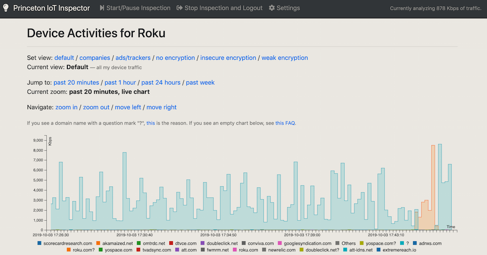
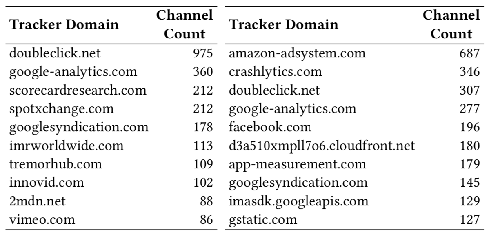
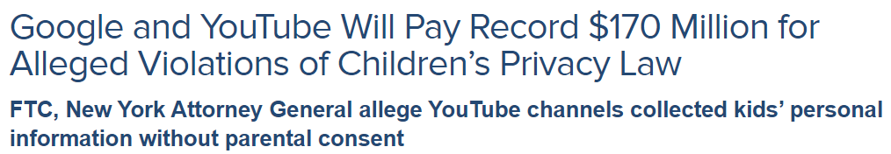

## Why the Smart Home Is Hard {.center}

> The devices in your home are **always on**, **rarely patched**, and **talking to
> servers you never chose** — and almost nobody is watching the traffic.

A smart speaker, a thermostat, a doorbell camera, and a streaming stick share one Wi-Fi
network. Each is a small, opaque computer with sensors, an internet connection, and a
business model.

::: {.notes}
Frame the lecture: this is where security (devices can be discovered and controlled)
and privacy (devices leak what you do at home) collide on one Wi-Fi network. The
recurring research question for the whole deck is a single sentence: what are these
devices doing, and who are they talking to? Cold-call the room — how many
internet-connected devices in the place you sleep? Then how many can you name the
last software update for? Almost nobody can answer both. Cross-reference the
companion IoT breakout and the IoT debate that will run later this week. We've
studied this problem for years; the answers keep getting worse, and this deck ends
with state AGs treating the same findings as consumer-protection cases.
:::

## Two Questions That Drive the Lecture

::: {.columns}
::: {.column width="50%"}
**Security**

- Can a *website* you visit reach into your home network?
- Can it **discover** and **control** your devices?
- What happens when devices are not isolated from each other?
:::
::: {.column width="50%"}
**Privacy**

- Who do your devices **contact** when you're not looking?
- What **identifiers** and **content** leak to third parties?
- Do the privacy settings vendors offer actually work?
:::
:::

::: {.notes}
This is the roadmap for the deck; keep it explicit. First half is web-based attacks
that cross the boundary from browser to LAN — same-origin policy is the fence, DNS
rebinding is how you jump it. Second half is measurement studies of what devices
actually leak: IoT Inspector in the wild, plus the smart-TV crawler in the lab.
Tie back to earlier lectures — same-origin policy from the web-security block,
third-party tracking from Meeting 9, DNS from the networking basics — all reappear
here in the IoT setting. The through-line: the browser security model becomes the
IoT security model, and the ad-tech tracking economy becomes the IoT tracking
economy. Preview the policy payoff on the last slide, which is the freshest research-
to-enforcement arc in the course.
:::

## Studying IoT Is Genuinely Hard

- **Anecdotal reports** don't generalize — one teardown of one camera tells you little
- **Internet-wide scans** (Shodan-style) see only what's *exposed* to the public internet
- The interesting traffic happens *inside* **home and enterprise networks** — proprietary,
  unobservable, behind NAT
- Heterogeneity: thousands of device types, vendors, and protocols (Wi-Fi, **Z-Wave**,
  Zigbee, BLE)

The core methodological problem: **how do you observe real devices in real homes, at scale,
without violating users' privacy?**

::: {.notes}
Methodological setup — this is why measurement is the whole contribution of the
lecture. You cannot study the smart home the way you study the web (crawlers)
or mobile (app stores plus instrumentation). Anecdotes don't generalize; Shodan
only sees what's exposed to the public internet, and the interesting traffic is
behind NAT. Add heterogeneity: Wi-Fi, Z-Wave, Zigbee, and BLE are all in the
same room, none of them observable the same way. The two systems in this deck —
IoT Inspector and the TV crawler — are direct answers to that observability
problem. Ask: if you wanted to know what your neighbor's smart speaker was
doing tonight, how would you find out without breaking any laws?
:::

# Part 1: Web-Based Attacks on Local Devices {.center}

## Many IoT Devices Run an Unauthenticated Web Server

Most smart-home gadgets talk to their phone app through a **local HTTP server** on the
device — often with **no authentication and no encryption**.

That means the **classic web-attack toolkit applies to your living room**:

- A malicious web page can try to **find** devices on your LAN
- ...and then **talk to them directly**, as if it were the companion app

::: {.notes}
This is the key insight of Acar, Huang, Li, Narayanan, Feamster, "Web-based
Attacks to Discover and Control Local IoT Devices," SIGCOMM 2018 Workshop on
IoT Security and Privacy. Origin story worth telling out loud: circa 2015 the
team bought the top-selling devices on Amazon expecting weeks of hard reverse
engineering — and found almost no encryption and almost no authentication.
The device's "API" is just an open web server on the local network. So the
browser security model becomes the IoT security model, which means every web
attack the class has already learned about applies inside your living room.
Cold-call: which of the browser defenses you know about — SOP, CORS,
HttpOnly cookies — would a device without any TLS actually get to rely on?
:::

## Attack 1: Discover Local Devices from a Web Page {.smaller}

A page you visit runs JavaScript that fingerprints your LAN — without your knowledge:

1. **Get the local IP** of the victim via a **WebRTC** SDP candidate (e.g. `192.168.6.6`)
2. **Scan the subnet**: fire `fetch()` GETs at port 81 across `192.168.6.*`; time the
   responses — **TCP RST is fast** (host up, port closed), **timeout is slow** (no host)
3. **Identify devices**: request known device endpoints (e.g. `GET /setup.xml`) and read
   the **`MediaError` message** from an HTML5 `<audio>` element — a **side channel** that
   leaks whether a cross-origin resource exists

::: {.notes}
Walk the three steps slowly; the payoff is understanding a new side channel.
Step 1 uses WebRTC RTCPeerConnection to leak the victim's local IP through the
SDP candidate — pure browser feature, no permission prompt. Step 2 is timing:
TCP RST is fast (host up, port closed), timeout is slow (no host). Step 3 is
the clever part: the same-origin policy is supposed to stop a page from
learning anything about a cross-origin response (except images and CSS), but
the differing HTML5 MediaError strings — "DEMUXER_ERROR..." versus "Format
error" — leak existence. That's a new side channel the SOP is supposed to
prevent. Chrome paid a bug bounty for it. Note the defenses that landed later:
Safari timed the fetches out, Edge gave no error strings, so the attack didn't
work there. This is the lateral, "stepping-stone" pattern: browser used as
LAN reconnaissance tool with no malware installed on the victim's machine.
:::

## Attack 2: DNS Rebinding to Control Devices {.smaller}

The discovery side channel only *reads*. To **send commands**, the attacker fully bypasses
the same-origin policy with **DNS rebinding** (Dean, Felten, Wallach, IEEE S&P 1996):

1. You visit `attacker.com`; its **authoritative nameserver** answers with the attacker's
   web-server IP and a **very short TTL**
2. The page loads, then keeps probing for a resource
3. When the cached record expires, the nameserver **rebinds** `attacker.com` to a **local
   IP** (`192.168.6.88`) with a long TTL
4. Now the browser believes `attacker.com` *is* your device — so requests to it are
   **same-origin** and the SOP no longer protects the device

**Demonstrated on Google Home / Chromecast:** play arbitrary YouTube videos, reboot the
device, scan for nearby Wi-Fi networks.

::: {.notes}
Original paper worth naming: Dean, Felten, and Wallach, "Java Security: From
HotJava to Netscape and Beyond," IEEE S&P 1996 — the birth of the DNS
rebinding attack. The attacker needs to control a domain, its web server, and
its authoritative DNS. The trick is exploiting the gap between what the
browser's SOP keys on (the hostname) and what the network actually routes to
(the rebound IP). Emphasize: this is a 1996 attack that still worked against
2018-era IoT because devices had no Host-header checks, no auth, and no TLS.
Brannon Dorsey's 2018 disclosure demonstrated it on Google Home and
Chromecast — arbitrary YouTube playback, reboot, Wi-Fi scanning. Fix classes
to name: DNS pinning, rejecting private IPs in public DNS responses, Host
header allow-listing on the device, and Chrome's Private Network Access. Ask
the room: why did the same attack work 22 years after publication?
:::

## Why These Attacks Matter

::: {.columns}
::: {.column width="55%"}
- **No isolation**: devices trust anything on the LAN, so a browser becomes a foothold
- **Stepping stone**: discovery + control chains into full device compromise
- **Privacy leakage**: even *discovery* fingerprints your home (which devices you own)
- The barrier to entry is **a single malicious web page** — no malware install needed
:::
::: {.column width="45%"}
**Defense direction:** the network must protect devices from **lateral** attacks —
segmentation, Host-header validation, treating the LAN as **untrusted**.
:::
:::

::: {.notes}
Connect explicitly to the Mirai story from the DDoS lecture: the October 2016
Dyn takedown showed that IoT is attractive to attackers precisely because it
is unpatched and unisolated. Here the takeaway is the "zero-trust LAN" idea —
your home network should not be a soft interior behind a hard perimeter,
because a single malicious web page can be the perimeter breach. Segmentation,
Host-header validation, and treating the LAN as untrusted are the defensive
posture. Debate hook: consumers can't reasonably run their own segmentation —
so does that shift the obligation to router vendors, ISPs, or device makers?
That's the same debate that comes back on the last slide of this deck.
:::

# Part 2: Measuring the Smart Home at Scale {.center}

## IoT Inspector: Crowdsourcing Home-Network Traffic

An **open-source desktop app** that **passively monitors** a smart-home network and shows
users what their devices are doing.

::: {.columns}
::: {.column width="50%"}
**For users**

- Easy to install, no new hardware
- Visualizes security & privacy issues
:::
::: {.column width="50%"}
**For researchers**

- A large, **labeled**, non-proprietary dataset of real IoT traffic in real homes
:::
:::

Publicly released **May 2019**; grew to **5,000+ users** and **50,000+ devices** worldwide
(Huang, Apthorpe, Acar, Li, Feamster).

::: {.notes}
This is the answer to the observability problem from earlier. Paper: Huang,
Apthorpe, Acar, Li, Feamster, "IoT Inspector: Crowdsourcing Labeled Network
Traffic from Smart Home Devices at Large Scale," PoPETS 2020 (arXiv 1909.09848).
The genius is aligning incentives — users get a privacy dashboard, researchers
get ground-truth labeled data. Roughly 20% of the 50,000 devices got
user-supplied labels, and that labeling is what makes the dataset scientifically
valuable. Publicly released May 2019; TechCrunch coverage in April 2019 helped
seed adoption. Project now hosted at Princeton (inspector.cs.princeton.edu) and
NYU (inspector.engineering.nyu.edu) under Danny Yuxing Huang. Recent extensions
worth naming for follow-on reading: He et al. at EuroS&P 2024 on allowlists,
and Kumar et al. at PoPETS 2024 on tracing IoT data endpoints.
:::

## How It Sees the Traffic: ARP Spoofing

IoT Inspector runs on an ordinary laptop with **no special hardware** by quietly inserting
itself into the path:

- Tells the **router**: "I'm the camera"
- Tells the **camera**: "I'm the router"

Now both sides send their packets through the laptop, which records and forwards them — a
**man-in-the-middle by ARP spoofing**, used here for *self-measurement*.

It also infers inbound data rates from **TCP ACK numbers** when it only sees one direction.
*Caveat:* some devices/routers reject spoofed ARP, so coverage isn't perfect.

::: {.notes}
Same primitive an attacker would use — ARP spoofing, sometimes called
man-in-the-middle — turned into a benign measurement tool on your own network.
Good moment to recall from networking basics that ARP has no authentication;
anyone on the LAN can announce whatever MAC-to-IP mapping they like. Inbound
data rates are inferred from TCP ACK numbers when only one direction is
observed. Be explicit that this only works on your own LAN with your consent;
the consent, on-device design, and opt-in labeling are what make this ethical
research rather than an attack. Ask: if the tool is technically indistinguishable
from an attack, what makes it acceptable to run — is it the intent, the
consent, or the design?
:::

## What Devices Talk To {.smaller}

::: {.notes}
This is the "aha" screenshot — Ira Flatow of Science Friday ran IoT Inspector
on his Roku in October 2019 and got exactly this graph on the air. A single
streaming session fans out to dozens of tracking domains: doubleclick,
scorecardresearch, Conviva, and more. Point at the "no encryption / insecure
encryption / weak encryption" view selectors at the top — the tool surfaces
TLS hygiene alongside third-party contact. This one image is worth a full
pause; students internalize that "my streaming stick" fans out to a whole
tracking ecosystem faster from the picture than from the numbers on the next
slide. Cold-call: which of these third-party domains do you recognize from
the web-tracking lecture?
:::

## Findings from 50,000 Devices

::: {.columns}
::: {.column width="52%"}
**Privacy**

- Pervasive **third-party tracking** — even on a smart fridge (talks to Nielsen)
- **Smart TVs** routinely contact ad/tracking services
:::
::: {.column width="48%"}
**Security**

- **Ineffective encryption**: devices using TLS 1.0, or insecure cipher suites
  (one camera negotiated 13–21 weak suites)
- Plenty of **plaintext** still in the wild
:::
:::

The dashboard turns invisible network behavior into something a non-expert can *see* — and
gives researchers evidence that the problem is **systematic, not anecdotal**.

::: {.notes}
The whole point of the "at scale" framing: anecdotes don't move policy;
distributions do. "14.9% of smart TVs contact ad/tracking services" is the
kind of claim you can put in front of a regulator or a legislator. Note the
security findings too: TLS 1.0 in production, one camera negotiating 13–21
weak cipher suites, plenty of plaintext still in the wild. Segue: to know
what leaks (not just to whom), you need to decrypt — which motivates the
lab study on the next slide. Ask the room: which of these findings is a
security problem, which is a privacy problem, and which is both? Most are both.
:::

# Part 3: What Your TV Tells On You {.center}

## Cord-Cutting Created a New Tracking Surface

Streaming sticks (**Roku**, **Amazon Fire TV**) are cheap and everywhere — and they're an
**open app ecosystem**, so far more third parties get involved than with a traditional TV.

- Channels (apps) can report **viewing history** and device **identifiers**
- Third-party channels can bundle their **own ad/tracking libraries**

The lab study (Mohajeri Moghaddam et al., **ACM CCS 2019**) was the first **large-scale**
measurement of thousands of channels on these platforms.

::: {.notes}
Paper: Mohajeri Moghaddam, Acar, Yu, Li, Vallina-Rodriguez, Feamster,
"Watching You Watch: The Tracking Ecosystem of Over-the-Top TV Streaming
Devices," ACM CCS 2019 — the first large-scale measurement of thousands of
channels on Roku and Amazon Fire TV. Contrast with the in-the-wild IoT
Inspector study: here we go into the lab to decrypt and read content, trading
scale for depth. Motivate why streaming is worth a whole study — it's the
most-used IoT device in most homes and the ecosystem is wide open, with any
channel able to bundle its own ad and tracking libraries. Ask: what's the
equivalent of the app-store review process for a Roku channel? Effectively
nothing, and that's why this study matters.
:::

## Building a Smart-TV Crawler {.smaller}

You can't reuse web/mobile tooling — there are **no standard automation tools, no feedback,
and you can't easily install your own TLS certificate** on a TV.

So the crawler simulates a viewer end-to-end:

1. **Install** a channel → **launch** → **navigate** to a video → **play** → **uninstall**
2. **Brute-force navigation** with common key sequences (`[OK, OK, OK]`, `[Down, OK, OK]`)
3. **Detect playback** by listening for **≥5 seconds of audio** (96% accurate; ~144/150)
4. **Decrypt traffic** — best-effort MITM proxy on Roku; on Fire TV, **root the device**
   and use **Frida** to defeat per-channel certificate pinning

::: {.notes}
The engineering is the contribution: how do you watch a thousand apps
automatically when there's no Selenium for a TV? Audio detection as a
playback oracle is the clever bit — 96% accuracy, roughly 144 out of 150
trials. Decryption is the hard part; certificate pinning means TLS is often
unreadable to a MITM proxy. They rooted Fire TV and used Frida — the
dynamic-instrumentation toolkit — to defeat per-channel certificate pinning,
and still only decrypted at least one connection from about 5% of channels
on the harder platform. Be honest about that limitation when you present the
findings on the next slide. The methodological point matters: measurement
studies live and die on how believable the coverage numbers are.
:::

## Almost Every Channel Talks to a Known Tracker

- **89%** of Amazon Fire TV channels and **69%** of Roku channels contact a **known tracker**
- The usual web/mobile players dominate: **doubleclick**, **google-analytics**,
  **scorecardresearch**, **amazon-adsystem**
- Some channels leak **video titles** and **persistent IDs** to third parties

::: {.notes}
Two things to draw out. First: the same tracking oligopoly that runs the web
has colonized your TV — DoubleClick, google-analytics, ScorecardResearch,
amazon-adsystem. These aren't exotic adversaries; they're the same firms from
last lecture. Second: the team also found previously unknown trackers —
domains that received the Ad ID or device serial, were contacted by multiple
independent channels, and appeared on no standard filter list. That last
point is the structural finding: blocklists miss new entrants by construction,
because they only know about what someone has already reported. Cross-reference
back to the "list-based blocking" defense from Meeting 9 — same limitation,
new setting. This is why measurement studies keep needing to be redone.
:::

## Children's Privacy: COPPA Enters the Picture

The crawler found **persistent identifiers** (Android ID, Ad ID, device serial number)
leaking from **child-directed channels** — exactly the conduct that drew a record
enforcement action.

::: {.notes}
Anchor case: FTC and NY AG v. Google & YouTube, September 4, 2019 — a
record $170M COPPA settlement for collecting persistent identifiers from
viewers of child-directed channels without parental consent. The TV crawler
found the same pattern on streaming platforms. Follow-on IoT precedent: on
May 31, 2023 the FTC settled with Amazon over Ring and Alexa for $31M total —
Ring paid $5.8M for letting employees browse customer bedroom cameras; Alexa
paid $25M for indefinite retention of children's voice recordings, and Amazon
was barred from training models on data users deleted. This is the bridge to
the privacy-law lecture: a technical measurement finding maps directly onto a
legal regime (COPPA) and a concrete penalty. Cross-reference the companion
IoT breakout. Debate hook: is a $170M fine a deterrent, a cost of doing
business, or a subsidy for a regulator?
:::

## The Opt-Outs Don't Really Work

Both platforms offer a privacy toggle — Roku's **"Limit Ad Tracking,"** Amazon's
**"No interest-based ads"** — marketed like Do-Not-Track.

The measurement verdict: **largely ineffective.**

- Channels **still shared persistent IDs** even with "limited ads" enabled
- Platform restrictions make it hard to block tracking with conventional tools; **DNS
  blocklists** (Pi-hole) can crash some channels
- **Previously unknown trackers** evade every standard filter list

**Takeaway:** individual self-help has sharp limits — meaningful protection needs
**regulation and platform-level defaults**, not buried toggles.

::: {.notes}
This is the policy punchline of the whole deck. The honest finding is that
the controls users are given — Roku's "Limit Ad Tracking" and Amazon's "No
interest-based ads" — are theater. Channels still shared persistent IDs even
with the toggles on; Pi-hole DNS blocking crashes some channels, and
previously unknown trackers evade every standard filter list. That hands you
the debate question: should the burden be on the consumer (notice-and-choice)
or on the platform/regulator (defaults plus enforcement)? Cross-reference the
IoT debate directly — this is the framing question. Tie to the privacy-law
unit: this is exactly the argument the CCPA GPC requirement was designed to
answer. Individual self-help has sharp limits when the platform is hostile.
:::

## A 2026 Vignette: States Go After Your TV {.smaller}

::: {.vignette}
On **December 15, 2025**, Texas AG Ken Paxton sued **five TV makers** — Samsung, Sony, LG,
Hisense, and TCL — over **Automatic Content Recognition (ACR)**: software that fingerprints
*everything on screen* (the complaints allege screenshots as often as **every 500 ms**, and
for one vendor "every sound and image every 10 ms") and sells the viewing data without
clear consent. A court issued the **first-ever TRO against a TV maker** two days later.
**Samsung settled Feb 26, 2026** (express consent, no fine); **LG settled May 11, 2026**
with an added no-transfer-to-CCP clause. Sony, Hisense, and TCL are still fighting.
**Kentucky** passed the first ACR-specific consent statute.
:::

This is the same finding the **2019** TV-crawler study made — now driving **state
enforcement** and **new statutes**.

::: {.notes}
This is the freshest hook and the strongest research-to-policy arc in the
course: an academic measurement result (your TV watches you) became, six years
later, a wave of AG lawsuits and the first ACR consent law. Timeline to say
out loud: Texas AG Ken Paxton sued Samsung, Sony, LG, Hisense, and TCL on
December 15, 2025; a court issued the first-ever TRO against a TV maker
(Hisense) two days later; Samsung settled February 26, 2026 with express
consent and no fine; LG settled May 11, 2026 with an added no-transfer-to-CCP
clause; Sony, Hisense, and TCL are still fighting as of mid-2026. Kentucky
passed the first ACR-specific consent statute. The precedent to recall is
the Vizio $2.2M FTC and NJ settlement, February 2017. Ask: why did it take
state AGs, not the FTC, this time? Connect to the state-vs-federal privacy
patchwork you'll see in Meeting 11.
:::

## Putting It Together {.smaller}

::: {.columns}
::: {.column width="50%"}
**Security**

- IoT lacks **isolation** — a web page can discover and control devices on your LAN
- Old attacks (DNS rebinding) work because devices have **no auth, no TLS, no Host checks**
:::
::: {.column width="50%"}
**Privacy**

- **Pervasive tracking** + weak/absent encryption across devices and streaming platforms
- **User-facing privacy controls are largely ineffective**
:::
:::

**Method matters:** measurement systems (**IoT Inspector** in the wild, the **TV crawler**
in the lab) turn anecdotes into evidence — and evidence is what moves **regulators**.

::: {.notes}
Land the three threads. First: the LAN must be treated as untrusted, because a
web page can discover and control devices on it. Second: the tracking economy
followed us from web to mobile to home to TV, and the same handful of firms
show up at every layer. Third: the contribution that lets you say anything
policy-relevant is measurement at scale. Preview the privacy-law and
consumer-protection lectures where these findings become legal arguments.
Regulatory horizon worth naming: the EU Cyber Resilience Act came into force
December 10, 2024, with reporting duties from September 11, 2026 and full
obligations December 11, 2027; connected toys are Class I "important products
with digital elements." The EU AI Act, as amended by the June 2026 "Digital
Omnibus on AI," brings AI-enabled toys under its high-risk regime with
application dates now August 2, 2027 and December 2, 2027. U.S. side: the
U.S. Cyber Trust Mark is a voluntary label, not a mandate. Cross-reference
the IoT debate as the discussion prompt for this arc.
:::

# Discussion {.center}

**Thought question:** you can't make your smart TV stop running ACR, and the opt-out
doesn't work. Where *should* the obligation sit — the **device maker**, the **platform**,
the **ISP/router**, or the **regulator**? Defend your answer.

::: {.notes}
Frame this as the debate seed for the IoT breakout later this week. Each of the
four candidate loci has a real argument. Device makers know the hardware and set
the defaults, but consumers can't credibly discipline them through market choice.
Platforms sit closest to the tracking, but the platform is often also the ad
seller. ISPs and router vendors could segment the LAN, but that shifts cost to
consumers who didn't ask for it. Regulators can set floors — see the Texas AG
Samsung and LG settlements from earlier in the deck — but move slowly and
patchwork. Encourage the class to defend one and steelman the strongest
objection. The purpose of the exercise is to sit with the fact that there is
no obviously right answer, only a set of trade-offs — which is exactly why the
policy landscape looks so uneven right now.
:::
