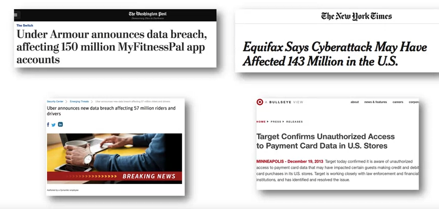

## Privacy Law Always Chases Technology {.center}

> The law must provide some relief to individuals when the acts of others
> interfere with their **right to be let alone.**
> — Warren & Brandeis, *The Right to Privacy*, 1890

A new technology arrives, a harm becomes visible, and the law reacts. That
pattern repeats from gossip photography to mainframes to AI.

::: {.notes}
Warren & Brandeis wrote the 1890 Harvard Law Review article in response to
instantaneous photography and gossip journalism — Warren was upset about
newspapers covering his family's social events. Sound familiar? The whole
lecture is organized around this reactive pattern: name the technology, name
the harm, name the law that followed. Ask: what's the 2026 version of "gossip
photography"? Primary source if you want to show it:
[Warren & Brandeis, "The Right to Privacy" (1890)](https://www.cs.cornell.edu/~shmat/courses/cs5436/warren-brandeis.pdf).
:::

## A 2026 Hook: The FTC Still Sets the Floor {.smaller}

::: {.vignette}
On **Dec. 31, 2025** a federal court approved a **$10M** order against **Disney**
to settle FTC/DOJ allegations it let children's data be collected through
mislabeled "Made for Kids" YouTube videos — a **COPPA** violation
([FTC, Dec. 2025](https://www.ftc.gov/news-events/news/press-releases/2025/12/court-approves-order-requiring-disney-pay-10-million-settle-ftc-allegations-firm-enabled-unlawful)).
The U.S. *still* has **no comprehensive federal privacy law** — so a 1998
children's statute plus the FTC's general authority do the work.
:::

Same year, the FTC moved against **Kochava** for selling precise location data
(order proposed May 2026). Old statutes, new harms.

::: {.notes}
This is the freshest concrete anchor. Two teaching points: (1) the regulator
reaching for a narrow 1998 tool (COPPA) and a general one (Section 5) because
there is nothing comprehensive; (2) enforcement is real and current, not
historical. Swap in whatever broke this week — the FTC press feed always has
something.
:::

# Where Modern Privacy Law Comes From {.center}

FIPPs → PII → the U.S. patchwork → the FTC → GDPR

## Computerized Records Created New Threats {.smaller}

By the 1970s, mainframes made four things newly possible:

- **Unknown databases** holding information about you
- **Cheap mass collection** — scale flips the cost-benefit of surveillance
- **One-to-many dissemination** of records
- **Linking** different kinds of information, gathered different ways

::: {.notes}
These 1970s concerns sound quaint until you note that every one is ~100x worse
with cloud, smartphones, and ad-tech. The point: the *structure* of the threat
(scale, linkage, opacity) is what the law tried to address — and it's the same
structure today.
:::

## FIPPs: The Foundation (HEW, 1973) {.smaller}

The HEW report *Records, Computers, and the Rights of Citizens* gave us the
**Fair Information Practice Principles**:

1. **No secret** record-keeping systems
2. A way to **know** what is collected and how it is used
3. A way to **prevent secondary use** without consent
4. A way to **correct** your record
5. **Reasonable security** and reliability for intended use

Almost every privacy law worldwide descends from these five ideas.

::: {.notes}
Emphasize the through-line: transparency, control, correction, security. Tell
students to keep these five in their head — when we hit GDPR, they'll see the
same DNA (notice, access/rectification, purpose limitation, security). The open
question for the rest of the lecture: does this 1973 model still fit?
:::

## The FIPPs in Practice {.smaller}

::: {.columns}
::: {.column width="50%"}
**Notice** — tell people what you collect, use, share

**Appropriate uses** — primary vs. secondary (national security, public health,
law enforcement)

**Individual choice** — **opt-in** vs. **opt-out**
:::
::: {.column width="50%"}
**Access & correction** — see and fix your record

**Security** — no privacy without it; the root of breach-notification law

**Minimization** — collect only what you need
:::
:::

::: {.notes}
Opt-in vs. opt-out is the sleeper concept — it looks technical but drives
everything. GDPR is opt-in for most processing; the U.S. defaults to opt-out,
and the empirical fact is that almost no one ever opts out. That single design
choice determines whether a "choice" regime protects anyone. Foreshadows the
Meeting 8 dark-patterns research.
:::

## Notice and Consent Is Broken {.smaller}

The model assumes a person reads, understands, and meaningfully agrees.

- Policies run **thousands of words** and change without warning
- Stated policy and actual practice **diverge** — that gap is what the FTC sues on
- "Consent" via a cookie wall is not a real choice

Demo: [tosdr.org](https://tosdr.org/) grades real privacy policies.

::: {.notes}
This is the central critique of the orthodox model. The notice-and-consent
paradigm puts the entire burden on the individual, who has neither the time nor
the information to bear it. Connect forward: the FTC's deception theory exists
*precisely because* the gap between promise and practice is where the harm lives.
:::

## Re-Examining FIPPs in the Age of Inference {.smaller}

FIPPs assume a world that no longer exists:

::: {.columns}
::: {.column width="50%"}
**Old model**

- Data sits in a database for later retrieval
- Meaning is **evident on its face**
- Processing = simple joins
:::
::: {.column width="50%"}
**Today**

- Data accessed via **queries**, not shipping
- Harm is new **inference**, not record-linking
- Probabilistic ML draws conclusions you never disclosed
:::
:::

Example: differential privacy deliberately adds **noise** — violating "data must
be correct," yet *enhancing* privacy.

::: {.notes}
This is the most intellectually interesting slide. FIPPs were built for static
records; modern systems infer. Target inferring a teenager's pregnancy from
purchase patterns is the canonical example — no "PII" was leaked, yet a deeply
private fact was produced. The paradigm may be orthogonal to today's real harm.
:::

## PII Is Not a Bright Line {.smaller}

The classic assumption: scrub name, SSN, address → data is "safe."

**Wrong.** Any attribute that distinguishes one person can re-identify them.

- **AOL (2006):** "anonymized" search logs re-identified by *The New York Times*
- **Netflix Prize (2006):** ratings re-identified by Narayanan & Shmatikov
- **MA health records:** Sweeney re-identified the governor via ZIP + DOB + sex

So is **ZIP code** PII? Is an **IP address**? The line dissolves under inference.

::: {.notes}
PII is a legal fiction that engineering keeps breaking. The three re-id results
are the canon — make students articulate *why* removing identifiers fails:
quasi-identifiers in combination are uniquely identifying. This is why modern
laws shifted from "remove PII" to "reasonably cannot be linked" standards
(e.g., CCPA de-identification) — and why even that is hard to define.
:::

# The U.S. Patchwork {.center}

Sectoral, reactive, incomplete — by design

## Sectoral vs. Omnibus {.smaller}

::: {.columns}
::: {.column width="50%"}
**United States — sectoral**

- No comprehensive federal law
- A patch per sector / harm / actor
- Driven by *who holds the data*, *what harm*, *what data-sharing deal*
:::
::: {.column width="50%"}
**EU — omnibus**

- One law (**GDPR**) over nearly all personal data
- Rights attach to the **data**, not the industry
- Extraterritorial reach
:::
:::

This single distinction — **sectoral vs. omnibus** — explains most U.S./EU
differences in this lecture.

::: {.notes}
Burn this dichotomy in; it's a midterm staple. Sectoral means coverage has
holes by construction. Omnibus means one rulebook but heavy compliance. Neither
is obviously right — that's the GDPR debate at the end.
:::

## The Patchwork, Statute by Statute {.smaller}

::: {.columns}
::: {.column width="50%"}
**Based on who has the data**

- **Privacy Act (1974)** — federal agencies (post-Watergate)
- **FCRA (1970)** — credit bureaus

**Based on anecdote / specific harm**

- **FERPA (1974)** — schools surveilling kids' home life
- **VPPA (1988)** — Judge Bork's video rentals leaked
- **DPPA (1994)** — states selling DMV data
:::
::: {.column width="50%"}
**Data-sharing initiatives**

- **HIPAA (1996)** — health portability & e-records
- **GLBA (1999)** — banks sharing among affiliates

**Special category**

- **COPPA (1998)** — kids under 13
- **GINA (2008)** — genetic discrimination
:::
:::

::: {.notes}
The VPPA story is the keeper: a reporter published Bork's video-rental list
during his Supreme Court nomination, and Congress passed a law within months —
but only about *video tapes*. That's sectoral lawmaking in a nutshell: each
statute fights the last scandal. Note the dates aren't chronological because
Congress reacted issue by issue.
:::

## The HIPAA Gap {.smaller}

HIPAA covers only **providers, plans, and clearinghouses** (and their vendors).

**Not covered:** fitness apps, period trackers, mental-health apps, 23andMe,
most "health" data you actually generate.

- **GoodRx** — fined $1.5M (2023) for sharing health data for ads
- **BetterHelp** — $7.8M (2023) for sharing mental-health data with Facebook

So a *sensitive* category is wide open whenever the holder isn't a "covered
entity."

::: {.notes}
This is the single most useful slide for showing why sectoral law fails:
"health privacy" feels protected, but HIPAA's definition of covered entity
leaves the entire consumer-app economy outside it. The FTC stepped into that gap
with Section 5 (GoodRx, BetterHelp) precisely because HIPAA didn't reach.
:::

## Breach Notification: Regulation by Consequence {.smaller}

{width="78%"}

::: {.notes}
Before 2003, a company could be breached and tell no one. California's SB 1386
(2003) required notifying any resident whose data was exposed — and suddenly
breaches were headlines. Today all 50 states have a law, and HIPAA was amended
to add one. Notification didn't mandate security; it made *insecurity* a PR and
board-level liability. That's "regulation by consequence."
:::

## What a Breach Law Requires Varies {.smaller}

- Triggering "**personal information**": name + SSN, driver's license, account
  numbers; some states add medical, biometric, student data
- Some states notify on **any** breach; others only on **risk of harm**
- Some require notifying **the media**; timelines range from "without
  unreasonable delay" to a fixed number of days

**The patchwork tax:** firms just apply the **strictest** state law (usually
California) to everyone.

::: {.notes}
50 different regimes is genuinely costly, and the rational response is to comply
with the toughest one everywhere — which is *de facto* one national standard set
by California, without Congress ever acting. Tie this to the broader theme:
California has become the default U.S. privacy legislator.
:::

## Equifax (2017): What a Bad Response Looks Like {.smaller}

::: {.columns}
::: {.column width="60%"}
- **147M** Americans' data exposed
- **Six weeks** to disclose
- Stood up a separate, **spoofable** notification site
- Tried to **upsell** credit monitoring to victims
:::
::: {.column width="40%"}
Result: **~$700M** settlement; CEO resigned.
:::
:::

::: {.notes}
Equifax is the case study in how *not* to respond. The data subjects were never
Equifax customers — they couldn't "take their business elsewhere," which is
exactly the FTC's "unfairness" condition (harm not reasonably avoidable). Use it
to motivate why a market alone doesn't discipline data brokers.
:::

# The FTC: De Facto Privacy Regulator {.center}

No privacy statute — one very flexible section

## Section 5 of the FTC Act {.smaller}

> "**Unfair or deceptive** acts or practices in or affecting commerce are
> declared unlawful."

::: {.columns}
::: {.column width="50%"}
**Deceptive**

You promised X, did Y. A representation or omission likely to mislead.
:::
::: {.column width="50%"}
**Unfair**

Substantial injury, **not reasonably avoidable**, not outweighed by benefits.
:::
:::

The FTC stretched a consumer-protection statute into America's main privacy law
— 60+ privacy cases, 2002–2017, and a steady stream since.

::: {.notes}
The key insight: there is no federal "privacy right" being enforced — there's a
*promise-keeping* and *anti-harm* statute doing double duty. Deception is the
easy theory (sue on the gap between policy and practice). Unfairness is the hard
one but reaches conduct even when no promise was broken. This is improvised law.
:::

## Section 5 in Action {.smaller}

::: {.columns}
::: {.column width="50%"}
**Uber (2017)** — "God View" tracking of journalists, politicians, exes despite
privacy claims → consent decree + comprehensive privacy program

**Twitter (2022)** — used 2FA phone numbers for ad targeting → penalty
:::
::: {.column width="50%"}
**Facebook (2019)** — violated its 2011 consent decree; **Cambridge Analytica**
harvested ~87M profiles → **$5B** fine, the largest ever

**Disney (2025)** — COPPA, **$10M** (see opening vignette)
:::
:::

::: {.notes}
Note the mechanism: cases almost always *settle* with a consent decree, not a
trial — so the FTC builds privacy "common law" through orders, not statutes.
Facebook's 2019 order is the model: 20-year program, executive certification,
limits on facial recognition and on repurposing 2FA numbers. Ask: is governance
by consent decree a feature or a bug?
:::

# International: The Omnibus Model {.center}

140+ countries have privacy laws — GDPR is the gravitational center

## GDPR: Scope and Reach {.smaller}

The EU's **General Data Protection Regulation** applies to organizations:

- **located in the EU**, and
- **anywhere**, if any component is in the EU, and
- **anywhere**, if they offer goods/services to, or **monitor**, people in the EU

If EU residents can use your service, you must ask whether GDPR applies.

::: {.notes}
Extraterritoriality is the whole game. A Chicago startup with EU users is in
scope. Critics call it regulatory imperialism; defenders call it the only way to
protect residents in a borderless internet. Either way, it made GDPR the global
default — the "Brussels effect."
:::

## What GDPR Requires {.smaller}

::: {.columns}
::: {.column width="50%"}
**Familiar (the FIPPs DNA)**

- Notice; access **with rectification**
- A **lawful basis** to process (consent, contract, legitimate interest)
- Security
:::
::: {.column width="50%"}
**Newer / sharper**

- **Right to be forgotten** (erasure, with free-expression exceptions)
- **Cross-border transfer** limits — only to "adequate" countries
- **DPIA** before risky processing
:::
:::

::: {.notes}
Point out the left column *is* FIPPs, four decades on. The right column is what's
genuinely new and contested. Right-to-be-forgotten collides head-on with the
U.S. First Amendment — Google delists in the EU but not the U.S. Cross-border:
the EU has repeatedly held the U.S. lacks "adequate" protection (Schrems I & II
invalidated Safe Harbor and Privacy Shield; the 2023 Data Privacy Framework is
already under legal challenge).
:::

## GDPR Enforcement Is Real {.smaller}

::: {.vignette}
Through 2025, EU regulators have issued roughly **€7B+** in GDPR fines.
**Meta** holds the all-time record at **€1.2B** (2023, unlawful EU–US transfers);
the largest of **2025 was €530M against TikTok** (May 2025) for EU–China data
flows
([Irish DPC, May 2025](https://geneo.app/query-reports/gdpr-fines-2025-largest-cases)).
:::

Live tracker: [enforcementtracker.com](https://www.enforcementtracker.com/).

::: {.notes}
The numbers refute the "GDPR is toothless" claim about the old 1990s Directive
(which was famously unenforced). The transfer cases (Meta, TikTok) show the
cross-border rules from the prior slide have teeth. Use the tracker live if time
allows.
:::

## The GDPR Debate {.smaller}

**A win for privacy — or a moat for incumbents?**

::: {.columns}
::: {.column width="50%"}
**For**

- Real rights, real fines
- One rulebook, not 50
- Raised the global floor
:::
::: {.column width="50%"}
**Against**

- Compliance cost favors **Big Tech**
- Cookie-consent UX fatigue
- Hasn't dented platform dominance
:::
:::

::: {.notes}
This is a natural debate prompt (and a likely exam question). The strongest
"against" point: if compliance is expensive enough, it entrenches the very firms
it targets, because only they can afford it. The strongest "for": before GDPR,
the 1990s Directive was omnibus *on paper* but unenforced — GDPR is what
enforcement looks like.
:::

## Where U.S. Privacy Law Stands in 2026 {.smaller}

::: {.vignette}
With no federal law, the states moved: **~20 now have comprehensive privacy
laws**, with Indiana, Kentucky, and Rhode Island taking effect **Jan. 1, 2026**.
But **2025 was the first year in five with no new state law passed** — the wave
may be leveling off
([MultiState, 2026](https://www.multistate.us/insider/2026/2/4/all-of-the-comprehensive-privacy-laws-that-take-effect-in-2026)).
:::

The U.S. is drifting from *purely sectoral* toward a **50-state quasi-omnibus** —
without ever passing one national law.

::: {.notes}
This is the live frontier and the bridge to Meeting 8 (automated compliance
enforcement, CCPA measurement, dark patterns). The irony to land: the U.S. is
getting something omnibus-like by accretion of state laws plus the
California-default effect — not by congressional design. Ask whether that's a
stable equilibrium.
:::

# Takeaways {.center}

- Privacy law is **reactive** — FIPPs (1973) are still the DNA
- **PII** and **notice-and-consent** are leaky models in an age of inference
- The U.S. is **sectoral** (patchwork + FTC Section 5); the EU is **omnibus** (GDPR)
- Enforcement is real and current: **Disney, TikTok, the state wave**

::: {.notes}
Close by returning to the opening pattern: every item here is the law chasing a
technology. The next meeting (automated compliance) asks whether we can measure
and enforce these rules at web scale.
:::

# Resources & Live Demos {.center}

Tools to pull up in class — most update in real time

## Live Tools & Trackers {.smaller}

::: {.columns}
::: {.column width="50%"}
**Enforcement, live**

- [GDPR Enforcement Tracker](https://www.enforcementtracker.com/) — every EU fine since 2018
- [FTC Cases & Proceedings](https://www.ftc.gov/legal-library/browse/cases-proceedings)
- [IAPP US State Privacy Tracker](https://iapp.org/resources/article/us-state-privacy-legislation-tracker/)
:::
::: {.column width="50%"}
**See it on yourself**

- [ToS;DR](https://tosdr.org/) — privacy policies, graded
- [Have I Been Pwned](https://haveibeenpwned.com/) — breach lookup
- [Privacy Badger](https://privacybadger.org/) — tracker blocking
- [Download your Google data](https://support.google.com/accounts/answer/3024190) — GDPR access, live
:::
:::

::: {.notes}
Folded in from the prior speaker-notes file. Good cold-open or break filler: pull up the
GDPR tracker and filter by Meta / Amazon / Google; run Have I Been Pwned on a volunteer's
email; show ToS;DR on Instagram's policy. The full link catalog (FTC case URLs, Schrems,
the EU–US Data Privacy Framework, Mozilla "Privacy Not Included: Cars") and the
discussion prompts live in coverage-notes.md.
:::
