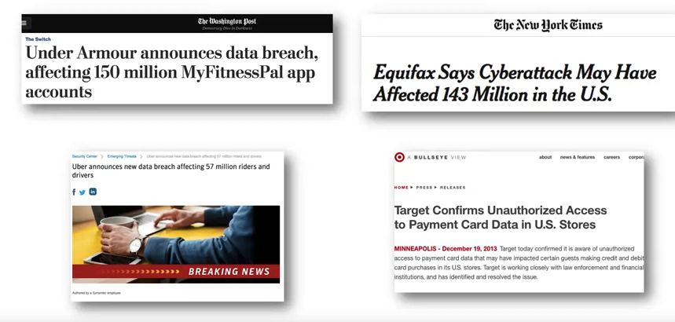

## Privacy Law Always Chases Technology {.center}

> The law must provide some relief to individuals when the acts of others
> interfere with their **right to be let alone.**
> — Warren & Brandeis, *The Right to Privacy*, 1890

A new technology arrives, a harm becomes visible, and the law reacts. That
pattern repeats from gossip photography to mainframes to AI.

::: {.notes}
Warren and Brandeis wrote "The Right to Privacy" for the Harvard Law Review in
1890 in response to a new technology — instantaneous photography — and to
gossip journalism. Warren was reportedly enraged by Boston newspapers covering
his family's social events. The article invented the U.S. right-to-privacy
tort. The whole lecture is organized around this reactive pattern: name the
technology, name the harm, name the law that followed. Cold-call: what's the
2026 version of gossip photography? Model training on scraped data,
age-verification wallets, and always-on ACR on smart TVs are the ones I'd
prime the room to consider. Hold this pattern as the deck's spine — every
statute later in the deck is another instance of it.
:::

## A 2026 Hook: The FTC Still Sets the Floor {.smaller}

::: {.vignette}
On **Dec. 31, 2025** a federal court approved a **$10M** order against **Disney**
to settle FTC/DOJ allegations it let children's data be collected through
mislabeled "Made for Kids" YouTube videos — a **COPPA** violation
([FTC, Dec. 2025](https://www.ftc.gov/news-events/news/press-releases/2025/12/court-approves-order-requiring-disney-pay-10-million-settle-ftc-allegations-firm-enabled-unlawful)).
The U.S. *still* has **no comprehensive federal privacy law** — so a 1998
children's statute plus the FTC's general authority do the work.
:::

On **May 4, 2026** the FTC settled its long-running case against **Kochava**,
banning sale of *sensitive* location data (medical, religious, shelters, schools)
without express consent ([FTC, May 2026](https://www.ftc.gov/news-events/news/press-releases/2026/05/ftc-ban-kochava-subsidiary-selling-sensitive-location-data-settle-charges-they-sold-location-data)).
Old statutes, new harms.

::: {.notes}
This is the freshest concrete anchor for the deck. Two teaching points to
land. First: the regulator is reaching for a narrow 1998 tool (COPPA) and a
general 1914 consumer-protection statute (Section 5) because there is nothing
comprehensive. Disney allegedly failed to label some YouTube uploads "Made
for Kids" — the designation Google agreed to in the 2019 YouTube COPPA
settlement — enabling targeted ads to under-13s. Second: enforcement is real
and current, not historical. Kochava is the more legally interesting anchor
because it rests on the unfairness prong of Section 5 (no broken promise
required) after nearly four years of litigation. Both anchors make the same
teaching point: no federal statute means a 1998 kids' law and a 1914
consumer-protection statute do the work. Swap in whatever broke this week —
the FTC press feed always has something.
:::

# Where Modern Privacy Law Comes From {.center}

FIPPs → PII → the U.S. patchwork → the FTC → GDPR

## Computerized Records Created New Threats {.smaller}

By the 1970s, mainframes made four things newly possible:

- **Unknown databases** holding information about you
- **Cheap mass collection** — scale flips the cost-benefit of surveillance
- **One-to-many dissemination** of records
- **Linking** different kinds of information, gathered different ways

::: {.notes}
Standard historical anchor. These 1970s concerns sound quaint until you note
that every one is roughly a hundred times worse with cloud, smartphones, and
ad-tech. The four threats — unknown databases, mass collection, dissemination,
linkage — are the same four Latanya Sweeney would empirically confirm with
re-identification attacks two decades later, and the same four the AOL search
log leak of 2006 realized in miniature. The point: the structure of the
threat — scale, linkage, opacity — is what the law tried to address, and it's
the same structure today. If a student pushes back that these worries are
overblown, forward-reference the Sweeney and Netflix Prize slides.
:::

## FIPPs: The Foundation (HEW, 1973) {.smaller}

The HEW report *Records, Computers, and the Rights of Citizens* gave us the
**Fair Information Practice Principles**:

1. **No secret** record-keeping systems
2. A way to **know** what is collected and how it is used
3. A way to **prevent secondary use** without consent
4. A way to **correct** your record
5. **Reasonable security** and reliability for intended use

Almost every privacy law worldwide descends from these five ideas.

::: {.notes}
Primary source is HEW's 1973 report "Records, Computers, and the Rights of
Citizens" — every modern regime descends from these five principles: the OECD
1980 guidelines, the EU 1995 Data Protection Directive, GDPR, and CCPA. Tell
students to memorize the five FIPPs; when we hit GDPR two segments from now,
they will see the same DNA — notice, access/rectification, purpose limitation,
security — mapped cleanly onto GDPR Articles 5 and 12–22. Emphasize the
through-line: transparency, control, correction, and security. The open
question for the rest of the lecture: does this 1973 model still fit a world
of inference and machine learning? That's the setup for the "Age of
Inference" slide three slides from now.
:::

## The FIPPs in Practice {.smaller}

::: {.columns}
::: {.column width="50%"}
**Notice** — tell people what you collect, use, share

**Appropriate uses** — primary vs. secondary (national security, public health,
law enforcement)

**Individual choice** — **opt-in** vs. **opt-out**
:::
::: {.column width="50%"}
**Access & correction** — see and fix your record

**Security** — no privacy without it; the root of breach-notification law

**Minimization** — collect only what you need
:::
:::

::: {.notes}
Opt-in versus opt-out is the sleeper concept — it looks technical but drives
everything downstream. The canonical empirical result is Johnson and Goldstein,
"Do Defaults Save Lives?", Science 302:1338, 2003 — default-opt-in produces
roughly 90%+ compliance, default-opt-out produces under 5%. GDPR is opt-in
for most processing; the U.S. defaults to opt-out, and the empirical fact is
that almost no one ever opts out. That single design choice determines whether
a "choice" regime protects anyone. Cookie banners, breach-notification
opt-outs, GDPR consent, CCPA opt-out — one design switch, huge downstream
effect. Foreshadows the Meeting 12 dark-patterns research.
:::

## Notice and Consent Is Broken {.smaller}

The model assumes a person reads, understands, and meaningfully agrees.

- Policies run **thousands of words** and change without warning
- Stated policy and actual practice **diverge** — that gap is what the FTC sues on
- "Consent" via a cookie wall is not a real choice

Demo: [tosdr.org](https://tosdr.org/) grades real privacy policies.

::: {.notes}
This is the central critique of the orthodox model. Canonical reading:
Aleecia McDonald and Lorrie Cranor, "The Cost of Reading Privacy Policies,"
I/S: A Journal of Law and Policy, 2008 — they estimated 244 hours per year
per person to read the policies of the sites they visit. The definitive
academic critique is Solove's "Privacy Self-Management and the Consent
Dilemma," 126 Harvard Law Review 1880 (2013) — putting the burden on the
individual doesn't work because the individual has neither the time nor the
information to bear it. Live demo if time: ToS;DR grades real privacy
policies. Connect forward: the FTC's deception theory exists precisely
because the gap between promise and practice is where the harm lives.
:::

## Re-Examining FIPPs in the Age of Inference {.smaller}

FIPPs assume a world that no longer exists:

::: {.columns}
::: {.column width="50%"}
**Old model**

- Data sits in a database for later retrieval
- Meaning is **evident on its face**
- Processing = simple joins
:::
::: {.column width="50%"}
**Today**

- Data accessed via **queries**, not shipping
- Harm is new **inference**, not record-linking
- Probabilistic ML draws conclusions you never disclosed
:::
:::

Example: differential privacy deliberately adds **noise** — violating "data must
be correct," yet *enhancing* privacy.

::: {.notes}
This is the most intellectually interesting slide in the deck. FIPPs were
built for static records; modern systems infer. The canonical example is
Kashmir Hill's February 2012 Forbes piece on Target inferring a teenager's
pregnancy from purchase patterns — no PII was leaked, yet a deeply private
fact was produced and mailed to the family home. On differential privacy,
the readable intro is Chapter 1 of Dwork and Roth, "The Algorithmic
Foundations of Differential Privacy," 2014 — noise is the privacy, which
directly contradicts the FIPPs accuracy principle. That's the paradox: some
FIPPs (accuracy, minimization-of-error) point the opposite direction from
what actually protects privacy today. Ask: does the 1973 model even name the
harm from inference? Debate hook — should we replace FIPPs, patch them, or
build a parallel framework for inferential harms?
:::

## PII Is Not a Bright Line {.smaller}

The classic assumption: scrub name, SSN, address → data is "safe."

**Wrong.** Any attribute that distinguishes one person can re-identify them.

- **AOL (2006):** "anonymized" search logs re-identified by *The New York Times*
- **Netflix Prize (2006):** ratings re-identified by Narayanan & Shmatikov
- **MA health records:** Sweeney re-identified the governor via ZIP + DOB + sex

So is **ZIP code** PII? Is an **IP address**? The line dissolves under inference.

::: {.notes}
PII is a legal fiction that engineering keeps breaking. The three re-id
results are the canon. AOL, August 2006: Barbaro and Zeller of the New York
Times identified "AOL Searcher No. 4417749" as Thelma Arnold, a 62-year-old
Georgia widow, from her supposedly-anonymized search log. Netflix Prize:
Narayanan and Shmatikov, "Robust De-anonymization of Large Sparse Datasets,"
IEEE S&P 2008. Sweeney: her 2000 paper "Simple Demographics Often Identify
People Uniquely" showed 87% of U.S. residents were uniquely identified by
ZIP plus date-of-birth plus sex. Modern update — Rocher, Hendrickx, and de
Montjoye, Nature Communications 2019 — 15 attributes suffice for over 99.98%
of Americans. Make students articulate why removing identifiers fails:
quasi-identifiers in combination are uniquely identifying. Modern laws have
shifted from "remove PII" to "reasonably cannot be linked" standards (e.g.,
CCPA de-identification) — and even that is hard to define.
:::

# The U.S. Patchwork {.center}

Sectoral, reactive, incomplete — by design

## Sectoral vs. Omnibus {.smaller}

::: {.columns}
::: {.column width="50%"}
**United States — sectoral**

- No comprehensive federal law
- A patch per sector / harm / actor
- Driven by *who holds the data*, *what harm*, *what data-sharing deal*
:::
::: {.column width="50%"}
**EU — omnibus**

- One law (**GDPR**) over nearly all personal data
- Rights attach to the **data**, not the industry
- Extraterritorial reach
:::
:::

This single distinction — **sectoral vs. omnibus** — explains most U.S./EU
differences in this lecture.

::: {.notes}
Burn this dichotomy in — it's a midterm staple. Sectoral means coverage has
holes by construction (every gap is a lawsuit or an FTC case). Omnibus means
one rulebook but heavy compliance and often uneven enforcement. Neither is
obviously right — that's the GDPR debate at the end of the deck, and the
Omnibus breakout later this week. Best-of-both defenders point to Illinois
BIPA (a sectoral state law with a private right of action, which produced a
$650M Facebook settlement) as evidence that sectoral can be sharp when it
wants to be. The private right of action is the sleeper design feature that
turns sectoral law from paper into teeth.
:::

## The Patchwork, Statute by Statute {.smaller}

::: {.columns}
::: {.column width="50%"}
**Based on who has the data**

- **Privacy Act (1974)** — federal agencies (post-Watergate)
- **FCRA (1970)** — credit bureaus

**Based on anecdote / specific harm**

- **FERPA (1974)** — schools surveilling kids' home life
- **VPPA (1988)** — Judge Bork's video rentals leaked
- **DPPA (1994)** — states selling DMV data
:::
::: {.column width="50%"}
**Data-sharing initiatives**

- **HIPAA (1996)** — health portability & e-records
- **GLBA (1999)** — banks sharing among affiliates

**Special category**

- **COPPA (1998)** — kids under 13
- **GINA (2008)** — genetic discrimination
:::
:::

::: {.notes}
The VPPA story is the keeper — and the perfect illustration of the pattern.
In September 1987 Michael Dolan published "The Bork Tapes" in the Washington
City Paper, listing Judge Robert Bork's video rentals during his Supreme
Court nomination. Congress passed the Video Privacy Protection Act,
18 U.S.C. § 2710, in October 1988 — roughly a year later — but only about
video tapes. That's sectoral lawmaking in a nutshell: each statute fights
the last scandal and stops at the boundary of that scandal. The FCRA/FERPA/
HIPAA/GLBA/COPPA/GINA statute list is the canonical "sectoral by anecdote"
survey. Cold-call: what would the equivalent modern statute be — a
"Streaming Video Privacy Act"? A "Voice Assistant Privacy Act"? Note the
dates aren't chronological because Congress reacted issue by issue.
:::

## The HIPAA Gap {.smaller}

HIPAA covers only **providers, plans, and clearinghouses** (and their vendors).

**Not covered:** fitness apps, period trackers, mental-health apps, 23andMe,
most "health" data you actually generate.

- **GoodRx** — fined $1.5M (2023) for sharing health data for ads
- **BetterHelp** — $7.8M (2023) for sharing mental-health data with Facebook

So a *sensitive* category is wide open whenever the holder isn't a "covered
entity."

::: {.notes}
This is the single most useful slide for showing why sectoral law fails.
The key teaching move: HIPAA regulates covered entities — providers, plans,
clearinghouses, and their business associates — not "health data as such."
Consumer apps, wearables, period trackers, 23andMe, and most
telehealth-adjacent services fall outside HIPAA entirely. Dates worth citing:
GoodRx settled for $1.5M on February 1, 2023, for sharing health data for
ads; BetterHelp settled for $7.8M on March 2, 2023, for sharing
mental-health data with Facebook. In both cases, FTC Section 5 had to reach
into the gap because HIPAA didn't. Cross-reference the HIPAA-gap breakout
that runs alongside this lecture. Cold-call: name a health app on your phone;
is its data covered by HIPAA?
:::

## Breach Notification: Regulation by Consequence {.smaller}

{width="78%"}

::: {.notes}
Before 2003, a company could be breached and tell no one. California SB 1386,
effective 2003 and codified at Civil Code sections 1798.29 and 1798.82,
required notifying any California resident whose data was exposed — and
suddenly breaches were headlines. Today all 50 states plus DC, Puerto Rico,
and the Virgin Islands have breach-notification laws; the NCSL breach
tracker is the canonical map. HIPAA was amended (HITECH, 2009) to add a
similar notification duty. The teaching frame: notification didn't mandate
security; it made insecurity a PR and board-level liability. That's
"regulation by consequence" — you can't outlaw breaches, but you can make
them impossible to hide. Ask: how many students have received a breach
notice in the last year? Every hand goes up.
:::

## What a Breach Law Requires Varies {.smaller}

- Triggering "**personal information**": name + SSN, driver's license, account
  numbers; some states add medical, biometric, student data
- Some states notify on **any** breach; others only on **risk of harm**
- Some require notifying **the media**; timelines range from "without
  unreasonable delay" to a fixed number of days

**The patchwork tax:** firms just apply the **strictest** state law (usually
California) to everyone.

::: {.notes}
Fifty different regimes are genuinely costly, and the rational corporate
response is to comply with the toughest one everywhere — which is de facto one
national standard set by California, without Congress ever acting. This is the
same "California effect" that will show up in Meeting 12 when we look at
spillover from state privacy laws to national practice. Tie to the broader
theme: California has become the default U.S. privacy legislator. Debate
prompt: is that democratically legitimate — a state whose residents are
14 percent of the country setting the effective national floor — or is it the
predictable market response to a Congress that won't act?
:::

## Equifax (2017): What a Bad Response Looks Like {.smaller}

::: {.columns}
::: {.column width="60%"}
- **147M** Americans' data exposed
- **Six weeks** to disclose
- Stood up a separate, **spoofable** notification site
- Tried to **upsell** credit monitoring to victims
:::
::: {.column width="40%"}
Result: **~$700M** settlement; CEO resigned.
:::
:::

::: {.notes}
Equifax is the case study in how not to respond. Dates and numbers to say
out loud: 147M Americans exposed, disclosure delayed roughly six weeks,
notification site stood up on a domain so implausible that Krebs on Security
called the response a "dumpster fire" in September 2017, credit-monitoring
upsell to the very people whose data was leaked. Result: roughly $700M
settlement announced July 2019, including a $300M consumer-compensation fund;
CEO resigned. The data subjects were never Equifax customers — they couldn't
take their business elsewhere, which is exactly the FTC's unfairness condition
(harm not reasonably avoidable, not outweighed by benefits). Use this to
motivate why a market alone doesn't discipline data brokers, and to set up
Section 5 on the next slide.
:::

# The FTC: De Facto Privacy Regulator {.center}

No privacy statute — one very flexible section

## Section 5 of the FTC Act {.smaller}

> "**Unfair or deceptive** acts or practices in or affecting commerce are
> declared unlawful."

::: {.columns}
::: {.column width="50%"}
**Deceptive**

You promised X, did Y. A representation or omission likely to mislead.
:::
::: {.column width="50%"}
**Unfair**

Substantial injury, **not reasonably avoidable**, not outweighed by benefits.
:::
:::

The FTC stretched a consumer-protection statute into America's main privacy law
— 60+ privacy cases, 2002–2017, and a steady stream since.

::: {.notes}
The key insight to burn in: there is no federal "privacy right" being
enforced — there's a 1914 promise-keeping and anti-harm statute
(15 U.S.C. § 45) doing double duty. Deception is the easy theory — sue on
the gap between policy and practice; policy statement dates to 1983.
Unfairness is the harder theory (1980 policy statement) but reaches conduct
even when no promise was broken — that's the doctrinal move in Kochava. The
definitive academic take is Solove and Hartzog, "The FTC and the New Common
Law of Privacy," Columbia Law Review 2014 — the FTC built a common law of
privacy through 60+ cases without a privacy statute. This is improvised law,
and it's the reason a 1998 kids' law and a 1914 general statute do most of
the U.S. privacy work today.
:::

## Section 5 in Action {.smaller}

::: {.columns}
::: {.column width="50%"}
**Uber (2017)** — "God View" tracking of journalists, politicians, exes despite
privacy claims → consent decree + comprehensive privacy program

**Twitter (2022)** — used 2FA phone numbers for ad targeting → penalty
:::
::: {.column width="50%"}
**Facebook (2019)** — violated its 2011 consent decree; **Cambridge Analytica**
harvested ~87M profiles → **$5B** fine, the largest ever

**Disney (2025)** — COPPA, **$10M** (see opening vignette)
:::
:::

::: {.notes}
Note the mechanism: cases almost always settle with a consent decree, not a
trial — so the FTC builds privacy "common law" through orders, not statutes.
Facebook's July 2019 order is the template: $5B penalty, 20-year
comprehensive privacy program, executive certification, limits on facial
recognition and on repurposing 2FA numbers for advertising. Uber (August 2017)
was about "God View" tracking of journalists, politicians, and exes despite
privacy claims. Twitter's May 2022 $150M penalty was for using 2FA phone
numbers as an ad-targeting signal — same fact pattern the Facebook order
had already prohibited. Disney COPPA $10M closes the arc. Ask: is
governance by consent decree a feature (flexible, evolves case by case) or a
bug (no democratic input, no published rulemaking)? Good midterm question.
:::

# International: The Omnibus Model {.center}

140+ countries have privacy laws — GDPR is the gravitational center

## GDPR: Scope and Reach {.smaller}

The EU's **General Data Protection Regulation** applies to organizations:

- **located in the EU**, and
- **anywhere**, if any component is in the EU, and
- **anywhere**, if they offer goods/services to, or **monitor**, people in the EU

If EU residents can use your service, you must ask whether GDPR applies.

::: {.notes}
Extraterritoriality is the whole game — Article 3 (territorial scope) is the
hook. A Chicago startup with EU users is in scope. Critics call it regulatory
imperialism; defenders call it the only way to protect residents in a
borderless internet. Either way, it made GDPR the global default — the
"Brussels effect," which is also the title of Anu Bradford's 2020 Oxford
University Press book. Cold-call: what U.S. law has ever had comparable
extraterritorial reach on private conduct? Very few, and none in privacy.
This is why so many U.S. state privacy laws end up copying GDPR concepts —
firms already had to build for the tougher regime.
:::

## What GDPR Requires {.smaller}

::: {.columns}
::: {.column width="50%"}
**Familiar (the FIPPs DNA)**

- Notice; access **with rectification**
- A **lawful basis** to process (consent, contract, legitimate interest)
- Security
:::
::: {.column width="50%"}
**Newer / sharper**

- **Right to be forgotten** (erasure, with free-expression exceptions)
- **Cross-border transfer** limits — only to "adequate" countries
- **DPIA** before risky processing
:::
:::

::: {.notes}
Point out the left column is FIPPs, four decades on. The right column is what's
genuinely new and contested. Right to erasure (Article 17) comes from the 2014
Google Spain v. AEPD case — the "right to be forgotten" ruling — and collides
head-on with the U.S. First Amendment; Google delists in the EU but not the
U.S. Cross-border transfers (Chapter V, Articles 44–50): the EU has repeatedly
held the U.S. lacks "adequate" protection. Schrems I (2015) invalidated Safe
Harbor; Schrems II (2020) invalidated Privacy Shield. The EU–US Data Privacy
Framework, adopted July 2023, is the current successor and already under
legal challenge. DPIAs (Article 35) are required before risky processing.
Ask: which of these ideas would survive a U.S. First Amendment challenge if
Congress ever tried to enact them?
:::

## GDPR Enforcement Is Real {.smaller}

::: {.vignette}
Cumulative GDPR fines topped **€7.1B by Jan. 2026** (DLA Piper survey). **Meta** still
holds the all-time record at **€1.2B** (2023, unlawful EU–US transfers). The
largest of **2025 was €530M against TikTok**
([Irish DPC, May 2, 2025](https://www.dataprotection.ie/en/news-media/latest-news/irish-data-protection-commission-fines-tiktok-eu530-million-and-orders-corrective-measures-following))
for EU–China data flows. In **Sept. 2025 CNIL fined Google €325M** for Gmail-ad and
cookie-consent violations
([CNIL, Sept. 2025](https://www.cnil.fr/en/cookies-and-advertisements-inserted-between-emails-google-fined-325-million-euros-cnil)).
:::

Live tracker: [enforcementtracker.com](https://www.enforcementtracker.com/).

::: {.notes}
The numbers refute the "GDPR is toothless" claim that people made about the
old 1995 Directive (famously unenforced). Concrete anchors: TikTok €530M
(Irish DPC, May 2, 2025) — €485M under Article 46 and €45M under Article
13(1)(f), for Chinese personnel remote access; the Irish High Court stayed
the transfer-suspension order pending TikTok's appeal in September 2025.
CNIL Google €325M (September 1, 2025) — Gmail "Promotions" and "Social" tabs
contained ad emails without consent, plus a 6-clicks-to-refuse versus
2-clicks-to-accept cookie flow when creating a Google account, affecting
74 million French accounts. Meta €1.2B (May 22, 2023) — unlawful EU–US
transfers, still the all-time record. Cumulative benchmark: DLA Piper's
January 2026 survey puts total GDPR fines at €7.1B. Use the tracker live if
time allows — filter by Meta, Amazon, and Google to see the pattern.
:::

## The GDPR Debate {.smaller}

**A win for privacy — or a moat for incumbents?**

::: {.columns}
::: {.column width="50%"}
**For**

- Real rights, real fines
- One rulebook, not 50
- Raised the global floor
:::
::: {.column width="50%"}
**Against**

- Compliance cost favors **Big Tech**
- Cookie-consent UX fatigue
- Hasn't dented platform dominance
:::
:::

::: {.notes}
This is a natural debate prompt (and a likely exam question) — cross-reference
the Omnibus debate that runs alongside this lecture. The strongest "against"
point: compliance cost creates a moat for incumbents who can afford CPOs
and DPIA teams; small firms can't. The strongest "for": before GDPR, the
1990s Data Protection Directive was omnibus on paper but famously unenforced,
and GDPR is what enforcement actually looks like — €7.1B says so. Ask
students to defend one side, then swap. Note that the answer often depends on
what you're optimizing for: individual redress, structural competition, or
raising the global floor.
:::

## Where U.S. Privacy Law Stands in 2026 {.smaller}

::: {.vignette}
With no federal law, the states moved: **~20 now have comprehensive privacy
laws**, with Indiana, Kentucky, and Rhode Island taking effect **Jan. 1, 2026**.
But **2025 was the first year in five with no new state law passed** — the wave
may be leveling off
([MultiState, 2026](https://www.multistate.us/insider/2026/2/4/all-of-the-comprehensive-privacy-laws-that-take-effect-in-2026)).
:::

The U.S. is drifting from *purely sectoral* toward a **50-state quasi-omnibus** —
without ever passing one national law.

::: {.notes}
This is the live frontier and the bridge to Meeting 12 (automated compliance
enforcement, CCPA measurement, dark patterns). Numbers to say: 20
comprehensive state laws in effect in 2026, with Indiana, Kentucky, and
Rhode Island effective January 1, 2026, and Connecticut, Arkansas, and Utah
amendments effective July 1, 2026. 2025 was the first year in five with no
new comprehensive law enacted, but 2026 is bringing a fresh wave (Alabama
passed both chambers as of April). Federal front: the American Privacy Rights
Act (APRA) expired at end of the 118th Congress in January 2025 and has not
been reintroduced — killed by fights over California preemption and the
private right of action. Only new federal privacy law of 2025 is the TAKE IT
DOWN Act (non-consensual intimate imagery plus deepfakes, 48-hour removal,
enforcement live May 2026). Texas AG's $1.375B Google settlement (October 31,
2025) is the biggest single-state privacy settlement ever. The irony to land:
the U.S. is getting something omnibus-like by accretion of state laws plus
the California-default effect — not by congressional design. Ask whether
that's a stable equilibrium.
:::

# Takeaways {.center}

- Privacy law is **reactive** — FIPPs (1973) are still the DNA
- **PII** and **notice-and-consent** are leaky models in an age of inference
- The U.S. is **sectoral** (patchwork + FTC Section 5); the EU is **omnibus** (GDPR)
- Enforcement is real and current: **Disney COPPA, TikTok €530M, CNIL Google €325M, the state wave**

::: {.notes}
Close by returning to the opening Warren and Brandeis pattern: every item
here is the law chasing a technology. Each of the three current enforcement
anchors — Disney COPPA (Dec 2025), TikTok €530M (May 2025), CNIL Google
€325M (Sept 2025) — is a law from a prior decade catching up to a technology
that outran it. FIPPs (1973) are still the DNA of everything modern.
Sectoral versus omnibus is the dichotomy to remember for the midterm. The
next meeting on automated compliance asks whether we can measure and enforce
these rules at web scale — the natural sequel to this deck. Land the plane
on the through-line: privacy law is reactive, and the reaction is speeding up.
:::

# Resources & Live Demos {.center}

Tools to pull up in class — most update in real time

## Live Tools & Trackers {.smaller}

::: {.columns}
::: {.column width="50%"}
**Enforcement, live**

- [GDPR Enforcement Tracker](https://www.enforcementtracker.com/) — every EU fine since 2018
- [FTC Cases & Proceedings](https://www.ftc.gov/legal-library/browse/cases-proceedings)
- [IAPP US State Privacy Tracker](https://iapp.org/resources/article/us-state-privacy-legislation-tracker/)
:::
::: {.column width="50%"}
**See it on yourself**

- [ToS;DR](https://tosdr.org/) — privacy policies, graded
- [Have I Been Pwned](https://haveibeenpwned.com/) — breach lookup
- [Privacy Badger](https://privacybadger.org/) — tracker blocking
- [Download your Google data](https://support.google.com/accounts/answer/3024190) — GDPR access, live
:::
:::

::: {.notes}
Folded in from the prior speaker-notes file. Good cold-open or break filler:
pull up the GDPR Enforcement Tracker and filter by Meta, Amazon, or Google;
run Have I Been Pwned on a volunteer's email; show ToS;DR on Instagram's
policy. Additional tools worth mentioning: Google's EU-privacy transparency
report on right-to-be-forgotten requests, the EU–US Data Privacy Framework
site, Privacy Badger from EFF for tracker blocking, and the Google Takeout
tool as a live GDPR-access-right demo. Companion materials: the Web Tracking
activity for hands-on privacy audit, the Omnibus debate on whether the U.S.
should adopt a GDPR-style federal law, and the privacy-law breakout that runs
the federal-omnibus and HIPAA-gap prompts. The full link catalog and
discussion prompts live in coverage-notes.md.
:::
