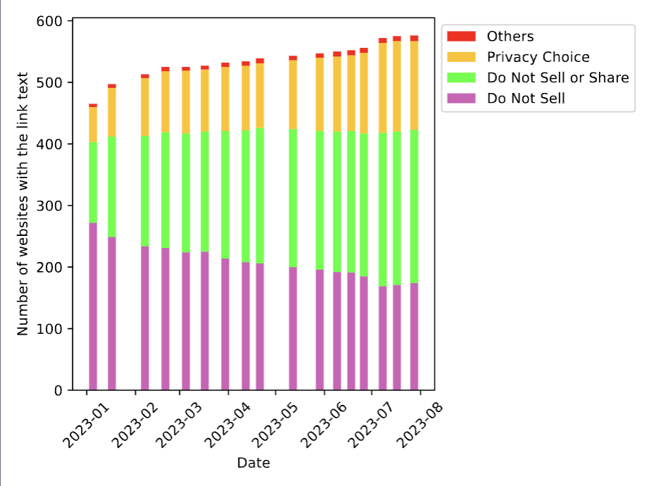
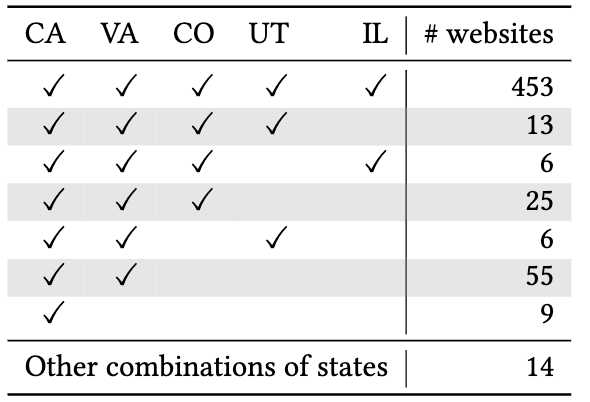
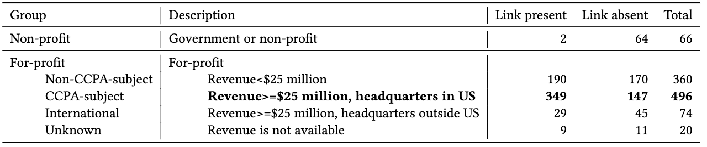
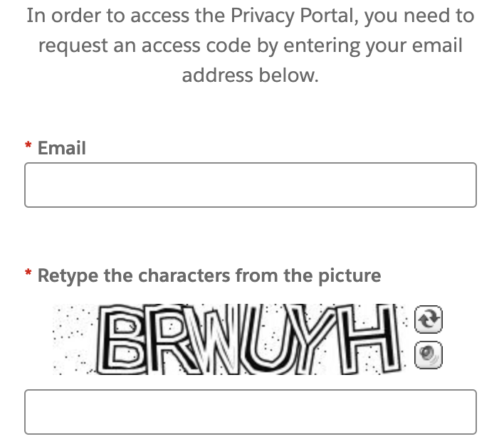
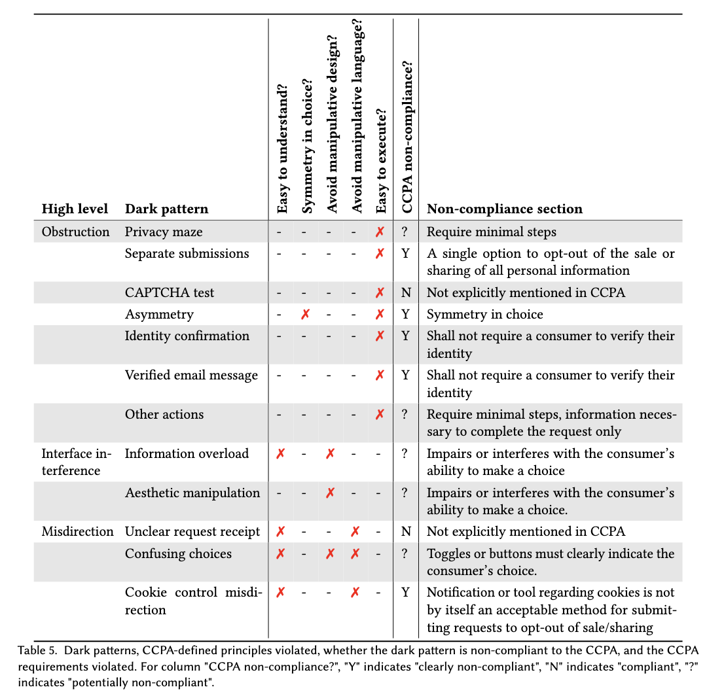

## From Law on the Books to Law in Action {.center}

A privacy statute grants rights. But do those rights **actually work**
when a consumer tries to exercise them on a real website?

This lecture moves from **what the law says** (CCPA / CPRA) to **what
measurement finds** — and the gap between them.

::: {.notes}
Frame the whole class as the gap between text and practice. We taught the FIPPs
and the structure of US privacy law last meeting; today we ask the empirical
question: when the law says "you have a right to opt out," can you? Two of our own
group's studies answer that. This is also the meeting where dark-pattern categories
are flagged as midterm material.
:::

## Where Does Our Data Go?

- Every day we spend hours browsing; sites and apps collect **identifiers**,
  **browsing history**, **preferences**, and more
- That data rarely stays put — it is **sold or shared** with third parties for profit
- Often without **explicit consent**

::: {.notes}
Set up the stakes. The business model is data flowing outward to third parties.
The whole point of an opt-out right is to give the consumer a lever on that flow.
Ask: what would it take for that lever to be real?
:::

## Why Consumers Should Care

::: {.columns}
::: {.column width="50%"}
- **Targeted advertising**
- **Consumer profiling**
:::
::: {.column width="50%"}
- **Manipulation & influence**
- **Data breaches & identity theft**
:::
:::

These are the harms the **right to opt out of sale/sharing** is meant to blunt.

# The Law: CCPA and CPRA {.center}

## The California Consumer Privacy Act (CCPA)

- Signed **2018**, in effect **January 2020**
- Six core consumer privacy rights, including the **right to opt out of the sale
  of personal information** — the cornerstone provision
- Strengthened by the **California Privacy Rights Act (CPRA)**: passed 2020,
  in effect **January 2023**
- CPRA extended opt-out to **sharing** (not just sale), created a **sensitive
  personal information** category, and was the **first US law to explicitly ban
  dark patterns**

::: {.notes}
Watch the dates — these are commonly garbled. CCPA: signed 2018, effective 2020.
CPRA: passed by ballot 2020, effective Jan 2023. "Sale" vs "share" matters because
most tracking is technically "sharing," not a cash sale. We use "CCPA" loosely to
mean the whole CCPA+CPRA framework.
:::

## Who Is Subject to the CCPA? {.smaller}

A **for-profit** entity doing business in California that meets **at least one**
threshold:

1. Annual gross revenue **> \$25 million**, **or**
2. Buys, sells, or shares the personal information of **≥ 100,000** California
   consumers, **or**
3. Derives **> 50%** of annual revenue from **selling** consumer personal data

::: {.notes}
CPRA raised the consumer threshold from 50,000 to 100,000 and added "shares." Note
that thresholds 2 and 3 use data that is usually NOT public — this becomes a real
problem when we try to decide, from the outside, whether a site is even covered.
:::

## How You Are Supposed to Opt Out {.smaller}

::: {.columns}
::: {.column width="50%"}
**Before CPRA (2020–2023)**

- A single link: *"Do Not Sell My Personal Information"*
:::
::: {.column width="50%"}
**After CPRA — any of:**

- *"Do Not Sell or Share My Personal Information"* link
- *"Your Privacy Choices"* link **+ opt-out icon**
- A **frictionless opt-out preference signal (GPC)**, disclosed in the privacy policy
:::
:::

The link must sit in the **header or footer**; the icon is required when the
*Privacy Choices* wording is used.

::: {.notes}
This slide is the rubric for "compliant appearance." The statute is unusually
prescriptive about wording, location, and the icon. That prescriptiveness is what
makes automated measurement possible — the law literally hands us the keywords.
:::

## Global Privacy Control (GPC): Opt Out Once

- A **browser-level signal** that broadcasts "do not sell or share" to every site
- The **frictionless** alternative: opt out once, not site-by-site
- Invocation differs by browser: **built-in** (DuckDuckGo, Firefox setting) vs.
  **extension** (Chrome)
- Sites need not notify the user it was honored — but **must disclose** GPC support
  in the privacy policy

::: {.notes}
GPC is the technologist's answer to per-site opt-out fatigue. It's the most
consumer-friendly mechanism and increasingly the enforcement focus (see the vignette).
The disclosure-in-policy rule is what lets us measure GPC support at scale, however
imperfectly.
:::

## A 2026 Enforcement Wake-Up Call {.smaller}

::: {.vignette}
California is now enforcing the *practice*, not just the *paperwork*. On **Feb 11,
2026**, AG Rob Bonta announced a **\$2.75M** settlement with **Disney** over failure
to honor opt-out signals. On **May 8, 2026**, that record was eclipsed by a
**\$12.75M** settlement with **General Motors** — the largest CCPA penalty to date —
for selling drivers' location and behavior data to LexisNexis and Verisk without
adequate notice or consent. These follow earlier actions against **Sephora**,
**DoorDash**, and **Sling TV**.
:::

Regulators are explicit: they care whether consumer choices **actually work**
across real tech stacks — not "paper compliance."

::: {.notes}
This is the freshest hook and ties directly to both studies: the GM case is about
data minimization and real opt-out, the Sephora/DoorDash line is squarely about GPC
and opt-out functionality. Cold-call: why is a $12.75M fine still small relative to
the data economy? What does "paper compliance" mean, and how would you detect it?
Sources are in coverage-notes.md.
:::

# Study 1: Measuring Compliance Over Space and Time {.center}

## The Research Questions

- **RQ1:** How does opt-out implementation **change over time**?
- **RQ2:** Are websites **complying** with the appearance requirements?
- **RQ3:** Do sites that offer opt-out in CA also offer it to **non-Californians** (spillover)?
- **RQ4:** Among sites that *don't* offer a link — are they **non-compliant**, or **not covered**?

::: {.notes}
Tran et al. RQ3 is the policy-interesting one: if firms extend rights nationwide
anyway, that weakens the case that we need a single federal law versus letting strong
state laws set a de facto national floor.
:::

## Method: Vantage Points and Keywords {.smaller}

::: {.columns}
::: {.column width="55%"}
- Five **vantage points**: CA, VA, CO, UT (all have privacy laws, different
  effective dates) + **IL** as a **no-law control**
- **1,016** unique sites, top sites across 80 categories
- Measured **twice a month, Jan–Jul 2023**
:::
::: {.column width="45%"}
- Keywords derived from the **statute's exact wording**, augmented by manual inspection
- Detect the link two ways: **page source** + **on-screen search/OCR**, then
  reconcile disagreements by hand
:::
:::

::: {.notes}
The five-state design is the clever part: IL is the control for spillover. Two
detection methods because dynamic links don't always appear in page source. The
statute handing us keywords is what makes this automatable at all.
:::

## RQ1: Compliance Is Rising — but Incomplete

{width="70%"}

The outdated *"Do Not Sell"* wording **shrinks**; compliant *"Do Not Sell or Share"*
and *"Privacy Choices"* **grow** — with a jump around **Jan 2023** (CPRA).

::: {.notes}
The total bar grows and its composition shifts toward compliant wordings. The Jan
2023 inflection is the CPRA effective date. Takeaway: increasingly, but not fully,
compliant.
:::

## RQ2: ~45% Fail the Appearance Requirements {.smaller}

Of **428** sites with an opt-out link (CA, July 2023):

- **141** still use outdated *"Do Not Sell"* (non-compliant)
- **7** place the link **outside** the header/footer
- **46** of 108 *"Privacy Choices"* links **omit the required icon**

→ Roughly **45%** fail to fully meet CPRA's *appearance* rules — and appearance is
only the **first** hurdle.

::: {.notes}
Emphasize: this measures only whether the link LOOKS right, not whether it WORKS.
If a site can't even get the cosmetic requirements right, it's unlikely to nail the
functional ones — which motivates Study 2.
:::

## RQ3: Spillover to Other States {.smaller}

::: {.columns}
::: {.column width="58%"}

:::
::: {.column width="42%"}
**453 (78%)** of sites that show the link in CA show it in **all five states** —
**including Illinois, which has no privacy law**.

Strong evidence of **spillover**: it's often cheaper to comply everywhere.
:::
:::

::: {.notes}
The policy hook for RQ3. If firms voluntarily extend rights to no-law states, a
strong state law can set a national floor — relevant to the "do we need a federal
privacy law?" debate. Caveat: a visible link in IL doesn't prove an IL resident can
actually complete the opt-out.
:::

## RQ4: 30% of Covered Sites Have No Link {.smaller}

{width="85%"}

Among sites **likely subject to CCPA**, **147 (30%)** still have **no opt-out link**.
Reasons are **varied and ambiguous**: claim they "don't sell," never mention CCPA, or
bury an opt-out (email/phone/form) in the privacy policy.

::: {.notes}
Coverage itself is hard to determine from outside — thresholds 2 and 3 use private
data, so they proxy with for-profit status, revenue, and HQ location. "We don't sell"
may exempt under old CCPA but not CPRA, which covers sharing. Ambiguity is the theme:
hard to call willful evasion vs. honest gaps.
:::

# Study 2: Dark Patterns in the Opt-Out Process {.center}

## Beyond the Link: Does Opt-Out Actually Work?

- Study 1 asked: **is there a link, and does it look right?**
- Study 2 asks: **can a real consumer actually complete the opt-out?**
- **Dark patterns** = manipulative interfaces that trick, deceive, or confuse users
  into acting against their own interest
- CPRA is the **first US law to explicitly ban** them in consent/opt-out flows

::: {.notes}
This is the conceptual bridge. Dark patterns connect back to informed consent from
Lecture 1: consent obtained through deception isn't meaningful consent. Law and
ethics overlap squarely here. The everyday example: Amazon Prime's "want it in 2 days
or 3 weeks?" flow that the FTC pursued.
:::

## Method: Actually Submitting Opt-Out Requests {.smaller}

::: {.columns}
::: {.column width="50%"}
- Stratified sample → **1,000** sites
- **542** have an opt-out link
- **330** likely subject to CCPA → studied
:::
::: {.column width="50%"}
- **Submit a real opt-out request** on each
- Track and **follow up for two months**
- Measure clicks, info required, control method, and dark patterns present
:::
:::

::: {.notes}
The key methodological leap: they don't just look — they DO the opt-out, with a unique
identity per site, and chase the email follow-ups for two months. That's how you learn
whether a request actually resolves.
:::

## Opt-Out Control Methods

- **Browser opt-out** — toggle off sale/sharing; **no personal info** required
  (often a pop-up via a third party like OneTrust)
- **Opt-out form** — must supply **name, email, phone, address**; multi-step,
  often with email confirmation
- **Both** — browser toggle **and** a form

The more personal info required, the more friction — and the more room for **dark patterns**.

::: {.notes}
Browser opt-out is the consumer-friendly path. Forms are where friction lives. Note
the irony coming up: many sites pay a third-party compliance vendor and are STILL out
of compliance.
:::

## ~30% of Opt-Out Attempts Fail {.smaller}

::: {.columns}
::: {.column width="50%"}
**Could not submit / unclear:**

- Failure to submit (37)
- Malfunctioning opt-out page (13)
- Offline steps required (10)
- Instructions only (8)
:::
::: {.column width="50%"}
**Submitted but did not resolve:**

- Failure to fulfill (48)
- Ambiguous status (35)
- Outstanding follow-up (7)
- Incomplete (6)
:::
:::

Nearly **one-third** of attempts could not be submitted, did not succeed, or ended in
**unclear status**. Of the resolved, some demanded **identity verification** the user
couldn't meet.

::: {.notes}
"Thank you for your submission" with no confirmation is the canonical ambiguous case.
Some sites demanded high-school name, test scores, etc. to "verify" before honoring an
opt-out — more data to exercise a data-minimization right.
:::

## Three Families of Dark Patterns {.smaller}

::: {.columns}
::: {.column width="33%"}
**Obstruction**
Barriers to completing the task: CAPTCHA, separate submissions for sale vs. share,
asymmetry (1 click in, 2 to opt out), identity-verification deadlines
:::
::: {.column width="33%"}
**Interface interference**
Privileging some choices: aesthetic manipulation that hides the opt-out link
:::
::: {.column width="34%"}
**Misdirection**
Confusing or absent instructions: a toggle with no indication of which way means "out"
:::
:::

::: {.notes}
Flagged as midterm material. Make students reproduce the three families and one
example each. These map to a broader dark-patterns taxonomy used across the field, not
just privacy.
:::

## Obstruction in the Wild: CAPTCHA to Opt Out

::: {.columns}
::: {.column width="45%"}

:::
::: {.column width="55%"}
To reach the privacy portal, the user must enter an email **and solve a CAPTCHA**.

Is this a **dark pattern**, or **legitimate security**? The statute doesn't say —
a genuine ambiguity for enforcement.
:::
:::

::: {.notes}
Great discussion slide. CAPTCHA has a real anti-bot rationale, but it also adds
friction to a protected action. The statute is silent. This is exactly the kind of
edge case that makes automated enforcement hard.
:::

## Clear Violations vs. Loopholes {.smaller}

{width="80%"}

Some patterns **clearly violate** the statute (asymmetry breaks the required
*symmetry in choice*; a 14-click flow breaks *minimal steps*). Others — **CAPTCHAs**,
unclear receipts, ambiguous toggles — are **not addressed at all**.

::: {.notes}
Walk one row from each bucket. "Symmetry in choice" and "minimal steps" are explicit
statutory hooks. The unaddressed cases are the loopholes — and there's been little to
no litigation specifically on privacy-opt-out dark patterns yet, which is changing
fast (see the 2026 settlements).
:::

# Why Automated Compliance Is Hard {.center}

## The Enforcement Gap {.smaller}

- **Determining coverage** is hard: key thresholds rely on **non-public** data
- **Presence ≠ function:** a compliant-looking link may not work
- **Third-party irony:** sites pay vendors (e.g., **OneTrust**) and are *still* out
  of compliance — misconfiguration? no testing? willful neglect? hard to tell
- **The statute is silent** on many real patterns (CAPTCHAs, ambiguous receipts)
- **Willful evasion vs. honest oversight** is often **indistinguishable from the outside**

This is why **regulators**, not just scrapers, are needed — and why 2026's
enforcement turn toward *functional* opt-out matters.

::: {.notes}
Tie it all together. Automated measurement can flag suspects at scale, but the final
call — covered? willful? legitimate security? — needs human/legal judgment. That's the
division of labor: measurement finds the haystack; enforcement picks the needle.
:::

## What Measurement Tells Policy {.smaller}

- Compliance is **rising but incomplete**; ~45% fail even appearance rules
- **Spillover is real** (78% extend opt-out nationwide) — a strong state law can set
  a national floor
- **~30%** of opt-out attempts fail outright; most sites use **at least one dark pattern**
- Banning dark patterns **on paper** (CPRA) is not the same as **eliminating** them

**Open questions:** automatically verify an opt-out actually *worked*? Detect dark
patterns at scale? Distinguish evasion from error?

::: {.notes}
Land on the meta-point: empirical measurement is how we hold privacy law accountable.
The 2026 GM and Disney settlements show enforcement catching up to what these studies
documented. Connect to the federal-vs-state privacy law debate and to informed consent.
:::

# Discussion {.center}

Pick a website you used **today**. Find its opt-out. How many clicks? What does it ask
for? Which **dark pattern family**, if any — and is it a **violation** or a **loophole**?
