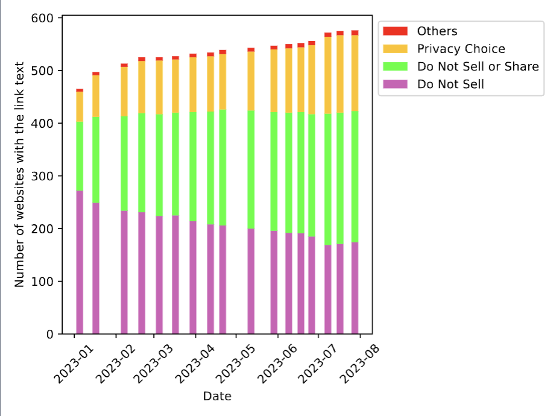
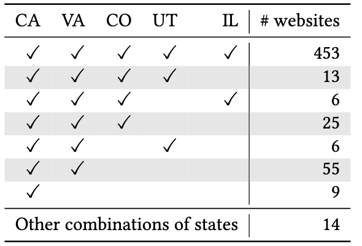
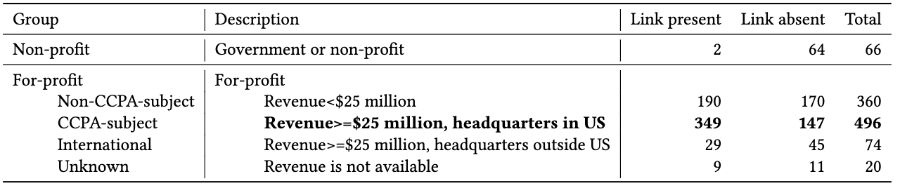
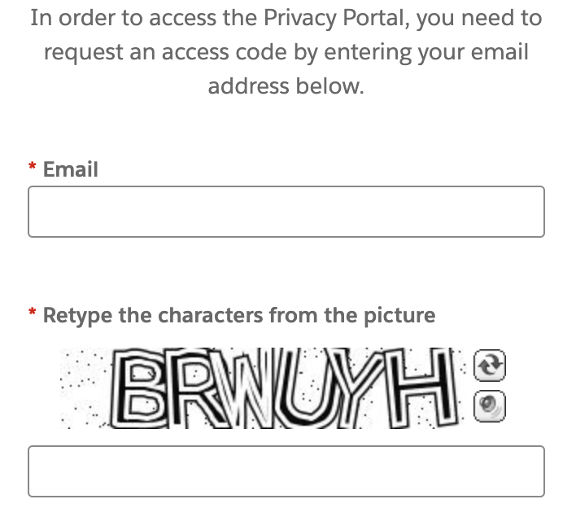
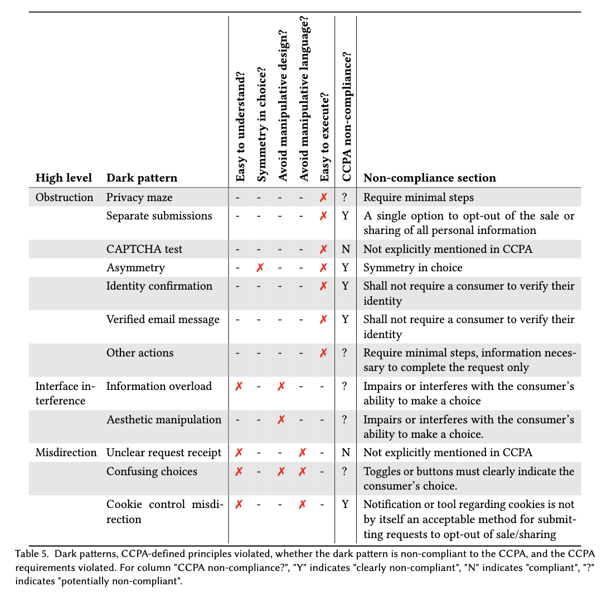

## From Law on the Books to Law in Action {.center}

A privacy statute grants rights. But do those rights **actually work**
when a consumer tries to exercise them on a real website?

This lecture moves from **what the law says** (CCPA / CPRA) to **what
measurement finds** — and the gap between them.

::: {.notes}
Frame the whole class as the gap between text and practice. Last meeting we taught the
FIPPs and the structure of US privacy law; today we ask the empirical question — when
the law says "you have a right to opt out," can you actually do it? Two studies from
our own group answer that: Van Tran et al. at CHI 2024 measured whether the link even
appears, and the follow-on 1,000-site study measured whether the request actually
resolves. Cold-call to open: raise your hand if you have ever successfully completed a
"Do Not Sell" opt-out on any site. Very few hands. Flag now that dark-pattern
categories are midterm material — this is a slide to write down. Point at the hands-on
Web Tracking activity as the do-it-yourself version of these studies.
:::

## Where Does Our Data Go?

- Every day we spend hours browsing; sites and apps collect **identifiers**,
  **browsing history**, **preferences**, and more
- That data rarely stays put — it is **sold or shared** with third parties for profit
- Often without **explicit consent**

::: {.notes}
Set up the stakes. The business model of the modern web is data flowing outward to
third parties in real-time bidding. If you want a live demo, open nytimes.com with the
dev-tools Network tab open — you will see 100+ third-party requests to Google, Meta,
Amazon, LiveRamp, OpenX inside the first few seconds. IAB Europe's Transparency and
Consent Framework is the industry plumbing behind this. The whole point of an opt-out
right is to give the consumer a lever on that outward flow. Ask the room: what would
it take for that lever to actually be real — a link? a working link? a signal your
browser sends automatically? That question sets up GPC later in the deck.
:::

## Why Consumers Should Care

::: {.columns}
::: {.column width="50%"}
- **Targeted advertising**
- **Consumer profiling**
:::
::: {.column width="50%"}
- **Manipulation & influence**
- **Data breaches & identity theft**
:::
:::

These are the harms the **right to opt out of sale/sharing** is meant to blunt.

::: {.notes}
Name concrete harms so this is not abstract. The FTC's 2024 Social Media Report on
data practices — "A Look Behind the Screens" — is the canonical inventory of
targeting, profiling, and manipulation aimed at teens. Cambridge Analytica is still
the sharpest manipulation example students recognize by name. The opt-out right is a
narrow lever aimed at exactly these harms, but only for "sale" and "sharing" — it
does not touch first-party collection or first-party use, which is a common student
misconception worth pre-empting now. Ask the class: which of these four harms would
you actually pay to avoid? That surfaces the willingness-to-pay-vs-willingness-to-
click gap that runs through the rest of the deck.
:::

# The Law: CCPA and CPRA {.center}

## The California Consumer Privacy Act (CCPA)

- Signed **2018**, in effect **January 2020**
- Six core consumer privacy rights, including the **right to opt out of the sale
  of personal information** — the cornerstone provision
- Strengthened by the **California Privacy Rights Act (CPRA)**: passed 2020,
  in effect **January 2023**
- CPRA extended opt-out to **sharing** (not just sale), created a **sensitive
  personal information** category, and was the **first US law to explicitly ban
  dark patterns**

::: {.notes}
Watch the dates — these are commonly garbled and they matter for the empirical study
later. CCPA signed 2018, effective January 1, 2020. CPRA passed by California ballot
initiative in November 2020, effective January 1, 2023 — that Jan 2023 date is the
inflection point in the RQ1 time-series chart. "Sale" versus "share" matters because
most third-party tracking is technically sharing for cross-context behavioral
advertising, not a cash sale — a site that says "we don't sell" may still be sharing.
CPRA also created the California Privacy Protection Agency, the first US privacy-only
regulator. We use "CCPA" loosely in this deck to mean the whole CCPA+CPRA framework.
Cold-call prompt: why did California, and not Congress, produce the first comprehensive
US privacy law?
:::

## Who Is Subject to the CCPA? {.smaller}

A **for-profit** entity doing business in California that meets **at least one**
threshold:

1. Annual gross revenue **> \$25 million**, **or**
2. Buys, sells, or shares the personal information of **≥ 100,000** California
   consumers, **or**
3. Derives **> 50%** of annual revenue from **selling** consumer personal data

::: {.notes}
CPRA raised the consumer threshold from 50,000 to 100,000 and added "shares" to
threshold 2. Watch which threshold is which — students garble the numbers. Load-bearing
teaching point: thresholds 2 and 3 use data that is not public — how many California
consumers a site touches, and what fraction of revenue comes from selling data. That
matters directly for Study 1's RQ4, where the researchers have to *approximate*
coverage from outside using for-profit status, revenue estimates, and headquarters
location. "Likely subject to CCPA" is a proxy, not a determination. Cold-call: how
would you decide from the outside whether a mid-sized regional news site is covered?
The honest answer is: often you cannot, which is itself part of the enforcement gap.
:::

## How You Are Supposed to Opt Out {.smaller}

::: {.columns}
::: {.column width="50%"}
**Before CPRA (2020–2023)**

- A single link: *"Do Not Sell My Personal Information"*
:::
::: {.column width="50%"}
**After CPRA — any of:**

- *"Do Not Sell or Share My Personal Information"* link
- *"Your Privacy Choices"* link **+ opt-out icon**
- A **frictionless opt-out preference signal (GPC)**, disclosed in the privacy policy
:::
:::

The link must sit in the **header or footer**; the icon is required when the
*Privacy Choices* wording is used.

::: {.notes}
This slide is the rubric for "compliant appearance." The CCPA regulations at 11 CCR
§7014 specify the exact wording, the blue toggle icon, and the header-or-footer
placement — unusually prescriptive by American privacy-law standards. That
prescriptiveness is what makes automated measurement feasible at all: the statute
literally hands the researchers the keywords their crawler searches for. Note the
three legally-equivalent paths post-CPRA — a "Do Not Sell or Share" link, a "Your
Privacy Choices" link with the icon, or GPC support disclosed in the privacy policy.
A site can pick one. Cold-call: which of the three would you pick if you were
minimizing your compliance burden — and which if you were maximizing user rights?
The answers often diverge, which is the whole story of the enforcement gap.
:::

## Global Privacy Control (GPC): Opt Out Once

- A **browser-level signal** that broadcasts "do not sell or share" to every site
- The **frictionless** alternative: opt out once, not site-by-site
- Invocation differs by browser: **built-in** (DuckDuckGo, Firefox setting) vs.
  **extension** (Chrome)
- Sites need not notify the user it was honored — but **must disclose** GPC support
  in the privacy policy

::: {.notes}
GPC is the technologist's answer to per-site opt-out fatigue — it is a browser-emitted
HTTP header and DOM property specified at globalprivacycontrol.org. Turn it on once
and every site you visit sees it. The Sephora settlement in September 2022 was the
first CCPA enforcement action to explicitly turn on GPC as the required signal —
AG Rob Bonta's press release named "failure to honor GPC" as a violation. Colorado's
and Connecticut's privacy laws now also require honoring universal opt-out mechanisms.
The disclosure-in-privacy-policy rule is what lets researchers measure GPC support at
scale, however imperfectly. Demo suggestion for the discussion slide at the end: pull
out your own phone, enable Firefox's or DuckDuckGo's GPC toggle live, then load a site
and see if behavior changes. It takes ten seconds. Cold-call: if GPC works, why do
sites still bother with per-site links at all?
:::

## A 2026 Enforcement Wake-Up Call {.smaller}

::: {.vignette}
California is now enforcing the *practice*, not just the *paperwork*. On **Feb 11,
2026**, AG Rob Bonta announced a **\$2.75M** settlement with **Disney** for failing
to honor opt-out preference signals (including **GPC**) across its streaming
services
([CA AG, Feb 11, 2026](https://oag.ca.gov/news/press-releases/california-wont-let-it-go-attorney-general-bonta-announces-275-million)).
On **May 8, 2026**, that record was eclipsed by a **\$12.75M** settlement with
**General Motors** — the largest CCPA penalty to date, and the first CCPA action
built on **data minimization and purpose limitation** — for selling OnStar
drivers' location and behavior data to LexisNexis and Verisk without notice or
consent
([CA AG, May 8, 2026](https://oag.ca.gov/news/press-releases/when-it-comes-data-privacy-consumers-must-be-driver%E2%80%99s-seat-attorney-general)).
These follow earlier actions against **Healthline (\$1.55M, Jul 2025)**,
**Sephora**, **DoorDash**, and **Sling TV**.
:::

Regulators are explicit: they care whether consumer choices **actually work**
across real tech stacks — not "paper compliance."

::: {.notes}
Freshest hook of the deck and it ties directly to both studies. The Disney case
(Feb 11, 2026, $2.75M) turned on fragmented opt-out — each streaming app, each
device required a separate opt-out, and GPC was not honored across services.
Anticipate Disney's defense: identity-based opt-out was "technically impossible."
AG Bonta rejected that flatly — quote the language from the press release: "if a
business can associate a consumer's devices with the consumer for advertising
purposes, it can and must associate those devices with the consumer for honoring
opt-out rights." The GM case (May 8, 2026, $12.75M) is bigger and different — it
is the first CCPA action on *data minimization and purpose limitation*, both CPRA
additions effective 2023. OnStar collected precise geolocation, hard-braking,
seatbelt, and speed data and sold it to LexisNexis and Verisk for insurance
rate-setting — $20M in unconsented data-broker sales from 2020 to 2024. Healthline
($1.55M, July 2025) was the record until Disney; Sephora, DoorDash, Sling TV are
the earlier line. Cold-call: why is a $12.75M fine still small relative to the data
economy — and would $128M change behavior? What does "paper compliance" mean, and
how would a regulator detect it at scale? That last question is exactly what the
next two studies answer.
:::

# Study 1: Measuring Compliance Over Space and Time {.center}

## The Research Questions

- **RQ1:** How does opt-out implementation **change over time**?
- **RQ2:** Are websites **complying** with the appearance requirements?
- **RQ3:** Do sites that offer opt-out in CA also offer it to **non-Californians** (spillover)?
- **RQ4:** Among sites that *don't* offer a link — are they **non-compliant**, or **not covered**?

::: {.notes}
Study 1 is Van Tran et al., "Measuring Compliance with the California Consumer
Privacy Act Over Space and Time," ACM CHI 2024. Four research questions, and RQ3
is the policy-interesting one: if firms extend California rights to non-California
users anyway, that weakens the case for a single federal privacy law and strengthens
Anu Bradford's "Brussels effect" (or here, "California effect") argument that strong
state law sets a de facto national floor. Route the omnibus-federal-law debate here
if it comes up. RQ4 — coverage estimation — is the methodologically hardest, and
sets up the enforcement-gap discussion at the end. Preview the arc: RQ1 shows things
are getting better over time; RQ2 shows appearance still fails; RQ3 shows spillover;
RQ4 shows an irreducible fraction just does not comply at all.
:::

## Method: Vantage Points and Keywords {.smaller}

::: {.columns}
::: {.column width="55%"}
- Five **vantage points**: CA, VA, CO, UT (all have privacy laws, different
  effective dates) + **IL** as a **no-law control**
- **1,016** unique sites, top sites across 80 categories
- Measured **twice a month, Jan–Jul 2023**
:::
::: {.column width="45%"}
- Keywords derived from the **statute's exact wording**, augmented by manual inspection
- Detect the link two ways: **page source** + **on-screen search/OCR**, then
  reconcile disagreements by hand
:::
:::

::: {.notes}
The five-state design is the clever methodological move. California is the treatment;
Virginia, Colorado, and Utah enacted comprehensive privacy laws effective 2023 (a
natural pre/post experiment on top of California); Illinois is the control — Illinois
has BIPA for biometrics but no comprehensive law, so a link appearing to an IL
vantage point is spillover, not compliance. 1,016 sites, top sites across 80
categories, measured twice a month January through July 2023 — that seven-month
window straddles the CPRA effective date. Two detection methods matter because
dynamic-JS links may exist only in the rendered DOM, not in raw page source, and
vice-versa; the OCR pass catches the rendered ones and human reconciliation resolves
disagreements. Emphasize: the statute handing us the exact keywords ("Do Not Sell
or Share My Personal Information," "Your Privacy Choices") is what makes this
automatable at all — a vague statute would defeat the whole method.
:::

## RQ1: Compliance Is Rising — but Incomplete

{width="70%"}

The outdated *"Do Not Sell"* wording **shrinks**; compliant *"Do Not Sell or Share"*
and *"Privacy Choices"* **grow** — with a jump around **Jan 2023** (CPRA).

::: {.notes}
The total bar grows and its composition shifts toward compliant wordings — the
outdated "Do Not Sell" language shrinks and the CPRA-compliant "Do Not Sell or Share"
and "Your Privacy Choices" wordings grow. The visible inflection in January 2023 is
the CPRA effective date; some sites migrated wording immediately, others took six
months or more. Ask: why the lag? The paper's discussion names "silent-holdout"
categories — small e-commerce, regional media — as slow movers. Cold-call: what does
it say about a site that took 200 days to change three words on its footer? Takeaway:
compliance is rising over the seven-month window but is still incomplete — and this
measures only whether the *link exists with the right wording*, not whether it
appears in the right place, has the icon, or functionally works.
:::

## RQ2: ~45% Fail the Appearance Requirements {.smaller}

Of **428** sites with an opt-out link (CA, July 2023):

- **141** still use outdated *"Do Not Sell"* (non-compliant)
- **7** place the link **outside** the header/footer
- **46** of 108 *"Privacy Choices"* links **omit the required icon**

→ Roughly **45%** fail to fully meet CPRA's *appearance* rules — and appearance is
only the **first** hurdle.

::: {.notes}
These are the numbers for the California vantage point in July 2023, out of 428 sites
that showed any opt-out link — Study 1 §5.2. Walk each line: 141 still use the
outdated "Do Not Sell" wording (that alone is non-compliant post-CPRA); 7 place the
link outside the required header or footer; 46 of the 108 "Privacy Choices" links
omit the required blue-toggle icon that §7014 mandates. Add them up: roughly 45%
fail on *appearance* alone. Emphasize the framing: this measures only whether the
link LOOKS right, not whether it WORKS. If a site cannot get the cosmetic
requirements correct — which are literally spelled out in the regulations — it is
unlikely to nail the functional ones. That is exactly what motivates Study 2. Ask:
what would drive a site to keep the outdated "Do Not Sell" wording 200 days into
CPRA? Options — vendor template hasn't been updated, no compliance staff, or a
deliberate calculation that enforcement is unlikely.
:::

## RQ3: Spillover to Other States {.smaller}

::: {.columns}
::: {.column width="58%"}

:::
::: {.column width="42%"}
**453 (78%)** of sites that show the link in CA show it in **all five states** —
**including Illinois, which has no privacy law**.

Strong evidence of **spillover**: it's often cheaper to comply everywhere.
:::
:::

::: {.notes}
This is the policy-load-bearing result. 453 out of 578 sites — 78% — that show the
link in California show it in all five vantage points including Illinois. Illinois
has no comprehensive privacy law, so an Illinois resident cannot legally demand the
opt-out; the site is showing it anyway because the marginal cost of geo-gating is
higher than the cost of complying nationwide. This is Anu Bradford's "Brussels
effect" applied to interstate US privacy law — a strong state law can set a de facto
national floor. It is the empirical anchor for the "do we need a federal privacy
law?" debate: if firms extend rights nationwide voluntarily, the case for
federalization weakens. Big caveat before students overread it: a *visible link* in
Illinois does not prove an *Illinois resident* can actually complete the opt-out —
the site may reject the request on residency grounds once submitted. That gap is
exactly what Study 2 investigates.
:::

## RQ4: 30% of Covered Sites Have No Link {.smaller}

{width="85%"}

Among sites **likely subject to CCPA**, **147 (30%)** still have **no opt-out link**.
Reasons are **varied and ambiguous**: claim they "don't sell," never mention CCPA, or
bury an opt-out (email/phone/form) in the privacy policy.

::: {.notes}
147 sites in the "likely subject to CCPA" bucket — about 30% — have no opt-out link
at all. Coverage is hard to determine from outside because thresholds 2 (100K CA
consumers) and 3 (>50% revenue from data sale) rely on non-public information; the
researchers proxy with for-profit status, revenue estimates, and headquarters
location. Reasons for the gap are varied and ambiguous: some sites claim "we don't
sell" — which may have exempted them under pre-CPRA CCPA but does not under CPRA,
which covers *sharing* too. Others never mention CCPA at all. Others bury an opt-out
in the privacy policy behind an email or phone number, which arguably fails the
"header or footer" placement rule. The theme of the slide is ambiguity: from outside,
willful evasion and honest oversight are often indistinguishable. Cold-call: if you
were a state AG with 20 investigators, how would you pick which 30 sites to open
files on out of these 147? That is the concrete enforcement-triage question.
:::

# Study 2: Dark Patterns in the Opt-Out Process {.center}

## Beyond the Link: Does Opt-Out Actually Work?

- Study 1 asked: **is there a link, and does it look right?**
- Study 2 asks: **can a real consumer actually complete the opt-out?**
- **Dark patterns** = manipulative interfaces that trick, deceive, or confuse users
  into acting against their own interest
- CPRA is the **first US law to explicitly ban** them in consent/opt-out flows

::: {.notes}
Conceptual bridge. Study 1 asked whether the link exists and looks right; Study 2
asks whether a real consumer can actually complete the opt-out. Dark patterns —
Harry Brignull's coinage, formalized in Gray et al. "The Dark (Patterns) Side of UX
Design," CHI 2018 — are manipulative interfaces that trick, deceive, or confuse users
into acting against their own interest. CPRA was the first US law to explicitly ban
them in consent and opt-out flows, at 11 CCR §7004. Connect back to informed consent
from Lecture 1: consent obtained through deception is not meaningful consent — law
and ethics overlap squarely here. The paradigmatic modern enforcement example is the
FTC's Amazon Prime "Iliad" settlement in September 2024, ~$2.5B civil penalty for
the multi-page dark-pattern cancellation flow. Cold-call: what's the difference
between a dark pattern and just a bad UI? Answer usually surfaces intent and
asymmetry — the design privileges one outcome over another.
:::

## Method: Actually Submitting Opt-Out Requests {.smaller}

::: {.columns}
::: {.column width="50%"}
- Stratified sample → **1,000** sites
- **542** have an opt-out link
- **330** likely subject to CCPA → studied
:::
::: {.column width="50%"}
- **Submit a real opt-out request** on each
- Track and **follow up for two months**
- Measure clicks, info required, control method, and dark patterns present
:::
:::

::: {.notes}
The methodological leap of Study 2: don't just look at whether the link is there —
actually submit the opt-out. Stratified sample of 1,000 sites, 542 have some opt-out
mechanism, 330 are likely CCPA-covered and get the full treatment. Each request uses
a unique synthetic identity per site — so if a confirmation email comes back weeks
later, you can match it to the exact request. Follow-ups tracked for two months.
Note the research-ethics dimension worth flagging aloud: this is a mystery-shopper
study with synthetic identities. IRB posture typically treats public-website
interaction with no real human subjects as minimal-risk, but it is worth pausing on.
The foundational prior work is Habib et al., "'It's a scavenger hunt': Usability of
Websites' Opt-Out and Data Deletion Choices," CHI 2020. Chasing the email follow-ups
for eight full weeks is what lets the researchers measure the difference between
"submitted" and "actually resolved."
:::

## Opt-Out Control Methods

- **Browser opt-out** — toggle off sale/sharing; **no personal info** required
  (often a pop-up via a third party like OneTrust)
- **Opt-out form** — must supply **name, email, phone, address**; multi-step,
  often with email confirmation
- **Both** — browser toggle **and** a form

The more personal info required, the more friction — and the more room for **dark patterns**.

::: {.notes}
Three control methods with very different friction profiles. Browser opt-out —
usually delivered by a third-party vendor like OneTrust — is consumer-friendly: no
personal info required, a toggle in a pop-up, done. Forms require name, email,
phone, sometimes address, and often demand email-link confirmation before the
opt-out takes effect. The more personal info a site demands to *opt out*, the more
friction and the more room for dark patterns — including the identity-verification
dark pattern where sites demand a driver's license or high-school test scores to
prove you are who you say you are. Set up the irony coming next: many sites pay
OneTrust or a similar vendor to be compliant and are still out of compliance —
misconfiguration, no functional testing, corner-case dark patterns baked into the
vendor UI. The EU analogue is IAB Europe's Transparency and Consent Framework,
itself found unlawful by the CJEU in 2024.
:::

## ~30% of Opt-Out Attempts Fail {.smaller}

::: {.columns}
::: {.column width="50%"}
**Could not submit / unclear:**

- Failure to submit (37)
- Malfunctioning opt-out page (13)
- Offline steps required (10)
- Instructions only (8)
:::
::: {.column width="50%"}
**Submitted but did not resolve:**

- Failure to fulfill (48)
- Ambiguous status (35)
- Outstanding follow-up (7)
- Incomplete (6)
:::
:::

Nearly **one-third** of attempts could not be submitted, did not succeed, or ended in
**unclear status**. Of the resolved, some demanded **identity verification** the user
couldn't meet.

::: {.notes}
Walk the failure taxonomy on the slide — it is the paper's own. Nearly one-third of
attempts could not be submitted, did not resolve, or ended in unclear status. The
"ambiguous status" bucket of 35 sites is the most enforcement-interesting: the site
displays "Thank you for your submission" and nothing further ever happens — no
confirmation, no rejection, no way to know. That ambiguity is exactly what makes
GPC-first regimes (opt out once, no per-site trust needed) so attractive. Also
call out the identity-verification-abuse pattern: some sites demanded high-school
name, standardized test scores, or driver's-license photos to "verify identity"
before honoring an opt-out — asking for more personal data as the price of
exercising a data-minimization right is the canonical use of compliance as a
data-collection lever. Cold-call: which of these buckets is a §7004 violation,
and which is legal but adversarial?
:::

## Three Families of Dark Patterns {.smaller}

::: {.columns}
::: {.column width="33%"}
**Obstruction**
Barriers to completing the task: CAPTCHA, separate submissions for sale vs. share,
asymmetry (1 click in, 2 to opt out), identity-verification deadlines
:::
::: {.column width="33%"}
**Interface interference**
Privileging some choices: aesthetic manipulation that hides the opt-out link
:::
::: {.column width="34%"}
**Misdirection**
Confusing or absent instructions: a toggle with no indication of which way means "out"
:::
:::

::: {.notes}
Flagged as midterm material — students should be able to reproduce the three
families and give one example each. Categories draw on Harry Brignull's original
deceptive-design catalog at deceptive.design and the Gray et al. CHI 2018 taxonomy;
these are broader than privacy but map cleanly onto opt-out flows. Obstruction is
about friction — CAPTCHAs, extra pages, asymmetry between opt-in (one click) and
opt-out (many). Interface interference is about visual privileging — the "Accept
All" button styled bright green and the "Reject" button hidden as small gray text.
Misdirection is about unclear or absent instructions — a toggle with no indication
of which position means "opted out." Ask students to name a real one they saw this
week. §7004(a) in the CCPA regulations codifies the counter-principles: symmetry
in choice, minimal steps, easy to understand, avoid manipulative design.
:::

## Obstruction in the Wild: CAPTCHA to Opt Out

::: {.columns}
::: {.column width="45%"}

:::
::: {.column width="55%"}
To reach the privacy portal, the user must enter an email **and solve a CAPTCHA**.

Is this a **dark pattern**, or **legitimate security**? The statute doesn't say —
a genuine ambiguity for enforcement.
:::
:::

::: {.notes}
Great discussion slide — the screenshot is from nfl.com's privacy portal, from
Study 2. Genuine ambiguity here: CAPTCHA has a real anti-bot rationale — automated
scrapers submitting mass opt-outs would be their own kind of problem — but it also
adds friction to a legally protected action, and the statute is silent on CAPTCHA
specifically. This is the archetypal edge case that makes automated dark-pattern
enforcement hard: a rule that catches every CAPTCHA overreaches; a rule that catches
none underreaches. Ask the class to vote: dark pattern or legitimate security?
Follow-up: does the answer change if only the opt-out flow has a CAPTCHA but the
sign-up flow does not? That asymmetry test is closer to §7004's "symmetry in choice"
language and often flips people's answer.
:::

## Clear Violations vs. Loopholes {.smaller}

{width="80%"}

Some patterns **clearly violate** the statute (asymmetry breaks the required
*symmetry in choice*; a 14-click flow breaks *minimal steps*). Others — **CAPTCHAs**,
unclear receipts, ambiguous toggles — are **not addressed at all**.

The **Disney 2026 settlement** ($2.75M) squarely litigated fragmented
per-device/per-service opt-out flows as CCPA violations — the "may violate" column
is starting to become "does violate."

::: {.notes}
Walk one row from each bucket. The "clearly violates" column maps to explicit
statutory hooks in 11 CCR §7004: asymmetry breaks the "symmetry in choice"
requirement at §7004(a)(2); a 14-click flow breaks "minimal steps" at §7004(a)(3).
The "may violate" column is where enforcement has to make new law — until 2026 there
was little privacy-opt-out dark-pattern litigation at all, so much of it lived in
uncertainty. That is changing fast: the Disney $2.75M settlement in February 2026
squarely litigated fragmented per-device/per-service opt-out flows as CCPA
violations. One row just moved from "may violate" to "does violate." The
unaddressed column — CAPTCHAs, ambiguous receipts, ambiguous toggles — is the
statutory loophole; watch for the first case citing §7004 directly on those.
Cold-call: which row do you think enforcement targets next?
:::

# Why Automated Compliance Is Hard {.center}

## The Enforcement Gap {.smaller}

- **Determining coverage** is hard: key thresholds rely on **non-public** data
- **Presence ≠ function:** a compliant-looking link may not work
- **Third-party irony:** sites pay vendors (e.g., **OneTrust**) and are *still* out
  of compliance — misconfiguration? no testing? willful neglect? hard to tell
- **The statute is silent** on many real patterns (CAPTCHAs, ambiguous receipts)
- **Willful evasion vs. honest oversight** is often **indistinguishable from the outside**

This is why **regulators**, not just scrapers, are needed — and why 2026's
enforcement turn toward *functional* opt-out matters.

::: {.notes}
Tie the whole class together. Determining coverage is hard because key thresholds
use non-public data. Presence does not equal function — a compliant-looking link may
not work. Third-party irony: sites pay vendors like OneTrust and are still out of
compliance because of misconfiguration or no functional testing. The statute is
silent on many real patterns, and willful evasion is often indistinguishable from
honest oversight from outside. That last point is the division of labor: automated
measurement finds the haystack, but the final call — covered? willful? legitimate
security? — needs human and legal judgment. This is the natural breakout prompt: if
you were the CPPA, would you fund a permanent continuous auditing program, or hire
more lawyers? The 2026 enforcement turn toward *functional* opt-out is why the
answer is starting to look like "both." Route to the compliance breakout for the
extended discussion.
:::

## What Measurement Tells Policy {.smaller}

- Compliance is **rising but incomplete**; ~45% fail even appearance rules
- **Spillover is real** (78% extend opt-out nationwide) — a strong state law can set
  a national floor
- **~30%** of opt-out attempts fail outright; most sites use **at least one dark pattern**
- Banning dark patterns **on paper** (CPRA) is not the same as **eliminating** them

**Open questions:** automatically verify an opt-out actually *worked*? Detect dark
patterns at scale? Distinguish evasion from error?

::: {.notes}
Land on the meta-point: empirical measurement is how we hold privacy law accountable
to its own promises. Compliance is rising but incomplete; roughly 45% fail appearance
rules; spillover is real and about 78% of sites extend opt-out nationwide; roughly
30% of opt-out attempts fail outright; and banning dark patterns on paper via CPRA
is not the same as eliminating them. The 2026 GM ($12.75M) and Disney ($2.75M)
settlements are enforcement catching up to what these two studies documented in
2023-24 — measurement finds the pattern, enforcement litigates one instance of it.
The open research questions are the natural bridge forward: can we automatically
verify that an opt-out actually *worked*? Can we detect dark patterns at scale? Can
we distinguish willful evasion from honest error? Bridge back to last meeting's
federal-vs-state debate and forward to next meeting's AI + privacy content.
:::

# Discussion {.center}

Pick a website you used **today**. Find its opt-out. How many clicks? What does it ask
for? Which **dark pattern family**, if any — and is it a **violation** or a **loophole**?

::: {.notes}
Cold-call prompt as written on the slide — pick a site, walk the class through the
click count and any dark patterns encountered. Best-in-class exercise: pull out your
own phone right now, enable GPC in Safari or Firefox (Do Not Sell or Share toggle,
about ten seconds), then load a site you use daily and watch — via Privacy Badger or
dev-tools Network tab — whether third-party behavior actually changes. Route students
to the Web Tracking hands-on activity to do this systematically for homework, and to
the compliance breakout for the extended dark-patterns edge-case discussion. Debate
seed: should state AGs and the CPPA fund continuous automated auditing on the model
of Study 1, or is enforcement better served by targeted litigation on the model of
the Disney and GM cases? Land the meta-point: the enforcement gap closes when
measurement and litigation move together.
:::
