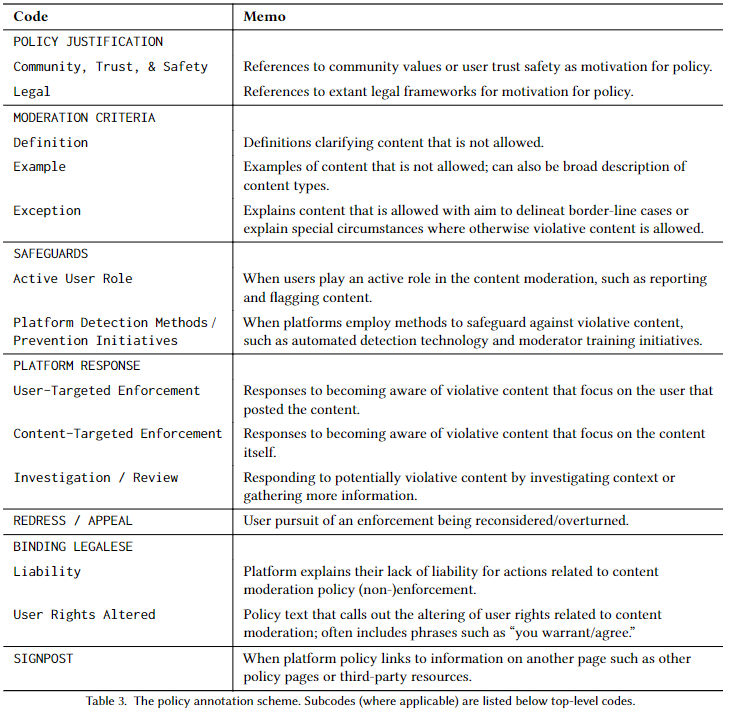
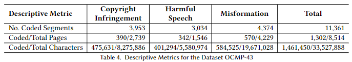
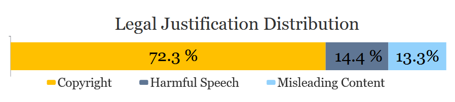
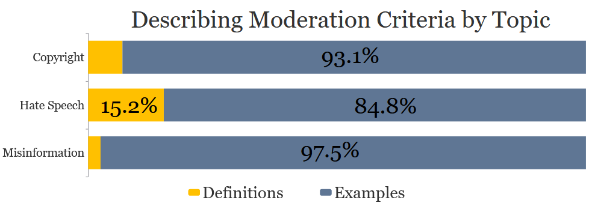
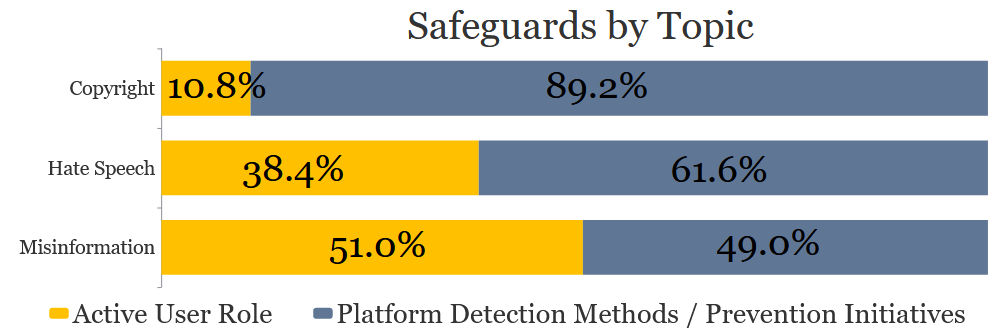
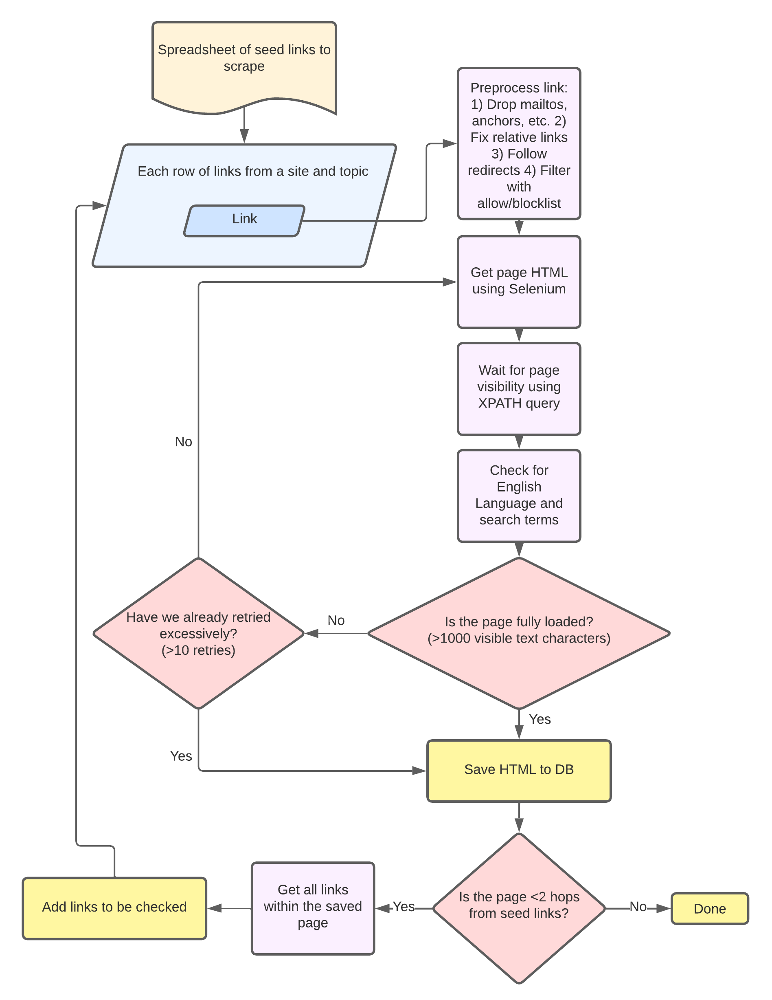

## What This Lecture Is About {.center}

> Once you let the public post, **someone has to decide what stays up.** Who is
> that someone — and by what rules?

We study how the Internet's largest platforms **govern the content they host**: the
law that (barely) constrains them, the policies they write, and what those policies
reveal.

::: {.notes}
Frame the day around one tension: free expression on one side, harm (CSAM, fraud,
incitement, hate) on the other, and a handful of private companies adjudicating
billions of decisions in between. This connects to the content-moderation debate
topic; tell students it can show up on Midterm 2.
:::

## A 2026 Hook: The DSA Bares Its Teeth {.smaller}

::: {.vignette}
On **24 October 2025** the European Commission issued **preliminary findings** that
**TikTok and Meta** breached the **Digital Services Act** — failing to give vetted
researchers "adequate access" to public platform data. The DSA lets the Commission
fine non-compliance up to **6% of global annual turnover**. Six months earlier (April
2025) Meta was fined **€200M** under the companion **Digital Markets Act**.
:::

Europe now actively *audits* moderation. The US, as we'll see, mostly does not.

::: {.notes}
The vignette makes the abstract concrete: regulators are no longer just writing rules,
they are enforcing them with turnover-scaled fines. Note the irony — the DSA charge
here is about *transparency and data access*, not specific takedowns. That foreshadows
our study's punchline: we can't even reliably read what platforms claim to do.
:::

## Online Content: Complex and at Scale {.smaller}

The Internet is far past plaintext messaging. A single live stream mixes:

- **Many media types** — video, chat, emotes, embedded clips, links
- **Nested hierarchies** of users, channels, and communities
- **Many languages**, jurisdictions, and norms — all at once

Billions of posts per day. **Who could possibly moderate all of it?**

::: {.notes}
Use a Twitch or live-stream mental image: simultaneous video, scrolling chat, sub-only
modes, multiple languages. The point is that scale and heterogeneity make uniform,
hand-tuned moderation impossible — which pushes platforms toward written policies plus
automation, both of which we'll scrutinize.
:::

## Do Governments Define What Is Allowed Online? {.smaller}

::: {.columns}
::: {.column width="50%"}
**United States — Section 230 (1996)**

- Platforms generally **not liable** for user content they host
- No federal "how-to" for moderation; act in **good faith** against the worst (CSAM,
  trafficking, terrorism) and you keep the shield
- Credited with letting the Web "flourish" — and endlessly contested
:::
::: {.column width="50%"}
**Elsewhere — more prescriptive**

- **EU Digital Services Act**: due-diligence, risk assessment, transparency,
  researcher data access (now being *enforced* — see hook)
- **Germany (NetzDG / §130)**: remove "clearly illegal" content (e.g., hate speech,
  Holocaust denial) within **24 hours** or face fines
:::
:::

In the US, the government largely **does not** define what is allowed — **the platforms do.**

::: {.notes}
Section 230 is the load-bearing US statute: (c)(1) immunizes platforms for third-party
content, (c)(2) protects good-faith removal. Contrast with the EU/German model, which
imposes affirmative removal duties and timelines. Don't argue that one regime is
better; show the variety, and the consequence: in the US, private policy is the de
facto law of online speech.
:::

## The First Amendment Cuts Both Ways {.smaller}

::: {.vignette}
**Moody v. NetChoice (July 1, 2024).** The Supreme Court took up Florida and Texas
laws restricting platforms' moderation. It vacated and remanded on procedural grounds —
but **six justices agreed** that when a platform curates which third-party content to
display, it is making **editorial choices the First Amendment protects.**
:::

So in the US, government can't easily *force* platforms to carry — or remove — speech.
That leaves the hard choices to the platforms' own **written policies.**

::: {.notes}
Key teaching point: the First Amendment constrains the *government*, not platforms.
NetChoice strengthens platforms' right to moderate as an editorial act. Combined with
Section 230, the result is that platform policy — not statute — is where most US
content rules actually live. This is the bridge into the empirical study.
:::

## Platforms as De Facto Regulators {.center}

In the US, platforms have implicitly become the **de facto regulators of nearly all
forms of human interaction online** for major portions of the Internet.

So the question becomes: **how do the platforms govern themselves — and can we even
read the rules?**

::: {.notes}
This is the thesis slide. If private policy is the real law of online speech, then
studying that policy systematically is a public-interest project. Set up the study:
Schaffner et al., "Community Guidelines Make this the Best Party on the Internet"
(CHI 2024) — an in-depth study of platforms' content-moderation policies.
:::

## The Study: Three Topics, Three Legal Regimes {.smaller}

We analyze platforms' **stated policies** across three moderation topics chosen for
their *different* grounding in US law:

::: {.columns}
::: {.column width="33%"}
**Copyright**

- Very structured, well-established
- **DMCA** notice-and-takedown
:::
::: {.column width="33%"}
**Misinformation**

- No consensus on "truth"
- Low institutional trust
- Only sporadic edge-case law (false ads, fraud, defamation)
:::
::: {.column width="33%"}
**Hate Speech**

- Hard to define; varies over time and place
- **First Amendment** protects much of it
:::
:::

Three relatively **siloed** areas, each rooted in a different depth of legal structure.

::: {.notes}
The design logic: hold "moderation" constant and vary the *legal scaffolding*.
Copyright has a detailed statutory process (DMCA §512). Hate speech is largely
constitutionally protected speech in the US. Misinformation sits in between, with only
scattered laws (false advertising, market fraud, defamation). Acknowledge other
important topics — CSAM, gore — are out of scope by design, not importance.
:::

## Where Do We Look, and What Do We Do? {.smaller}

::: {.columns}
::: {.column width="55%"}
- Start from the **Tranco top-200** sites
- Keep the **43** with meaningful **user-generated content (UGC)**
- For each, find policy text on copyright, misinformation, and hate speech
- **Collect → Annotate → Analyze** the policy text
:::
::: {.column width="45%"}
Prior work mostly studied **one site** or **one topic**. Looking across many sites and
multiple topics gives a **broad view** of the state of platform self-governance.
:::
:::

::: {.notes}
Tranco is a research-grade, manipulation-resistant ranking of popular domains — better
than raw Alexa-style lists. The 43-site, three-topic cross-section is the contribution:
breadth where prior work was narrow. The pipeline (collect/annotate/analyze) maps onto
the three contributions on the next slides.
:::

## How We Read a Policy: The Annotation Scheme {.smaller}

We hand-built a **codebook** capturing what a policy *can* contain — why a rule exists,
what gets moderated, how violations are found and handled, and what users can do next.

::: {.notes}
Walk the seven families quickly: **Why** (justification — community values vs. legal);
**What** (moderation criteria — definitions, examples, exceptions); **How found**
(safeguards — user reporting vs. platform detection); **How handled** (platform
response — user- vs. content-targeted, investigation); **Then what** (redress/appeal);
**Who** (binding legalese / liability); and **structural** signposts. The full codebook
is in the paper. This scheme is the lens for every finding that follows.
:::

## A Dataset of Policy Text: OCMP-43 {.smaller}

Four annotators coded policy text for all 43 platforms across the three topics:

Over **1,300 annotated pages**, **11,000+ segments**, and **1.4M characters** — a large,
open dataset enabling systematic analysis. (Browse it: **ocmp43.cs.uchicago.edu**.)

::: {.notes}
Emphasize the manual effort — four annotators, iterative codebook, large scale. The
payoff is that annotation at this scale lets us ask comparative questions across topics
and platforms that single-site studies can't. The dataset is public for reuse.
:::

## Why Do Platforms Say They Moderate? {.smaller}

- **Copyright** policies overwhelmingly cite **legal** justifications (the DMCA)
- Where law is thin — **hate speech, misinformation** — platforms invoke **community
  values, trust, and safety** instead

> "Our users, as decent human beings, don't like that kind of thing."
> — *Tumblr Global Advertising Policy*

::: {.notes}
This matches the design hypothesis exactly: justification tracks the depth of the
underlying law. 72% of *legal* justifications come from copyright. Where statutes run
out, platforms fall back on values language — which is harder to hold them accountable
to, because "decency" isn't a standard you can litigate.
:::

## How Do Platforms Describe What They Moderate? {.smaller}

Across **all three** topics, platforms explain what they moderate mostly by **giving
examples**, not **definitions**.

> "Hate speech is... a serious attack on a group... Examples include: '⟨race⟩ are not
> welcome in our country.'" — *Quora Platform Policies*

::: {.notes}
Headline takeaway of the paper. Examples are easy to write and flexible, but they leave
users guessing at the boundary — and give platforms discretion. Definitions provide
clarity and accountability but are hard to write for contested categories. Note hate
speech has the *most* definitions (15%) yet still leans heavily on examples; copyright
and misinformation are almost all examples.
:::

## How Do Platforms Find Violating Content? {.smaller}

::: {.columns}
::: {.column width="55%"}

:::
::: {.column width="45%"}
Three mechanisms recur: **automated detection**, **human moderators**, and **user
flagging**.

The mix shifts by topic — **copyright** leans on platform/automated detection;
**misinformation** leans far more on **users** reporting.
:::
:::

> "Pornhub moderates... through automated detection technologies, real-life human
> moderators, and user-generated reports." — *Pornhub Help Center*

::: {.notes}
Why the shift? Copyright infringement is comparatively machine-detectable (hashing,
Content ID-style matching), so platforms automate. Misinformation requires real-world
truth and context that automation can't supply, so platforms offload to users. Tie this
to Facebook's own admission: with misinformation "there is no way to articulate a
comprehensive list of what is prohibited."
:::

## Can Users Push Back? {.smaller}

::: {.columns}
::: {.column width="50%"}
**Copyright — yes, with a form**

> "...you may submit a **counter notice**." — *Automattic DMCA Counter Notice Form*

The DMCA supplies a concrete, statutory appeal path.
:::
::: {.column width="50%"}
**Hate speech / misinformation — often, no**

> "...your only remedy... is to **terminate your account** and discontinue use of...
> the Services." — *Fandom ToS*
:::
:::

Appeal rights are **lopsided**: robust where the law mandates them, near-absent where
it doesn't.

::: {.notes}
This is a fairness/due-process story. Where Congress built a procedure (DMCA §512
counter-notice), users have recourse. Where there's no statute, the "remedy" can be
"leave." Connects to the NetChoice issue: Texas/Florida tried to *mandate* appeals
processes — exactly the gap this finding identifies — and ran into the First Amendment.
:::

## Are Policies Even Complete? {.smaller}

A policy is **"complete"** only if it covers all five families: justification,
moderation criteria, safeguards, platform response, and redress/appeal.

::: {.vignette}
Only **30% (13 of 43)** of the largest UGC platforms have **complete** policies.
And policy text is **scattered** — across ToS, community guidelines, help centers,
transparency pages, blog posts. Only ~12 of 43 link community guidelines from the home
page.
:::

::: {.notes}
Two problems compound: policies are incomplete *and* hard to find. That undermines both
user understanding and regulator oversight — you can't check compliance against a moving,
scattered target. This is the core motivation for the scraper (next) and for proposals
to standardize policy format and location.
:::

## Collecting the Mess: The Scraper {.smaller}

::: {.columns}
::: {.column width="45%"}
Because policy is scattered and adversarial to crawl, we built a **configurable
web-scraper**: seed links → preprocess → render with Selenium → keyword/length filter →
save → follow links up to 2 hops.
:::
::: {.column width="55%"}

:::
:::

Worked ~**99%** of the time; ~100 pages still needed manual collection. A constant
**arms race** with bot-blockers.

::: {.notes}
Don't dwell on engineering; the teaching point is methodological honesty: this is hard,
imperfect, and partly manual — which itself is evidence that policy is not built to be
read at scale. Casting a wide net (footers, menus) over-collects on purpose; annotation
filters out the noise.
:::

## Implications for Stakeholders {.smaller}

::: {.columns}
::: {.column width="33%"}
**Regulators**

Policies are scattered and unclear → push toward **standardized formats** and (ideally
machine-readable) locations so compliance can be checked.
:::
::: {.column width="33%"}
**Platforms**

Use the dataset to **benchmark** their own policies against the wider industry.
:::
::: {.column width="33%"}
**Researchers**

Reuse the **open pipeline** and dataset; extend to new topics (e.g., AI-generated
content) and user types.
:::
:::

::: {.notes}
Standardization is the policy ask: standard locations and machine-readable policies
would let regulators verify that stated policy matches law and practice. For platforms,
this is the first cross-industry mirror. For researchers, the natural extension — flagged
on the next slide — is moderating, and studying, AI-generated content with LLMs.
:::

## LLMs Enter the Loop {.smaller}

Manual annotation is slow; manual moderation doesn't scale. So platforms increasingly
use **LLMs** both to *moderate* content and to *study* policy.

- **Promise:** GPT-class models now rival or beat older toxicity classifiers
  (e.g., Perspective API) on benchmark AUC
- **Peril (2025 research):** LLM moderators **miss implicit toxicity**, are
  **uncertain on edge cases**, and show **bias by author identity** — judging the same
  text differently depending on who they think wrote it

::: {.notes}
This is the forward-looking extension the paper itself names: LLMs as the likely tool
for both moderation and policy analysis. But ground the optimism — 2025 work (e.g., the
"Watch Your Language" ICWSM study and uncertainty/bias papers) shows LLMs inherit
hallucination and bias, miss implicit harms, and can be inconsistent. The same opacity
we criticized in platform policy now lives inside a model. Connects to the AI lectures.
:::

## What Platforms Report vs. What They Do {.smaller}

This study measures **stated policy** — what platforms *say* they do.

The harder, open question: **do platforms actually adhere to their reported policies?**

> "Related to the elections: We may not take action on violating content that is deemed
> **newsworthy**." — *TikTok Election Integrity Policy*

::: {.notes}
End the empirical arc with the limitation and the next frontier: stated vs. enacted
policy. The TikTok "newsworthy" carve-out shows how much discretion lives in the gap —
a policy can be technically present yet not binding in practice. This is exactly what
the EU DSA's transparency/data-access provisions (our opening hook) are trying to make
auditable.
:::

## The Free-Expression Tension {.center}

Every moderation rule is a **speech rule** written by a private company.

- Too little: harm, fraud, harassment, manipulation
- Too much: over-removal, opacity, no appeal, viewpoint risk
- Either way: **no government, no clear law, little transparency**

::: {.notes}
Land the normative stakes. Platforms are unelected, their rules are incomplete and
hidden, their enforcement is unauditable, and yet they govern the de facto public
square. The First Amendment protects *their* choices (NetChoice); the law rarely
protects the *user's*. That asymmetry is the heart of the content-moderation debate.
:::

## Takeaways {.smaller}

- In the US, **platforms — not government — write the rules** of online speech
  (Section 230 + NetChoice); the EU is moving the opposite way (DSA enforcement, 2025)
- Justifications track the **depth of underlying law**: legal for copyright, "values"
  for hate speech / misinformation
- Platforms explain moderation by **example, not definition** — flexible but opaque
- **Appeal rights are lopsided**; only ~**30%** of top platforms have complete policies
- **LLMs** are the next moderation engine — and the next accountability problem

::: {.notes}
Recap as a cold-call ladder. Ask: if you were a regulator, would you mandate
machine-readable policy, mandate appeals (and survive NetChoice), or require LLM
moderation audits? There's no clean answer — which is the point, and good debate fuel.
:::

# Questions? {.center}

Browse the dataset: **ocmp43.cs.uchicago.edu** ·
Source: Schaffner et al., *"Community Guidelines Make this the Best Party on the
Internet,"* CHI 2024.
