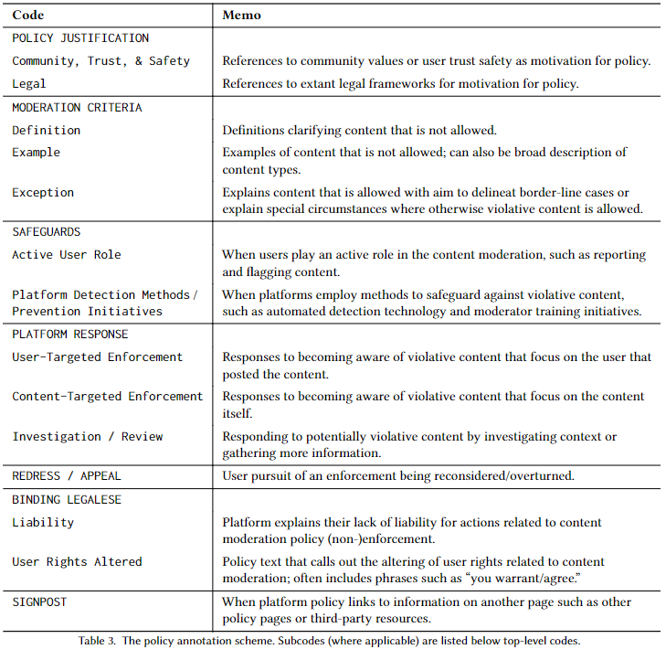
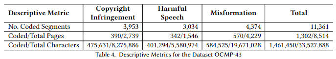
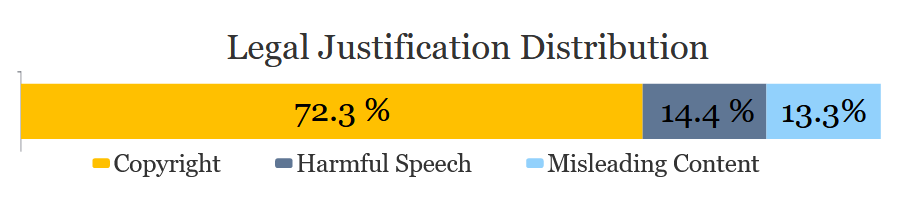
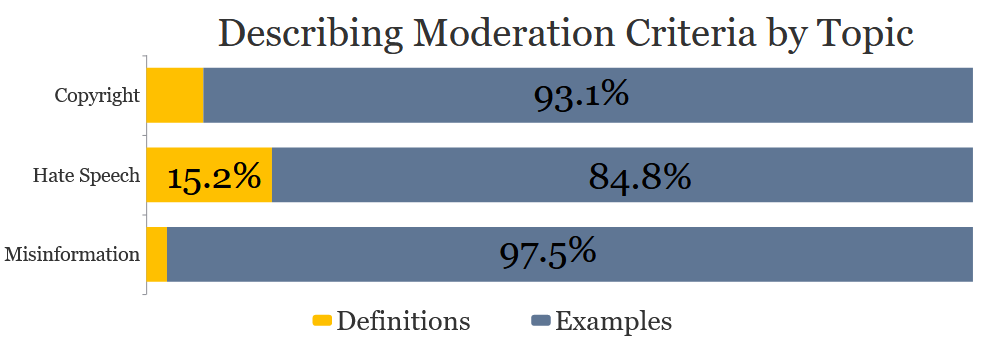
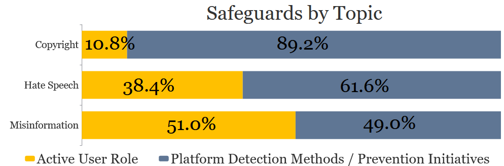
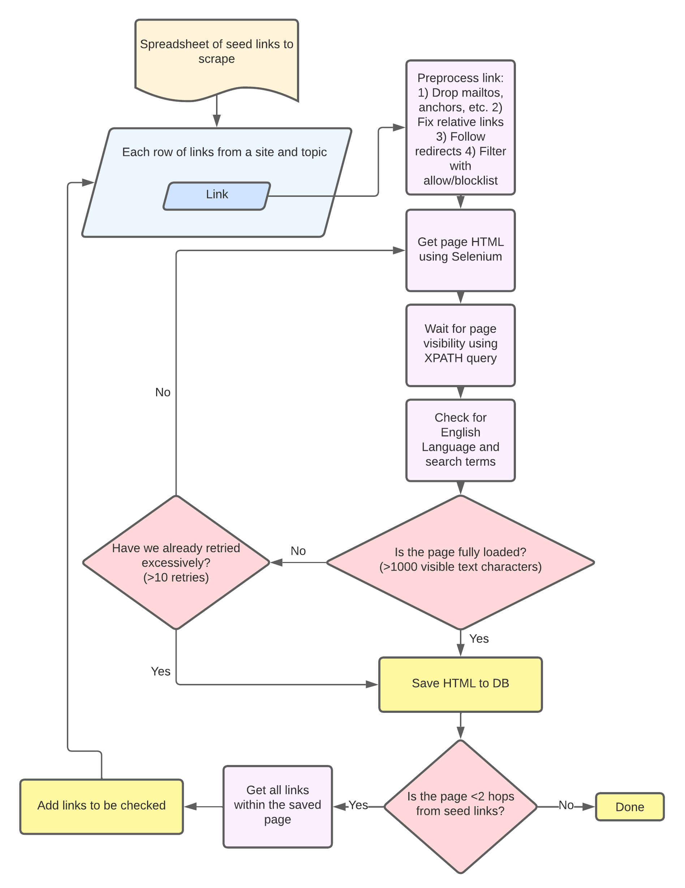

## What This Lecture Is About {.center}

> Once you let the public post, **someone has to decide what stays up.** Who is
> that someone — and by what rules?

We study how the Internet's largest platforms **govern the content they host**: the
law that (barely) constrains them, the policies they write, and what those policies
reveal.

::: {.notes}
Frame the day around one tension: free expression on one side, harm (CSAM, fraud,
incitement, hate) on the other, and a handful of private companies adjudicating
billions of decisions in between. Cold-call: who *should* write the rules of online
speech — Congress, the platforms, users, or Brussels? Every answer creates a problem
we'll hit later. This connects to the content-moderation Oxford debate ("Automated
content moderation is more harmful than beneficial for protecting free speech") —
tell students it can show up on Midterm 2. Cross-reference the copyright lecture (14)
and the AI-copyright lecture (15): moderation policies are the same private-governance
problem, one lens up.
:::

## A 2026 Hook: The DSA Bares Its Teeth {.smaller}

::: {.vignette}
On **5 December 2025** the European Commission issued its **first DSA non-compliance
decision**: a **€120M fine on X** (with Elon Musk **personally named**) over deceptive
"blue checks," ad-transparency failures, and blocked researcher access. On **24 Oct
2025** the Commission preliminarily found **TikTok and Meta** in breach for the same
researcher-access problem; on **6 Feb 2026** it added preliminary findings that
**TikTok's addictive design** violates Article 28. X sued the Commission at the
**General Court on 16 Feb 2026** — the first legal challenge to a DSA fine.
:::

Europe now actively *audits* moderation. The US, as we'll see, mostly does not.

::: {.notes}
The vignette makes the abstract concrete: regulators are no longer just writing rules,
they are enforcing them with turnover-scaled fines and personal liability. Note the irony —
the DSA charges here are about *transparency, ads, and design*, not specific takedowns.
That foreshadows our study's punchline: we can't even reliably read what platforms claim
to do. Also note the X fine is well below the 6%-of-turnover ceiling; Brussels is being
graduated, not maximalist, on first shots.
:::

## Online Content: Complex and at Scale {.smaller}

The Internet is far past plaintext messaging. A single live stream mixes:

- **Many media types** — video, chat, emotes, embedded clips, links
- **Nested hierarchies** of users, channels, and communities
- **Many languages**, jurisdictions, and norms — all at once

Billions of posts per day. **Who could possibly moderate all of it?**

::: {.notes}
Use a Twitch or live-stream mental image — simultaneous video, scrolling chat,
sub-only modes, embedded clips, multiple languages. Scale plus heterogeneity make
uniform, hand-tuned moderation impossible, which pushes platforms toward written
policies and automation — both of which we scrutinize later. Cold-call: how many
posts per second does a platform you use handle? Rough answers are fine (Facebook is
several hundred thousand per minute) — the point is to internalize the ceiling on
human review. This foreshadows the LLM-moderation slide near the end: automation is
not optional, it just shifts the accountability problem inward.
:::

## Do Governments Define What Is Allowed Online? {.smaller}

::: {.columns}
::: {.column width="50%"}
**United States — Section 230 (1996)**

- Platforms generally **not liable** for user content they host
- No federal "how-to" for moderation; act in **good faith** against the worst (CSAM,
  trafficking, terrorism) and you keep the shield
- Credited with letting the Web "flourish" — and endlessly contested
:::
::: {.column width="50%"}
**Elsewhere — more prescriptive**

- **EU Digital Services Act**: due-diligence, risk assessment, transparency,
  researcher data access (now being *enforced* — see hook)
- **Germany (NetzDG / §130)**: remove "clearly illegal" content (e.g., hate speech,
  Holocaust denial) within **24 hours** or face fines
:::
:::

In the US, the government largely **does not** define what is allowed — **the platforms do.**

::: {.notes}
Section 230 (47 U.S.C. §230, 1996) is the load-bearing US statute: (c)(1) immunizes
platforms for third-party content, (c)(2) protects good-faith removal. Contrast with
the EU DSA (in force 2024) and Germany's NetzDG (2017, 24-hour removal duty for
"clearly illegal" content under §130 StGB — hate speech, Holocaust denial). Don't
argue one regime is better; show the variety, and the consequence: in the US, private
policy is the de facto law of online speech. Cold-call: name a category of content
you think should be illegal to host — then explain which regime would let a regulator
force removal. Cross-reference the DSA vignette we just opened with: enforcement, not
just statute, is what makes the EU model bite.
:::

## The First Amendment Cuts Both Ways {.smaller}

::: {.vignette}
**Moody v. NetChoice (July 1, 2024).** The Supreme Court took up Florida and Texas
laws restricting platforms' moderation. It vacated and remanded on procedural grounds —
but **six justices agreed** that when a platform curates which third-party content to
display, it is making **editorial choices the First Amendment protects.**
:::

So in the US, government can't easily *force* platforms to carry — or remove — speech.
That leaves the hard choices to the platforms' own **written policies.**

::: {.notes}
Key teaching point: the First Amendment constrains the *government*, not platforms.
*Moody v. NetChoice*, 603 U.S. 707 (July 1, 2024) was a unanimous vacate-and-remand
on procedural grounds (facial-challenge doctrine), but Justice Kagan's majority made
six-justice dicta clear: platform curation is First-Amendment-protected editorial
activity. Alito, Thomas, Gorsuch called much of that "nonbinding" — worth naming so
students know the opinion is more contested than a headline suggests. First remand
ruling: N.D. Fla. denied Florida's dismissal motion May 22, 2025. Combined with
Section 230, the result is that platform policy — not statute — is where most US
content rules actually live. Bridge into the empirical study: if private policy is
the law, systematic study of policy is a public-interest project.
:::

## Platforms as De Facto Regulators {.center}

In the US, platforms have implicitly become the **de facto regulators of nearly all
forms of human interaction online** for major portions of the Internet.

So the question becomes: **how do the platforms govern themselves — and can we even
read the rules?**

::: {.notes}
Thesis slide. If private policy is the real law of online speech, systematic study of
that policy is a public-interest project. Set up the source paper: Schaffner, Feamster
et al., "Community Guidelines Make this the Best Party on the Internet: An In-Depth
Study of Online Platforms' Content Moderation Policies," CHI 2024. Live dataset browser
at ocmp43.cs.uchicago.edu — send students there to poke around after class. Cold-call
before revealing the study: if you were told to audit platform policies at scale, where
would you even start? Their instincts (Terms of Service? community guidelines? help
centers?) will illustrate why the "scattered mess" finding is unsurprising.
:::

## The Study: Three Topics, Three Legal Regimes {.smaller}

We analyze platforms' **stated policies** across three moderation topics chosen for
their *different* grounding in US law:

::: {.columns}
::: {.column width="33%"}
**Copyright**

- Very structured, well-established
- **DMCA** notice-and-takedown
:::
::: {.column width="33%"}
**Misinformation**

- No consensus on "truth"
- Low institutional trust
- Only sporadic edge-case law (false ads, fraud, defamation)
:::
::: {.column width="33%"}
**Hate Speech**

- Hard to define; varies over time and place
- **First Amendment** protects much of it
:::
:::

Three relatively **siloed** areas, each rooted in a different depth of legal structure.

::: {.notes}
Design logic: hold "moderation" constant and vary the legal scaffolding. Copyright
has a detailed statutory process (DMCA §512, 17 U.S.C. §512). Hate speech is largely
constitutionally protected in the US — cite *R.A.V. v. St. Paul* (1992) and *Snyder
v. Phelps* (2011) if pushed. Germany criminalizes it via §130 StGB. Misinformation
sits in between: only scattered laws (false advertising, market fraud, defamation).
Acknowledge CSAM and gore are out of scope by design, not importance. Cold-call:
predict which of the three topics has the most consistent cross-platform policy
before the next slide reveals the answer. Copyright wins on consistency because
Congress supplied the template — a preview of the paper's headline finding.
:::

## Where Do We Look, and What Do We Do? {.smaller}

::: {.columns}
::: {.column width="55%"}
- Start from the **Tranco top-200** sites
- Keep the **43** with meaningful **user-generated content (UGC)**
- For each, find policy text on copyright, misinformation, and hate speech
- **Collect → Annotate → Analyze** the policy text
:::
::: {.column width="45%"}
Prior work mostly studied **one site** or **one topic**. Looking across many sites and
multiple topics gives a **broad view** of the state of platform self-governance.
:::
:::

::: {.notes}
Tranco (tranco-list.eu) is a research-grade, manipulation-resistant ranking of popular
domains — better than raw Alexa-style lists which were easy to game. 43 UGC platforms
times three topics = 129 policy corpora. Cross-site, cross-topic breadth is the
contribution over prior single-site or single-topic work. The pipeline (collect,
annotate, analyze) maps onto the three contributions on the following slides. Cold-call:
if you had to pick five platforms outside this list to add, which would you add and
why? Answers reveal how much of "the internet" is really eight platforms plus a long
tail — which is itself a governance story.
:::

## How We Read a Policy: The Annotation Scheme {.smaller}

We hand-built a **codebook** capturing what a policy *can* contain — why a rule exists,
what gets moderated, how violations are found and handled, and what users can do next.

::: {.notes}
Walk the seven families quickly: **Why** (justification — community values vs. legal);
**What** (moderation criteria — definitions, examples, exceptions); **How found**
(safeguards — user reporting vs. platform detection); **How handled** (platform
response — user- vs. content-targeted, investigation); **Then what** (redress/appeal);
**Who** (binding legalese / liability); and **structural** signposts. The full codebook
is in the paper. This scheme is the lens for every finding that follows.
:::

## A Dataset of Policy Text: OCMP-43 {.smaller}

Four annotators coded policy text for all 43 platforms across the three topics:

Over **1,300 annotated pages**, **11,000+ segments**, and **1.4M characters** — a large,
open dataset enabling systematic analysis. (Browse it: **ocmp43.cs.uchicago.edu**.)

::: {.notes}
Emphasize the manual effort — four annotators, iterative codebook, over 1,300
annotated pages, 11,000+ segments, 1.4M characters across 43 platforms and three
topics. The payoff: annotation at this scale lets us ask comparative questions across
topics and platforms that single-site studies can't. Dataset is open for reuse at
ocmp43.cs.uchicago.edu — send students there and to the CHI 2024 paper. Cross-reference:
this is what "data science with stakeholders" (Lecture 18 on broadband) looks like
in another domain — building the instrument because the found data was inadequate.
:::

## Why Do Platforms Say They Moderate? {.smaller}

- **Copyright** policies overwhelmingly cite **legal** justifications (the DMCA)
- Where law is thin — **hate speech, misinformation** — platforms invoke **community
  values, trust, and safety** instead

> "Our users, as decent human beings, don't like that kind of thing."
> — *Tumblr Global Advertising Policy*

::: {.notes}
Headline: justification tracks the depth of underlying law. 72% of *legal*
justifications across the dataset come from copyright alone. Where statutes run out
(hate speech, misinformation), platforms fall back on "community values, trust, and
safety" language — which is harder to hold them accountable to because "decency"
isn't a litigable standard. Tumblr quote is real, drawn straight from the OCMP-43
corpus. Cold-call: what would a regulator do differently if a platform said "we don't
allow this because it's illegal" versus "because our users don't like it"? The first
gives you a legal handle; the second gives you nothing.
:::

## How Do Platforms Describe What They Moderate? {.smaller}

Across **all three** topics, platforms explain what they moderate mostly by **giving
examples**, not **definitions**.

> "Hate speech is... a serious attack on a group... Examples include: '⟨race⟩ are not
> welcome in our country.'" — *Quora Platform Policies*

::: {.notes}
Headline takeaway of the Schaffner et al. paper. Examples are easy to write and
flexible, but they leave users guessing at the boundary and give platforms discretion.
Definitions provide clarity and accountability but are hard to write for contested
categories. Hate speech has the most definitions (about 15%) yet still leans heavily
on examples; copyright and misinformation are almost all examples. Quora quote is
from OCMP-43. Cold-call: read the Quora example aloud — is "a serious attack on a
group" definitive enough for a user to know what will be removed? Discretion lives
in that ambiguity.
:::

## How Do Platforms Find Violating Content? {.smaller}

::: {.columns}
::: {.column width="55%"}

:::
::: {.column width="45%"}
Three mechanisms recur: **automated detection**, **human moderators**, and **user
flagging**.

The mix shifts by topic — **copyright** leans on platform/automated detection;
**misinformation** leans far more on **users** reporting.
:::
:::

> "Pornhub moderates... through automated detection technologies, real-life human
> moderators, and user-generated reports." — *Pornhub Help Center*

::: {.notes}
Why the shift? Copyright infringement is comparatively machine-detectable — hashing,
Content ID-style matching, YouTube's Content ID and Meta's Rights Manager are the
production examples. Misinformation requires real-world truth and context that
automation can't supply, so platforms offload to users. Facebook's own admission
about misinformation: "there is no way to articulate a comprehensive list of what
is prohibited." Cross-reference the AI-Privacy and AI-Copyright lectures on where
LLM classifiers are and aren't reliable — those limits shape which of the three
mechanisms actually scales. Cold-call: which mechanism would you trust to flag a
deepfake in an election week?
:::

## Can Users Push Back? {.smaller}

::: {.columns}
::: {.column width="50%"}
**Copyright — yes, with a form**

> "...you may submit a **counter notice**." — *Automattic DMCA Counter Notice Form*

The DMCA supplies a concrete, statutory appeal path.
:::
::: {.column width="50%"}
**Hate speech / misinformation — often, no**

> "...your only remedy... is to **terminate your account** and discontinue use of...
> the Services." — *Fandom ToS*
:::
:::

Appeal rights are **lopsided**: robust where the law mandates them, near-absent where
it doesn't.

::: {.notes}
Fairness/due-process story. Where Congress built a procedure (DMCA §512(g)
counter-notice), users have recourse. Where there's no statute, the "remedy" can be
"leave the platform." Connects directly to *Moody v. NetChoice*: Texas and Florida
tried to mandate appeals processes — exactly the gap this finding identifies — and
ran into the First Amendment because forcing platforms to carry speech is itself
editorial compulsion. Cold-call: which is worse for a user — a wrong takedown with
no appeal, or a wrong non-takedown by a platform you can't sue under Section 230?
Debate hook: the DSA's Article 20 mandates internal complaint-handling systems for
platforms; is that the model the US should adopt, or a First Amendment collision?
:::

## Are Policies Even Complete? {.smaller}

A policy is **"complete"** only if it covers all five families: justification,
moderation criteria, safeguards, platform response, and redress/appeal.

::: {.vignette}
Only **30% (13 of 43)** of the largest UGC platforms have **complete** policies.
And policy text is **scattered** — across ToS, community guidelines, help centers,
transparency pages, blog posts. Only ~12 of 43 link community guidelines from the home
page.
:::

::: {.notes}
Two problems compound: policies are incomplete *and* hard to find. Only 30% of the
largest UGC platforms (13 of 43) cover all five families; only about 12 of 43 link
community guidelines from the home page. That undermines both user understanding and
regulator oversight — you can't check compliance against a moving, scattered target.
Core motivation for the scraper on the next slide and for proposals to standardize
policy format and location — machine-readable policy would let regulators verify
stated policy against law and practice. Cold-call: try to find one platform's hate
speech policy in under a minute — students routinely fail.
:::

## Collecting the Mess: The Scraper {.smaller}

::: {.columns}
::: {.column width="45%"}
Because policy is scattered and adversarial to crawl, we built a **configurable
web-scraper**: seed links → preprocess → render with Selenium → keyword/length filter →
save → follow links up to 2 hops.
:::
::: {.column width="55%"}

:::
:::

Worked ~**99%** of the time; ~100 pages still needed manual collection. A constant
**arms race** with bot-blockers.

::: {.notes}
Don't dwell on engineering; the teaching point is methodological honesty. About 99%
success on automated collection, but roughly 100 pages still required manual work,
and it was a constant arms race with bot-blockers. That policy has to be scraped
adversarially is itself evidence policy isn't built to be read at scale. Casting a
wide net (footers, menus) over-collects on purpose; annotation filters out the noise.
Cross-reference the DSA researcher-access provisions (opening vignette) — blocked
researcher access was one of the three heads of the €120M X fine, exactly because
you cannot audit what you cannot read.
:::

## Implications for Stakeholders {.smaller}

::: {.columns}
::: {.column width="33%"}
**Regulators**

Policies are scattered and unclear → push toward **standardized formats** and (ideally
machine-readable) locations so compliance can be checked.
:::
::: {.column width="33%"}
**Platforms**

Use the dataset to **benchmark** their own policies against the wider industry.
:::
::: {.column width="33%"}
**Researchers**

Reuse the **open pipeline** and dataset; extend to new topics (e.g., AI-generated
content) and user types.
:::
:::

::: {.notes}
Standardization is the policy ask: standard locations and machine-readable policies
would let regulators verify stated policy against law and practice — the DSA's
data-access provisions are the closest current instantiation. For platforms, this
is the first cross-industry mirror they can benchmark against. For researchers, the
natural extension (next slide) is moderating and studying AI-generated content with
LLMs, plus new user categories such as minors and EU users under DSA Article 28.
Cold-call: if you were a regulator, would you require policies as JSON, or just
require they live at the same well-known URL on every platform? Trade-offs both ways.
:::

## LLMs Enter the Loop {.smaller}

Manual annotation is slow; manual moderation doesn't scale. So platforms increasingly
use **LLMs** both to *moderate* content and to *study* policy.

- **Promise:** GPT-class models now rival or beat older toxicity classifiers
  (e.g., Perspective API) on benchmark AUC
- **Peril (2025 research):** LLM moderators **miss implicit toxicity**, are
  **uncertain on edge cases**, and show **bias by author identity** — judging the same
  text differently depending on who they think wrote it

::: {.notes}
Forward-looking extension the paper itself names: LLMs are the likely tool for both
moderation and policy analysis. Ground the optimism — 2025 work such as the ICWSM
"Watch Your Language" line and the growing literature on LLM-judge bias shows LLMs
miss implicit toxicity, are uncertain on edge cases, and judge the same text
differently depending on the author's perceived identity. Compare against Google
Jigsaw's Perspective API as the pre-LLM baseline. The same opacity we criticized in
platform policy now lives inside the model itself. Cross-reference the AI-Copyright
and AI-Privacy lectures — memorization and bias both make LLM moderators fragile.
Companion hands-on activity walks students through auditing a policy corpus with a
model in the loop.
:::

## What Platforms Report vs. What They Do {.smaller}

This study measures **stated policy** — what platforms *say* they do.

The harder, open question: **do platforms actually adhere to their reported policies?**

> "Related to the elections: We may not take action on violating content that is deemed
> **newsworthy**." — *TikTok Election Integrity Policy*

::: {.notes}
End the empirical arc with the limitation and the next frontier: stated vs. enacted
policy. The TikTok "newsworthy" carve-out (drawn from their Election Integrity Policy)
shows how much discretion lives in the gap — a policy can be technically present yet
not binding in practice. Exactly what the EU DSA's transparency and data-access
provisions (opening vignette) are trying to make auditable, and exactly why blocked
researcher access was one of the three breach heads in the €120M X fine. Cold-call:
how would you *measure* whether a platform follows its own policy without inside
access? Sampling flagged posts, longitudinal audits, or forcing disclosure — each
has trade-offs and each maps to a real regulatory tool.
:::

## The Free-Expression Tension {.center}

Every moderation rule is a **speech rule** written by a private company.

- Too little: harm, fraud, harassment, manipulation
- Too much: over-removal, opacity, no appeal, viewpoint risk
- Either way: **no government, no clear law, little transparency**

::: {.notes}
Land the normative stakes. Platforms are unelected, their rules are incomplete and
hidden, their enforcement is unauditable, yet they govern the de facto public square.
The First Amendment protects *their* choices (*Moody v. NetChoice*); the law rarely
protects the *user's*. Cloudflare's deplatforming arc is the vivid case study: CEO
Matthew Prince pulled Daily Stormer (Aug 16, 2017), 8chan (Aug 5, 2019, after El
Paso), Kiwi Farms (Sept 3, 2022). Prince himself called the discretion "dangerous"
in the Daily Stormer blog post — "I woke up in a bad mood and decided someone
shouldn't be allowed on the Internet." Debate hook: is there a version of platform
governance that both scales and respects due process, or is that a contradiction?
:::

## Takeaways {.smaller}

- In the US, **platforms — not government — write the rules** of online speech
  (Section 230 + NetChoice); Meta ended third-party fact-checking (**Jan 2025**) and
  moved to Community Notes. The EU is moving the opposite way (first **DSA fine**:
  €120M on X, Dec 2025)
- Justifications track the **depth of underlying law**: legal for copyright, "values"
  for hate speech / misinformation
- Platforms explain moderation by **example, not definition** — flexible but opaque
- **Appeal rights are lopsided**; only ~**30%** of top platforms have complete policies
- **LLMs** are the next moderation engine — and the next accountability problem

::: {.notes}
Recap as a cold-call ladder. Meta announced the end of third-party fact-checking on
Jan 7, 2025 (US program officially wound down Apr 7, 2025) and moved to Community
Notes, an X-style model — the deregulatory US counterpoint to EU DSA maximalism.
Ask: as a regulator, would you mandate machine-readable policy, mandate appeals (and
survive *NetChoice*), or require LLM moderation audits? No clean answer — which is
the point and good debate fuel. Cross-reference: this is the exact question the
moderation debate ("Automated content moderation is more harmful than beneficial for
protecting free speech") asks students to defend both sides of.
:::

# Questions? {.center}

Browse the dataset: **ocmp43.cs.uchicago.edu** ·
Source: Schaffner et al., *"Community Guidelines Make this the Best Party on the
Internet,"* CHI 2024.
