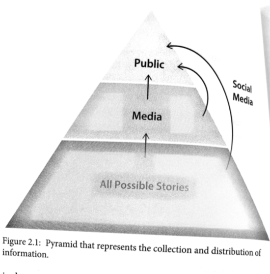
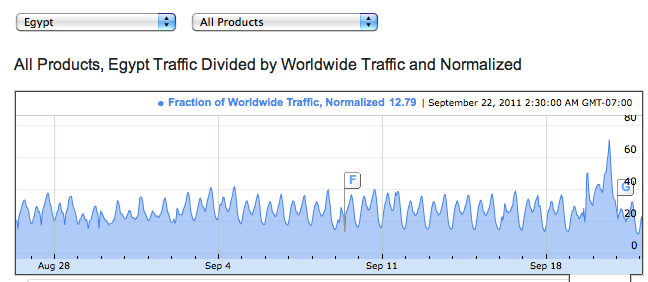
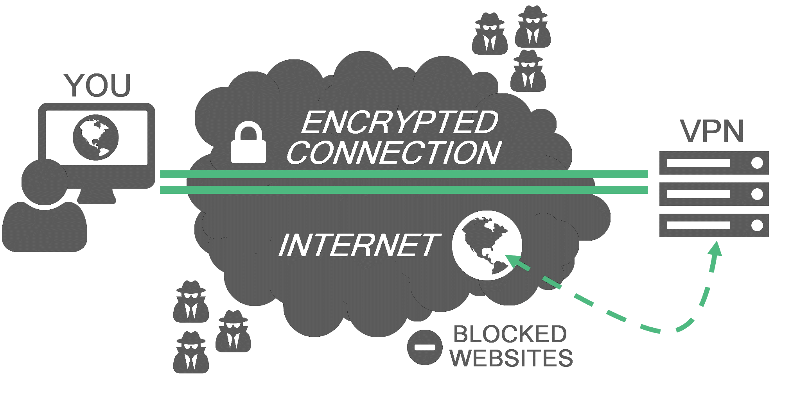
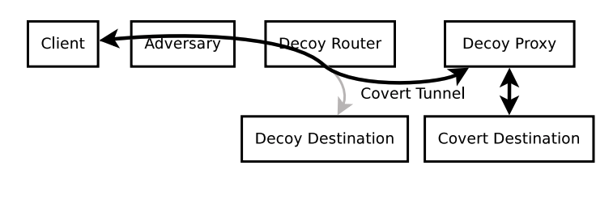
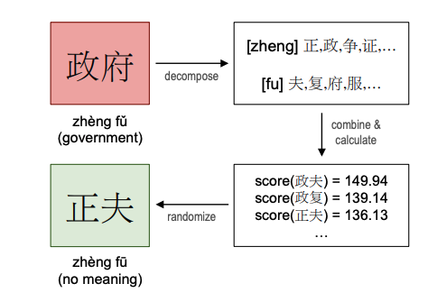

## "The Net Interprets Censorship as Damage" {.center}

> "The Net interprets censorship as damage and routes around it."
> — John Gilmore, quoted in *Time*, **December 6, 1993**

A founding article of faith for the early Internet. Three decades later, is it
still true?

::: {.notes}
Open with the date. In 1993 the commercial services (Prodigy, AOL, CompuServe) were
dismantling the walls between their private gardens and the open Internet, and the open
Net "imposed no restrictions." Ask the room: do you still believe Gilmore's line? What
is the biggest threat to it today? The arc of this lecture is that the Internet has
drifted *back* toward a handful of walled platforms — which makes control easier, not
harder.
:::

## What This Lecture Covers

- **What** Internet censorship is, and **why** states and platforms do it
- **How** it is implemented — technical and non-technical mechanisms
- **How** it is measured and circumvented
- A **modern theory**: censorship as *friction* and *flooding*, not just blocking

::: {.notes}
Set the frame: this is not just "China blocks websites." Modern information control is
subtler — a tax on attention, plausibly deniable, often porous by design. Keep that
thesis in mind throughout.
:::

# What Is Internet Censorship? {.center}

## The What and Why of Censorship

::: {.columns}
::: {.column width="50%"}
**What — control over information**

- **Access**: block content, apps, services
- **Publish**: prevent dissemination
- **View**: block individual articles
:::
::: {.column width="50%"}
**Why — the motives**

- **Political**: influence outcomes, prevent collective action
- **Religious / moral / social**: enforce norms
- **Economic**: protect domestic industry, trade
:::
:::

::: {.notes}
The three verbs — access, publish, view — map to three points where a censor can
intervene. Politics is the dominant driver, but economic protectionism (e.g., favoring
a domestic platform over a foreign one) is increasingly important and harder to call
out as "censorship."
:::

## A Brief History {.smaller}

| Year | Event |
|---|---|
| 1994 | Internet arrives in **China** |
| 1997–2006 | **Great Firewall** / **Golden Shield** built out |
| 2006 | Google agrees to **censor search results** in China |
| 2010 | Google **stops** censoring, redirects to Hong Kong |
| 2011 | **Egypt** Internet shutdown during the Arab Spring |
| 2015 | China's **Great Cannon** (DDoS via injected traffic) |
| 2017 | Cloudflare drops the **Daily Stormer** — a private-actor takedown |

::: {.notes}
Note the shift over the decades: 1990s active disruption and protocol filtering, 2000s
surveillance, 2010s platform-level and private-actor control. The 2017 Cloudflare/Daily
Stormer episode is the pivot point — the gatekeeper here is a *company*, not a
government, and the CEO openly worried about the precedent. That sets up the "protocols
to platforms" theme later.
:::

## A "Modern" Theory of Censorship

{width="55%"}

::: {.notes}
This is from Margaret Roberts' *Censored* (2018). The censor's job is not to erase the
base of the pyramid; it is to control the narrow channel through which stories reach the
public. That reframing — control the *flow*, not the *existence* — is the spine of the
whole second half of the lecture.
:::

# How Widespread Is It? {.center}

## Censorship Is the Norm, Not the Exception {.smaller}

- Practiced in **60+ countries**, including several electoral democracies
- ~20 countries operate **centralized infrastructure** for monitoring/blocking
- In 23+ countries a user has been **arrested** for online content
- Platform bans (Twitter/X, YouTube, Telegram) are routine leverage

::: {.vignette}
**2025 was the worst year on record.** Access Now's #KeepItOn coalition documented
**313 deliberate shutdowns across 52 countries** in 2025 — up from 304 in 2024 — with an
estimated **\$19.7 billion** in global economic losses. As 2026 opened, **75 shutdowns in
33 countries were still ongoing**, and Iran and Russia were pivoting from blacklisting to
**whitelisting**: block the whole Internet by default, allow only government-approved
"socially significant" services. (Access Now, March 2026.)
:::

::: {.notes}
The vignette is the freshest hook — verify the numbers against the linked report before
class. The whitelisting pivot is the important conceptual update: it inverts the default.
Blacklisting is "everything allowed except X"; whitelisting is "everything blocked except
X." Russia's "sovereign internet" / RuNet work and Iran's National Information Network
are the canonical examples. Ask students why a state would prefer whitelisting despite
the economic cost.
:::

## Measuring Censorship

::: {.columns}
::: {.column width="48%"}
- **OONI** — open measurements from volunteers' devices
- **Censored Planet** — remote, global, continuous
- **Google Transparency Report** — service reachability
- **Access Now / #KeepItOn** — shutdown tracking
:::
::: {.column width="52%"}

:::
:::

::: {.notes}
You cannot govern (or contest) what you cannot measure. The Egypt plot is the classic
example: Google's normalized traffic from Egypt drops to near zero, then spikes back when
connectivity returns. Modern tools (OONI, Censored Planet) do this continuously and
remotely, which is how we get the annual shutdown counts in the vignette. Herdict, an
older crowdsourcing project, has shut down — replaced by these endpoint/remote methods.
:::

# How Is Censorship Implemented? {.center}

## The Conventional Picture

Alice wants content from Bob. Behind a censoring firewall, the censor can:

- **Monitor** the communication
- **Block** the traffic
- **Punish** Alice for trying

```
Alice ──▶ [ Censor / Firewall ] ──╳──▶ Bob
        block traffic · punish user
```

::: {.notes}
This is the mental model students arrive with, and it's a fine starting point: a
chokepoint between a censored net and an uncensored net. "Suppose Alice wants content
from Bob; if she reaches the Internet through a censorship firewall, the censor can
monitor, block, or punish." The rest of the lecture complicates this — the chokepoint
moves, and outright blocking is often the *least* favored tool.
:::

## Technical Mechanisms {.smaller}

::: {.columns}
::: {.column width="50%"}
**Protocol interference**

- **IP filtering** (blocklists)
- **DNS** manipulation / poisoning
- **TCP** connection resets
- **HTTP(S)** redirection, **SNI** filtering
:::
::: {.column width="50%"}
**Infrastructure & platform leverage**

- DNS registries / registrars
- **Certificate authorities**
- **CDNs**
- Social media, search engines
:::
:::

::: {.notes}
Walk down the stack. IP and DNS blocking are cheap and coarse; TCP RST injection and
SNI-based filtering are how the Great Firewall does fine-grained, keyword-aware blocking
on otherwise-encrypted connections. Encrypted DNS (DoH/DoT) and Encrypted Client Hello
(ECH) are eroding the SNI vantage point — tie back to the DNS-security lecture. The
right column matters more every year: control a registrar, a CA, or a CDN and you
control reachability without touching a single packet on the wire.
:::

## Points of Control Along the Path

- **Access ISPs** and **transit/backbone** networks — where most state filtering lives
- **CDNs, social platforms, search engines** — increasingly the real chokepoints
- **Client endpoints** — devices and apps (mandated client-side scanning, app removals)

::: {.notes}
Censorship requires a *point of control*. Centralized infrastructure — a national
gateway, a dominant CDN, an app store — is what makes blocking feasible at scale. The
trend is that control is migrating from the network core toward the platform and the
endpoint, which is exactly why "protocols to platforms" is the throughline.
:::

## Non-Technical Censorship

- **Self-censorship** — fear of backlash; pervasive yet essentially undocumented
- **Law and policy** — defamation, "fake news," and copyright statutes
  (e.g., **DMCA §512** notice-and-takedown; **CDA §230**) repurposed to remove speech
- **Arrests and intimidation** — the human cost behind the statistics

::: {.notes}
The most effective censorship may leave no technical trace at all. Self-censorship is
the hardest to measure and arguably the most powerful. Copyright takedown regimes are a
favorite legal tool because they are fast, deniable, and outsourced to platforms. This
connects directly to the content-moderation and copyright lectures.
:::

# How Can It Be Circumvented? {.center}

## Circumvention Tools

::: {.columns}
::: {.column width="55%"}
- **VPNs** — encrypt and tunnel traffic through a proxy
- **Tor** and pluggable transports — anonymity + obfuscation
- **Secure messaging** — Signal, encrypted apps
- **Domain fronting / refraction** — hide the real destination
:::
::: {.column width="45%"}

:::
:::

::: {.notes}
VPNs are the workhorse — but censors fight back by blocking VPN endpoints and
fingerprinting their handshakes, which is why obfuscation (pluggable transports,
Snowflake) matters. Note the arms race: as censors detect a tool, the tool must look
more like ordinary traffic. This is also why some states now *whitelist* (vignette) —
it's the censor's answer to circumvention.
:::

## Two Clever Ideas Worth Knowing {.smaller}

::: {.columns}
::: {.column width="50%"}
**Decoy / refraction routing** — a friendly router *inside the path* secretly diverts
your traffic to the real destination; to the censor it looks like an innocent site.


:::
::: {.column width="50%"}
**Language-based evasion** — replace banned words with **homophones** the filters miss
(政府 → 正夫). Cheap, human-driven, hard to fully block.


:::
:::

::: {.notes}
Decoy routing (a.k.a. refraction networking) is elegant because the censor would have to
block huge swaths of innocuous traffic to stop it — raising collateral damage. The
Weibo homophone example shows circumvention doesn't have to be technical at all; users
out-creative the keyword filters. Both illustrate the next idea: censorship is rarely
airtight, and the censor often *knows* it isn't.
:::

# From Protocols to Platforms {.center}

## Trends in Information Control

- **Information manipulation** — not just removing speech, but *adding* noise
- **Centralization** — a few platforms and CDNs become the chokepoints
- **Plausible deniability** — make control look like accident or "moderation"

::: {.notes}
This is the second half's thesis, drawn from the course reading (Roberts; "From
Protocols to Platforms"). Control has moved up the stack and into private hands, and the
most effective methods are the ones that don't look like censorship at all.
:::

## Manipulation: Sock-Puppets, Astroturf, Disinformation

- **Sock-puppeting** — fake the appearance of independent speakers
- **Astroturfing** — fake the appearance of a grassroots movement
- **Disinformation** — deliberately spread falsehoods to crowd out the truth

::: {.notes}
China's "50 Cent Army" is the canonical study (King, Pan, Roberts): the goal of state
commentators is mostly *distraction* — cheerleading and topic-shifting around sensitive
dates — not argument. Connect to the "flooding" tactic below. Modern twist: generative
AI makes plausible sock-puppet content nearly free, which scales flooding dramatically.
:::

## Roberts' Taxonomy: Fear, Friction, Flooding {.smaller}

| Tactic | Mechanism | Example |
|---|---|---|
| **Fear** | Make people afraid to publish or view | Arrests, surveillance, prosecutions |
| **Friction** | Make content costly to find or reach | Throttling, VPN blocks, buried results |
| **Flooding** | Drown signal with distracting noise | Bots, astroturf, hashtag hijacking |

::: {.notes}
This table is the single most important slide. Fear targets the sophisticated minority;
friction and flooding work on everyone else. The genius is that friction and flooding
are *deniable* — they look like a slow network or an organic trend, not a crackdown.
Have students classify the day's news headline into one of the three F's.
:::

## Censorship as a Tax, Not a Ban

> "Most censorship in China acts not as a ban but as a **tax** on information."

- Users *can* reach censored material — if they spend more **time** or **money**
- China's 2010 Google "exit" was largely **throttling**, not a clean block
- A small, deliberate inconvenience deters the **majority** — without backlash

::: {.notes}
The throttling story: rather than a hard block, the page simply loads ~75% of the time,
slowly. Most users give up; the determined few get through. Crucially, throttling is
deniable — "the network is just slow." This is the "porous censorship" insight: holes
are a feature, because the holes relieve pressure from the motivated minority who would
otherwise cause backlash.
:::

## Personalization and "Filter Bubbles"

Personalized feeds show us what *already* suits our tastes — and that channel can be
**exploited** to shape what we see and don't.

> "A squirrel dying in front of your house may be more relevant to your interests right
> now than people dying in Africa." — Mark Zuckerberg

::: {.notes}
The point isn't that filter bubbles are an unstoppable force (the empirical evidence is
mixed) — it's that *whoever controls the ranking controls attention*, and attention is
the scarce resource censors now compete for. Tie to flooding: you don't need to delete a
story if the algorithm simply never surfaces it.
:::

## Why Control Information If It Leaks Anyway?

- Direct repression causes **backlash**; porous control does not
- **Inconveniencing** the population is usually *sufficient*
- Friction + flooding handle the majority; **fear** is reserved for the sophisticated few
- Every method gives the censor **plausible deniability**

::: {.notes}
This answers the lecture's central puzzle (the "why bother if it's circumventable?"
slide). The answer: perfect censorship was never the goal. A leaky system that taxes
attention, looks like technical failure, and avoids martyrs is *more* effective than an
airtight one that provokes resistance. The future of censorship is the competition for
limited human attention.
:::

## Takeaways

- Censorship is **control over the flow** of information, not just deletion
- It runs from **packets to platforms to attention** — and increasingly the chokepoints
  are **private**
- The modern toolkit is **fear, friction, flooding** — deniable and porous *by design*
- We can **measure** it (OONI, Censored Planet) and **circumvent** it — but the arms
  race favors whoever controls the chokepoint

::: {.notes}
Land the thesis: a "tax on access to information." Even citizens in democracies are
vulnerable to friction and flooding, because attention is finite. Preview the link to
content moderation and net-neutrality debates — when does platform moderation become
censorship, and who decides?
:::

# Discussion {.center}

Is **content moderation** by a private platform a form of censorship? When does
**throttling** cross the line? Pick this week's news story — is it *fear*, *friction*,
or *flooding*?

::: {.notes}
Run as a cold-call into the three-F framework, then bridge to the content-moderation
debate. Good follow-up: who should hold the chokepoint accountable — the state, the
platform, or no one?
:::
