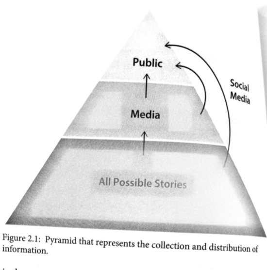
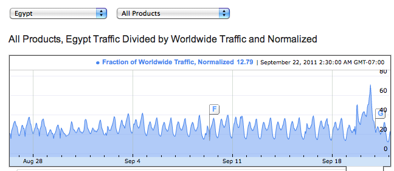
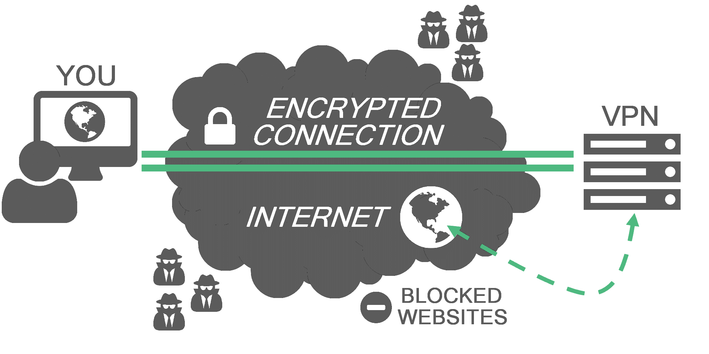
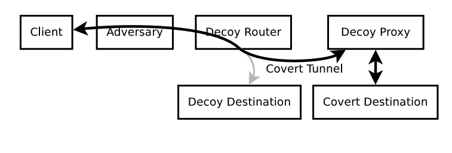
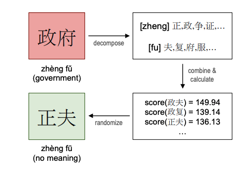

## "The Net Interprets Censorship as Damage" {.center}

> "The Net interprets censorship as damage and routes around it."
> — John Gilmore, quoted in *Time*, **December 6, 1993**

A founding article of faith for the early Internet. Three decades later, is it
still true?

::: {.notes}
Open with the date and the source. John Gilmore, EFF co-founder, is quoted in Philip
Elmer-DeWitt's "First Nation in Cyberspace," *Time*, Dec 6, 1993 — the earliest
independent recording is Rheingold's *The Virtual Community* (Sept 1993). In 1993 the
commercial services (Prodigy, AOL, CompuServe) were dismantling the walls between
their private gardens and the open Internet, and the open Net "imposed no restrictions."
Cold-call: do you still believe Gilmore's line? What's the biggest threat to it today?
The arc of this lecture is that the Internet has drifted back toward a handful of
walled platforms — which makes control easier, not harder. Debate hook to plant early:
if the chokepoints are private, does the First Amendment even reach them?
:::

## What This Lecture Covers

- **What** Internet censorship is, and **why** states and platforms do it
- **How** it is implemented — technical and non-technical mechanisms
- **How** it is measured and circumvented
- A **modern theory**: censorship as *friction* and *flooding*, not just blocking

::: {.notes}
Roadmap slide. Set the frame explicitly: this is not just "China blocks websites."
Modern information control is subtler — a tax on attention, plausibly deniable, often
porous by design. Preview the fear/friction/flooding framing that lands at the end of
the deck (Margaret Roberts' taxonomy). Cross-reference: this lecture rhymes with the
moderation deck (private gatekeepers) and with the DNS/routing lectures (technical
chokepoints). If students remember one thing, it should be that porous censorship is
often more effective than airtight censorship.
:::

# What Is Internet Censorship? {.center}

## The What and Why of Censorship

::: {.columns}
::: {.column width="50%"}
**What — control over information**

- **Access**: block content, apps, services
- **Publish**: prevent dissemination
- **View**: block individual articles
:::
::: {.column width="50%"}
**Why — the motives**

- **Political**: influence outcomes, prevent collective action
- **Religious / moral / social**: enforce norms
- **Economic**: protect domestic industry, trade
:::
:::

::: {.notes}
Book anchor: Margaret Roberts, *Censored: Distraction and Diversion Inside China's
Great Firewall* (Princeton, 2018), Chapter 1. The three verbs — access, publish, view
— map to three intervention points. Politics is the dominant driver, but economic
protectionism (favoring a domestic platform over a foreign one) is increasingly
important and harder to call out as "censorship." Cold-call: is India blocking TikTok
in 2020 political, economic, or both? Both — and the ambiguity is itself the tool.
Cross-reference the moderation lecture: private "trust and safety" is a fourth verb
that doesn't fit the traditional taxonomy but often does the same work.
:::

## A Brief History {.smaller}

| Year | Event |
|---|---|
| 1994 | Internet arrives in **China** |
| 1997–2006 | **Great Firewall** / **Golden Shield** built out |
| 2006 | Google agrees to **censor search results** in China |
| 2010 | Google **stops** censoring, redirects to Hong Kong |
| 2011 | **Egypt** Internet shutdown during the Arab Spring |
| 2015 | China's **Great Cannon** (DDoS via injected traffic) |
| 2017 | Cloudflare drops the **Daily Stormer** — a private-actor takedown |

::: {.notes}
Trace the shift over decades: 1990s protocol filtering and active disruption; 2000s
surveillance; 2010s platform-level and private-actor control. China's Great Firewall
and Golden Shield were built out from 1997–2006; Google agreed to censor in 2006 and
withdrew in 2010, redirecting cn.google.com to Hong Kong. Egypt's 2011 shutdown was a
BGP withdrawal (Cowie/Renesys, "Egypt Leaves the Internet") that disconnected roughly
88% of Egyptian networks. The 2015 Great Cannon (Citizen Lab) weaponized in-network
injection to DDoS GreatFire and GitHub. The 2017 Cloudflare / Daily Stormer takedown
is the pivot point: the gatekeeper is a company, not a government, and Matthew Prince
openly worried about the precedent. That sets up "protocols to platforms" later.
:::

## A "Modern" Theory of Censorship

{width="55%"}

::: {.notes}
From Margaret Roberts' *Censored* (Princeton, 2018) — the information pyramid. The
censor's job is not to erase the base of the pyramid; it is to control the narrow
channel through which stories reach the public. Reframing "control the flow, not the
existence" is the spine of the whole second half of the lecture. Cold-call: if you
were a censor with a fixed budget, would you delete every offending story or slow
their reach by 30%? Roberts's data says slowing is cheaper, more effective, and less
politically costly. Cross-reference the personalization slide later: whoever ranks
the feed controls the same pyramid.
:::

# How Widespread Is It? {.center}

## Censorship Is the Norm, Not the Exception {.smaller}

- Practiced in **60+ countries**, including several electoral democracies
- ~20 countries operate **centralized infrastructure** for monitoring/blocking
- In 23+ countries a user has been **arrested** for online content
- Platform bans (Twitter/X, YouTube, Telegram) are routine leverage

::: {.vignette}
**2025 was the worst year on record.** Access Now's #KeepItOn coalition documented
**313 deliberate shutdowns across 52 countries** in 2025 — the highest since tracking
began in 2016 — with an estimated **\$19.7 billion** in global economic losses
(Top10VPN/NetBlocks). **Myanmar** led with **95 shutdowns**, surpassing **India (65)**
for the second year in a row; **conflict** was the leading trigger for the third year
running (125 shutdowns in 14 countries). Iran and Russia continue pivoting from
blacklisting to **whitelisting** — block the whole Internet by default, allow only
government-approved "socially significant" services. (Access Now, March 2026.)
:::

::: {.notes}
The vignette is the freshest hook — verify the numbers against the linked report before
class. Access Now's official 2025 annual report (Mar 31, 2026): 313 shutdowns across
52 countries, Myanmar #1 (95), India #2 (65), conflict the leading trigger for the
third year, 70 shutdowns coinciding with grave human-rights abuses in 21 countries.
Economic-loss figure is Top10VPN/NetBlocks ($19.7B, with Russia alone at $11.9B). The
whitelisting pivot is the key conceptual update: it inverts the default. Blacklisting is
"everything allowed except X"; whitelisting is "everything blocked except X." Russia's
"sovereign internet" / RuNet work and Iran's National Information Network are the
canonical examples. First-time-ever shutdowns tracked in 2025 include the **United
States** (Access Now flagged domestic incidents for the first time). Ask students why a
state would prefer whitelisting despite the economic cost.
:::

## Measuring Censorship

::: {.columns}
::: {.column width="48%"}
- **OONI** — open measurements from volunteers' devices
- **Censored Planet** — remote, global, continuous
- **Google Transparency Report** — service reachability
- **Access Now / #KeepItOn** — shutdown tracking
:::
::: {.column width="52%"}

:::
:::

::: {.notes}
You cannot govern (or contest) what you cannot measure. The Egypt plot is the classic
example: Google's normalized traffic from Egypt drops to near zero on Jan 27, 2011,
then spikes back when connectivity returns days later. Modern tools do this continuously
and remotely: OONI (Open Observatory of Network Interference) via volunteer endpoints;
Censored Planet from Roya Ensafi's Michigan group via remote probing; SFLC.in's India
shutdown tracker; Access Now's KeepItOn coalition tracks the shutdown counts in the
vignette. Herdict, an older crowdsourcing project, shut down and has been replaced.
Cold-call: which measurement approach would let you catch throttling (as opposed to a
hard block)? Continuous remote probing sees the difference between "slow" and "off."
:::

# How Is Censorship Implemented? {.center}

## The Conventional Picture

Alice wants content from Bob. Behind a censoring firewall, the censor can:

- **Monitor** the communication
- **Block** the traffic
- **Punish** Alice for trying

```
Alice ──▶ [ Censor / Firewall ] ──╳──▶ Bob
        block traffic · punish user
```

::: {.notes}
This is the mental model students arrive with, and it's a fine starting point: a
chokepoint between a censored net and an uncensored net. Alice wants content from Bob;
behind a firewall, the censor can monitor, block, or punish. The rest of the lecture
complicates this — the chokepoint moves, and outright blocking is often the *least*
favored tool because it's the most visible. Cold-call: which of the three verbs
(monitor, block, punish) creates the most self-censorship? Punishment is why "fear"
is one of Roberts's three F's, and why arrests scale far beyond the people arrested.
:::

## Technical Mechanisms {.smaller}

::: {.columns}
::: {.column width="50%"}
**Protocol interference**

- **IP filtering** (blocklists)
- **DNS** manipulation / poisoning
- **TCP** connection resets
- **HTTP(S)** redirection, **SNI** filtering
:::
::: {.column width="50%"}
**Infrastructure & platform leverage**

- DNS registries / registrars
- **Certificate authorities**
- **CDNs**
- Social media, search engines
:::
:::

::: {.notes}
Walk down the stack. IP and DNS blocking are cheap and coarse. TCP RST injection and
SNI-based filtering are how the Great Firewall does fine-grained keyword-aware blocking
on otherwise-encrypted connections. Encrypted DNS (DoH/DoT) and Encrypted Client Hello
(ECH — see Cloudflare's ECH deployment notes) are eroding the SNI vantage point —
tie back to the DNS-security lecture. Recent measurement anchor: Hoang et al.,
*GFWeb* at USENIX Security 2024, quantified GFW web censorship at scale. The right
column matters more every year: control a registrar, a CA, or a CDN and you control
reachability without touching a packet on the wire. Cold-call: if the SNI goes away
under ECH, where does the censor's next vantage point move to? Probably to the
endpoint (client-side scanning) or to the platform (mandated takedowns).
:::

## Points of Control Along the Path

- **Access ISPs** and **transit/backbone** networks — where most state filtering lives
- **CDNs, social platforms, search engines** — increasingly the real chokepoints
- **Client endpoints** — devices and apps (mandated client-side scanning, app removals)

::: {.notes}
Censorship requires a point of control. Centralized infrastructure — a national
gateway, a dominant CDN, an app store, a mobile OS vendor — is what makes blocking
feasible at scale. Control is migrating from the network core toward the platform
and the endpoint, which is exactly why "protocols to platforms" is the throughline
of this lecture. Concrete anchors: EU Chat Control (mandated client-side scanning
proposals); Russia's forced removal of VPN apps from Apple's App Store in 2024;
India-mandated app takedowns. Cold-call: which of these three vantage points would
you find hardest to circumvent as a user? Endpoint scanning is nearly impossible
without switching device stacks entirely.
:::

## Non-Technical Censorship

- **Self-censorship** — fear of backlash; pervasive yet essentially undocumented
- **Law and policy** — defamation, "fake news," and copyright statutes
  (e.g., **DMCA §512** notice-and-takedown; **CDA §230**) repurposed to remove speech
- **Arrests and intimidation** — the human cost behind the statistics

::: {.notes}
The most effective censorship may leave no technical trace at all. Self-censorship is
the hardest to measure and arguably the most powerful — pervasive and essentially
undocumented. Copyright takedown regimes (DMCA §512, EU DSA) are a favorite legal
tool because they are fast, deniable, and outsourced to platforms — the platform
takes it down first and litigates later. Connects directly to the content-moderation
(16) and copyright (14, 15) lectures — the same statutory tools that legitimately
protect creators are repurposed for information control. Cold-call: name a recent
news story about a takedown; whose "law" produced it — the state's, or the platform's?
:::

# How Can It Be Circumvented? {.center}

## Circumvention Tools

::: {.columns}
::: {.column width="55%"}
- **VPNs** — encrypt and tunnel traffic through a proxy
- **Tor** and pluggable transports — anonymity + obfuscation
- **Secure messaging** — Signal, encrypted apps
- **Domain fronting / refraction** — hide the real destination
:::
::: {.column width="45%"}

:::
:::

::: {.notes}
VPNs are the workhorse — but censors fight back by blocking VPN endpoints and
fingerprinting their handshakes, which is why obfuscation matters. Tor's pluggable
transports (obfs4, meek, Snowflake) exist to make Tor traffic look like ordinary
web traffic. Signal has done similar domain-fronting work — see its own censorship-
circumvention blog posts. Domain fronting was mostly killed when Google and AWS shut
it off in 2018 (EFF: "domain fronting was a critical tool for the open web"). The
arms race means: as censors detect a tool, the tool must look more like ordinary
traffic. This is also why some states now whitelist (opening vignette) — it's the
censor's ultimate answer to circumvention. Cold-call: which is easier to defeat,
whitelisting or blacklisting? Whitelisting is expensive to build but nearly airtight.
:::

## Two Clever Ideas Worth Knowing {.smaller}

::: {.columns}
::: {.column width="50%"}
**Decoy / refraction routing** — a friendly router *inside the path* secretly diverts
your traffic to the real destination; to the censor it looks like an innocent site.


:::
::: {.column width="50%"}
**Language-based evasion** — replace banned words with **homophones** the filters miss
(政府 → 正夫). Cheap, human-driven, hard to fully block.


:::
:::

::: {.notes}
Decoy / refraction routing traces to Wustrow et al., *Telex: Anticensorship in the
Network Infrastructure* (USENIX Security 2011), and continues via TapDance and Conjure
in the Refraction Networking project. It's elegant because the censor would have to
block huge swaths of innocuous traffic to stop it — raising collateral damage. The
Weibo homophone example (政府 → 正夫) shows circumvention doesn't have to be technical
at all; users out-creative the keyword filters. King, Pan & Roberts' work on Chinese
censorship (APSR 2013, "How Censorship in China Allows Government Criticism but
Silences Collective Expression") is the canonical study. Both illustrate the next
idea: censorship is rarely airtight, and the censor often knows it isn't.
:::

# From Protocols to Platforms {.center}

## Trends in Information Control

- **Information manipulation** — not just removing speech, but *adding* noise
- **Centralization** — a few platforms and CDNs become the chokepoints
- **Plausible deniability** — make control look like accident or "moderation"

::: {.notes}
Second-half thesis, drawn from the course reading (Roberts, *Censored*; "From
Protocols to Platforms"). Anchor essay: Jack Balkin's "Free Speech in the Algorithmic
Society" (UC Davis L. Rev. 2018) — the free-speech triangle of state, platforms, and
users. Also Kate Klonick, "The New Governors" (Harvard L. Rev. 2018). Control has
moved up the stack and into private hands, and the most effective methods are the ones
that don't look like censorship at all. Centralization is what makes modern takedown
both easy and deniable. Cross-reference the content-moderation lecture (16): private
governance of speech is the same story from a different angle.
:::

## Manipulation: Sock-Puppets, Astroturf, Disinformation

- **Sock-puppeting** — fake the appearance of independent speakers
- **Astroturfing** — fake the appearance of a grassroots movement
- **Disinformation** — deliberately spread falsehoods to crowd out the truth

::: {.notes}
China's "50 Cent Army" is the canonical study — King, Pan, Roberts, "How the Chinese
Government Fabricates Social Media Posts for Strategic Distraction, Not Engaged
Argument" (APSR 2017). Finding: state commentators mostly distract (cheerleading,
topic-shifting around sensitive dates) rather than argue. Connect to the "flooding"
tactic on the next slide. Modern twist: generative AI makes plausible sock-puppet
content nearly free — see Goldstein et al., "Generative Language Models and Automated
Influence Operations" (2023). This scales flooding dramatically. Cold-call: if a
bot can post 10,000 comments per day, what's the marginal cost of drowning out any
particular narrative? Nearly zero — which is the whole game.
:::

## Roberts' Taxonomy: Fear, Friction, Flooding {.smaller}

| Tactic | Mechanism | Example |
|---|---|---|
| **Fear** | Make people afraid to publish or view | Arrests, surveillance, prosecutions |
| **Friction** | Make content costly to find or reach | Throttling, VPN blocks, buried results |
| **Flooding** | Drown signal with distracting noise | Bots, astroturf, hashtag hijacking |

::: {.notes}
Single most important slide of the deck. Straight from Roberts, *Censored*, §1.2
"Distraction and Diversion." Fear targets the sophisticated minority; friction and
flooding work on everyone else. The genius is that friction and flooding are
*deniable* — they look like a slow network or an organic trend, not a crackdown.
Cold-call: have students classify the day's news headline into one of the three F's
before you reveal your read. Debate hook for the censorship breakout: is age
verification a form of friction masquerading as consumer protection? That's Breakout
A. Cross-reference the moderation deck: private "shadowbanning" is textbook friction.
:::

## Censorship as a Tax, Not a Ban

> "Most censorship in China acts not as a ban but as a **tax** on information."

- Users *can* reach censored material — if they spend more **time** or **money**
- China's 2010 Google "exit" was largely **throttling**, not a clean block
- A small, deliberate inconvenience deters the **majority** — without backlash

::: {.notes}
Direct quote from Roberts (Ch. 1). The Google 2010 throttling story: rather than a
hard block, pages loaded roughly 75% of the time, slowly. Most users give up; the
determined few get through. Throttling is deniable — "the network is just slow."
This is the "porous censorship" insight: the holes are a feature, because they relieve
pressure from the motivated minority who would otherwise cause backlash and become
martyrs. Cold-call: how would you empirically distinguish "network is bad" from
"government is throttling"? Continuous remote probing (Censored Planet) is one answer;
patterns tied to sensitive dates are another. Cross-reference the measurement slide.
:::

## Personalization and "Filter Bubbles"

Personalized feeds show us what *already* suits our tastes — and that channel can be
**exploited** to shape what we see and don't.

> "A squirrel dying in front of your house may be more relevant to your interests right
> now than people dying in Africa." — Mark Zuckerberg

::: {.notes}
Zuckerberg's "squirrel dying" quote originally appeared in David Kirkpatrick's *The
Facebook Effect* (Simon & Schuster, 2010). Eli Pariser coined "filter bubble" the
same year. Empirical pushback worth naming: Guess et al. in *Science* (2023) found
reshares amplify political news but don't detectably move beliefs or opinions — the
evidence for filter-bubble *effects* is mixed. The teaching point isn't "filter bubbles
are unstoppable" but "whoever controls ranking controls attention," and attention is
the scarce resource censors now compete for. Tie to flooding: you don't need to
delete a story if the algorithm simply never surfaces it. Cold-call: is a downranked
tweet censored? By whose definition?
:::

## Why Control Information If It Leaks Anyway?

- Direct repression causes **backlash**; porous control does not
- **Inconveniencing** the population is usually *sufficient*
- Friction + flooding handle the majority; **fear** is reserved for the sophisticated few
- Every method gives the censor **plausible deniability**

::: {.notes}
Answers the lecture's central puzzle: why bother censoring if it's circumventable?
Because perfect censorship was never the goal. A leaky system that taxes attention,
looks like technical failure, and avoids martyrs is more effective than an airtight
one that provokes resistance. Fear reserved for the sophisticated few; friction and
flooding handle the majority; every method gives the censor plausible deniability.
The future of censorship is the competition for limited human attention. Cold-call:
if you were designing a control regime and could pick only one of the three F's,
which would you pick and why? Roberts's data says friction gives the best ROI.
:::

## Takeaways

- Censorship is **control over the flow** of information, not just deletion
- It runs from **packets to platforms to attention** — and increasingly the chokepoints
  are **private**
- The modern toolkit is **fear, friction, flooding** — deniable and porous *by design*
- We can **measure** it (OONI, Censored Planet) and **circumvent** it — but the arms
  race favors whoever controls the chokepoint

::: {.notes}
Land the thesis: censorship is a tax on access to information. Even citizens in
democracies are vulnerable to friction and flooding because attention is finite.
Recap ladder: packets → platforms → attention; fear/friction/flooding; measurement
via OONI and Censored Planet; circumvention arms race. Preview the link to the
content-moderation debate — when does platform moderation become censorship, and
who decides? That's the discussion coming next, and Breakout A in the censorship
breakout guide. Debate hook: is a private CDN pulling a controversial site
censorship, moderation, or both?
:::

# Discussion {.center}

Is **content moderation** by a private platform a form of censorship? When does
**throttling** cross the line? Pick this week's news story — is it *fear*, *friction*,
or *flooding*?

::: {.notes}
Run as a cold-call into the three-F framework, then bridge to the moderation debate.
Good follow-up: who should hold the chokepoint accountable — the state, the platform,
or no one? Companion breakouts: Breakout A is age-verification / democratic-censorship,
workshopping the friction/flooding/fear frame; Breakout B is whitelisting, VPN
crackdowns, and splinternet. Flag the censorship debate if scheduled the same session.
Best cold-call: "Pick this week's news story — is it fear, friction, or flooding?"
Almost every headline maps onto one of the three, which is the durable takeaway you
want students to leave with.
:::
