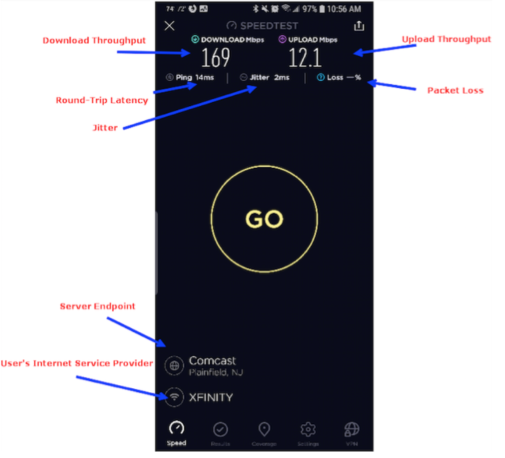
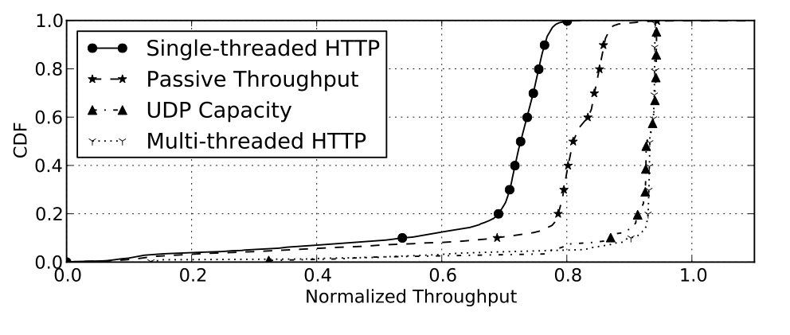
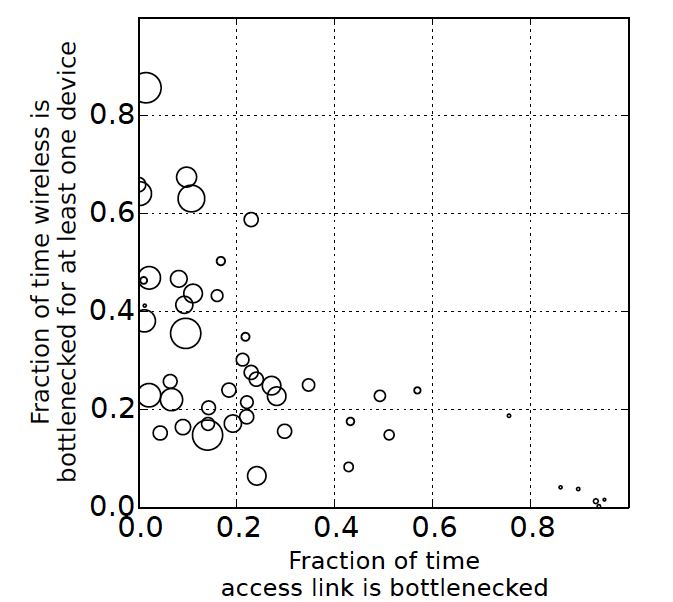
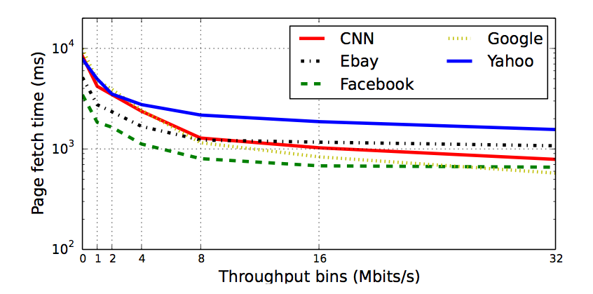
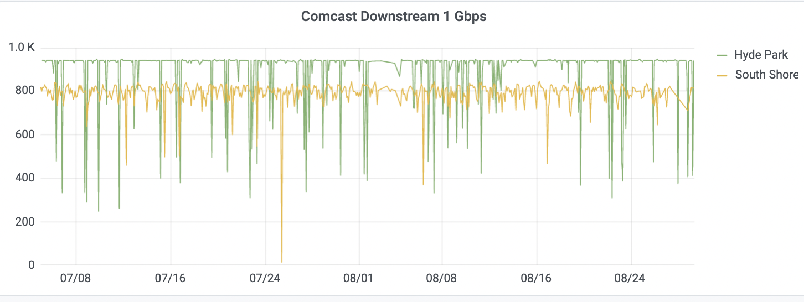
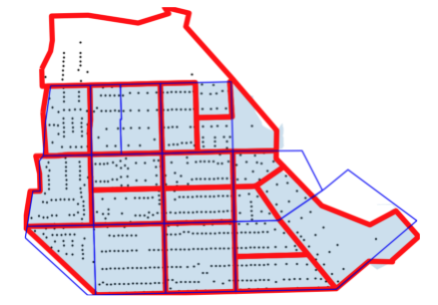
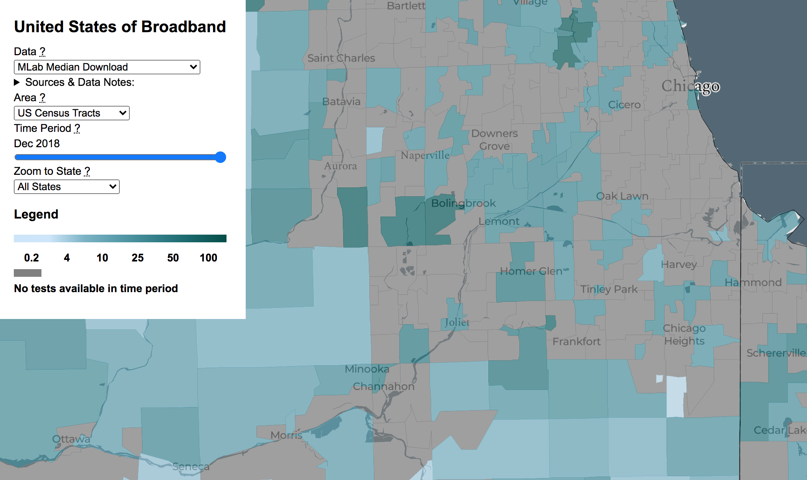
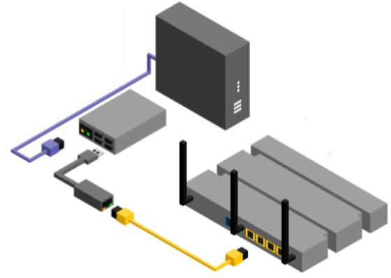

## Why Broadband Belongs in This Course {.center}

Broadband is **consumer-protection infrastructure**: what you can buy, what you
actually get, who is left out, and whether the **measurements** that drive policy
are trustworthy.

::: {.notes}
Frame the day. This is not a networking lecture for its own sake — it is a case study
in how technical measurement, policy, privacy, and equity collide. Every claim a
regulator makes ("X% of homes have broadband") rests on a measurement someone designed,
and those designs have biases. That is the consumer-protection angle.
:::

## A 2026 Vignette: The Cliff and the Map {.smaller}

::: {.vignette}
On **June 1, 2024** the **Affordable Connectivity Program** ended after Congress
declined to refund it — pulling a ~**$30/month** subsidy from roughly **23 million**
enrolled households; an estimated **5 million** lost home internet entirely. Meanwhile
the **$42.45B BEAD** deployment program was **restructured in June 2025** and only began
releasing funds to states in late 2025 — so the U.S. spent the affordability gap *up*
while the buildout was still on paper.
:::

**Thought question:** if you were the FCC, *what would you measure* to know whether
either program worked?

::: {.notes}
This is the freshest hook. The pairing is the teaching point: a demand-side subsidy
(ACP) and a supply-side buildout (BEAD) moving in opposite directions. Cold-call: what
data would tell you if ACP mattered? Adoption rates, not just availability. That sets up
the whole "measurement is hard and biased" arc.
:::

## Five Lessons for the Day {.smaller}

1. **"Speed" has many facets** — one number hides a lot.
2. **Different techniques measure different things** — and disagree.
3. **Many factors limit a client-based speed test** — the bottleneck moves.
4. **Faster "speed" doesn't mean better experience** — apps plateau.
5. **As links get faster, measurement gets harder** — and more political.

::: {.notes}
This is the spine. Each lesson is a slide or two. Tell students the through-line: every
lesson is a reason that the "official" broadband numbers can be wrong — and wrong numbers
drive billions in policy.
:::

# What Are We Even Measuring? {.center}

## "Speed" Has Many Facets

::: {.columns}
::: {.column width="55%"}
A single advertised number — "1 Gbps" — collapses several distinct properties:

- **Throughput** (upload *and* download)
- **Latency** — delay, what video calls and gaming feel
- **Jitter** — variation in latency
- **Packet loss**

The metric that matters depends on the **application**.
:::
::: {.column width="45%"}

:::
:::

::: {.notes}
Hammer the point that "speed" is marketing shorthand. A Zoom call cares about latency,
jitter, and loss far more than peak throughput. This is why a household can have "fast
internet" on paper and a terrible experience.
:::

## Different Techniques Measure Different Things

::: {.columns}
::: {.column width="55%"}
- **Active** tests inject traffic and time it (speed tests).
- **Passive** monitoring watches real traffic without injecting any.
- **Single-** vs **multi-threaded** tests get very different answers on the *same* link.

The four lines below are all "the throughput of the same homes."
:::
::: {.column width="45%"}

:::
:::

::: {.notes}
Walk the CDF: single-threaded HTTP (NDT-style) systematically *under*-reports capacity
vs. UDP capacity or multi-threaded tests. This is not noise — it is a methodological
bias, and it matters because M-Lab/NDT data feeds public maps and policy.
:::

## Many Factors Limit a Client-Based Speed Test {.smaller}

The number you get is the **minimum** across the whole chain:

- **Client device** — old CPU, weak Wi-Fi radio, busy browser
- **Home network** — Wi-Fi contention, other devices
- **Network path** — peering, interconnection, distance
- **Measurement server** — is *it* the bottleneck?
- **Test parameters** — duration, number of connections

::: {.notes}
The key intuition: a speed test measures the weakest link, not the access link. If the
phone's Wi-Fi caps at 80 Mbps, a 1 Gbps plan reads as 80. Students conflate "my speed
test" with "my ISP's speed" constantly — this slide breaks that.
:::

## The Home Network Is Often the Bottleneck

::: {.columns}
::: {.column width="50%"}
- Homes above ~**35 Mbps** almost never see the **access link** as the bottleneck (2015 study).
- **Wi-Fi** bottlenecks dominate, and *grow* with faster plans.
- So buying a faster plan often changes **nothing** the user can feel.
:::
::: {.column width="50%"}

:::
:::

::: {.notes}
Bubble plot: x-axis = fraction of time the access link is the bottleneck, y-axis =
fraction of time Wi-Fi is. Mass sits in the upper-left: Wi-Fi limited, access link fine.
Policy implication: subsidizing a faster tier may not help if the home network is the
constraint — an equity nuance.
:::

## Faster "Speed" Doesn't Mean Better Performance

::: {.columns}
::: {.column width="55%"}
**Page load time stops improving above ~16 Mbps.**

Beyond that, the bottleneck is **latency, protocols, and the page itself** — not raw
throughput.

So the marginal gigabit buys almost no web-browsing benefit.
:::
::: {.column width="45%"}

:::
:::

::: {.notes}
This is the consumer-protection punchline: ISPs upsell ever-faster tiers, but for most
everyday tasks the experience plateaus. The Wall Street Journal ran a well-known piece
("You're probably paying for internet speed you don't need") on exactly this. Tie it to
how we define a *useful* broadband benchmark.
:::

## User Experience Lives in the Application {.smaller}

For streaming and video calls, what users actually feel:

- **Startup delay** — how long until video plays
- **Resolution** — how sharp
- **Bitrate changes** — quality shifting mid-stream
- **Rebuffering** — the dreaded spinner

These are **application-quality** metrics — not throughput. And apps rarely saturate the
link at all.

::: {.notes}
The right thing to measure is experience, which is observable only by watching real
application traffic. That motivates passive measurement — and the privacy tension we hit
later. Note: ideally you'd also just ask users (experience sampling).
:::

# Measuring the Digital Divide {.center}

## The Divide Is Local — and Right Next Door

::: {.columns}
::: {.column width="48%"}
The digital divide is **national and global**, but also block-by-block in Chicago —
acute on the **South Side**, even in neighborhoods bordering the university
(Woodlawn, South Shore).
:::
::: {.column width="52%"}

:::
:::

::: {.notes}
Two homes, *same advertised 1 Gbps Comcast plan*, two neighborhoods. South Shore sits
lower and dips harder. "Same service plan ≠ same performance." This is the equity heart
of the lecture and it's measurable. Connect back to ACP: affordability and quality both
vary by neighborhood.
:::

## What Counts as "Broadband"? {.smaller}

::: {.columns}
::: {.column width="55%"}
The definition is a **policy choice** with real money attached:

- **2015:** FCC benchmark = **25/3 Mbps**
- **2024:** raised to **100/20 Mbps** (a 4× jump)
- Still ~**22M Americans** lack 100/20 service
- **Rural** access ~77% vs **urban** ~98%

Move the threshold, and millions move in or out of "served."
:::
::: {.column width="45%"}
::: {.vignette}
The benchmark feeds **BEAD eligibility, USF, and state maps** — so the *number itself*
decides who gets funded.
:::
:::
:::

::: {.notes}
This is the cleanest example of "a definition is a policy lever." The 2024 jump to
100/20 instantly reclassified locations as unserved/underserved, changing who BEAD money
can reach. Verified: FCC 2024 Section 706 report raised the benchmark to 100/20.
:::

## Bad Data: Garbage In, Garbage Out {.smaller}

The map is only as good as the data behind it — and found data is often broken at the
**root**, not just dirty:

- **Technical method** — single-threaded tests under-report capacity
- **Sampling method** — who runs the test isn't a random sample
- **Systematic errors** — biased, not random

::: {.callout-warning}
These are **not** fixable by deleting outliers. A biased sample stays biased after you
clean it.
:::

::: {.notes}
The data-science lesson. Students' instinct is "drop the bad rows." But sampling and
methodological bias survive cleaning — you have to fix the *instrument*, not the
spreadsheet. This is the bridge to "sometimes you must build a new measurement system."
:::

## Limitation: Who Runs the Test? {.smaller}

::: {.columns}
::: {.column width="48%"}
**Sampling frame** matters. Crowdsourced speed tests over-represent:

- People who already **suspect** a problem
- Households with **devices and confidence** to test
- The **technically engaged**

The least-connected are the **least likely** to appear in the data — exactly the people
policy is meant to help.
:::
::: {.column width="52%"}

:::
:::

::: {.notes}
Selection bias is the silent killer of broadband data. The map of "where tests ran" is
not a map of "where people live." Designing a real **sampling frame** (red boundary,
census blocks) is itself research. Tie back to the vignette: ACP-eligible households are
under-sampled.
:::

## Limitation: The Test Itself Lies {.smaller}

::: {.columns}
::: {.column width="50%"}
A single-threaded client test (e.g., classic **NDT / M-Lab**) plus infrastructure
bottlenecks can **severely under-report** true throughput.

The result isn't a small error — it's **bad conclusions** baked into public maps.
:::
::: {.column width="50%"}

:::
:::

::: {.notes}
This is delicate: M-Lab data is widely used and valuable, but a known methodological
limitation means it can understate capacity. The teaching point is humility — know your
instrument's bias before you publish a map that moves billions of dollars.
:::

# Doing It Right: A Data-Science Workflow {.center}

## Step 1: Define the Question with Stakeholders

Good broadband research **starts with people**, not a dataset:

- Residents, community organizations, city agencies, ISPs, regulators
- Each stakeholder frames a **different question** ("Is it affordable?" vs. "Is it fast?"
  vs. "Is it reliable?")
- The question determines what — and where — to measure

::: {.notes}
Counter the Kaggle mindset. You don't start from "here's a CSV." You start from a
community's actual question. Shaping research questions *in relation to people* is the
work — and it's what keeps the measurement honest and useful.
:::

## Step 2: Sometimes You Must Build the Instrument {.smaller}

::: {.columns}
::: {.column width="52%"}
When good data doesn't exist, you build a system:

- **Router-based** speed tests (measure from inside the home)
- **Passive, privacy-preserving** inference of Wi-Fi, ISP, and app performance — *without
  breaking encryption*
- Methods now used by the **FCC and ISPs**

**Hard parts:** scale, geographic/network sampling, and the directness-vs-privacy
tradeoff.
:::
::: {.column width="48%"}

:::
:::

::: {.notes}
The device sits in-line between the cable modem and the home router (or off-path),
implemented on cheap hardware (Raspberry Pi / Odroid). It infers experience from traffic
patterns instead of decrypting. This is how you escape the biases of crowdsourced client
tests — but it introduces the privacy problem on the next slides.
:::

## Step 3: Confront the Tradeoffs — Privacy {.smaller}

In-home measurement gives the **best data** and raises the **hardest privacy questions**:

- A device in someone's home sees **when and how** they use the internet
- Even without decryption, **traffic patterns** are revealing
- Trust is **lowest** in exactly the **underserved communities** the work aims to help

::: {.callout-note}
The more **direct** the measurement, the more **invasive** it tends to be. That tradeoff
is a design decision, not an afterthought.
:::

::: {.notes}
This is where the lecture rejoins the privacy themes of the course. You can infer a lot —
sleep schedules, which apps, household size — from metadata alone. Asking an
under-resourced community to host a sensor demands earned trust and strong privacy
guarantees. Current deployments often retreat to active-only measurement for this reason.
:::

## Passive Measurement Yields Real Insight {.smaller}

From a lab study of video-conferencing apps over **constrained** links:

- Idle calls use surprisingly little — utilization ranges **~0.8–1.9 Mbps**
- All apps take **≥20s** to recover from a severe uplink drop to 0.25 Mbps
- Proprietary congestion control is **unfair**: Zoom/Meet can grab **>75%** of downlink
  when competing with Teams or a TCP flow
- Your **video layout** (speaker pin) changes your *own* uplink use

::: {.notes}
Concrete payoff of passive measurement: you learn things no speed test could — fairness
between apps, recovery dynamics, layout effects. Ties back to Lesson 4: experience is
about app behavior under real conditions, not peak Mbps.
:::

# Why It Matters {.center}

## The Policy Stakes Are Live and Large {.smaller}

::: {.columns}
::: {.column width="50%"}
**Affordability (demand side)**

- ACP ended **June 2024**; ~23M households, ~5M dropped off
- Successor proposals and **Lifeline** ($9.25/mo) don't fill the gap
:::
::: {.column width="50%"}
**Deployment (supply side)**

- **BEAD** $42.45B, restructured **June 2025**
- 26 states added **$1.3B** of their own in 2025
- Maps + benchmarks decide **who is eligible**
:::
:::

Every one of these decisions rests on **a measurement someone designed**.

::: {.notes}
Bring it home. The same measurement biases we discussed (sampling, method, definition)
are deciding tens of billions in spending right now. A student who understands instrument
bias can critique a broadband map — and that is a policy superpower.
:::

## Conclusion {.smaller}

- Broadband **"speed" is many things**; one number hides bias and inequity.
- The **digital divide** is measurable, local, and shaped by **how we define and sample**.
- Real data science: **pose the question with stakeholders, build the instrument,
  confront the tradeoffs (especially privacy), and know your limitations.**
- It is **not** tuning a model on a found dataset.

> Addressing the digital divide is a quintessential data-science *and* consumer-protection
> problem.

::: {.notes}
End on the disposition you want: skepticism toward tidy numbers, respect for the people
behind the data, and awareness that measurement choices are policy choices. If they
remember one thing: "a broadband statistic is an argument, not a fact — ask how it was
measured."
:::
