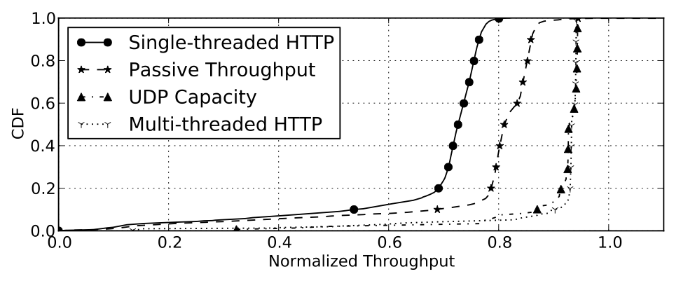
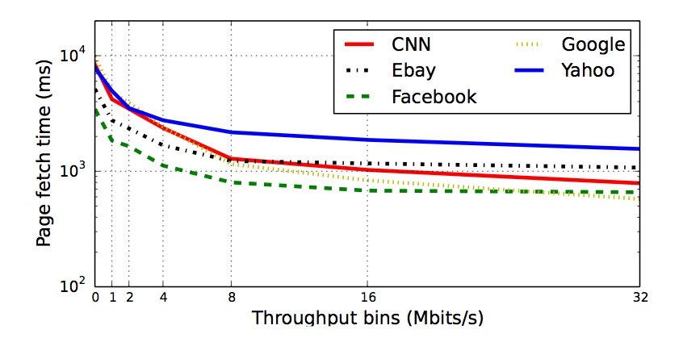
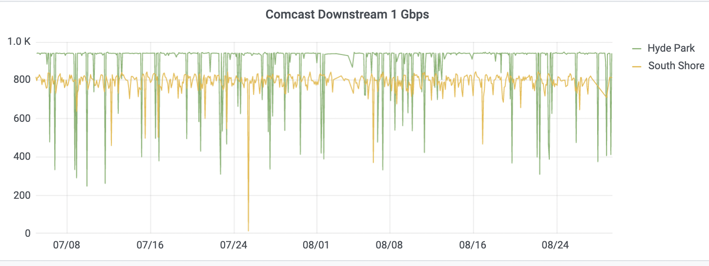
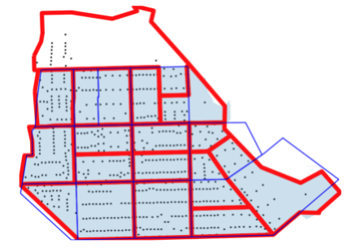
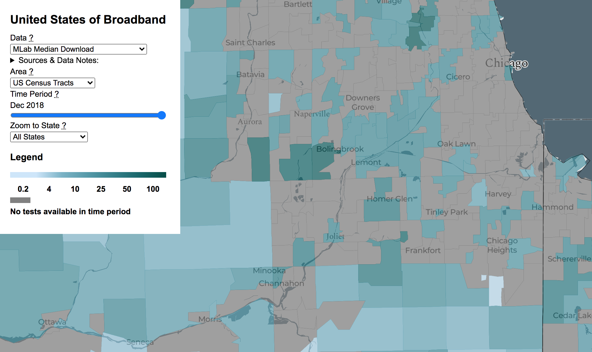
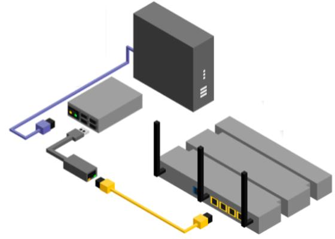

## Why Broadband Belongs in This Course {.center}

Broadband is **consumer-protection infrastructure**: what you can buy, what you
actually get, who is left out, and whether the **measurements** that drive policy
are trustworthy.

::: {.notes}
Frame the day. This is not a networking lecture for its own sake — it is a case study
in how technical measurement, policy, privacy, and equity collide. Every claim a
regulator makes ("X% of homes have broadband") rests on a measurement someone designed,
and those designs have biases. That is the consumer-protection angle. Cross-reference
the whole term: security and privacy live inside infrastructure, and infrastructure is
allocated by numbers that appear in a table. Cold-call: think of a consumer product
you buy where "the number on the box" is really an argument, not a fact — broadband
speed, phone battery life, camera megapixels. Broadband is the case study today.
:::

## A 2026 Vignette: The Cliff and the Map {.smaller}

::: {.vignette}
On **June 1, 2024** the **Affordable Connectivity Program** ended after Congress
declined to refund it — pulling a ~**$30/month** subsidy from roughly **23 million**
enrolled households; an estimated **5 million** lost home internet entirely. Two years
later, **no federal replacement has passed** — only **Lifeline** ($9.25/mo) and a
patchwork of **state successors** (NM LITAP, CA LifeLine Home Broadband Pilot, both
launched 2026). Meanwhile the **$42.45B BEAD** deployment program was **restructured
June 6, 2025**; by mid-2026 **52 of 56 states/territories** had signed subgrant
agreements and the first BEAD-funded home was connected in Nebraska — so the U.S. spent
the affordability gap *up* while the buildout is only now shovel-ready.
:::

**Thought question:** if you were the FCC, *what would you measure* to know whether
either program worked?

::: {.notes}
This is the freshest hook. The pairing is the teaching point: a demand-side subsidy
(ACP) and a supply-side buildout (BEAD) moving in opposite directions. Verified July
2026: no federal ACP successor has passed Congress; NM LITAP launched July 1, 2026;
CA LifeLine Home Broadband Pilot launched January 2026; both offer up to $30/mo. On
the BEAD side, NTIA's Progress Dashboard shows 54 of 56 Final Proposals approved and
52 subgrant agreements signed; Alabama, Mississippi, Massachusetts, Louisiana, and
Nevada are among the states already awarding subgrants (all in Q1–Q2 2026). Cold-call:
what data would tell you if ACP mattered? Adoption rates, not just availability. That
sets up the whole "measurement is hard and biased" arc.
:::

## Five Lessons for the Day {.smaller}

1. **"Speed" has many facets** — one number hides a lot.
2. **Different techniques measure different things** — and disagree.
3. **Many factors limit a client-based speed test** — the bottleneck moves.
4. **Faster "speed" doesn't mean better experience** — apps plateau.
5. **As links get faster, measurement gets harder** — and more political.

::: {.notes}
Spine of the lecture. Each lesson is a slide or two. Tell students the through-line
explicitly: every lesson is a reason the "official" broadband numbers can be wrong,
and wrong numbers drive tens of billions in policy — BEAD alone is $42.45B, ACP was
about $30/month for 23M households. Cold-call: rank the five lessons by which one
surprises you most. That primes them to notice which of their intuitions the deck
overturns. Cross-reference to the data-science workflow at the end: fixing a
measurement is often the real research project.
:::

# What Are We Even Measuring? {.center}

## "Speed" Has Many Facets

::: {.columns}
::: {.column width="55%"}
A single advertised number — "1 Gbps" — collapses several distinct properties:

- **Throughput** (upload *and* download)
- **Latency** — delay, what video calls and gaming feel
- **Jitter** — variation in latency
- **Packet loss**

The metric that matters depends on the **application**.
:::
::: {.column width="45%"}

:::
:::

::: {.notes}
Hammer that "speed" is marketing shorthand. A Zoom call cares about latency, jitter,
and loss far more than peak throughput. Cloudflare's engineering blog puts this well:
"aim for reliability, not speed." That's why a household can have "fast internet" on
paper and a terrible experience — and why a family paying for a gigabit tier can
still hit a rebuffering spinner on the same call. Cold-call: for the app you used
last night, which of the four metrics mattered most? Gaming = latency; streaming =
throughput + jitter; video calls = all four. Bridges to the "apps plateau" slide.
:::

## Different Techniques Measure Different Things

::: {.columns}
::: {.column width="55%"}
- **Active** tests inject traffic and time it (speed tests).
- **Passive** monitoring watches real traffic without injecting any.
- **Single-** vs **multi-threaded** tests get very different answers on the *same* link.

The four lines below are all "the throughput of the same homes."
:::
::: {.column width="45%"}

:::
:::

::: {.notes}
Walk the CDF: single-threaded HTTP (classic NDT-style) systematically under-reports
capacity vs. UDP-capacity or multi-threaded tests. This is not noise — it's
methodological bias. It matters because M-Lab / NDT data feeds public FCC maps and
policy decisions. M-Lab publishes its own methodology (measurementlab.net) and has
since evolved NDT (NDT7 uses BBR and TCP_INFO). Cold-call: if two speed tests
disagree by 300 Mbps on the same link, which one is right? Neither — they answer
different questions. Cross-reference the "who runs the test?" slide later: even
before sampling bias, method choice already skews the answer.
:::

## Many Factors Limit a Client-Based Speed Test {.smaller}

The number you get is the **minimum** across the whole chain:

- **Client device** — old CPU, weak Wi-Fi radio, busy browser
- **Home network** — Wi-Fi contention, other devices
- **Network path** — peering, interconnection, distance
- **Measurement server** — is *it* the bottleneck?
- **Test parameters** — duration, number of connections

::: {.notes}
Key intuition: a speed test measures the weakest link, not the access link. If your
phone's Wi-Fi caps at 80 Mbps, a 1 Gbps plan reads as 80 — and you'll blame Comcast.
Students conflate "my speed test" with "my ISP's speed" constantly; this slide breaks
that. Cold-call: name every hop you can think of between your laptop and Zoom's
server. Then ask which of those hops you as a consumer can even *see*, let alone
control. Very few — which is exactly why measurement is a policy problem, not just
a device problem. Cross-reference the next slide: even inside your home, Wi-Fi is
usually the culprit above 35 Mbps.
:::

## The Home Network Is Often the Bottleneck

::: {.columns}
::: {.column width="50%"}
- Homes above ~**35 Mbps** almost never see the **access link** as the bottleneck (2015 study).
- **Wi-Fi** bottlenecks dominate, and *grow* with faster plans.
- So buying a faster plan often changes **nothing** the user can feel.
:::
::: {.column width="50%"}

:::
:::

::: {.notes}
Bubble plot: x-axis is fraction of time the access link is the bottleneck; y-axis
is fraction of time Wi-Fi is. Mass sits in the upper-left — Wi-Fi limited, access
link fine. Anchor: Sundaresan et al., "Home Network or Access Link? Locating Last-Mile
Downstream Throughput Bottlenecks" (PAM 2016). Above roughly 35 Mbps the access link
is almost never the bottleneck. Policy implication: subsidizing a faster *tier* may
not help if the home network is the constraint — an important equity nuance for
programs like ACP and BEAD. Cold-call: if you were the FCC, would you fund faster
tiers or better routers? A live debate in current broadband policy circles.
:::

## Faster "Speed" Doesn't Mean Better Performance

::: {.columns}
::: {.column width="55%"}
**Page load time stops improving above ~16 Mbps.**

Beyond that, the bottleneck is **latency, protocols, and the page itself** — not raw
throughput.

So the marginal gigabit buys almost no web-browsing benefit.
:::
::: {.column width="45%"}

:::
:::

::: {.notes}
Consumer-protection punchline: ISPs upsell ever-faster tiers, but for most everyday
tasks the experience plateaus. The *Wall Street Journal* piece "You're Probably Paying
for Internet Speed You Don't Need" (2018) is the popular anchor; Sundaresan, Feamster
& Teixeira's academic work quantifies the ~16 Mbps plateau for page loads. Beyond
that, latency, protocol behavior (TCP slow start, HTTP/2 vs. 3), and page complexity
are the bottleneck, not throughput. Cold-call: what would you actually notice if
your ISP doubled your plan from 300 to 600 Mbps? Probably nothing for browsing.
Ties directly to the benchmark-definition slide: the FCC's 100/20 threshold is
already well past the plateau for most everyday tasks.
:::

## User Experience Lives in the Application {.smaller}

For streaming and video calls, what users actually feel:

- **Startup delay** — how long until video plays
- **Resolution** — how sharp
- **Bitrate changes** — quality shifting mid-stream
- **Rebuffering** — the dreaded spinner

These are **application-quality** metrics — not throughput. And apps rarely saturate the
link at all.

::: {.notes}
The right thing to measure is experience, which is observable only by watching real
application traffic — startup delay, resolution, bitrate changes, rebuffering.
Motivates passive measurement, and the privacy tension we hit later. Reference for
video-conferencing facts: MacMillan et al., "Measuring the Performance and Network
Utilization of Popular Video Conferencing Applications" (IMC 2021). Ideally you'd
also just ask users (experience sampling). Cold-call: what would a *user-experience*
KPI look like for broadband, and how would you audit an ISP against it? The FCC's
Measuring Broadband America program (via SamKnows) is the closest current example.
:::

# Measuring the Digital Divide {.center}

## The Divide Is Local — and Right Next Door

::: {.columns}
::: {.column width="48%"}
The digital divide is **national and global**, but also block-by-block in Chicago —
acute on the **South Side**, even in neighborhoods bordering the university
(Woodlawn, South Shore).
:::
::: {.column width="52%"}

:::
:::

::: {.notes}
Two homes, *same advertised 1 Gbps Comcast plan*, two neighborhoods bordering the
university (Hyde Park vs. South Shore). South Shore sits lower and dips harder.
"Same service plan ≠ same performance." This is the equity heart of the lecture and
it is measurable — anchor is the UChicago Internet Equity Initiative
(internetequity.uchicago.edu). Connect back to ACP: affordability *and* delivered
quality both vary by neighborhood. Cold-call: what would you need to prove to a
regulator that this pattern is systematic, not one bad router? A sampling frame
(next few slides) and controlled comparison — hard, hence why so few maps show it.
:::

## What Counts as "Broadband"? {.smaller}

::: {.columns}
::: {.column width="55%"}
The definition is a **policy choice** with real money attached:

- **2015:** FCC benchmark = **25/3 Mbps**
- **2024:** raised to **100/20 Mbps** (a 4× jump)
- **July 2025:** Carr FCC proposes to **scrap adoption/affordability** from the
  Section 706 inquiry and roll back the **1 Gbps long-term goal** — decision expected
  in **early 2026**
- Still ~**22M Americans** lack 100/20 service
- **Rural** access ~77% vs **urban** ~98%

Move the threshold, and millions move in or out of "served."
:::
::: {.column width="45%"}
::: {.vignette}
The benchmark feeds **BEAD eligibility, USF, and state maps** — so the *number itself*
decides who gets funded.
:::
:::
:::

::: {.notes}
This is the cleanest example of "a definition is a policy lever." The 2024 jump to
100/20 instantly reclassified locations as unserved/underserved, changing who BEAD money
can reach. Verified: FCC 2024 Section 706 report raised the benchmark to 100/20; the
July 2025 Carr FCC NPRM proposes returning Section 706 to "plain language"
(availability only, technology-neutral — a nod to *Loper Bright*), stripping
affordability and adoption metrics and eliminating the 1 Gbps aspirational goal. That
also reopens the satellite question: at 100/20, Starlink covers >99% of eligible
locations, which reshapes BEAD's tech-neutrality fight.
:::

## Bad Data: Garbage In, Garbage Out {.smaller}

The map is only as good as the data behind it — and found data is often broken at the
**root**, not just dirty:

- **Technical method** — single-threaded tests under-report capacity
- **Sampling method** — who runs the test isn't a random sample
- **Systematic errors** — biased, not random

::: {.callout-warning}
These are **not** fixable by deleting outliers. A biased sample stays biased after you
clean it.
:::

::: {.notes}
The data-science lesson. Students' instinct is "drop the bad rows." But sampling and
methodological bias survive cleaning — you have to fix the *instrument*, not the
spreadsheet. Systematic errors are biased, not random; deleting outliers doesn't help.
Bridge to "sometimes you must build a new measurement system." Cold-call: what's the
difference between a random error and a systematic one, and which does data cleaning
actually fix? Random shrinks with more samples; systematic doesn't. Cross-reference
the broadband breakout on "who measures the internet?" as a political question.
:::

## Limitation: Who Runs the Test? {.smaller}

::: {.columns}
::: {.column width="48%"}
**Sampling frame** matters. Crowdsourced speed tests over-represent:

- People who already **suspect** a problem
- Households with **devices and confidence** to test
- The **technically engaged**

The least-connected are the **least likely** to appear in the data — exactly the people
policy is meant to help.
:::
::: {.column width="52%"}

:::
:::

::: {.notes}
Selection bias is the silent killer of broadband data. The map of "where tests ran"
is not the map of "where people live." Crowdsourced speed tests over-represent people
who already suspect a problem, households with devices and confidence to test, and
the technically engaged. The least-connected are the least likely to appear in the
data — exactly the people policy is meant to help. Designing a real sampling frame
(red boundary, census blocks in the South Shore image) is itself research. Cold-call:
in Hyde Park vs. South Shore, which neighborhood do you expect to run more speed
tests? Almost certainly Hyde Park — biasing every downstream policy conclusion.
Tie back to the ACP vignette: eligible households are precisely the ones under-sampled.
:::

## Limitation: The Test Itself Lies {.smaller}

::: {.columns}
::: {.column width="50%"}
A single-threaded client test (e.g., classic **NDT / M-Lab**) plus infrastructure
bottlenecks can **severely under-report** true throughput.

The result isn't a small error — it's **bad conclusions** baked into public maps.
:::
::: {.column width="50%"}

:::
:::

::: {.notes}
Delicate slide: M-Lab data is widely used and valuable, but the classic single-threaded
NDT implementation can under-report at high speeds. Not a smear — M-Lab publishes its
methodology openly and has evolved NDT (NDT7 uses BBR and TCP_INFO). Teaching point
is humility: know your instrument's bias before you publish a map that moves billions.
Cold-call: if the FCC's broadband map is built on biased data, and BEAD money flows
from that map, who is under-served in the resulting allocation? Rural + low-adoption
communities twice over. Cross-reference the "who runs the test" slide: methodological
bias and sampling bias compound rather than cancel.
:::

# Doing It Right: A Data-Science Workflow {.center}

## Step 1: Define the Question with Stakeholders

Good broadband research **starts with people**, not a dataset:

- Residents, community organizations, city agencies, ISPs, regulators
- Each stakeholder frames a **different question** ("Is it affordable?" vs. "Is it fast?"
  vs. "Is it reliable?")
- The question determines what — and where — to measure

::: {.notes}
Counter the Kaggle mindset. You don't start from "here's a CSV" — you start from a
community's actual question. Residents, community organizations, city agencies, ISPs,
and regulators each frame a different question: "Is it affordable?" vs. "Is it fast?"
vs. "Is it reliable?" The question determines what and where to measure. Shaping
research questions in relation to people is the work — and it's what keeps the
measurement honest and useful. UChicago Internet Equity Initiative case studies
show the workflow in practice. Cold-call: what question would your hometown ask
about its broadband, and how would you measure it? Almost never a Kaggle download.
:::

## Step 2: Sometimes You Must Build the Instrument {.smaller}

::: {.columns}
::: {.column width="52%"}
When good data doesn't exist, you build a system:

- **Router-based** speed tests (measure from inside the home)
- **Passive, privacy-preserving** inference of Wi-Fi, ISP, and app performance — *without
  breaking encryption*
- Methods now used by the **FCC and ISPs**

**Hard parts:** scale, geographic/network sampling, and the directness-vs-privacy
tradeoff.
:::
::: {.column width="48%"}

:::
:::

::: {.notes}
The device sits in-line between the cable modem and the home router (or off-path),
implemented on cheap hardware (Raspberry Pi, Odroid). It infers experience from
traffic patterns instead of decrypting. Reference implementations: Netrics /
NetMicroscope from the Internet Equity Initiative; BISmark; SamKnows (used by the
FCC's Measuring Broadband America program). This is how you escape the biases of
crowdsourced client tests — but it introduces the privacy problem on the next slides.
Cold-call: what could you infer about a household from the *shape* of their traffic,
without decrypting anything? Sleep schedules, streaming vs. work hours, number of
active devices, even which app is in use. That's the tension.
:::

## Step 3: Confront the Tradeoffs — Privacy {.smaller}

In-home measurement gives the **best data** and raises the **hardest privacy questions**:

- A device in someone's home sees **when and how** they use the internet
- Even without decryption, **traffic patterns** are revealing
- Trust is **lowest** in exactly the **underserved communities** the work aims to help

::: {.callout-note}
The more **direct** the measurement, the more **invasive** it tends to be. That tradeoff
is a design decision, not an afterthought.
:::

::: {.notes}
Where the lecture rejoins the privacy themes of the course. You can infer sleep
schedules, apps in use, household size, even individual identities from metadata
alone — cross-reference the surveillance/metadata deck and the DNS-security lecture,
where the same technique reveals browsing patterns without touching payloads. Asking
an under-resourced community to host a sensor demands earned trust and strong privacy
guarantees. Current deployments often retreat to active-only measurement for exactly
this reason. Debate hook: is a "measurement device" in a low-income household closer
to a smart meter or to a wiretap? Same technology can be either depending on
governance. Cold-call: what consent regime would you build?
:::

## Passive Measurement Yields Real Insight {.smaller}

From a lab study of video-conferencing apps over **constrained** links:

- Idle calls use surprisingly little — utilization ranges **~0.8–1.9 Mbps**
- All apps take **≥20s** to recover from a severe uplink drop to 0.25 Mbps
- Proprietary congestion control is **unfair**: Zoom/Meet can grab **>75%** of downlink
  when competing with Teams or a TCP flow
- Your **video layout** (speaker pin) changes your *own* uplink use

::: {.notes}
Concrete payoff of passive measurement: you learn things no speed test could — fairness
between apps, recovery dynamics, layout effects. Anchor: MacMillan et al., "Measuring
the Performance and Network Utilization of Popular Video Conferencing Applications"
(IMC 2021) for the app-fairness and 20-second recovery findings. Zoom and Google Meet
grab more than 75% of downlink when competing with Teams or a TCP flow — that's not a
speed problem, it's a protocol-design and market-power problem. Ties back to Lesson 4:
experience is about app behavior under real conditions, not peak Mbps. Cold-call:
which of these findings is most actionable for a regulator, and which one would ISPs
push back on hardest? Fairness measurements have the most policy leverage.
:::

# Why It Matters {.center}

## The Policy Stakes Are Live and Large {.smaller}

::: {.columns}
::: {.column width="50%"}
**Affordability (demand side)**

- ACP ended **June 2024**; ~23M households, ~5M dropped off
- No federal successor as of **mid-2026**; **Lifeline** ($9.25/mo) alone
- State fills: **NM LITAP** (Jul 2026), **CA LifeLine Home Broadband** (Jan 2026)
:::
::: {.column width="50%"}
**Deployment (supply side)**

- **BEAD** $42.45B, restructured **June 2025**
- By **mid-2026**: 54/56 Final Proposals approved, 52 subgrant agreements signed
- Maps + benchmarks decide **who is eligible**
:::
:::

Every one of these decisions rests on **a measurement someone designed**.

::: {.notes}
Bring it home. The same measurement biases we discussed (sampling, method, definition)
are deciding tens of billions in spending right now. Affordability side: ACP ended
June 2024; no federal successor; NM LITAP (July 2026) and CA LifeLine Home Broadband
Pilot (January 2026) are the leading state successors at up to $30/month; NY and CT
took a different path (mandate large providers offer capped low-cost plans). Deployment
side: BEAD dashboard shows 54/56 Final Proposals approved and 52 subgrant agreements
signed by mid-2026; Alabama ($460M / 63 projects / March 2026), Mississippi ($508M
/ February 2026), Massachusetts ($18.8M / February 2026) are examples. A student who
understands instrument bias can critique a broadband map — that is a policy superpower.
:::

## Conclusion {.smaller}

- Broadband **"speed" is many things**; one number hides bias and inequity.
- The **digital divide** is measurable, local, and shaped by **how we define and sample**.
- Real data science: **pose the question with stakeholders, build the instrument,
  confront the tradeoffs (especially privacy), and know your limitations.**
- It is **not** tuning a model on a found dataset.

> Addressing the digital divide is a quintessential data-science *and* consumer-protection
> problem.

::: {.notes}
End on the disposition you want: skepticism toward tidy numbers, respect for the
people behind the data, and awareness that measurement choices are policy choices.
If they remember one thing: "a broadband statistic is an argument, not a fact — ask
how it was measured." Cross-links for the day: the broadband activity has students
run Ookla and M-Lab on their own connection and reconcile the disagreement
(operationalizes Lesson 2 and the sampling discussion). Broadband Breakout A is
Title II / utility regulation (grounded in the ACP collapse); Breakout B is "who
measures the internet?" — measurement methodology as a political question, exactly
the disposition we just built. Debate hook: is broadband a public utility?
:::
