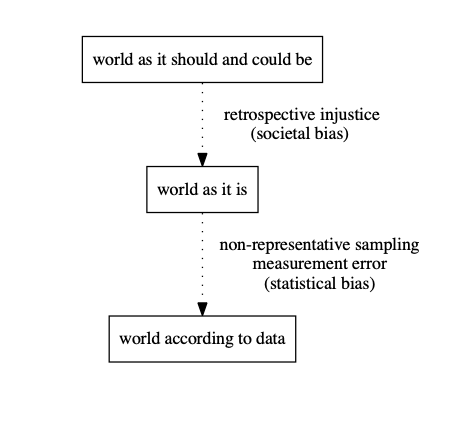
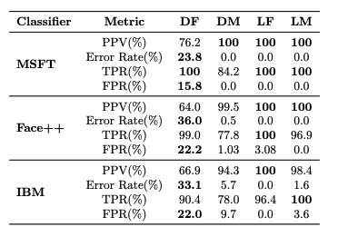
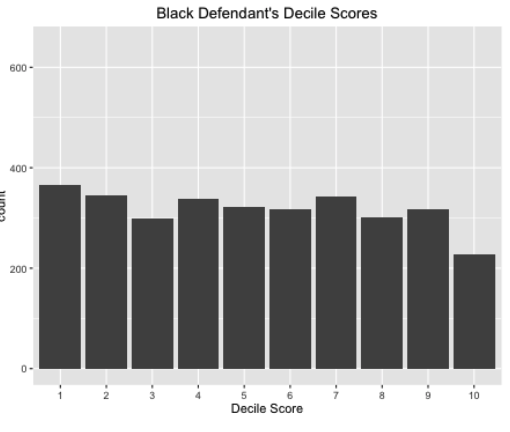
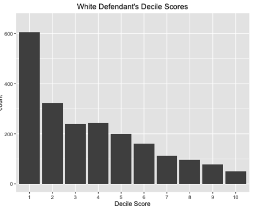
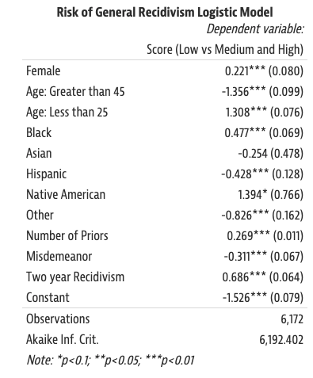

## Why Fairness Belongs in This Course {.center}

When an algorithm decides who gets a **loan**, a **job interview**, or **bail**, it
becomes an instrument of **policy** — and demands the same **accountability** we ask of
any government or corporate decision-maker.

The hard part: **"fairness" has no single technical definition**, and the popular ones
**provably conflict**.

::: {.notes}
Frame this as the accountability lecture for automated decision-making — it pairs with
the AI Accountability debate. The punchline for the whole hour: there is no neutral,
purely technical answer to "is this model fair?" The choice of fairness definition is a
value judgment dressed as math. Cold-call: where have you personally encountered an
algorithmic decision about you?
:::

## A 2026 Vignette: AI Hiring on Trial {.smaller}

::: {.vignette}
In **February 2026**, a federal court in California authorized **class notice** in
*Mobley v. Workday* — letting applicants who say Workday's AI screening software
filtered them out by **age, race, and disability** proceed as a collective. The novel
move: the court treats the **software vendor as an "agent" of the employer**, so the
tool's bias becomes the employer's liability. Separately, **California's Automated
Decision System rules** (effective **October 2025**) pulled AI hiring tools squarely
under state anti-discrimination law.
:::

The legal system is converging on a familiar standard: **disparate impact** — you can be
liable for a discriminatory *outcome* even with **no intent** to discriminate.

::: {.notes}
This is the freshest hook. Verified facts: Mobley v. Workday class notice authorized
Feb 2026; CA ADS regulations effective Oct 2025; the agent theory is what makes Workday
itself a defendant. Tie to disparate impact, which we develop two slides from now. Don't
overstate the outcome — the case is ongoing, not decided.
:::

## Overview: What's Settled, What Isn't

There is a huge literature on algorithmic fairness — and it is still **young**.

::: {.columns}
::: {.column width="50%"}
**What we know**

- Bias gets **encoded in data**
- Minimizing **average error** fits the **majority** population
- We should **explore** before we optimize
:::
::: {.column width="50%"}
**Still open**

- The **right definition** of fairness
- The **best way to implement** it
- What happens when models **change the world** they measure
:::
:::

::: {.notes}
Set expectations: this is not a solved problem with a checklist. The course goal is to
make students fluent enough to ask the right questions and spot the value choices hidden
in "objective" systems.
:::

# Where Does Bias Come From? {.center}

## Societal Bias vs. Statistical Bias

::: {.columns}
::: {.column width="55%"}
- **Societal bias** — the world as it *is* reflects objectionable social structures
  (the gap between "should be" and "is")
- **Statistical bias** — measurement error from **non-representative sampling** (the gap
  between "is" and "what the data say")
- **Prediction bias can reinforce societal bias**: the model learns the world as it is
  and helps keep it that way
:::
::: {.column width="45%"}

:::
:::

::: {.notes}
The diagram is the spine of the whole lecture. Two distinct leakage points: injustice
baked into reality (societal) and distortion in how we sampled/measured reality
(statistical). A model can be statistically unbiased and still launder societal injustice.
:::

## Bias in Training Data

The data we train on **already contains human bias** — the model just makes it scalable.

::: {.columns}
::: {.column width="55%"}
- **Recidivism prediction:** we have data on who is **arrested**, not who **commits
  crimes**. Arrests already over-sample heavily policed communities.
- **Language models:** embeddings absorb **gendered associations** ("o bir doktor" →
  *he* is a doctor) and surface them in translation, ranking, and generation.
:::
::: {.column width="45%"}

:::
:::

::: {.notes}
Label leakage is the key idea for recidivism: the target ("re-offend") is proxied by
"re-arrest," which is itself a policed quantity. The translation example shows the same
problem in generative AI — still live in today's LLMs, just subtler. Ask: what's the
ground-truth label you wish you had, and why can't you measure it?
:::

## Minimizing Average Error Fits the Majority

::: {.columns}
::: {.column width="55%"}
**SAT prediction.** Suppose the **majority** group uses tutors, retakes the test, and
reports only its **highest** score; a **minority** group does not. A model that minimizes
*overall* error optimizes for the majority's pattern and fits the minority **worse**.

This effect is **quantifiable** and often fixable with **better data collection** for
under-represented groups — not just a clever loss function.
:::
::: {.column width="45%"}

:::
:::

::: {.notes}
The face-classification table (Buolamwini & Gebru, "Gender Shades" lineage) makes it
concrete: error rates on darker-skinned women dwarf those on lighter-skinned men across
MSFT, Face++, IBM. The mechanism — average loss is dominated by the majority — is the
same one driving the SAT toy example. The fix often lives in the dataset, not the model.
:::

# Case Study: COMPAS {.center}

## COMPAS: Predicting Re-Offense

**COMPAS** (Correctional Offender Management Profiling for Alternative Sanctions) scores
a defendant's likelihood of **re-offending**; courts used it in bail and sentencing.

::: {.columns}
::: {.column width="50%"}

:::
::: {.column width="50%"}

:::
:::

ProPublica's finding: **Black defendants** were flagged high-risk more often than
warranted; **White defendants**, less — and it **held controlling for prior crimes**.

::: {.notes}
The two decile-score histograms are the visual hook: skewed-low for white defendants,
roughly flat for Black defendants. This is the 2016 ProPublica investigation. We'll
return at the end to whether "COMPAS is unfair" is even a well-posed question.
:::

## What the Model Actually Weighs

::: {.columns}
::: {.column width="55%"}
- **Age** is the most predictive feature
- **Race-correlated features** carry substantial weight even when race isn't an input
- **False-positive rate** on Black defendants is **nearly twice** that on White
  defendants

"Race-blind" inputs don't make a model race-neutral — **proxies** (priors, ZIP code,
prior arrests) carry the signal.
:::
::: {.column width="45%"}

:::
:::

::: {.notes}
Point at the coefficient table: priors, age, and demographic terms all move the score.
Key teaching point — dropping the race variable does NOT remove disparate impact when
correlated features remain. This kills the naive "just don't feed it race" fix.
:::

# Defining Fairness {.center}

## Two Families of Definitions

::: {.columns}
::: {.column width="50%"}
**Statistical / group fairness**

Equalize some statistic **across groups** (selection rate, accuracy, FPR…)

- **Pros:** simple, assumption-light, **verifiable**
- **Cons:** only fair "on average" — no guarantee to an **individual** or a subgroup
:::
::: {.column width="50%"}
**Individual fairness**

**Similar individuals should be treated similarly**

- **Cons:** requires a defensible **similarity metric** — and defining "similar" smuggles
  in exactly the value judgments we were trying to avoid
:::
:::

::: {.notes}
Group vs. individual is the first fork. Group fairness is auditable but coarse;
individual fairness is principled but needs a similarity metric nobody can agree on.
Most regulation (disparate impact, the EU AI Act) is implicitly group-based because it's
the only kind you can measure from the outside.
:::

## Flavors of Group Fairness {.smaller}

| Conditioning on… | Equalize | Meaning |
|---|---|---|
| Nothing | **Demographic parity** | Same selection rate across groups |
| **True outcome** | **FPR / TPR** (equalized odds) | Same error rates among people with the *same outcome* |
| **The decision** | **PPV / NPV** (calibration) | Same outcome rate among people given the *same decision* |
| Scores | **AUC parity**, **calibration** | Score means the same thing in each group |

Each row is a *reasonable* sentence in English. They are **not jointly satisfiable**.

::: {.notes}
Don't drown them in metrics — the point is that "equal error rates" (conditioning on
outcome) and "equal predictive value" (conditioning on decision) are different
sentences, and a model can satisfy one while violating the other. That sets up the
impossibility result and the COMPAS resolution.
:::

## The Impossibility Result {.center}

> Except in degenerate cases, you **cannot** simultaneously satisfy **equalized odds**
> (equal FPR/FNR) **and** **calibration** (equal PPV/NPV) when base rates differ.

The fairness "criteria" are not a menu you can fully order — picking one is a **policy
choice with losers**, not a bug to be engineered away.

::: {.notes}
This is Kleinberg–Mullainathan–Raghavan / Chouldechova (2016–17). State it plainly:
when two groups have different base rates, no nontrivial classifier hits both
equalized-odds and equal-PPV. That is a theorem, not an implementation failure. This is
the intellectual core of the lecture.
:::

## So — Is COMPAS Unfair? {.smaller}

**It depends on which definition you pick.**

::: {.columns}
::: {.column width="50%"}
**ProPublica's critique**

COMPAS **fails FPR parity**: wrong "high-risk" labels fell disproportionately on **Black**
defendants.
:::
::: {.column width="50%"}
**Northpointe's defense**

COMPAS **satisfies PPV parity**: among those labeled high-risk, the re-arrest rate was
the **same across race**.
:::
:::

Both are **true**. With **different base rates**, you **cannot** have both — and adding
**demographic parity** on top is possible only in a world with **no real disparity** or
with a **useless model**.

::: {.notes}
This is the resolution slide. Neither party was lying with statistics — they chose
different definitions, and the impossibility theorem guarantees a tradeoff. The
deeper lesson: the debate over COMPAS was really a hidden debate over values. Connect
explicitly to the AI Accountability debate.
:::

# Beyond One Decision {.center}

## Open Questions

::: {.columns}
::: {.column width="50%"}
**Dynamics & feedback**

- Models **change the environment** they were trained on
- They shift the **incentives** of the people they score (gaming, strategic behavior)
- Predictive policing → more arrests where you predicted → "confirmed" predictions
:::
::: {.column width="50%"}
**Correcting bias is hard**

- You must first **know what causes** the bias
- Beyond classification: **ranking, personalization, generative AI** have their own
  fairness questions we barely understand
:::
:::

::: {.notes}
Feedback loops are the frontier — static fairness audits miss them. The predictive
policing loop is the cleanest example of a self-fulfilling prediction. Generative AI
(recommendations, LLM outputs) reopens every question at larger scale and with less
measurability — a good bridge to the AI privacy and copyright lectures.
:::

## Regulation Is Catching Up

::: {.vignette}
On **August 2, 2026**, the **EU AI Act's** obligations for **high-risk** systems —
including **employment, credit scoring, and biometric ID** — take effect. Among them:
providers must, **where technically feasible, examine training data for bias** and
document mitigation. It is one of the first laws to write **fairness auditing** into the
text itself.
:::

The open technical questions don't go away — but "we couldn't define it" stops being a
legal defense.

::: {.notes}
Verified: high-risk obligations under the EU AI Act apply from 2 Aug 2026, with bias
examination of training data required where technically feasible. The tension to leave
students with: the law now demands bias mitigation, but the math says fairness can't be
fully achieved — so compliance is necessarily a value-laden, contestable judgment, not a
box to tick.
:::

# Takeaways {.center}

- Bias enters through **society** and through **measurement** — both leak into the model
- **Average-error** optimization quietly serves the **majority**
- The popular fairness definitions **provably conflict**; choosing one is a **policy
  decision**
- Auditing and law (**disparate impact**, **EU AI Act**, **CA ADS rules**) now demand
  accountability — but can't dissolve the underlying value choices

::: {.notes}
Land the plane: "fair" is not a property you can certify the way you certify a crypto
protocol. The technologist's job is to make the tradeoffs legible to the people making
the policy call. Tee up the AI Accountability debate.
:::
