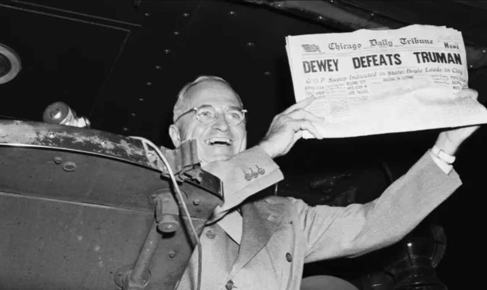
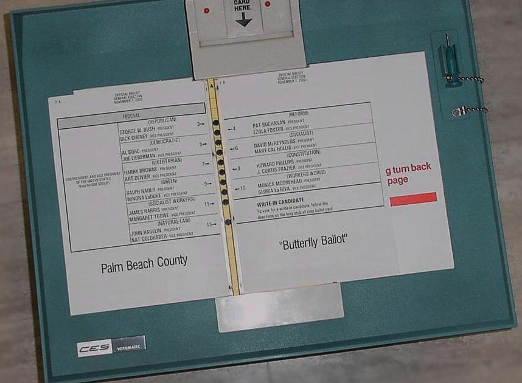
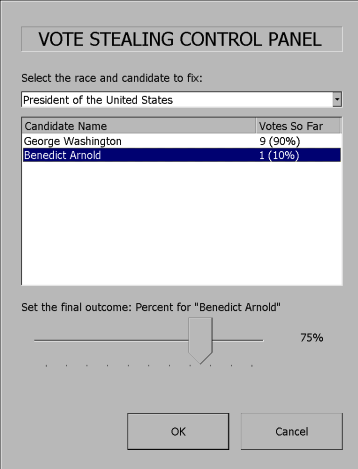
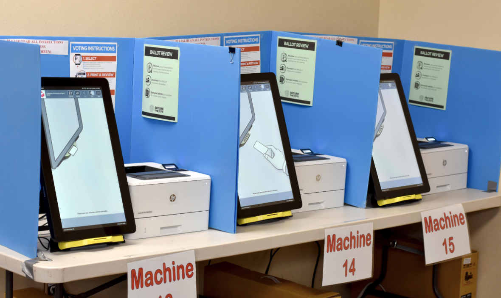
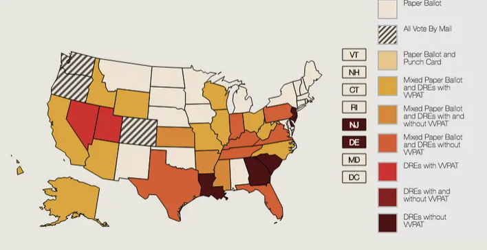

## Why Elections Are a Security Problem {.center}

> An election should not only **accurately** figure out who won, but should also
> provide **convincing evidence** that the winner really won. — Stark & Wagner, 2012

Elections are a uniquely hostile setting: **no trusted party**, a secret ballot
that *forbids* receipts, motivated adversaries, and a result that must be
believed by the losing side.

::: {.notes}
Frame the whole lecture around the Stark & Wagner quote. Security here is not just
"get the right answer" — it is producing *public evidence* that convinces even the
side that lost. That tension drives every design choice that follows.
:::

## Getting It Right vs. Proving It {.smaller}

{width="45%"}

The famous "Dewey Defeats Truman" headline: a confident result with **no evidence
behind it**. Modern recounts in close races (FL 2000; WI/MI/PA 2016) show the same
problem — when the process isn't auditable, *nobody can settle the dispute*.

::: {.notes}
Use this to motivate "evidence-based elections." The press called it wrong because
they trusted a model, not a count. Tie to 2000 (we'll see the butterfly ballot) and
to 2016, where recounts in WI/MI/PA were stymied and "did Russian hackers change the
outcome?" could not be answered — because the systems couldn't produce evidence.
:::

# What a Good Election Must Guarantee {.center}

## The Core Requirements {.smaller}

::: {.columns}
::: {.column width="50%"}
- **Accuracy** — totals reflect voter intent
- **Availability** — voters can actually vote
- **Transparency** — process observable, results auditable
- **Privacy** — the secret ballot
:::
::: {.column width="50%"}
- **Non-coercibility** — you *can't* prove how you voted (no vote-selling)
- **Accessibility** — disabled voters vote privately and independently
- **Minority languages** — required ballots/audio (Voting Rights Act)
:::
:::

These requirements **conflict**: privacy and non-coercibility make fraud detection
hard; accessibility and transparency pull against each other.

::: {.notes}
Walk the list. Emphasize the conflicts — the secret ballot is *deliberately* a
receipt-free system, which is exactly what makes verifying the count hard. LA County
provides ballots in 7+ languages; accessibility means audio and tactile interfaces.
Cold-call: which two requirements are in the most direct tension? (privacy vs.
auditability / fraud detection.)
:::

## Where Accuracy and Availability Fail

::: {.columns}
::: {.column width="50%"}
**Accuracy loss**

- Voter confusion, bad UI ("jumping votes")
- Software bugs, hardware failures
- Tallying/capacity errors
- Fraud
:::
::: {.column width="50%"}
**Availability loss**

- Crashes, freezes, dead batteries
- Failed components, under-provisioning
- Administrative error (machine never plugged in)
- Denial of service
:::
:::

::: {.notes}
These are mundane but they decide elections. Long lines are a *security* failure
(availability) just as much as a hacked tally is an accuracy failure. The lever-machine
"jam at 99" anecdote is a great example of silent accuracy loss from physical wear.
:::

# How We Actually Vote {.center}

## A Century of Voting Technology {.smaller}

::: {.columns}
::: {.column width="50%"}
- **1893** — Australian (secret) paper ballot
- **1890s–2010** — mechanical lever machines
- **1960s–2014** — punch cards
- **Post-2002** — DREs (touchscreen), funded by HAVA
- **Today** — optical scan + ballot-marking devices, with paper trails
:::
::: {.column width="50%"}

:::
:::

::: {.notes}
The 2000 punch-card debacle (hanging chads, butterfly ballot) triggered the **Help
America Vote Act (2002)**, ~$3B to modernize. Most states bought paperless DRE
touchscreens — trading one problem (unreadable ballots) for a worse one (no auditable
record). That overcorrection is the story of the next decade.
:::

## The DRE Detour {.smaller}

> "After the 2000 recount debacle... Congress passed the **Help America Vote Act** in
> 2002, [providing] over $3 billion to modernize equipment. All 50 states took the
> money, and most used it to buy **touch-screen DRE** machines."

A Direct-Recording Electronic machine stores votes **only in software**. If the
software is wrong — by bug or by attacker — there is *no independent record* to check
against. That is the heart of the problem.

::: {.notes}
DRE = the vote exists only as bits the machine chose to write. This sets up software
independence and the Diebold attack. The irony: money meant to fix elections funded the
least auditable technology.
:::

# Attacking the Machine {.center}

## Threat Model: No One Is Trusted {.smaller}

::: {.columns}
::: {.column width="50%"}
**Adversaries are formidable and funded**

- Candidates, zealots, foreign governments
- Organized crime, businesses
- Stakes: hundreds of millions per campaign
:::
::: {.column width="50%"}
**Attackers sit everywhere in the chain**

- Vendor & COTS-OS programmers, hardware designers
- Election officials, IT, shippers, warehouse guards
- Poll workers, voters
:::
:::

A secure design assumes **all parties are suspect** — vendors, officials, candidates,
spouses, nation-states.

::: {.notes}
The key teaching point: you cannot solve election security by "trusting the good
people." The attacker can be the person who wrote the OS years ago. This motivates
software independence — security that does not depend on trusting any component.
:::

## The Diebold Study: Stealing Votes in Software {.smaller}

::: {.columns}
::: {.column width="55%"}
Feldman, Halderman & Felten (2006) studied a real Diebold AccuVote-TS:

- Election results sat in ordinary files **any program could modify**
- A **memory card** could overwrite the bootloader on boot — *no confirmation asked*
- The vote-stealing payload hid in unused space in `fboot.nb0`
- Spreads machine-to-machine like a **virus** with brief physical access
:::
::: {.column width="45%"}

:::
:::

::: {.notes}
This is the canonical "voting machine is just a PC" result. The demo control panel
(George Washington vs. Benedict Arnold) is deliberately absurd to make the point: once
code runs, it can set any outcome and the machine has no way to know it lied. Physical
access to one machine + shared memory cards = a county. No DRE-only system survives this.
:::

## Software Independence {.smaller}

A voting system is **software-independent** if an *undetected error in the software
cannot cause an undetectable change* in the outcome.

**Strongly** software-independent: you can also *correct* the error.

> Example: **voter-verified paper ballots** plus the ability to do a **hand recount**.

This is why the field abandoned paperless DREs: the only known way to be
software-independent is to keep a **physical record the voter checked**.

::: {.notes}
Rivest's definition. The phrase to remember: "software is not to be trusted." Paper is
not nostalgia — it is the only artifact an attacker who owns the software cannot
silently rewrite. Everything modern (BMDs, optical scan, RLAs) is built to achieve this.
:::

## Certification Doesn't Save You {.smaller}

- Federal standards: **FEC VSS** (1990, 2002) → **EAC VVSG** (2008, updated since)
- Testing done by private labs (**ITAs**) — **paid by the vendors** they certify
- "Shake-and-bake" environmental tests, some source review, functional testing
- Historically, **security requirements were almost nonexistent**

Certification checks that a machine *works as specified* — not that the specification
or the machine is **secure against an adversary**.

::: {.notes}
The conflict-of-interest is the point: vendors pay the testers. Certification is a
floor, not a security guarantee. This is why independent academic studies (Diebold,
California Top-to-Bottom Review, DEF CON Voting Village) kept finding holes certified
machines were supposed to be free of.
:::

# Getting to Evidence: Paper + Audits {.center}

## The Modern Stack {.smaller}

::: {.columns}
::: {.column width="50%"}
**Ballot-marking devices (BMDs)** help voters mark a paper ballot the **scanner and a
human** can both read — accessibility without paperless trust.
:::
::: {.column width="50%"}

:::
:::

The pipeline: **print/setup → voter marks & verifies → cast → optical scan gives the
reported result → audit the paper to confirm it.**

::: {.notes}
BMDs are the compromise: a touchscreen UI (good for accessibility and languages) that
*outputs paper the voter inspects*. The open research question — do voters actually
verify the printout? — matters, because an unverified BMD printout is back to trusting
software. Mention Appel/Stark's critique.
:::

## The Paper Trail Across the Country {.smaller}

{width="70%"}

In 2016 several states were still **fully paperless**. After sustained pressure, the
map has shifted decisively toward **voter-verifiable paper**.

::: {.vignette}
By the **2024 U.S. general election**, roughly **98% of votes** were cast on
**paper-based systems** with a voter-verifiable record — up from far less a decade
earlier (Verified Voting / Brennan Center). The paperless-DRE era is nearly over.
:::

::: {.notes}
Update the 2016 map verbally with the 2024 reality: near-universal paper. This is a
genuine policy success driven partly by the security research in this lecture. Ask: why
did it take ~20 years? (Procurement cycles, cost, HAVA lock-in, contested politics.)
:::

## Risk-Limiting Audits {.smaller}

A **risk-limiting audit (RLA)** hand-checks a random sample of paper ballots, stopping
once there is strong statistical evidence the reported winner really won.

1. Draw a random sample of paper ballots
2. Interpret them **by hand**
3. If the reported outcome is now confirmed to the **risk limit**, stop
4. Otherwise enlarge the sample and repeat (worst case: full hand count)

**Ballot-polling** uses ballots alone; **comparison** audits check ballots against
electronic cast-vote records — more efficient by roughly **1 / margin**.

::: {.notes}
The beauty of RLAs: the sample size scales with how close the race is, not the size of
the state. A landslide needs a few hundred ballots; a near-tie needs many. "Brush your
teeth; eat your spinach; audit your elections!" (Vora). This is evidence-based elections
made operational.
:::

## RLAs in Practice, 2024–2025 {.smaller}

::: {.vignette}
After the **November 2024** general election, **Georgia** ran a **statewide RLA across
all 159 counties** at a **5% risk limit** — among the strongest in the country —
confirming the reported result. **Virginia** ran statewide RLAs after both its 2024 and
2025 elections.
:::

RLAs turn "trust us" into a **public, repeatable statistical argument**. A growing
number of states now require them by statute.

::: {.notes}
Sources: Georgia SOS (2024 statewide RLA, 5% risk limit, all 159 counties); Verified
Voting and Brennan Center on RLA adoption; Virginia Dept. of Elections (2024 Senate
ballot-polling RLA, 2025 House of Delegates RLA). This is the freshest concrete win for
the evidence-based model — pair it with the deepfake vignette to contrast "the count is
now defensible" with "the information environment is not."
:::

# The Information Layer {.center}

## Disinformation: Attacking Belief, Not Ballots {.smaller}

You don't need to touch a single machine to damage an election — you can attack what
voters **believe** about it.

- False claims about **how, when, or where** to vote (suppression)
- Manufactured doubt about the **count** itself (delegitimization)
- **Generative AI** lowers the cost of fakes to near zero

::: {.vignette}
**January 2024:** New Hampshire voters got a robocall using an **AI deepfake of
President Biden's voice** telling Democrats not to vote in the primary. It cost the
creator about **$1 and 20 minutes**. The **FCC** promptly ruled AI-voiced robocalls
illegal under the TCPA and pursued a multi-million-dollar penalty.
:::

::: {.notes}
This is the headline shift since the original deck: the threat moved from the tabulator
to the timeline. Note the asymmetry — $1 to make, enormous reach. But also the
"apocalypse that wasn't": the Harvard Ash Center / post-2024 analyses found the biggest
2024 misinformation narratives (pet-eating, FEMA) were *not* AI-driven. Lesson:
cheap-fakes and human rumor still dominate; AI is an accelerant, not the whole story.
:::

## Why "Blockchain Voting" Is Not the Answer {.smaller}

Blockchains solve a *different* problem (decentralized consensus among untrusting
nodes) and **don't** meet election requirements:

- No secret ballot / non-coercibility once votes are on a public ledger
- The hard part — **the voter's device** and **voter authentication** — is untouched
- Decentralization adds congestion, upgrade, and compromise risks; elections are
  inherently **centralized**

> A bulletin board + encryption may help *verifiability* — but it does not fix the
> fundamental security problems of remote electronic voting.

::: {.notes}
Students will ask about blockchain/online voting every year. The crisp answer:
blockchain authenticates *transactions on a ledger*, not *humans casting secret
ballots*, and it can't secure the endpoint malware can own. Cite the 2018 MIT/Voatz
findings if asked. End-to-end-verifiable schemes (e.g., STAR-Vote, ElectionGuard) are
the serious research direction — not "put it on chain."
:::

# Takeaways {.center}

## What to Remember {.smaller}

- Security means **evidence**, not just the right answer
- **No party is trusted** — design for adversaries everywhere in the chain
- **Software independence**: an undetected software error must not silently change the
  outcome → **voter-verified paper**
- **Risk-limiting audits** turn the count into a public statistical argument — now
  standard practice in 2024–2025
- The frontier has moved to the **information layer**: AI-era disinformation attacks
  *belief* in the result, and that is harder to audit than any machine

::: {.notes}
Land the arc: paper + RLAs largely solved the *machine* trust problem this decade; the
open problem for the next is sustaining *public trust* against cheap, scalable
disinformation. Tie back to the Stark & Wagner quote — convincing evidence only works if
people are willing to be convinced.
:::
