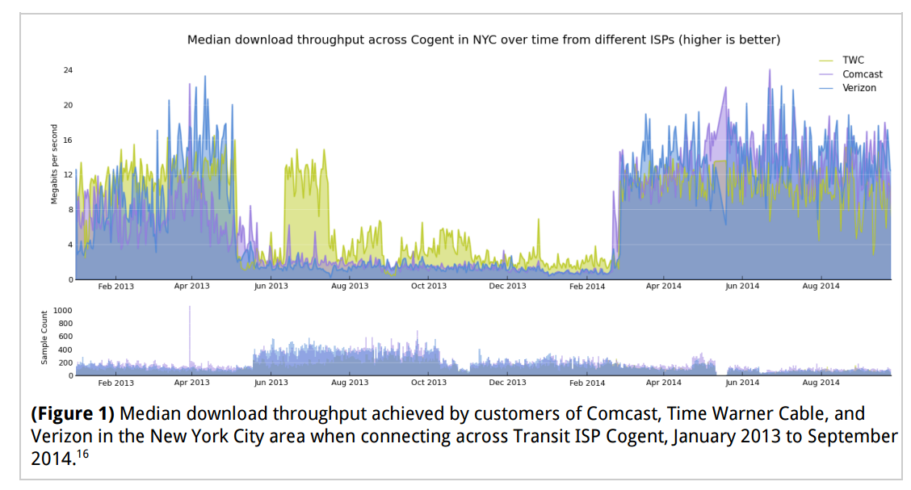
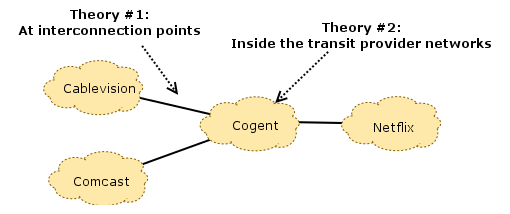
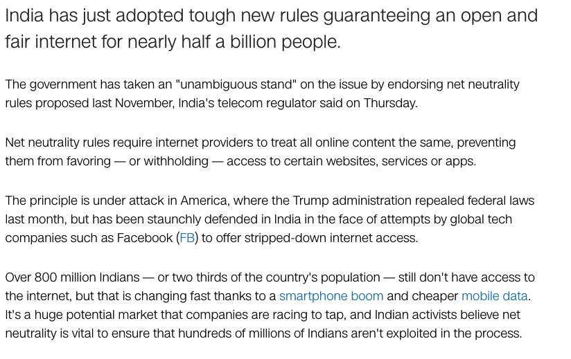

## What "Net Neutrality" Actually Means {.center}

The colloquial idea: an ISP should treat all lawful traffic **the same** —
no favoring, blocking, or charging extra to reach you.

The legal reality is messier: "net neutrality" bundles together several **very
different** policy questions, only some of which are about treating bits equally.

::: {.notes}
Open by asking the room to define net neutrality in one sentence. You'll get the
"treat all traffic the same" answer. The whole lecture is about unpacking why that
one sentence hides at least four distinct debates: censorship/discrimination,
regulatory classification, interconnection economics, and consumer protection.
:::

## A 2025 Vignette: The Rules Are Off the Books {.smaller}

::: {.vignette}
On **January 2, 2025**, the U.S. Court of Appeals for the **Sixth Circuit**, in
*Ohio Telecom Ass'n v. FCC*, **vacated the FCC's 2024 Title II net neutrality
order**. Applying the Supreme Court's 2024 *Loper Bright* decision (which ended
**Chevron deference**), the court decided *for itself* that broadband is a lightly
regulated **"information service,"** not a **"telecommunications service"** — so the
FCC had no authority to impose the rules at all. As of 2026 there are **no federal
net neutrality rules**, and Congress has not legislated.
:::

The fight didn't end — it **moved to the states** (see California, later).

::: {.notes}
This is the freshest hook and the single most important update since the old deck.
*Loper Bright* is the connective tissue: the same administrative-law earthquake that
shows up in privacy and AI regulation killed net neutrality here. The court didn't
say the rules were bad policy — it said the FCC lacked statutory authority. That
distinction matters for the debate.
:::

## The Many Faces of Net Neutrality

Under one banner sit several distinct issues:

- **"Bright-line rules"** — no blocking, throttling, or paid prioritization
- **Title II classification** — treating ISPs as common carriers
- **Regulatory authority** — outage reporting, access fees, network-management rules
- **Privacy & data collection** constraints on ISPs

...all very different from the rules **Google, Meta, or Netflix** face as edge
providers.

::: {.notes}
The key teaching move: "net neutrality" is a portmanteau. When a student says they're
"for" or "against" it, ask *which* of these they mean. The bright-line rules are
popular; Title II reclassification (the legal mechanism) is far more contested.
:::

## First, the Plumbing: The Internet Business Model {.smaller}

The Internet is a network *of* networks (ASes) connected by money and barter:

- **Customer / provider (transit):** one AS **pays** another for reachability to
  the rest of the Internet
- **Settlement-free peering:** two ASes **swap traffic for free** because it's
  mutually beneficial (bartering)
- Preferences are enforced with BGP **local-preference** manipulation: prefer
  *customer* routes (you get paid) over *peer* over *provider* (you pay)

::: {.notes}
Students need this before the Netflix story makes sense. Money flows the opposite
direction of the "get paid > free > pay" preference ordering. The neutrality debate
lives at the *interconnection* layer as much as the last mile, and that's the part
the public conversation usually ignores.
:::

## The Bright-Line Rules (2015 Open Internet Order) {.smaller}

The FCC's 2015 rules — the colloquial heart of net neutrality:

::: {.columns}
::: {.column width="55%"}
- **No blocking** of lawful content
- **No throttling** of lawful traffic
- **No paid prioritization** ("fast lanes")
- **No unreasonable interference** or disadvantage
- **Transparency** about practices
:::
::: {.column width="45%"}
...all subject to exceptions for **"reasonable network management."**

That escape hatch is where most of the real arguments happen.
:::
:::

::: {.notes}
The bright-line rules poll well across party lines. The disagreement is rarely about
"should ISPs block lawful sites" — it's about the *legal vehicle* (Title II) and how
elastic "reasonable network management" is. Note the history: 2015 order, repealed
2017/2018, reinstated 2024, vacated Jan 2025.
:::

## The Legal Engine: Title II Reclassification {.smaller}

To make the rules stick, the 2015 order reclassified ISPs as **Title II "common
carriers"** — like a regulated **public utility** — while **forbearing** (waiving)
most of Title II's heavy provisions.

- **Upshot:** ISPs can't discriminate among traffic
- **Twist:** content-delivery networks (CDNs) and edge providers were **exempted**
  from the process entirely
- So the rules constrained the *pipe*, not the *content* — perhaps we were "barking
  up the wrong tree"?

::: {.notes}
This is the crux of the legal fight and exactly what the Sixth Circuit rejected in
2025: is broadband a "telecommunications service" (Title II) or an "information
service" (Title I)? The classification question is statutory interpretation, not
engineering. Push students: if the goal is preventing discrimination, why exempt the
CDNs that do the most traffic shaping?
:::

# Where Neutrality Gets Fuzzy: Interconnection {.center}

The 2014 Comcast–Netflix dispute: was this **blocking**, or just **congested
peering links** and a fight over who pays to upgrade them?

## Congestion Wasn't "At Home" — It Was Upstream {.smaller}

Median download throughput from a transit provider (Cogent) into NYC ISPs collapsed
for months, then suddenly recovered — right when **paid-interconnection deals** were
signed.

::: {.notes}
This plot is the empirical heart of the lecture. The degradation isn't random — it
tracks a business negotiation. The "fix" arrives the moment Netflix agrees to pay
for direct interconnection. Ask: is a congested *peering link* a net-neutrality
violation if the last-mile ISP never "throttled" anyone's packets?
:::

## Where Was the Bottleneck? {.smaller}

::: {.columns}
::: {.column width="55%"}

:::
::: {.column width="45%"}
**Theory 1:** congestion at the **interconnection points** (the ISP–Cogent border).

**Theory 2:** congestion **inside** the transit provider's own network.

Measurement (M-Lab) located it at the **interconnection points** — a peering and
provisioning fight, not classic last-mile throttling.
:::
:::

::: {.notes}
The diagnosis matters legally. If the slowdown is at a paid interconnection border,
it's an economic dispute about who provisions and pays for capacity — arguably
outside the bright-line rules, which target last-mile handling. This is why the
"fuzzy" category exists.
:::

## So... Was Comcast "Blocking" Netflix? {.smaller}

Two defensible stories:

::: {.columns}
::: {.column width="50%"}
**Netflix:** "We already paid our transit providers for access to your eyeballs.
You *let the links congest* by refusing to upgrade interconnection."
:::
::: {.column width="50%"}
**Comcast:** "Netflix can congest any link it chooses and can pick which transit
provider to send through. Provision your own delivery."
:::
:::

...and then there was the **Cogent** dynamic — Cogent's own congestion-management
(prioritizing retail over wholesale customers) muddied the data.

::: {.notes}
There is no clean villain. This is the slide for the debate: have students argue
each side. The Cogent wrinkle — Cogent QoS-marked retail vs. wholesale traffic during
congestion — shows even the "neutral" middle wasn't neutral. Good moment to connect
to the BITAG congestion-management report.
:::

## Net Neutrality Around the World {.smaller}

The U.S. is an outlier in its on-again/off-again approach.

**India (2018):** adopted some of the world's strongest rules, partly in reaction to
**Facebook's "Free Basics"** zero-rating program. The **EU** has had enforceable
open-internet rules since **2016**.

::: {.notes}
Useful contrast: the U.S. ties neutrality to a contested classification statute, so
it flips with each administration and court. India and the EU legislated/regulated
more durably. Zero-rating (Free Basics) is the international flashpoint — is "free
but curated" access pro- or anti-consumer? Good thought question.
:::

## The Fight Moved to the States {.smaller}

With no federal rules, **states stepped in**:

- **California's SB 822** bans blocking, throttling, paid prioritization — and goes
  further to restrict **zero-rating**
- The **Ninth Circuit** (*ACA Connects v. Bonta*) **upheld** it; after repeated
  losses, ISPs **abandoned** their challenge
- **Washington** and others have similar laws

Result: a **patchwork**, where the largest state laws effectively set a national
floor.

::: {.notes}
This is the practical answer to "is net neutrality dead?" — federally yes, but a
big-state law that survives preemption challenges shapes provider behavior
nationwide (no one builds California-only network policy). Connect to the broader
course theme of state-by-state regulation filling federal gaps, exactly like
comprehensive privacy laws.
:::

## Net Neutrality: Summary {.smaller}

- Federal net-neutrality regulation in the U.S. is **"dead" for now** — vacated by the
  Sixth Circuit in **January 2025** on *Loper Bright* / authority grounds
- Some provisions are about **discrimination / censorship** (blocking, throttling,
  paid prioritization) — relatively clean
- Others are about **interconnection economics and provisioning** — genuinely **fuzzy**
- The action has shifted to **states** and, potentially, **Congress**

::: {.notes}
Land the three-part framing: classification (the legal hook), bright-line rules (the
popular core), and interconnection (the fuzzy economics). The exam-worthy point is
*why* the rules keep flipping — it's an administrative-law and statutory-authority
problem, not a technical one.
:::

# Thought Question {.center}

If a state law is what actually protects you, and the FCC has no authority —
**who should govern the Internet's plumbing, and through what mechanism**:
the FCC, Congress, the states, or the market?
