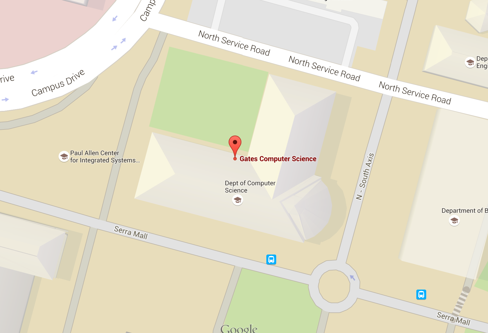
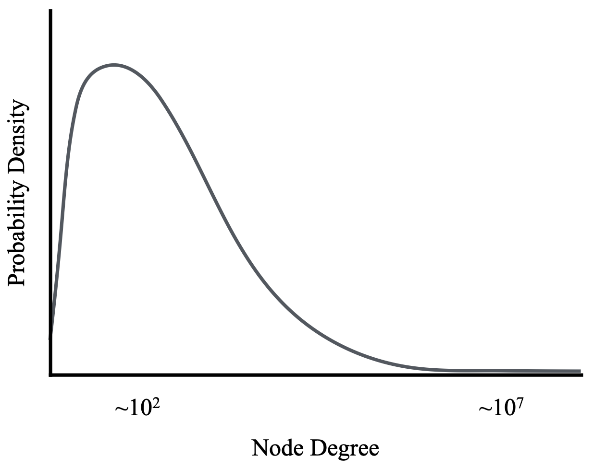
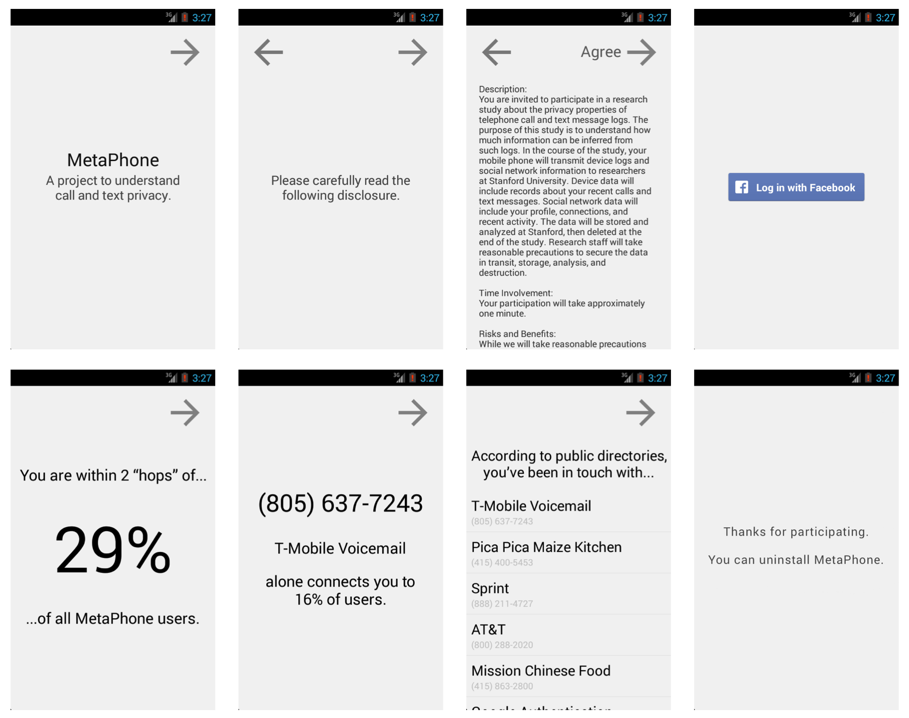

## "It's Just Metadata" {.center}

> "You have my telephone number, connecting with your telephone number…
> There are no **names** in that database. It's just the number pairs, when the
> calls took place, how long they took place."
> — President Obama, 2013

When you hear *"it's only metadata,"* your **antenna should go up**.

::: {.notes}
This is the line that motivates the whole lecture. Obama defended the NSA bulk
phone program by saying it was "just metadata" — no names, no content. The
research question for today: is that reassuring? We'll see that metadata is
often *more* revealing than content, because it is structured and machine-
analyzable at scale. Cold-call: who believes metadata is less sensitive than
content, and why?
:::

## Today

::: {.columns}
::: {.column width="50%"}
1. What is **metadata**? (and why the definition is contested)
2. Metadata and **federal law**
3. The NSA's **bulk metadata** programs
:::
::: {.column width="50%"}
4. Re-identification and **inference** from metadata
5. **FISA** today: Section 702 and incidental collection
6. **DNS, ISPs, and encryption** — who can still see your traffic?
:::
:::

::: {.notes}
Roadmap. The arc is: define the thing, show the law treats it as low-sensitivity,
then demonstrate empirically that it is extremely revealing, then bring it to the
present with the live Section 702 fight and the ISP/DNS surveillance question.
:::

# What Is Metadata? {.center}

## Many Definitions, One Word {.smaller}

"Metadata" means different things to different communities:

::: {.columns}
::: {.column width="50%"}
- **Colloquial:** "data about data"; the *fact of* a communication
- **Engineering:** dialing, routing, addressing, signaling; "envelope" information
:::
::: {.column width="50%"}
- **Legal:** specific statutory categories; "routine business records"; information
  *knowingly divulged* to a third party
- All roughly: **non-content**
:::
:::

For **real-time, person-to-person** communication, these definitions mostly agree.

::: {.notes}
The trap is that everyone uses one word for several different concepts. The legal
definition matters most because it determines what protection (if any) the
communication gets. "Knowingly divulged to a third party" is the seed of the
third-party doctrine — the idea that you have no reasonable expectation of privacy
in records you hand to your phone company.
:::

## Metadata for a Phone Call

For a call, text, iMessage, email, or Skype session, the metadata is the same set
of fields:

- **Parties** (who called whom)
- **Time** the communication occurred
- **Length** / duration
- **Direction** (who initiated)

Not the **words** — but everything *around* the words.

::: {.notes}
Analogy on the next slide: this is the outside of the envelope, not the letter
inside. The point is that for a clean person-to-person call, content vs. metadata
is a crisp line. The trouble starts when communication isn't person-to-person.
:::

## The Envelope Analogy

::: {.columns}
::: {.column width="55%"}
A postal envelope shows:

- **To:** John Smith, 1060 W. Addison St., Chicago, IL 60613
- **From:** the sender's address
- Postmark **time** and **place**

The *contents* — "Chinese takeout? Lunch?" — stay sealed.
:::
::: {.column width="45%"}
But the envelope alone can reveal who you talk to, when, where, and how often —
the **pattern of life**.
:::
:::

::: {.notes}
Wrigley Field's address (1060 W. Addison) is a nice in-joke. The teaching point:
the envelope is "just metadata," yet a stack of envelopes reconstructs your social
graph, schedule, and locations. Metadata is structured, so it scales; content is
unstructured and expensive to analyze.
:::

## When the Definition Breaks Down {.smaller}

Hard cases where content and metadata blur:

- **Not person-to-person — web browsing.** Is
  `searchengine.com/search?query=Stanford+map` metadata, or content?
  The URL *path and query string* reveal exactly what you were looking for.
- **Stored communications** — webmail sitting on a server vs. in transit.
- **Location information** — explicit (cell-site location) and implicit
  (IP addresses, trunk identifiers).

::: {.notes}
The search-URL example is the killer. The "metadata" of that HTTP request — the
URL — *is* the content of your thought. Courts and statutes drew the
content/metadata line in a telephone world; it does not transfer cleanly to the
web. This is exactly the ambiguity that re-surfaces with DNS and SNI later.
:::

## Implicit Location: IP Addresses Are Maps

{width="60%"}

An IP address is "addressing information," yet it can pin a device to a **building**.

::: {.notes}
This is the implicit-location problem. Nobody thinks of an IP address as location
data, but geolocation databases map it to a campus building. The redaction
(171.64.78.██) is a wink — even the partial address narrows it down. Tie back to
the legal definition: addressing info is treated as low-sensitivity metadata, yet
it functions as location surveillance.
:::

# Metadata and the Law {.center}

## The NSA's Bulk Metadata Programs {.smaller}

Two domestic programs, revealed in 2013:

| Program | Data | Years | Authority |
|---|---|---|---|
| Bulk **email** metadata | sender/recipient pairs | 2001–2011 | FISC-approved 2004 |
| Bulk **phone** metadata | call-detail records | 2001–2015 | FISC-approved 2006 |

The phone program used a **FISA business-records order** to collect bulk telephone
metadata directly from the **telcos**.

::: {.notes}
Emphasis on *domestic*. These ran for years under secret FISA Court (FISC)
orders before the Snowden disclosures made them public. The legal hook was Section
215 of the PATRIOT Act ("business records") plus the third-party doctrine — the
phone company's records, "knowingly divulged," so allegedly no warrant needed.
:::

## How a Query Worked — and the USA FREEDOM Reform

::: {.columns}
::: {.column width="55%"}
**Old model:** NSA held the whole database. An analyst targeted a number, then
pulled everyone within **2 hops** of it.

**2 hops** = your contacts' contacts → tens of thousands of people from a single
seed.
:::
::: {.column width="45%"}
**USA FREEDOM Act (2015):** ended bulk collection. Data stays at the telcos;
government queries with a specific selector and a narrower hop limit.
:::
:::

Even reformed + filtering popular numbers: **≈ 25,000 subscribers** swept in per query.

::: {.notes}
The two-hop expansion is the scary part — pre-reform, one seed number reached a
huge population because of the social graph's structure (next section). USA
FREEDOM moved storage back to carriers and narrowed queries, but the count on the
slide (~25k per query, even after filtering high-degree numbers) shows reform
narrowed but did not eliminate the dragnet effect.
:::

# What Can You Learn From Metadata? {.center}

## The Graph Has Hubs {.smaller}

::: {.columns}
::: {.column width="55%"}
{width="100%"}
:::
::: {.column width="45%"}
A few numbers (pizza places, customer-service lines) have **enormous degree**
(~10⁷ contacts).

Two hops from a hub explodes the query set — which is *why* the "popular number"
filter exists.
:::
:::

::: {.notes}
This is the structural reason two-hop queries balloon. The call graph is
heavy-tailed: most people have ~10² contacts, but a handful of nodes connect to
millions. If your seed is two hops from a hub, you've pulled in the whole hub's
neighborhood. The MetaPhone study (Stanford, Mayer & Mutchler) is the source for
much of this section.
:::

## Re-Identification Is Easy {.smaller}

The Stanford **MetaPhone** study: volunteers shared their call/text metadata, no names.

::: {.columns}
::: {.column width="60%"}
{width="100%"}
:::
::: {.column width="40%"}
Numbers were matched to **public directories**, Google Places, and Yelp — so
"anonymous" call records became **named** with little effort.
:::
:::

::: {.notes}
The participants believed sharing numbers-only was safe. Researchers
re-identified the businesses and many individuals automatically. This is the
classic anonymization-fails result: metadata is *linkable* to identity through
abundant public side-data.
:::

## Inferring Sensitive Traits {.smaller}

From re-identified call/text metadata alone, researchers inferred:

::: {.columns}
::: {.column width="50%"}
- **Home location** — cluster the re-identified businesses you contact
  (≈80–90% accuracy within a modest distance tolerance)
- **Relationships** — train a classifier on calling patterns; validated against
  Facebook friend data
:::
::: {.column width="50%"}
- **Religion** — ≈¾ accuracy from a naïve heuristic on a small sample
- **Health, firearms, finances** — single calls to a cardiologist, a gun store,
  or a bankruptcy line are self-revealing
:::
:::

::: {.notes}
The punchline: content was never needed. *Who* you call and *when* leaks
medical conditions, religion, relationships, and home location. A single call to
a specialty pharmacy or a hotline is content-free but utterly revealing. This is
the empirical rebuttal to "it's just metadata."
:::

## "It's Just Metadata" — Revisited {.center}

Metadata is **structured, linkable, and machine-analyzable at scale**.

Content is messy and expensive to read; metadata is *exactly* what surveillance
systems are built to exploit.

> The fact of a communication is often more revealing than its contents.

::: {.notes}
Land the thesis. Bring it back to the Obama quote. The reason agencies want
metadata is precisely that it's cheap to analyze in bulk — you don't need to read
a billion calls, you need the graph. Good place for a thought question: where else
in your life is "just metadata" being collected? (Smart-home, DNS, location.)
:::

# FISA Today {.center}

## A Live 2026 Fight: Section 702 {.smaller}

::: {.vignette}
**Section 702** of FISA authorizes warrantless collection of foreigners'
communications — but routinely sweeps in Americans' messages as **incidental
collection**, searchable by the FBI. After a bruising 2024 reauthorization
(the RISAA, a two-year extension), 702 hit its sunset on **April 20, 2026**.
On **April 30, 2026**, Congress passed only a **45-day stopgap extension** while
the fight continued — over a proposed **warrant requirement** for U.S.-person
queries and the **data-broker loophole** (agencies buying location data they
couldn't subpoena). The 2026 reauthorization remains unresolved.
:::

::: {.notes}
This is the freshest hook — verified June 2026. The 2024 RISAA reauthorized 702
for two years; it sunset April 20, 2026, and Congress passed a 45-day extension
on April 30, 2026. The unresolved issues are the U.S.-person query warrant
requirement (the "backdoor search" loophole) and the data-broker loophole. Ask:
should querying an American's incidentally-collected messages require a warrant?
Sources: Lawfare; Brennan Center 702 resource page; CNBC (Apr 30, 2026).
:::

## Incidental Collection: The Core Tension

- 702 targets **non-U.S. persons abroad** — no individual warrant required.
- But Americans on the other end of those communications get **swept in**.
- The FBI can then run **"backdoor searches"** of that data for U.S. persons.
- Reformers want a **warrant** to query U.S.-person data; agencies resist.

::: {.notes}
The constitutional question: collection is "incidental" and lawful, but is
*querying* it for an American a new search that needs a warrant? This maps
directly onto the content/metadata and third-party-doctrine themes from the first
half — same legal machinery, modern data. The data-broker loophole is the newest
wrinkle: why get a court order when you can just buy the data?
:::

# DNS, ISPs, and Encryption {.center}

## Can Your ISP Still See Your Traffic? {.smaller}

A 2016 industry whitepaper (Swire, funded by Broadband for America) argued ISPs
see *little* about customers, because:

::: {.columns}
::: {.column width="50%"}
- **Users are mobile** — no single ISP sees all your traffic
- **HTTPS everywhere** — content is encrypted end-to-end
- **VPNs** — users encrypt traffic away from the ISP
:::
::: {.column width="50%"}
This framing shaped the **2016 FCC privacy rulemaking** debate over whether ISPs
should follow stricter rules than content providers ("parity").
:::
:::

::: {.notes}
Context: when ISPs were reclassified under Title II (the Open Internet Order),
Section 222 (CPNI / customer proprietary network info) suddenly applied to them.
The FCC proposed broadband privacy rules in April 2016; ISPs argued for "parity"
with the FTC rules that govern Google/Facebook. Swire's whitepaper argued ISPs
can't see much — which Feamster rebutted in a letter to the FCC chairman. Note:
those FCC broadband privacy rules were later repealed by Congress in 2017, but the
technical argument is the lasting lesson.
:::

## The Rebuttal: Metadata Leaks Anyway {.smaller}

Even with HTTPS, mobility, and VPNs, ISPs (and on-path observers) still see a lot:

- **DNS lookups** reveal every domain you visit — and your client DNS resolver is
  set by the **ISP's DHCP**, so queries often go to the ISP regardless.
- **TLS SNI** in the initial handshake is sent **in the clear**.
- **IoT devices** often use no encryption at all — and rarely traverse VPNs.
- **The tail matters:** the fraction of sites on HTTPS isn't the point; the
  unencrypted long tail is.

::: {.notes}
This is the heart of the rebuttal. The "ISPs can't see anything" argument is
disingenuous: the home gateway is a perfect vantage point, DNS is set by DHCP, SNI
leaks the hostname, and IoT is a metadata firehose. Connect back to the lecture
thesis: it's all "metadata," and it reconstructs your behavior. WebMD historically
didn't encrypt; a VPN is hard to use correctly and your DNS may still leak.
:::

## Closing the Leaks — and the New Trade-offs {.smaller}

The protocol community has been plugging these holes:

::: {.columns}
::: {.column width="50%"}
- **DNS-over-HTTPS (DoH)** encrypts queries to a resolver (Cloudflare, Google)
- **Encrypted SNI / ECH** hides the hostname in the handshake
- **Oblivious DoH (ODoH)** splits *who you are* from *what you ask*, so no single
  server sees both
:::
::: {.column width="50%"}
But DoH doesn't remove trust — it **moves** it: the ISP no longer sees your
queries, but **one of two giant resolvers** now sees *all* of them.
**Centralization** becomes the new risk.
:::
:::

::: {.notes}
DoH/ECH solve the on-path eavesdropping problem but recentralize trust onto
Cloudflare/Google — and create a single point of failure (tie to the AWS-outage
discussion). ODoH (invented in this research group, later shipped by Cloudflare)
decouples identity from query content using a masking proxy. The meta-lesson for
the privacy section: every fix relocates the trust boundary; ask *who can see
what now?* rather than *is it encrypted?*
:::

## The Other Side: ISP Data Has Legitimate Uses {.smaller}

Restricting ISP data sharing isn't free:

- Network traffic data powers **security** (threat detection), **research**, and
  **network operations** — often by sharing with vendors and academics.
- Protocol and **device innovation** depends on real measurement data.
- **Hard problem:** write exceptions for *legitimate* researchers without opening
  the barn door for self-described "researchers."

::: {.notes}
Steelman the other side so the debate is honest. DNS and traffic data underpin a
lot of public-interest security and measurement research. The policy challenge is
drafting exception language narrow enough to prevent abuse but broad enough to
permit real research. This is a good bridge to the in-class encryption-backdoor
debate.
:::

## Encryption Backdoors: The Current Front {.smaller}

::: {.vignette}
The metadata fight has a content-side twin: **lawful-access backdoors**. In
**January 2025** the UK used a secret **Technical Capability Notice** (Investigatory
Powers Act) to demand Apple weaken iCloud encryption; Apple responded in **February
2025** by **pulling Advanced Data Protection (end-to-end encrypted iCloud) for UK
users** rather than build a backdoor. In **2025** the EU's **"Chat Control"**
client-side-scanning proposal was pushed again — and, after broad pushback, the
Danish Council presidency **withdrew the mandatory-scanning version** later that year.
:::

The debate question: can you build access "for the good guys only"?

::: {.notes}
Verified, dated (2025) hooks for the encryption-backdoors debate. UK TCN → Apple
disabled ADP in the UK (Feb 2025) rather than backdoor it; the order was reissued
in 2025 narrowed to UK users. EU Chat Control client-side scanning was pushed and
then the mandatory version was withdrawn under the Danish presidency. Core CS point:
a backdoor is an intentional vulnerability — there is no math that opens only for
"authorized" parties. This sets up the in-class debate directly.
:::

# Wrap-Up {.center}

## What to Take Away

- **"Just metadata" is a red flag** — it's structured, linkable, and revealing.
- The **legal** content/metadata line was built for telephones and breaks on the web.
- **Re-identification + inference** turn anonymous records into named, sensitive profiles.
- **FISA §702** is being fought *right now* — incidental collection, backdoor
  searches, data brokers.
- Every privacy fix (**DoH, ECH, ODoH**) **relocates trust** — always ask *who can
  see what now?*

::: {.notes}
Recap and bridge. The constant question across the whole lecture is "who can see
what, and what can they infer from it?" Next: the in-class encryption-backdoors
debate, where the content side of this same tension plays out.
:::
