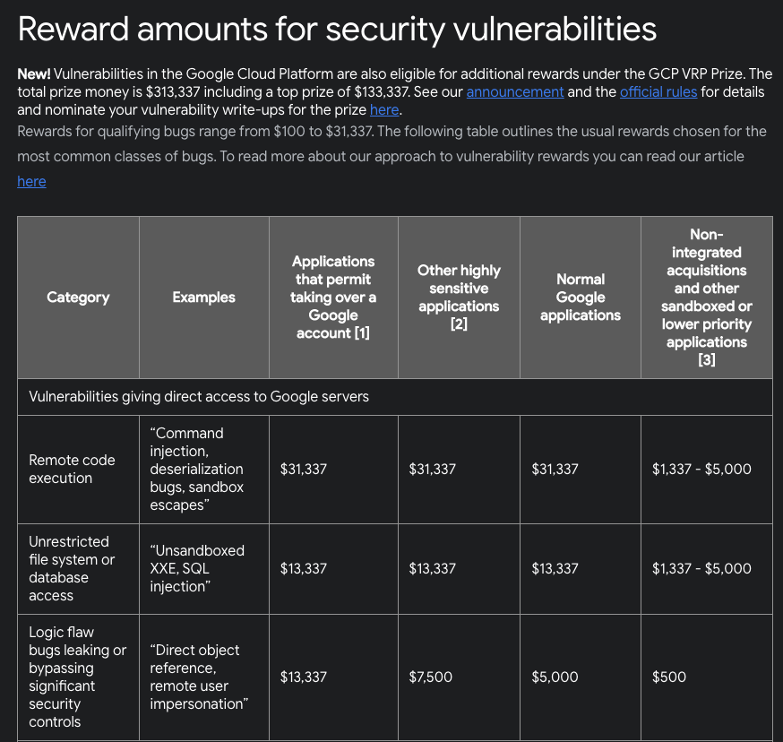
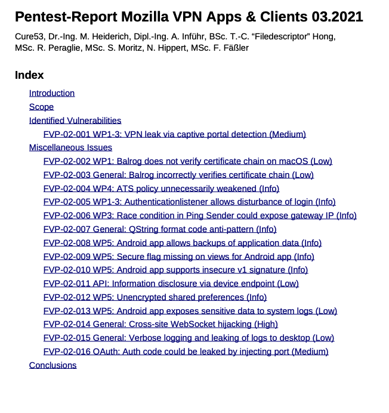

## Why Vulnerabilities Are Inevitable {.center}

> Software is **complex and imperfect** — bugs are not the exception, they're the baseline.

Finding them depends on a large community of **independent, third-party researchers**.
That relationship with vendors is often **adversarial**, and tangled in **legal hurdles**.

::: {.notes}
Set the frame: this lecture is less about *how* to find a bug and more about the
ecosystem and law around *finding and telling*. Note that "vulnerability" here includes
**privacy** vulnerabilities (data leaks), not just classic memory-corruption security bugs.
:::

## Today's Questions

- Who actually finds vulnerabilities, and why is the vendor relationship tense?
- When you find one, **what do you owe whom** — full, coordinated, or no disclosure?
- How do **U.S. laws** (CFAA, DMCA) help or chill security research?
- Do **bug bounties** and **penetration testing** fix the incentive problem?

::: {.notes}
Lay out the arc. The legal material is the spine of the lecture because it's what makes
this a *policy* topic, not just a technical one. Tie back to the CFAA debate.
:::

## Privacy Vulnerabilities Are Real Vulnerabilities

Researchers found a **Nest thermostat leaking ZIP codes** of nearby weather stations —
the device was otherwise "fairly secure" and encrypted everything else.

Many IoT devices talk to their phone app through a **simple, unauthenticated local web
server** — so **classic web attacks work against physical devices**.

::: {.notes}
Source: Acar, Huang, Li, Narayanan, Feamster, "Fast Web-based Attacks to Discover and
Control IoT Devices," ACM SIGCOMM IoT S&P Workshop, 2018. The teaching point: a "leak"
with no memory-corruption bug is still a vulnerability with real-world consequences, and
the attack surface for consumer devices is enormous and poorly secured.
:::

# The Discloser's Dilemma {.center}

You found a bug. **Now what?**

## Three Paths After You Find a Bug

::: {.columns}
::: {.column width="33%"}
**Full disclosure**

Tell the world immediately. Forces a fast fix — but arms attackers before a patch exists.
:::
::: {.column width="33%"}
**Coordinated disclosure**

Tell the vendor privately, agree on a deadline, then publish. The modern default.
:::
::: {.column width="33%"}
**No disclosure**

Sell to the grey/black market or sit on it. Lucrative, dangerous, and the seed of the
**zero-day** trade.
:::
:::

What do you actually *owe* the vendor — and the public?

::: {.notes}
Cold-call: which path, and why? Push on the deadline question — 90 days (Google Project
Zero) is the de facto norm. "Responsible disclosure" is the older term; vendors like it
because it puts the moral weight on the researcher. Many researchers now prefer
"coordinated disclosure." Ask about **hardware** bugs, where a "patch" may be impossible.
:::

## Zero-Days: When Nobody Has a Patch

A **zero-day** is a vulnerability the vendor has had **zero days** to fix — exploited
before any patch exists.

- A market exists: brokers and governments **buy** working zero-days
- Incentives compete directly with disclosure: a sold exploit is a *non-disclosed* one
- This is why **bug-bounty payouts** try to outbid the grey market

::: {.notes}
Connect the economics: if a legitimate vendor pays $5k but a broker pays $250k for the
same Chrome RCE, you have an incentive problem. The bounty tables later make this concrete.
This is the bridge from "ethics" to "markets."
:::

## A 2026 Vignette: Disclosure Goes to War {.smaller}

::: {.vignette}
**May 2026:** a researcher using the handle **"Chaotic Eclipse"** dumped proof-of-concept
exploits for a string of unpatched Windows **zero-days** (Defender flaws *BlueHammer*
CVE-2026-33825, *RedSun*, *UnDefend*). Within days, several were **actively exploited in
the wild**. **Microsoft** publicly condemned the uncoordinated dumps as irresponsible and
GitHub removed the researcher's account; the researcher countered that Microsoft had
**ignored their reports, paid nothing, and named them in an advisory**. Microsoft later
said it **would not pursue** the researcher.
:::

The full-vs-coordinated-disclosure fight, live — and it's about **incentives, not just ethics**.

::: {.notes}
Sources: The Hacker News and Security Affairs, May 2026; The Record, "Microsoft says it
will not pursue security researchers." This is the perfect modern restatement of the
Felten/SDMI conflict 25 years later: a researcher who feels mistreated goes loud, the
vendor calls it reckless, and real users get hurt in the gap. Ask: who was right? What
would have changed the researcher's calculus? (Answer usually: a working bounty + a
responsive vendor.)
:::

# The Legal Terrain {.center}

Two U.S. statutes shape almost everything: **DMCA** and **CFAA**.

## The DMCA and Anticircumvention

The **Digital Millennium Copyright Act** makes it a crime to **produce or distribute
technology that circumvents copyright protection** — *even if you never infringe a copyright*.

- Security implication: you may not be able to **research whether a protection mechanism
  actually works**
- Strongly backed by the media industries
- Chilled exactly the people who would find the flaws

::: {.notes}
Emphasize the decoupling from infringement — that's the trap. Studying a DRM scheme to
see if it's secure can itself be the "device." Lead into the two canonical cases.
:::

## When Research Became a Crime {.smaller}

::: {.columns}
::: {.column width="50%"}
**Sklyarov v. Adobe (2001)**

Dmitry Sklyarov, a Russian PhD student, wrote software to convert Adobe eBooks to PDF
(removing copy/print/text-to-speech restrictions). **Arrested by the FBI at DEF CON** under
the DMCA for distributing a circumvention tool.
:::
::: {.column width="50%"}
**Felten v. RIAA (2001)**

Ed Felten's team broke the **SDMI** music-watermark challenge. The **RIAA threatened
suit** if he published, calling the *paper itself* a "circumvention device." He pulled the
talk, then sued.
:::
:::

::: {.notes}
The chilling effect is the point: in both cases the "crime" was *explaining how the
protection failed*. Note the absurdity of a research *paper* being treated as a hacking tool.
:::

## Felten v. RIAA: The Timeline {.smaller}

| Date | Event |
|---|---|
| Sep 2000 | SDMI watermark challenge introduced |
| Nov 2000 | Felten's team breaks it; intends to publish |
| Apr 2001 | RIAA/SDMI threaten legal action |
| Apr 2001 | Felten announces he will **not** publish |
| May 2001 | RIAA/SDMI claim they "never intended to sue" |
| Jun 2001 | Felten files suit (with EFF) |
| Jul 2001 | Case **dismissed** |
| Aug 2001 | Paper finally **published** |

::: {.notes}
The whiplash is instructive: the threat alone achieved suppression for months — that's the
chilling effect in action, no conviction required. This is **Free Speech vs. copyright /
corporate rights**, and the conflict is between a *discloser* and a *company*.
:::

## The Computer Fraud and Abuse Act

The **CFAA** (1984) is the broadest U.S. computer-crime law. It criminalizes:

- Using computers to obtain **classified information**
- Using computers to **defraud**
- **Damaging or denying service** to computers in interstate commerce/communications

The fight has always been over what counts as **"unauthorized access."**

::: {.notes}
The CFAA's vagueness is the recurring problem. "Exceeds authorized access" became the
battleground — does violating a website's *Terms of Service* make you a criminal hacker?
This is the topic of the in-class **CFAA debate**.
:::

## Does a ToS Violation Make You a Criminal? {.smaller}

A decade of courts narrowing the CFAA away from terms-of-service violations:

- **2009 — *Lori Drew* (MySpace hoax):** court rejects CFAA built on a ToS violation
- **2016 — *Facebook v. Power Ventures*:** scraping with user-supplied credentials *can*
  violate CFAA
- **2019 — *hiQ v. LinkedIn*:** scraping **public** data does **not** violate the CFAA

The line: **code-based** access controls vs. mere **contract/policy** restrictions.

::: {.notes}
Source: Ars Technica, 2020, "Court: Violating a site's terms of service isn't criminal
hacking." The trend favors researchers and journalists, but the cases zig-zag — outcomes
turn on *how* access was restricted (a password wall vs. a sentence in the ToS).
:::

## *Van Buren* and *Sandvig*: Protecting Researchers {.smaller}

::: {.columns}
::: {.column width="50%"}
**Van Buren v. United States (2021)**

Supreme Court **narrowed** "exceeds authorized access": misusing data you're *allowed* to
access isn't a CFAA crime. A win against overbroad readings.
:::
::: {.column width="50%"}
**Sandvig v. Barr (2020)**

Researchers auditing websites for **racial discrimination** by violating ToS. Court: the
CFAA doesn't criminalize that — protecting **research and journalism**.
:::
:::

> *Van Buren* left open whether the line is purely **code-based** limits or also
> **contract/policy** limits.

::: {.notes}
Source: EFF on Van Buren; Columbia Global Freedom of Expression on Sandvig v. Barr. These
are the modern counterweight to Sklyarov/Felten — the law slowly catching up to protect
good-faith research. But the "left open" footnote (Kerr's code-based-vs-policy question) is
exactly the ambiguity bug-bounty hunters still live with.
:::

# Aligning the Incentives {.center}

If adversarial + illegal is the default, can we **buy our way to cooperation**?

## Bug Bounties: Would You Hire a Hacker?

::: {.columns}
::: {.column width="50%"}
**Pro**

"I want someone who finds problems **before the bad guys do**." Skilled, motivated,
already thinking like an attacker.
:::
::: {.column width="50%"}
**Con**

"I don't hire an **arsonist as a Fire Marshal**." Trust, teamwork, potential to damage the
company.
:::
:::

Assessing **personality** — morals, ethics, attitude — matters as much as skill.

::: {.notes}
The "arsonist as Fire Marshal" line always lands. Push the class: how would you *fire* a
hacker who knows your weak points? Bug bounties are partly a way to get the upside
(adversarial skill) without the employment risk.
:::

## What a Bounty Pays {.smaller}

Tiered by **impact** (RCE > info leak) and **exploit quality**. Top-tier remote code
execution can reach six figures.

::: {.notes}
Source: Google bughunters.google.com / about.google/appsecurity. Use the table to make the
zero-day-market point concrete: bounties must be high enough to beat what a broker would
pay, or researchers (rationally) sell elsewhere. Note bounties are explicit **safe-harbor**
promises: "we won't sue you if you follow these rules."
:::

## Bug Bounties Don't Erase the Tension

- **Organizations worry:** participants may damage production, steal user data, or leak
  findings to others — or the public
- **Participants worry:** they may face **legal charges** for the very research they were
  invited to do
- The **regulatory area is murky** — safe-harbor language is a contract, not a law

::: {.notes}
This is the through-line: a bounty's "safe harbor" is only as strong as the company's
promise and the prevailing CFAA reading. Tie back to Chaotic Eclipse — a researcher who
distrusts the vendor's process is the failure mode bounties are meant to prevent.
:::

## Penetration Testing and Audits

- **Vulnerability analysis followed by exploitation** — assumptions verified in the field
- Usually **black-box** (no source, like a real attacker)
- One *part* of a larger **security audit**, not a complete solution

A full audit also needs **source-code analysis, policy review, and social engineering**.

::: {.notes}
Distinguish a pentest (find-and-prove-exploitable) from a full audit. A clean pentest
report is not a clean bill of health — absence of found bugs ≠ absence of bugs.
:::

## What a Pentest Report Looks Like {.smaller}

Real reports enumerate findings by **severity** with concrete reproduction — the output of
the disclosure process done *cooperatively*.

::: {.notes}
This Cure53 report on Mozilla VPN is a good artifact: itemized issues (Low/Medium/Info),
each actionable. Contrast with the Chaotic Eclipse dump — same technical content, opposite
relationship to the vendor.
:::

## Discussion: Is Penetration Testing Useful? {.center}

A clean pentest finds **no** issues. Are you secure?

What does a pentest **miss** that source review, policy analysis, or social engineering catches?

::: {.notes}
Drive the limits home: black-box testing is bounded by time, scope, and the tester's
imagination. Useful, necessary, never sufficient. Good closing breakout.
:::

## Takeaways

- Every nontrivial system has vulnerabilities; **finding them is a community effort**
- Disclosure is a **choice with consequences** — full, coordinated, or none
- **DMCA/CFAA** can chill exactly the research that protects us; courts (*Van Buren*,
  *Sandvig*, *hiQ*) have pushed back
- **Bug bounties** realign incentives but rest on **murky legal safe harbors**

::: {.notes}
End by connecting 2001 (Felten) to 2026 (Chaotic Eclipse): the same conflict, better law,
still-broken incentives. The policy job is closing that gap.
:::
